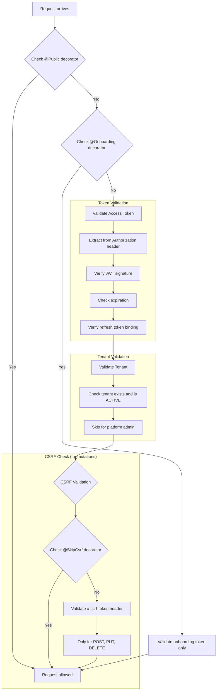

# Guards & Decorators

Vritti uses NestJS guards and decorators to implement authentication, authorization, and request context extraction.

## Global Auth Guard

The `VrittiAuthGuard` is registered globally and runs on every request:

```typescript
// Registered in AuthConfigModule
{
  provide: APP_GUARD,
  useClass: VrittiAuthGuard,
}
```

### Guard Flow



### Guard Implementation

```typescript
// vritti-auth.guard.ts (simplified)
@Injectable({ scope: Scope.REQUEST })
export class VrittiAuthGuard implements CanActivate {
  constructor(
    private reflector: Reflector,
    private jwtService: JwtService,
    private tenantContext: TenantContextService,
    private primaryDb: PrimaryDatabaseService,
  ) {}

  async canActivate(context: ExecutionContext): Promise<boolean> {
    const request = context.switchToHttp().getRequest<FastifyRequest>();

    // 1. Check @Public() decorator
    const isPublic = this.reflector.get<boolean>(IS_PUBLIC_KEY, context.getHandler());
    if (isPublic) return true;

    // 2. Check @Onboarding() decorator
    const isOnboarding = this.reflector.get<boolean>(IS_ONBOARDING_KEY, context.getHandler());
    if (isOnboarding) {
      return this.validateOnboardingToken(request);
    }

    // 3. Validate access token
    const token = this.extractToken(request);
    if (!token) throw new UnauthorizedException('Missing token');

    const payload = await this.verifyToken(token, 'access');

    // 4. Verify refresh token binding
    const refreshToken = request.cookies['refresh_token'];
    if (!this.verifyTokenBinding(payload, refreshToken)) {
      throw new UnauthorizedException('Token binding mismatch');
    }

    // 5. Validate tenant
    await this.validateTenant();

    // 6. CSRF validation for mutations
    await this.validateCsrf(context, request);

    // 7. Attach user to request
    request['user'] = { id: payload.sub };

    return true;
  }
}
```

<Warning>
  The guard is **REQUEST-SCOPED** to prevent cross-request contamination in concurrent scenarios. This is critical for multi-tenant security.
</Warning>

## Route Decorators

### @Public()

Marks an endpoint as publicly accessible, bypassing all authentication:

```typescript
import { Public } from '@vritti/api-sdk';

@Controller('auth')
export class AuthController {
  @Public()
  @Post('signup')
  async signup(@Body() dto: SignupDto) {
    // No authentication required
    return this.authService.signup(dto);
  }

  @Public()
  @Post('login')
  async login(@Body() dto: LoginDto) {
    // No authentication required
    return this.authService.login(dto);
  }
}
```

**Use Cases:**
- Login/signup endpoints
- Password reset initiation
- OAuth callbacks
- Public API endpoints

### @Onboarding()

Marks an endpoint as part of the onboarding flow, requiring a special onboarding token:

```typescript
import { Onboarding } from '@vritti/api-sdk';

@Controller('onboarding')
export class OnboardingController {
  @Onboarding()
  @Get('status')
  async getStatus(@UserId() userId: string) {
    // Requires onboarding token (type='onboarding')
    // Skips tenant validation
    return this.onboardingService.getStatus(userId);
  }

  @Onboarding()
  @Post('verify-email')
  async verifyEmail(@Body() dto: VerifyEmailDto) {
    // User is mid-registration, not fully authenticated
    return this.onboardingService.verifyEmail(dto);
  }
}
```

**Key Differences from Regular Auth:**
- Accepts tokens with `type: 'onboarding'`
- Skips tenant validation (user doesn't have a tenant yet)
- User ID is still extracted from token

### @SkipCsrf()

Skips CSRF validation for specific endpoints (typically webhooks):

```typescript
import { SkipCsrf } from '@vritti/api-sdk';

@Controller('webhooks')
export class WebhookController {
  @SkipCsrf()
  @Post('stripe')
  async stripeWebhook(@Req() req: FastifyRequest) {
    // External service can't provide CSRF token
    // Verify using Stripe signature instead
    const signature = req.headers['stripe-signature'];
    return this.stripeService.handleWebhook(req.rawBody, signature);
  }

  @SkipCsrf()
  @Post('twilio')
  async twilioWebhook(@Body() dto: TwilioWebhookDto) {
    // Twilio doesn't send CSRF tokens
    return this.twilioService.handleWebhook(dto);
  }
}
```

<Warning>
  Only use `@SkipCsrf()` for webhooks from trusted external services. Always verify the request authenticity using signatures, IP allowlists, or other mechanisms.
</Warning>

## Parameter Decorators

### @UserId()

Extracts the authenticated user's ID from the request:

```typescript
import { UserId } from '@vritti/api-sdk';

@Controller('users')
export class UserController {
  @Get('me')
  async getMe(@UserId() userId: string) {
    // userId is extracted from JWT payload
    return this.userService.findById(userId);
  }

  @Put('profile')
  async updateProfile(
    @UserId() userId: string,
    @Body() dto: UpdateProfileDto,
  ) {
    return this.userService.update(userId, dto);
  }
}
```

**Implementation:**
```typescript
export const UserId = createParamDecorator(
  (data: unknown, ctx: ExecutionContext) => {
    const request = ctx.switchToHttp().getRequest();
    return request.user?.id; // Set by VrittiAuthGuard
  },
);
```

### @Tenant()

Extracts the current tenant context:

```typescript
import { Tenant, TenantInfo } from '@vritti/api-sdk';

@Controller('products')
export class ProductController {
  @Get()
  async findAll(@Tenant() tenant: TenantInfo) {
    // tenant contains full tenant configuration
    console.log(`Tenant: ${tenant.subdomain}`);
    return this.productService.findAll();
  }
}
```

**TenantInfo Structure:**
```typescript
interface TenantInfo {
  id: string;
  subdomain: string;
  type: 'STANDARD' | 'ENTERPRISE';
  status: 'ACTIVE' | 'INACTIVE' | 'SUSPENDED';
  databaseHost: string;
  databasePort: number;
  databaseName: string;
  databaseUsername: string;
  databasePassword: string;
  databaseSslMode: 'require' | 'prefer' | 'disable';
  connectionPoolSize?: number;
}
```

## Custom Decorator Creation

Create your own decorators for repeated metadata:

```typescript
// Custom role decorator
export const Roles = (...roles: string[]) => SetMetadata('roles', roles);

// Usage
@Roles('admin', 'manager')
@Get('admin/dashboard')
async adminDashboard() { ... }

// Custom guard to check roles
@Injectable()
export class RolesGuard implements CanActivate {
  constructor(private reflector: Reflector) {}

  canActivate(context: ExecutionContext): boolean {
    const roles = this.reflector.get<string[]>('roles', context.getHandler());
    if (!roles) return true;

    const request = context.switchToHttp().getRequest();
    const user = request.user;
    return roles.some(role => user.roles?.includes(role));
  }
}
```

## Decorator Combinations

Decorators can be combined as needed:

```typescript
@Controller('admin')
export class AdminController {
  // Public endpoint - no auth needed
  @Public()
  @Get('health')
  health() {
    return { status: 'ok' };
  }

  // Authenticated + tenant context
  @Get('dashboard')
  dashboard(@UserId() userId: string, @Tenant() tenant: TenantInfo) {
    return this.adminService.getDashboard(userId, tenant.id);
  }

  // Webhook - authenticated but no CSRF
  @SkipCsrf()
  @Post('webhook')
  webhook(@Body() dto: WebhookDto) {
    return this.adminService.handleWebhook(dto);
  }
}
```

## Decorator Precedence

When multiple decorators are applied:

1. **@Public()** - Highest priority, skips everything
2. **@Onboarding()** - Uses onboarding validation
3. **@SkipCsrf()** - Only affects CSRF check
4. **Default** - Full authentication + CSRF

```typescript
// This combination:
@Public()
@SkipCsrf() // Has no effect - @Public already skips everything
@Post('login')
```

## Testing Decorated Endpoints

```typescript
describe('AuthController', () => {
  it('should allow public signup', async () => {
    // No auth headers needed
    const response = await request(app.getHttpServer())
      .post('/auth/signup')
      .send({ email: 'test@example.com', password: 'password' });

    expect(response.status).toBe(201);
  });

  it('should require auth for protected routes', async () => {
    const response = await request(app.getHttpServer())
      .get('/users/me');
      // No Authorization header

    expect(response.status).toBe(401);
  });

  it('should work with valid token', async () => {
    const response = await request(app.getHttpServer())
      .get('/users/me')
      .set('Authorization', `Bearer ${validToken}`);

    expect(response.status).toBe(200);
  });
});
```

## Next Steps

<CardGroup cols={2}>
  <Card title="Multi-Tenancy" icon="building" href="/architecture/backend/multi-tenancy">
    Learn about tenant isolation patterns
  </Card>
  <Card title="API Reference" icon="book" href="/api/introduction">
    See all API endpoints
  </Card>
</CardGroup>
