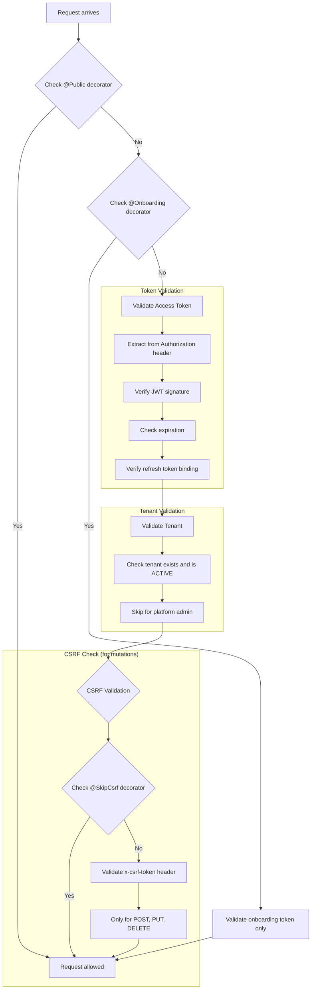

Vritti uses NestJS guards and decorators to implement authentication, authorization, and request context extraction. The authentication system is provided by the `@vritti/api-sdk` package.

## AuthConfigModule

The `AuthConfigModule` must be registered in your application module to configure JWT verification and register the global auth guard.

```typescript
import { AuthConfigModule } from '@vritti/api-sdk';
import { ConfigService } from '@nestjs/config';

@Module({
  imports: [
    AuthConfigModule.forRootAsync({
      inject: [ConfigService],
      useFactory: (config: ConfigService) => ({
        secret: config.get('JWT_SECRET'),
      }),
    }),
  ],
})
export class AppModule {}
```

### Configuration Options

| Option | Type | Required | Description |
|--------|------|----------|-------------|
| `secret` | `string` | Yes | JWT signing secret for token verification |

The module automatically:
- Registers `VrittiAuthGuard` as a global guard
- Configures JWT verification with the provided secret
- Sets up request-scoped providers for tenant context

## Global Auth Guard

The `VrittiAuthGuard` is registered globally and runs on every request:

```typescript
// Registered in AuthConfigModule
{
  provide: APP_GUARD,
  useClass: VrittiAuthGuard,
}
```

### Guard Flow



### Guard Implementation

```typescript
// vritti-auth.guard.ts (simplified)
@Injectable({ scope: Scope.REQUEST })
export class VrittiAuthGuard implements CanActivate {
  constructor(
    private reflector: Reflector,
    private jwtService: JwtService,
    private tenantContext: TenantContextService,
    private primaryDb: PrimaryDatabaseService,
  ) {}

  async canActivate(context: ExecutionContext): Promise<boolean> {
    const request = context.switchToHttp().getRequest<FastifyRequest>();

    // 1. Check @Public() decorator
    const isPublic = this.reflector.get<boolean>(IS_PUBLIC_KEY, context.getHandler());
    if (isPublic) return true;

    // 2. Check @Onboarding() decorator
    const isOnboarding = this.reflector.get<boolean>(IS_ONBOARDING_KEY, context.getHandler());
    if (isOnboarding) {
      return this.validateOnboardingToken(request);
    }

    // 3. Validate access token
    const token = this.extractToken(request);
    if (!token) throw new UnauthorizedException('Missing token');

    const payload = await this.verifyToken(token, 'access');

    // 4. Verify refresh token binding
    const refreshToken = request.cookies['refresh_token'];
    if (!this.verifyTokenBinding(payload, refreshToken)) {
      throw new UnauthorizedException('Token binding mismatch');
    }

    // 5. Validate tenant
    await this.validateTenant();

    // 6. CSRF validation for mutations
    await this.validateCsrf(context, request);

    // 7. Attach user to request
    request['user'] = { id: payload.sub };

    return true;
  }
}
```

<Warning>
  The guard is **REQUEST-SCOPED** to prevent cross-request contamination in concurrent scenarios. This is critical for multi-tenant security.
</Warning>

## Route Decorators

### @Public()

Marks an endpoint as publicly accessible, bypassing all authentication:

```typescript
import { Public } from '@vritti/api-sdk';

@Controller('auth')
export class AuthController {
  @Public()
  @Post('signup')
  async signup(@Body() dto: SignupDto) {
    // No authentication required
    return this.authService.signup(dto);
  }

  @Public()
  @Post('login')
  async login(@Body() dto: LoginDto) {
    // No authentication required
    return this.authService.login(dto);
  }
}
```

**Use Cases:**
- Login/signup endpoints
- Password reset initiation
- OAuth callbacks
- Public API endpoints

### @Onboarding()

Marks an endpoint as part of the onboarding flow, requiring a special onboarding token:

```typescript
import { Onboarding } from '@vritti/api-sdk';

@Controller('onboarding')
export class OnboardingController {
  @Onboarding()
  @Get('status')
  async getStatus(@UserId() userId: string) {
    // Requires onboarding token (type='onboarding')
    // Skips tenant validation
    return this.onboardingService.getStatus(userId);
  }

  @Onboarding()
  @Post('verify-email')
  async verifyEmail(@Body() dto: VerifyEmailDto) {
    // User is mid-registration, not fully authenticated
    return this.onboardingService.verifyEmail(dto);
  }
}
```

**Key Differences from Regular Auth:**
- Accepts tokens with `type: 'onboarding'`
- Skips tenant validation (user doesn't have a tenant yet)
- User ID is still extracted from token

### @SkipCsrf()

Skips CSRF validation for specific endpoints (typically webhooks):

```typescript
import { SkipCsrf } from '@vritti/api-sdk';

@Controller('webhooks')
export class WebhookController {
  @SkipCsrf()
  @Post('stripe')
  async stripeWebhook(@Req() req: FastifyRequest) {
    // External service can't provide CSRF token
    // Verify using Stripe signature instead
    const signature = req.headers['stripe-signature'];
    return this.stripeService.handleWebhook(req.rawBody, signature);
  }

  @SkipCsrf()
  @Post('twilio')
  async twilioWebhook(@Body() dto: TwilioWebhookDto) {
    // Twilio doesn't send CSRF tokens
    return this.twilioService.handleWebhook(dto);
  }
}
```

<Warning>
  Only use `@SkipCsrf()` for webhooks from trusted external services. Always verify the request authenticity using signatures, IP allowlists, or other mechanisms.
</Warning>

## Parameter Decorators

### @UserId()

Extracts the authenticated user's ID from the request:

```typescript
import { UserId } from '@vritti/api-sdk';

@Controller('users')
export class UserController {
  @Get('me')
  async getMe(@UserId() userId: string) {
    // userId is extracted from JWT payload
    return this.userService.findById(userId);
  }

  @Put('profile')
  async updateProfile(
    @UserId() userId: string,
    @Body() dto: UpdateProfileDto,
  ) {
    return this.userService.update(userId, dto);
  }
}
```

**Implementation:**
```typescript
export const UserId = createParamDecorator(
  (data: unknown, ctx: ExecutionContext) => {
    const request = ctx.switchToHttp().getRequest();
    return request.user?.id; // Set by VrittiAuthGuard
  },
);
```

### @Tenant()

Extracts the current tenant context:

```typescript
import { Tenant, TenantInfo } from '@vritti/api-sdk';

@Controller('products')
export class ProductController {
  @Get()
  async findAll(@Tenant() tenant: TenantInfo) {
    // tenant contains full tenant configuration
    console.log(`Tenant: ${tenant.subdomain}`);
    return this.productService.findAll();
  }
}
```

**TenantInfo Structure:**
```typescript
interface TenantInfo {
  id: string;
  subdomain: string;
  type: 'STANDARD' | 'ENTERPRISE';
  status: 'ACTIVE' | 'INACTIVE' | 'SUSPENDED';
  databaseHost: string;
  databasePort: number;
  databaseName: string;
  databaseUsername: string;
  databasePassword: string;
  databaseSslMode: 'require' | 'prefer' | 'disable';
  connectionPoolSize?: number;
}
```

## SSE Authentication Guard

For Server-Sent Events (SSE) endpoints, use `SseAuthGuard` which accepts tokens via query parameters:

```typescript
import { SseAuthGuard, Public } from '@vritti/api-sdk';
import { Sse } from '@nestjs/common';

@Controller('events')
export class EventsController {
  @Public()  // Bypass global VrittiAuthGuard
  @UseGuards(SseAuthGuard)  // Apply SSE-specific guard
  @Sse('stream')
  stream(@Query('token') token: string) {
    // Token validated from ?token=<jwt>
    return this.eventsService.getStream();
  }
}
```

**Differences from VrittiAuthGuard:**
- Accepts token from query parameter (`?token=<jwt>`) instead of Authorization header
- Sets CORS headers before validation for SSE compatibility
- No CSRF validation (SSE is read-only)
- Still validates JWT signature, expiration, and tenant context

**Usage Pattern:**
```typescript
// Client connects with JWT in query string
const eventSource = new EventSource(
  `${API_URL}/events/stream?token=${accessToken}`
);

eventSource.onmessage = (event) => {
  const data = JSON.parse(event.data);
  console.log('Received:', data);
};
```

## Token Types

The authentication system uses three token types, each with different purposes and lifetimes.

### Access Token

Short-lived token for API requests:

```typescript
{
  sub: 'usr_123',           // User ID
  type: 'access',           // Token type
  tenantId: 'ten_456',      // Tenant ID
  email: 'user@example.com',
  iat: 1234567890,
  exp: 1234568790,          // 15 minutes (configurable)
  nbf: 1234567890,
  rtHash: 'sha256...'       // Refresh token binding (optional)
}
```

**Properties:**
- Lifetime: 15 minutes (default)
- Transmitted via: `Authorization: Bearer <token>` header
- Required for: All authenticated endpoints
- Contains: User ID, tenant ID, email

### Refresh Token

Long-lived token stored in httpOnly cookie:

```typescript
{
  sub: 'usr_123',
  type: 'refresh',
  jti: 'unique-token-id',   // For revocation
  iat: 1234567890,
  exp: 1237159890           // 30 days (default)
}
```

**Properties:**
- Lifetime: 30 days (default)
- Transmitted via: httpOnly cookie
- Required for: Token refresh endpoint
- Contains: User ID, unique token ID (jti)

**Security Features:**
- HttpOnly flag prevents XSS attacks
- Secure flag for HTTPS-only transmission
- SameSite attribute for CSRF protection
- Token binding links refresh token to access token

### Onboarding Token

Limited token for onboarding flow:

```typescript
{
  sub: 'usr_123',
  type: 'onboarding',
  email: 'user@example.com',
  iat: 1234567890,
  exp: 1234654290           // 24 hours (default)
}
```

**Properties:**
- Lifetime: 24 hours (default)
- Used during: User registration and onboarding
- Allows access to: Endpoints marked with `@Onboarding()`
- Skips: Tenant validation

## Token Utilities

The `@vritti/api-sdk` provides utilities for secure token handling.

### hashToken

Creates a SHA-256 hash of a token for secure storage:

```typescript
import { hashToken } from '@vritti/api-sdk';

const refreshToken = generateRefreshToken();
const hash = hashToken(refreshToken);

// Store hash in database for token binding validation
await db.insert(sessions).values({
  userId,
  refreshTokenHash: hash,
});
```

**Use Cases:**
- Token binding (linking refresh tokens to access tokens)
- Secure storage of refresh tokens
- Token revocation checks

### verifyTokenHash

Compares a token against its hash using constant-time comparison:

```typescript
import { verifyTokenHash } from '@vritti/api-sdk';

const refreshToken = req.cookies['refresh_token'];
const storedHash = await getStoredRefreshTokenHash(userId);

const isValid = verifyTokenHash(refreshToken, storedHash);
if (!isValid) {
  throw new UnauthorizedException('Token binding mismatch');
}
```

**Security Features:**
- Constant-time comparison prevents timing attacks
- Returns boolean (true/false)
- Safe for use in authentication flows

## Token Binding

Token binding links refresh tokens to access tokens for additional security. This prevents stolen access tokens from being used without the corresponding refresh token.

### How Token Binding Works

1. **On Login**: Hash the refresh token and store it in the user's session
2. **Include Hash in Access Token**: Add the hash to the access token payload as `rtHash`
3. **On Protected Requests**: Verify the access token's `rtHash` matches the current refresh token

### Implementation Example

```typescript
// 1. Generate tokens on login
const refreshToken = this.jwtService.sign({
  sub: userId,
  type: 'refresh',
  jti: sessionId,
});

const refreshTokenHash = hashToken(refreshToken);

const accessToken = this.jwtService.sign({
  sub: userId,
  type: 'access',
  tenantId: user.tenantId,
  email: user.email,
  rtHash: refreshTokenHash, // Bind to refresh token
});

// 2. Store hash in database
await this.sessionRepository.update(sessionId, {
  refreshTokenHash,
});

// 3. Guard automatically validates binding
// (Already implemented in VrittiAuthGuard)
```

### Security Benefits

- **Prevents Token Theft**: Stolen access token is useless without refresh token
- **Revocation Support**: Revoking session invalidates both tokens
- **Defense in Depth**: Additional layer beyond JWT signatures

### Configuration

Enable token binding in your SDK configuration:

```typescript
import { configureApiSdk } from '@vritti/api-sdk';

configureApiSdk({
  jwt: {
    validateTokenBinding: true,  // Enable token binding
    accessTokenExpiry: '15m',
    refreshTokenExpiry: '30d',
  },
});
```

## CSRF Protection

CSRF (Cross-Site Request Forgery) protection is automatically enabled for all state-changing requests.

### How CSRF Protection Works

1. **Client Fetches CSRF Token**: `GET /csrf/token`
2. **Client Includes Token**: Add `x-csrf-token` header to mutations
3. **Guard Validates Token**: Automatic validation on POST, PUT, DELETE, PATCH

### CSRF Token Flow

```typescript
// 1. Client fetches CSRF token
const response = await fetch('/api/csrf/token', {
  credentials: 'include', // Include cookies
});
const { token } = await response.json();

// 2. Client includes token in mutations
await fetch('/api/users/profile', {
  method: 'PUT',
  headers: {
    'Authorization': `Bearer ${accessToken}`,
    'x-csrf-token': token,
  },
  body: JSON.stringify(data),
});
```

### Automatic Validation

The `VrittiAuthGuard` automatically validates CSRF tokens for:
- POST requests
- PUT requests
- DELETE requests
- PATCH requests

**Skipped for:**
- GET requests (safe methods)
- Endpoints marked with `@SkipCsrf()`
- Public endpoints (`@Public()`)

### Skipping CSRF Validation

Use `@SkipCsrf()` for webhooks from external services:

```typescript
import { SkipCsrf } from '@vritti/api-sdk';

@Controller('webhooks')
export class WebhookController {
  @SkipCsrf()
  @Post('stripe')
  async handleStripe(@Body() payload: any, @Headers('stripe-signature') signature: string) {
    // External service can't provide CSRF token
    // Verify using webhook signature instead
    this.stripeService.verifyWebhook(payload, signature);
    return this.stripeService.handleWebhook(payload);
  }
}
```

<Warning>
  Only use `@SkipCsrf()` for webhooks from trusted external services. Always verify request authenticity using signatures, IP allowlists, or other mechanisms.
</Warning>

## SDK Configuration

Configure authentication behavior using `configureApiSdk`:

```typescript
import { configureApiSdk } from '@vritti/api-sdk';

configureApiSdk({
  jwt: {
    // Token expiry settings
    accessTokenExpiry: '15m',
    refreshTokenExpiry: '30d',
    onboardingTokenExpiry: '24h',

    // Security features
    validateTokenBinding: true,  // Enable token binding
  },

  guard: {
    // Header configuration
    tenantHeaderName: 'x-tenant-id',
    authHeaderName: 'authorization',
    tokenPrefix: 'Bearer',

    // CSRF configuration
    csrfHeaderName: 'x-csrf-token',
    csrfCookieName: 'csrf_token',
  },
});
```

### Configuration Options

**JWT Settings:**
| Option | Type | Default | Description |
|--------|------|---------|-------------|
| `accessTokenExpiry` | `string` | `'15m'` | Access token lifetime |
| `refreshTokenExpiry` | `string` | `'30d'` | Refresh token lifetime |
| `onboardingTokenExpiry` | `string` | `'24h'` | Onboarding token lifetime |
| `validateTokenBinding` | `boolean` | `false` | Enable token binding |

**Guard Settings:**
| Option | Type | Default | Description |
|--------|------|---------|-------------|
| `tenantHeaderName` | `string` | `'x-tenant-id'` | Tenant identifier header |
| `authHeaderName` | `string` | `'authorization'` | Auth token header |
| `tokenPrefix` | `string` | `'Bearer'` | Token prefix in header |
| `csrfHeaderName` | `string` | `'x-csrf-token'` | CSRF token header |
| `csrfCookieName` | `string` | `'csrf_token'` | CSRF cookie name |

## Error Handling

Authentication errors follow RFC 7807 Problem Details format:

### 401 Unauthorized

```json
{
  "type": "https://vritti.cloud/errors/unauthorized",
  "title": "Unauthorized",
  "status": 401,
  "detail": "Token has expired",
  "instance": "/api/users/profile",
  "timestamp": "2024-01-15T10:30:00Z",
  "correlationId": "abc123"
}
```

**Common Causes:**
- Missing or invalid JWT token
- Expired token
- Token signature verification failed
- Tenant not found or inactive
- Token binding mismatch

### 403 Forbidden

```json
{
  "type": "https://vritti.cloud/errors/forbidden",
  "title": "Forbidden",
  "status": 403,
  "detail": "Invalid CSRF token",
  "instance": "/api/users/update",
  "timestamp": "2024-01-15T10:30:00Z",
  "correlationId": "abc123"
}
```

**Common Causes:**
- CSRF token missing or invalid
- Insufficient permissions
- Account suspended or inactive

## Custom Decorator Creation

Create your own decorators for repeated metadata:

```typescript
// Custom role decorator
export const Roles = (...roles: string[]) => SetMetadata('roles', roles);

// Usage
@Roles('admin', 'manager')
@Get('admin/dashboard')
async adminDashboard() { ... }

// Custom guard to check roles
@Injectable()
export class RolesGuard implements CanActivate {
  constructor(private reflector: Reflector) {}

  canActivate(context: ExecutionContext): boolean {
    const roles = this.reflector.get<string[]>('roles', context.getHandler());
    if (!roles) return true;

    const request = context.switchToHttp().getRequest();
    const user = request.user;
    return roles.some(role => user.roles?.includes(role));
  }
}
```

## Decorator Combinations

Decorators can be combined as needed:

```typescript
@Controller('admin')
export class AdminController {
  // Public endpoint - no auth needed
  @Public()
  @Get('health')
  health() {
    return { status: 'ok' };
  }

  // Authenticated + tenant context
  @Get('dashboard')
  dashboard(@UserId() userId: string, @Tenant() tenant: TenantInfo) {
    return this.adminService.getDashboard(userId, tenant.id);
  }

  // Webhook - authenticated but no CSRF
  @SkipCsrf()
  @Post('webhook')
  webhook(@Body() dto: WebhookDto) {
    return this.adminService.handleWebhook(dto);
  }
}
```

## Decorator Precedence

When multiple decorators are applied:

1. **@Public()** - Highest priority, skips everything
2. **@Onboarding()** - Uses onboarding validation
3. **@SkipCsrf()** - Only affects CSRF check
4. **Default** - Full authentication + CSRF

```typescript
// This combination:
@Public()
@SkipCsrf() // Has no effect - @Public already skips everything
@Post('login')
```

## Testing Decorated Endpoints

```typescript
describe('AuthController', () => {
  it('should allow public signup', async () => {
    // No auth headers needed
    const response = await request(app.getHttpServer())
      .post('/auth/signup')
      .send({ email: 'test@example.com', password: 'password' });

    expect(response.status).toBe(201);
  });

  it('should require auth for protected routes', async () => {
    const response = await request(app.getHttpServer())
      .get('/users/me');
      // No Authorization header

    expect(response.status).toBe(401);
  });

  it('should work with valid token', async () => {
    const response = await request(app.getHttpServer())
      .get('/users/me')
      .set('Authorization', `Bearer ${validToken}`);

    expect(response.status).toBe(200);
  });
});
```

## Next Steps

<CardGroup cols={2}>
  <Card title="Multi-Tenancy" icon="building" href="/architecture/backend/multi-tenancy">
    Learn about tenant isolation patterns
  </Card>
  <Card title="API Reference" icon="book" href="/api/introduction">
    See all API endpoints
  </Card>
</CardGroup>
