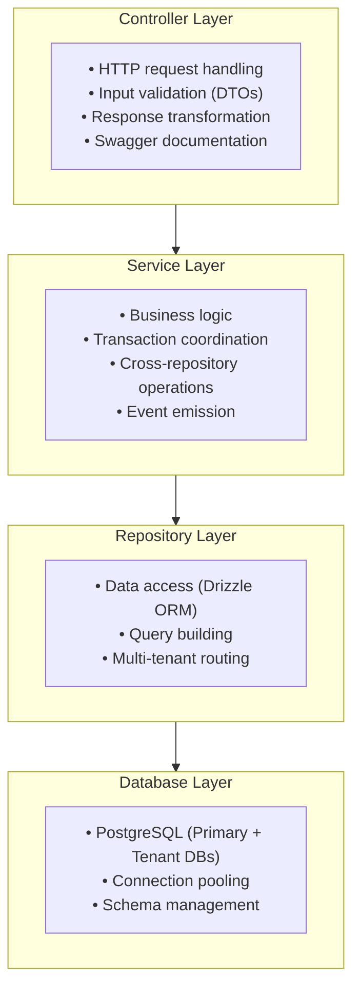

Vritti's backend follows a domain-driven module structure where each business domain is encapsulated in its own NestJS module.

## App Module Overview

```typescript
// app.module.ts
@Module({
  imports: [
    // Global Configuration
    ConfigModule.forRoot({
      isGlobal: true,
      validate: (config) => envSchema.parse(config),
    }),

    // Event System (for SSE)
    EventEmitterModule.forRoot(),

    // Logging
    LoggerModule.forRoot({
      preset: process.env.LOG_PRESET || 'development',
    }),

    // Multi-Tenant Database
    DatabaseModule.forServer({
      useFactory: (config: ConfigService) => ({
        primaryDb: {
          host: config.get('PRIMARY_DB_HOST'),
          port: config.get('PRIMARY_DB_PORT'),
          database: config.get('PRIMARY_DB_NAME'),
          username: config.get('PRIMARY_DB_USER'),
          password: config.get('PRIMARY_DB_PASS'),
          schema: 'cloud',
        },
        drizzleSchema: schema,
        drizzleRelations: relations,
        connectionCacheTTL: 300000, // 5 minutes
      }),
      inject: [ConfigService],
    }),

    // Global Auth Guard
    AuthConfigModule.forRootAsync({
      useFactory: (config: ConfigService) => ({
        jwtSecret: config.get('JWT_SECRET'),
        jwtExpiresIn: config.get('JWT_ACCESS_EXPIRES'),
        refreshExpiresIn: config.get('JWT_REFRESH_EXPIRES'),
      }),
      inject: [ConfigService],
    }),

    // Domain Modules (under cloud-api prefix)
    RouterModule.register([
      {
        path: 'cloud-api',
        children: [
          { path: 'tenants', module: TenantModule },
          { path: 'users', module: UserModule },
          { path: 'auth', module: AuthModule },
          { path: 'onboarding', module: OnboardingModule },
          { path: 'mfa', module: MfaVerificationModule },
        ],
      },
    ]),
  ],
})
export class AppModule {}
```

## Module Directory Structure

```
src/
├── app.module.ts              # Root module
│
├── db/                        # Database layer
│   ├── schema/                # Drizzle schemas
│   │   ├── index.ts
│   │   ├── user.ts
│   │   ├── tenant.ts
│   │   └── ...
│   └── migrations/            # Migration files
│
├── tenants/                   # Tenant domain
│   ├── tenant.module.ts
│   ├── tenant.controller.ts
│   ├── tenant.service.ts
│   ├── tenant.repository.ts
│   └── dto/
│       ├── create-tenant.dto.ts
│       └── update-tenant.dto.ts
│
├── users/                     # User domain
│   ├── user.module.ts
│   ├── user.controller.ts
│   ├── user.service.ts
│   ├── user.repository.ts
│   └── dto/
│
├── auth/                      # Authentication
│   ├── auth.module.ts
│   ├── auth.controller.ts
│   ├── auth.service.ts
│   ├── oauth/                 # OAuth sub-module
│   │   ├── oauth.controller.ts
│   │   └── oauth.service.ts
│   ├── passkey/               # Passkey sub-module
│   │   ├── passkey.controller.ts
│   │   └── passkey.service.ts
│   └── dto/
│
├── onboarding/                # Onboarding flow
│   ├── onboarding.module.ts
│   ├── onboarding.controller.ts
│   ├── onboarding.service.ts
│   └── dto/
│
└── mfa/                       # Multi-factor auth
    ├── mfa-verification.module.ts
    ├── mfa-verification.controller.ts
    ├── mfa-verification.service.ts
    └── dto/
```

## Standard Module Pattern

Each domain module follows this structure:

<Tabs>
  <Tab title="Module">
    ```typescript
    // tenant.module.ts
    @Module({
      imports: [],
      controllers: [TenantController],
      providers: [TenantService, TenantRepository],
      exports: [TenantService], // Export for other modules
    })
    export class TenantModule {}
    ```
  </Tab>
  <Tab title="Controller">
    ```typescript
    // tenant.controller.ts
    @ApiTags('Tenants')
    @Controller() // Path set by RouterModule
    export class TenantController {
      constructor(private readonly tenantService: TenantService) {}

      @Get()
      @ApiOperation({ summary: 'List all tenants' })
      async findAll(@Tenant() tenant: TenantInfo) {
        return this.tenantService.findAll(tenant.id);
      }

      @Post()
      @ApiOperation({ summary: 'Create a tenant' })
      async create(@Body() dto: CreateTenantDto) {
        return this.tenantService.create(dto);
      }
    }
    ```
  </Tab>
  <Tab title="Service">
    ```typescript
    // tenant.service.ts
    @Injectable()
    export class TenantService {
      constructor(private readonly tenantRepo: TenantRepository) {}

      async findAll(currentTenantId: string) {
        // Business logic here
        return this.tenantRepo.findMany({
          where: { status: 'ACTIVE' },
        });
      }

      async create(dto: CreateTenantDto) {
        // Validation, transformation, business rules
        const tenant = await this.tenantRepo.create({
          ...dto,
          status: 'ACTIVE',
        });

        // Side effects (events, notifications)
        this.eventEmitter.emit('tenant.created', tenant);

        return tenant;
      }
    }
    ```
  </Tab>
  <Tab title="Repository">
    ```typescript
    // tenant.repository.ts
    @Injectable()
    export class TenantRepository extends PrimaryBaseRepository<typeof tenants> {
      constructor(primaryDb: PrimaryDatabaseService) {
        super(primaryDb, tenants);
      }

      // Custom queries beyond CRUD
      async findBySubdomain(subdomain: string) {
        return this.db.query.tenants.findFirst({
          where: { subdomain },
          with: { databaseConfig: true },
        });
      }
    }
    ```
  </Tab>
</Tabs>

## Layered Architecture



## Global Modules

Modules registered as `isGlobal: true` are available everywhere:

| Module | Purpose | Provider |
|--------|---------|----------|
| `ConfigModule` | Environment config | `ConfigService` |
| `DatabaseModule` | Multi-tenant DB | `TenantDatabaseService`, `PrimaryDatabaseService` |
| `AuthConfigModule` | Auth guard | `VrittiAuthGuard` |
| `LoggerModule` | Winston logging | `LoggerService` |

## Dynamic Module Registration

The SDK modules use dynamic registration for configuration:

```typescript
// DatabaseModule (from @vritti/api-sdk)
@Module({})
export class DatabaseModule {
  static forServer(options: DatabaseModuleOptions): DynamicModule {
    return {
      module: DatabaseModule,
      global: true,
      imports: [],
      providers: [
        {
          provide: DATABASE_OPTIONS,
          useValue: options,
        },
        PrimaryDatabaseService,
        TenantDatabaseService,
        TenantContextService,
        {
          provide: APP_INTERCEPTOR,
          useClass: TenantContextInterceptor,
        },
      ],
      exports: [
        PrimaryDatabaseService,
        TenantDatabaseService,
        TenantContextService,
      ],
    };
  }
}
```

## Router Module Configuration

Routes are prefixed using `RouterModule`:

```typescript
RouterModule.register([
  {
    path: 'cloud-api',     // All routes start with /cloud-api
    children: [
      { path: 'auth', module: AuthModule },
      // Results in: /cloud-api/auth/login, /cloud-api/auth/signup
    ],
  },
]);
```

<Note>
  The `cloud-api` prefix distinguishes tenant-specific APIs from future microservice endpoints.
</Note>

## Feature Flags

Modules can be conditionally loaded:

```typescript
@Module({
  imports: [
    // Always load
    AuthModule,

    // Conditionally load based on config
    ...(process.env.ENABLE_PASSKEYS === 'true' ? [PasskeyModule] : []),
  ],
})
export class AppModule {}
```

## Module Communication

Modules communicate through:

<CardGroup cols={2}>
  <Card title="Dependency Injection" icon="syringe">
    Export services from one module, import in another

    ```typescript
    // In AuthModule
    exports: [AuthService]

    // In OnboardingModule
    imports: [AuthModule]
    constructor(authService: AuthService)
    ```
  </Card>
  <Card title="Event Emitter" icon="bell">
    Loose coupling via events

    ```typescript
    // Emit
    this.eventEmitter.emit('user.created', user);

    // Listen
    @OnEvent('user.created')
    handleUserCreated(user: User) {}
    ```
  </Card>
</CardGroup>

## Testing Module Structure

Each module has corresponding test files:

```
src/tenants/
├── tenant.module.ts
├── tenant.controller.ts
├── tenant.controller.spec.ts    # Unit tests
├── tenant.service.ts
├── tenant.service.spec.ts       # Unit tests
├── tenant.repository.ts
└── __tests__/
    └── tenant.e2e-spec.ts       # E2E tests
```

## Next Steps

<CardGroup cols={2}>
  <Card title="Guards & Decorators" icon="shield" href="/architecture/backend/guards-decorators">
    Learn about authentication patterns
  </Card>
  <Card title="Multi-Tenancy" icon="building" href="/architecture/backend/multi-tenancy">
    Understand tenant isolation
  </Card>
</CardGroup>
