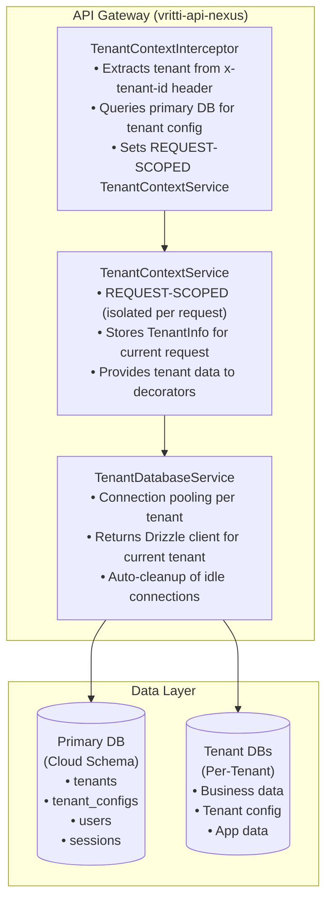
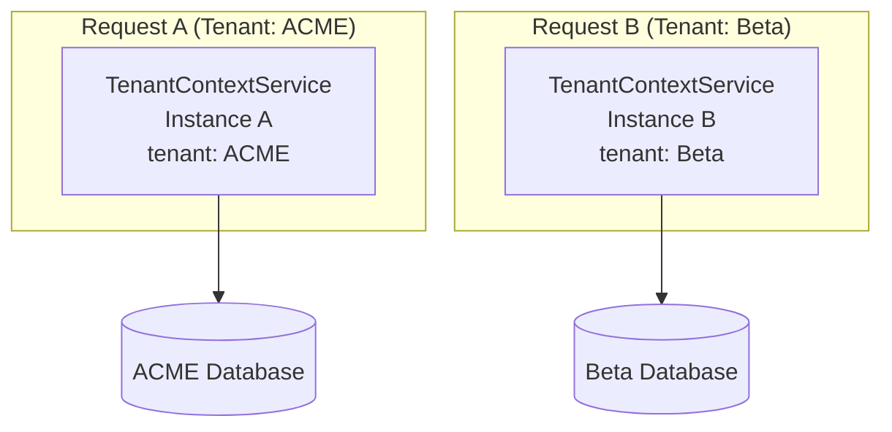

# Multi-Tenancy

Vritti implements multi-tenancy at the database level, with each tenant having either a dedicated database or a shared schema with row-level isolation.

## Architecture Overview



## Tenant Isolation Models

Vritti supports two isolation models:

<Tabs>
  <Tab title="Dedicated Database">
    **Full Isolation** - Each tenant has their own PostgreSQL database.

    ```
    PostgreSQL Server
    ├── tenant_acme (database)
    │   └── All tables for ACME Corp
    ├── tenant_beta (database)
    │   └── All tables for Beta Inc
    └── cloud (primary database)
        └── Tenant registry
    ```

    **Benefits:**
    - Complete data isolation
    - Per-tenant backup/restore
    - Custom schema modifications
    - Compliance requirements (SOC2, HIPAA)

    **Trade-offs:**
    - Higher infrastructure cost
    - More complex migrations
    - Connection overhead
  </Tab>
  <Tab title="Shared Database">
    **Schema Isolation** - Tenants share a database with schema-level separation.

    ```
    PostgreSQL Server
    └── cloud (database)
        ├── cloud (schema) - Primary
        ├── tenant_acme (schema)
        └── tenant_beta (schema)
    ```

    **Benefits:**
    - Lower infrastructure cost
    - Simpler operations
    - Faster tenant provisioning

    **Trade-offs:**
    - Shared resource constraints
    - Complex backup per tenant
    - Noisy neighbor potential
  </Tab>
</Tabs>

## Tenant Context Flow

### Step 1: Extract Tenant from Request

```typescript
// TenantContextInterceptor
@Injectable()
export class TenantContextInterceptor implements NestInterceptor {
  async intercept(context: ExecutionContext, next: CallHandler) {
    const request = context.switchToHttp().getRequest<FastifyRequest>();

    // Check if endpoint is public
    const isPublic = this.reflector.get<boolean>(IS_PUBLIC_KEY, context.getHandler());
    if (isPublic && !request.headers['x-tenant-id']) {
      return next.handle(); // Allow without tenant
    }

    // Extract tenant identifier
    const tenantId = request.headers['x-tenant-id'] as string;
    const subdomain = request.headers['x-subdomain'] as string;

    // Skip for platform admin
    if (tenantId === 'cloud' || subdomain === 'cloud') {
      return next.handle();
    }

    // Load tenant configuration from primary DB
    const tenantInfo = await this.loadTenantConfig(tenantId || subdomain);

    // Store in REQUEST-SCOPED service
    this.tenantContext.setTenant(tenantInfo);

    return next.handle();
  }
}
```

### Step 2: Store Tenant Context

```typescript
// TenantContextService
@Injectable({ scope: Scope.REQUEST })
export class TenantContextService {
  private tenantInfo: TenantInfo | null = null;

  setTenant(info: TenantInfo): void {
    if (this.tenantInfo !== null) {
      throw new Error('Tenant context already set for this request');
    }
    this.tenantInfo = info;
  }

  getTenant(): TenantInfo {
    if (!this.tenantInfo) {
      throw new Error('Tenant context not initialized');
    }
    return this.tenantInfo;
  }

  hasTenant(): boolean {
    return this.tenantInfo !== null;
  }

  // For RabbitMQ consumers that reuse context
  clearTenant(): void {
    this.tenantInfo = null;
  }
}
```

<Warning>
  `TenantContextService` is **REQUEST-SCOPED**. Each HTTP request gets its own instance, preventing tenant data leakage between concurrent requests.
</Warning>

### Step 3: Route to Tenant Database

```typescript
// TenantDatabaseService
@Injectable()
export class TenantDatabaseService {
  private readonly clients = new Map<string, TenantConnection>();
  private readonly clientLastUsed = new Map<string, number>();

  constructor(
    private tenantContext: TenantContextService,
  ) {}

  get drizzleClient(): TypedDrizzleClient {
    const tenant = this.tenantContext.getTenant();
    const cacheKey = this.getCacheKey(tenant);

    // Check for existing connection
    let connection = this.clients.get(cacheKey);
    if (!connection) {
      connection = this.createConnection(tenant);
      this.clients.set(cacheKey, connection);
    }

    // Update last used time
    this.clientLastUsed.set(cacheKey, Date.now());

    return connection.db;
  }

  private createConnection(tenant: TenantInfo): TenantConnection {
    const connectionUrl = `postgresql://${tenant.databaseUsername}:${tenant.databasePassword}@${tenant.databaseHost}:${tenant.databasePort}/${tenant.databaseName}?sslmode=${tenant.databaseSslMode}`;

    const pool = new Pool({
      connectionString: connectionUrl,
      max: tenant.connectionPoolSize || 10,
    });

    const db = drizzle(pool, {
      schema: this.schema,
    });

    return { pool, db };
  }

  // Cleanup idle connections periodically
  @Interval(60000) // Every minute
  private cleanupIdleConnections() {
    const now = Date.now();
    const ttl = this.options.connectionCacheTTL; // Default: 5 minutes

    for (const [key, lastUsed] of this.clientLastUsed) {
      if (now - lastUsed > ttl) {
        const connection = this.clients.get(key);
        if (connection) {
          connection.pool.end();
          this.clients.delete(key);
          this.clientLastUsed.delete(key);
        }
      }
    }
  }
}
```

## Repository Pattern

### Primary Database Repository

For tables in the primary database (tenant registry, users, sessions):

```typescript
@Injectable()
export class TenantRepository extends PrimaryBaseRepository<typeof tenants> {
  constructor(primaryDb: PrimaryDatabaseService) {
    super(primaryDb, tenants);
  }

  async findBySubdomain(subdomain: string) {
    return this.db.query.tenants.findFirst({
      where: { subdomain },
      with: {
        databaseConfig: true,
      },
    });
  }
}
```

### Tenant Database Repository

For tables in tenant-specific databases:

```typescript
@Injectable()
export class ProductRepository extends TenantBaseRepository<typeof products> {
  constructor(tenantDb: TenantDatabaseService) {
    super(tenantDb, products);
  }

  // All queries automatically use current tenant's database
  async findByCategory(categoryId: string) {
    return this.db.query.products.findMany({
      where: { categoryId },
    });
  }
}
```

## Tenant Database Schema

### Primary Database Tables

```typescript
// Tenant registry
export const tenants = cloudSchema.table('tenants', {
  id: uuid('id').primaryKey().defaultRandom(),
  subdomain: varchar('subdomain', { length: 63 }).notNull().unique(),
  name: varchar('name', { length: 255 }).notNull(),
  dbType: databaseTypeEnum('db_type').notNull().default('DEDICATED'),
  status: tenantStatusEnum('status').notNull().default('ACTIVE'),
  createdAt: timestamp('created_at').notNull().defaultNow(),
  updatedAt: timestamp('updated_at').notNull().defaultNow().$onUpdate(() => new Date()),
});

// Database connection configuration
export const tenantDatabaseConfigs = cloudSchema.table('tenant_database_configs', {
  id: uuid('id').primaryKey().defaultRandom(),
  tenantId: uuid('tenant_id').references(() => tenants.id, { onDelete: 'cascade' }).unique(),
  dbHost: varchar('db_host', { length: 255 }).notNull(),
  dbPort: integer('db_port').notNull().default(5432),
  dbUsername: varchar('db_username', { length: 255 }).notNull(),
  dbPassword: varchar('db_password', { length: 255 }).notNull(),
  dbName: varchar('db_name', { length: 255 }).notNull(),
  dbSchema: varchar('db_schema', { length: 255 }).default('public'),
  connectionPoolSize: integer('connection_pool_size').default(10),
  createdAt: timestamp('created_at').notNull().defaultNow(),
  updatedAt: timestamp('updated_at').notNull().defaultNow().$onUpdate(() => new Date()),
});
```

## Security Considerations

### Request Isolation



Each request gets its own `TenantContextService` instance due to `Scope.REQUEST`.

### Guard Validation

```typescript
// VrittiAuthGuard validates tenant on every request
async validateTenant(): Promise<void> {
  const tenant = this.tenantContext.getTenant();

  if (tenant.status !== 'ACTIVE') {
    throw new ForbiddenException('Tenant is not active');
  }
}
```

### Connection String Safety

```typescript
// Tenant credentials are stored encrypted in the database
// Connection strings are built dynamically, never logged
private createConnectionUrl(tenant: TenantInfo): string {
  // Never log this URL - contains credentials
  return `postgresql://${encodeURIComponent(tenant.databaseUsername)}:${encodeURIComponent(tenant.databasePassword)}@${tenant.databaseHost}:${tenant.databasePort}/${tenant.databaseName}`;
}
```

## Tenant Provisioning

When a new tenant is created:

```typescript
@Injectable()
export class TenantProvisioningService {
  async provision(dto: CreateTenantDto) {
    // 1. Create tenant record
    const tenant = await this.tenantRepo.create({
      subdomain: dto.subdomain,
      name: dto.name,
      dbType: dto.dbType,
    });

    // 2. Provision database
    if (dto.dbType === 'DEDICATED') {
      const dbConfig = await this.createDedicatedDatabase(tenant);
      await this.tenantConfigRepo.create({
        tenantId: tenant.id,
        ...dbConfig,
      });
    }

    // 3. Run migrations on tenant database
    await this.runMigrations(tenant);

    // 4. Seed initial data
    await this.seedTenantData(tenant);

    return tenant;
  }
}
```

## Platform Admin Access

The `cloud` tenant ID is special - it represents platform admin access:

```typescript
// Skip tenant database for platform admin
if (tenantId === 'cloud') {
  // Use primary database only
  // No tenant context needed
  return next.handle();
}
```

## Next Steps

<CardGroup cols={2}>
  <Card title="Database Architecture" icon="database" href="/architecture/database/drizzle-orm">
    Learn about Drizzle ORM setup
  </Card>
  <Card title="Multi-Tenant Schemas" icon="layer-group" href="/architecture/database/multi-tenant-schemas">
    Understand schema management
  </Card>
</CardGroup>
