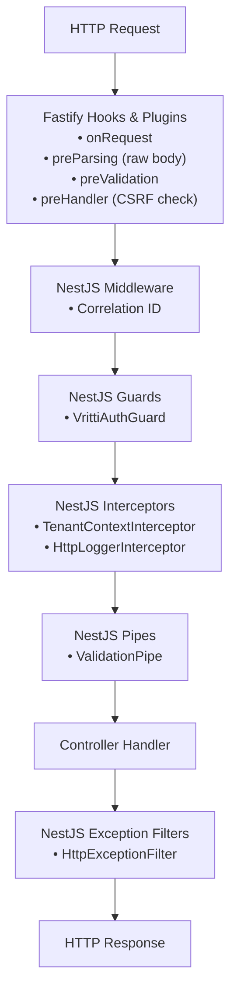

# NestJS + Fastify

Vritti's backend uses **NestJS 11** with **Fastify 5** as the HTTP adapter, providing a high-performance, type-safe API layer.

## Why Fastify Over Express?

<CardGroup cols={2}>
  <Card title="Performance" icon="bolt">
    Fastify is ~2x faster than Express in benchmarks, handling 30,000+ req/sec vs Express's 14,000+ req/sec
  </Card>
  <Card title="Schema Validation" icon="shield-check">
    Built-in JSON Schema validation for request/response, though we use class-validator for NestJS integration
  </Card>
  <Card title="Logging" icon="file-lines">
    Built-in Pino logger with low overhead, integrated with our Winston setup
  </Card>
  <Card title="Plugins" icon="puzzle-piece">
    Rich plugin ecosystem for cookies, CORS, CSRF, compression
  </Card>
</CardGroup>

## Bootstrap Configuration

The application bootstrap in `main.ts` configures the Fastify adapter with all necessary plugins:

```typescript
// main.ts
import { NestFactory } from '@nestjs/core';
import { FastifyAdapter, NestFastifyApplication } from '@nestjs/platform-fastify';
import fastifyCookie from '@fastify/cookie';
import fastifyCsrf from '@fastify/csrf-protection';
import fastifyRawBody from 'fastify-raw-body';

async function bootstrap() {
  const app = await NestFactory.create<NestFastifyApplication>(
    AppModule,
    new FastifyAdapter({
      logger: false, // We use Winston instead
    }),
  );

  // 1. Raw body for webhook signature validation
  await app.register(fastifyRawBody, {
    field: 'rawBody',
    global: false,
    encoding: 'utf8',
    runFirst: true,
  });

  // 2. Cookie support with signing
  await app.register(fastifyCookie, {
    secret: process.env.COOKIE_SECRET,
  });

  // 3. CSRF protection (HMAC-based)
  await app.register(fastifyCsrf, {
    cookieOpts: {
      signed: true,
      httpOnly: true,
      sameSite: 'strict',
      secure: process.env.NODE_ENV === 'production',
    },
    getToken: (req) => req.headers['x-csrf-token'] as string,
  });

  // 4. CORS configuration
  app.enableCors({
    origin: [
      'http://localhost:3012',
      'http://local.vrittiai.com:3012',
      'https://cloud.vrittiai.com',
    ],
    credentials: true,
  });

  // 5. Global pipes and filters
  app.useGlobalPipes(new ValidationPipe({
    whitelist: true,
    transform: true,
    forbidNonWhitelisted: true,
  }));

  app.useGlobalFilters(new HttpExceptionFilter());

  await app.listen(3000, '0.0.0.0');
}
```

## Fastify Plugins Used

| Plugin | Purpose | Configuration |
|--------|---------|---------------|
| `@fastify/cookie` | Cookie parsing and signing | Signed cookies with secret |
| `@fastify/csrf-protection` | CSRF token validation | HMAC tokens, double-submit |
| `fastify-raw-body` | Raw body access | For webhook signatures |
| `@fastify/cors` | Cross-origin requests | Specific origins, credentials |

## Request/Response Lifecycle



## Validation Pipeline

All incoming requests are validated using `class-validator` decorators:

```typescript
// DTO with validation
import { IsEmail, IsString, MinLength } from 'class-validator';

export class SignupDto {
  @IsEmail()
  email: string;

  @IsString()
  @MinLength(8)
  password: string;
}

// Controller using DTO
@Controller('auth')
export class AuthController {
  @Post('signup')
  async signup(@Body() dto: SignupDto) {
    // dto is validated and typed
    return this.authService.signup(dto);
  }
}
```

**ValidationPipe Options:**
- `whitelist: true` - Strip properties not in DTO
- `transform: true` - Auto-transform types (string → number)
- `forbidNonWhitelisted: true` - Throw on extra properties

## Error Handling

All errors are transformed to RFC 7807 Problem Details format:

```typescript
// HttpExceptionFilter
@Catch()
export class HttpExceptionFilter implements ExceptionFilter {
  catch(exception: unknown, host: ArgumentsHost) {
    const ctx = host.switchToHttp();
    const response = ctx.getResponse<FastifyReply>();
    const request = ctx.getRequest<FastifyRequest>();

    const status = exception instanceof HttpException
      ? exception.getStatus()
      : HttpStatus.INTERNAL_SERVER_ERROR;

    const problemDetails = {
      type: `https://api.vrittiai.com/problems/${status}`,
      title: this.getTitle(status),
      status,
      detail: this.getMessage(exception),
      instance: request.url,
      timestamp: new Date().toISOString(),
      correlationId: request.headers['x-correlation-id'],
    };

    response.status(status).send(problemDetails);
  }
}
```

**Example Error Response:**
```json
{
  "type": "https://api.vrittiai.com/problems/401",
  "title": "Unauthorized",
  "status": 401,
  "detail": "Invalid or expired token",
  "instance": "/cloud-api/auth/me",
  "timestamp": "2024-01-26T10:30:00.000Z",
  "correlationId": "abc-123-xyz"
}
```

## Swagger/OpenAPI Integration

API documentation is auto-generated from decorators:

```typescript
import { SwaggerModule, DocumentBuilder } from '@nestjs/swagger';

// main.ts
const config = new DocumentBuilder()
  .setTitle('Vritti Cloud API')
  .setDescription('Internal API for Vritti SaaS Platform')
  .setVersion('1.0')
  .addBearerAuth()
  .addServer('http://localhost:3000', 'Local')
  .addServer('https://api.vrittiai.com', 'Production')
  .build();

const document = SwaggerModule.createDocument(app, config);
SwaggerModule.setup('api/docs', app, document);

// Export for Mintlify docs
fs.writeFileSync('./openapi.json', JSON.stringify(document, null, 2));
```

**Swagger Decorators:**
```typescript
@ApiTags('Auth')
@Controller('auth')
export class AuthController {
  @ApiOperation({ summary: 'Login with email and password' })
  @ApiResponse({ status: 200, description: 'Login successful' })
  @ApiResponse({ status: 401, description: 'Invalid credentials' })
  @Post('login')
  login(@Body() dto: LoginDto) { ... }
}
```

## Configuration Management

Environment-based configuration using `@nestjs/config`:

```typescript
// app.module.ts
@Module({
  imports: [
    ConfigModule.forRoot({
      isGlobal: true,
      validate: (config) => configSchema.parse(config),
      envFilePath: ['.env', `.env.${process.env.NODE_ENV}`],
    }),
  ],
})
export class AppModule {}

// Usage in service
@Injectable()
export class AuthService {
  constructor(private config: ConfigService) {
    this.jwtSecret = this.config.get<string>('JWT_SECRET');
  }
}
```

## Logging Configuration

Winston-based logging with environment-specific presets:

```typescript
// app.module.ts
LoggerModule.forRoot({
  preset: process.env.LOG_PRESET || 'development',
  // Presets: development, staging, production, test
});
```

| Preset | Console | File | Level | Format |
|--------|---------|------|-------|--------|
| development | ✓ | ✗ | debug | Pretty |
| staging | ✓ | ✓ | info | JSON |
| production | ✓ | ✓ | warn | JSON |
| test | ✗ | ✗ | error | - |

## Performance Optimizations

<Accordion title="Connection Keep-Alive">
  Fastify maintains keep-alive connections by default, reducing TCP handshake overhead.
</Accordion>

<Accordion title="JSON Serialization">
  Fastify uses `fast-json-stringify` for 2x faster JSON serialization compared to `JSON.stringify()`.
</Accordion>

<Accordion title="Request Parsing">
  Lazy parsing - request body is only parsed when accessed, saving CPU for routes that don't need it.
</Accordion>

<Accordion title="Compression">
  Response compression is handled by the reverse proxy (NGINX/Cloudflare) in production, not Fastify.
</Accordion>

## Next Steps

<CardGroup cols={2}>
  <Card title="Module Structure" icon="cubes" href="/architecture/backend/module-structure">
    Learn how NestJS modules are organized
  </Card>
  <Card title="Guards & Decorators" icon="shield" href="/architecture/backend/guards-decorators">
    Understand authentication and authorization
  </Card>
</CardGroup>
