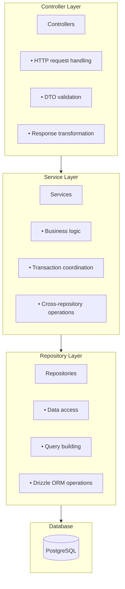

This guide covers the service layer architecture and design patterns used across all Vritti backend applications.

## Why Layered Architecture

Vritti follows a **layered architecture** to separate concerns and maintain clean code boundaries:

- **Controller Layer** - HTTP concerns (request/response handling)
- **Service Layer** - Business logic and orchestration
- **Repository Layer** - Data access and persistence
- **Database Layer** - PostgreSQL with Drizzle ORM

This separation enables:
- **Testability** - Each layer can be unit tested in isolation
- **Maintainability** - Changes to one layer don't cascade to others
- **Reusability** - Services can be shared across controllers
- **Clarity** - Each component has a single, well-defined purpose

## Layered Architecture Diagram



## Layer Responsibilities

### Controller Layer

**Responsibilities:**
- Extract data from HTTP requests (body, query params, headers)
- Validate input using DTOs and class-validator
- Call appropriate service methods
- Transform service responses to HTTP responses
- Handle HTTP-specific concerns (status codes, headers)

**Should NOT:**
- Contain business logic
- Access the database directly
- Call other controllers

**Example:**
```typescript
@Controller('users')
export class UserController {
  constructor(private readonly userService: UserService) {}

  @Get(':id')
  async findOne(@Param('id') id: string) {
    const user = await this.userService.findById(id);
    // Controller returns the service result directly
    return user;
  }

  @Post()
  async create(@Body() dto: CreateUserDto) {
    // Controller passes validated DTO to service
    return this.userService.create(dto);
  }
}
```

### Service Layer

**Responsibilities:**
- Implement business logic and rules
- Coordinate operations across multiple repositories
- Handle transactions
- Emit domain events
- Transform repository data for controllers

**Should NOT:**
- Access HTTP request/response directly
- Contain database query logic (delegate to repositories)
- Handle HTTP-specific concerns

**Example:**
```typescript
@Injectable()
export class UserService {
  constructor(
    private readonly userRepository: UserRepository,
    private readonly eventEmitter: EventEmitter2,
  ) {}

  async create(dto: CreateUserDto) {
    // Business rule: Check for duplicates
    const existing = await this.userRepository.findByEmail(dto.email);
    if (existing) {
      throw new ConflictException('Email already registered');
    }

    // Business logic: Set initial status
    const user = await this.userRepository.create({
      ...dto,
      accountStatus: 'PENDING_VERIFICATION',
      onboardingStep: 'EMAIL_VERIFICATION',
    });

    // Emit domain event
    this.eventEmitter.emit('user.created', { userId: user.id });

    return user;
  }
}
```

### Repository Layer

**Responsibilities:**
- Execute database queries
- Abstract database operations
- Provide type-safe data access
- Handle low-level database concerns

**Should NOT:**
- Contain business logic
- Call other repositories directly
- Emit events

**Example:**
```typescript
@Injectable()
export class UserRepository extends PrimaryBaseRepository<typeof users> {
  constructor(database: PrimaryDatabaseService) {
    super(database, users);
  }

  async findByEmail(email: string) {
    return this.model.findFirst({
      where: { email: email.toLowerCase() },
    });
  }

  async findActiveUsers(limit = 100, offset = 0) {
    return this.model.findMany({
      where: { accountStatus: 'ACTIVE' },
      limit,
      offset,
    });
  }
}
```

## Standard Service Patterns

### Basic Service Pattern

Simple service with single dependency:

```typescript
import { Injectable } from '@nestjs/common';
import { UserRepository } from './user.repository';
import { CreateUserDto, UpdateUserDto } from './dto';

@Injectable()
export class UserService {
  constructor(private readonly userRepository: UserRepository) {}

  async findById(id: string) {
    const user = await this.userRepository.findById(id);
    if (!user) {
      throw new NotFoundException(`User ${id} not found`);
    }
    return user;
  }

  async findByEmail(email: string) {
    return this.userRepository.findByEmail(email);
  }

  async create(dto: CreateUserDto) {
    const existing = await this.userRepository.findByEmail(dto.email);
    if (existing) {
      throw new ConflictException('Email already registered');
    }

    return this.userRepository.create({
      ...dto,
      accountStatus: 'PENDING_VERIFICATION',
    });
  }

  async update(id: string, dto: UpdateUserDto) {
    await this.findById(id); // Throws if not found
    return this.userRepository.update(id, dto);
  }
}
```

### Service with Multiple Dependencies

Complex service orchestrating multiple repositories:

```typescript
@Injectable()
export class AuthService {
  constructor(
    private readonly userService: UserService,
    private readonly sessionService: SessionService,
    private readonly jwtService: JwtAuthService,
    private readonly configService: ConfigService,
  ) {}

  async login(dto: LoginDto) {
    // 1. Find user
    const user = await this.userService.findByEmail(dto.email);
    if (!user) {
      throw new UnauthorizedException('Invalid credentials');
    }

    // 2. Verify password
    const isValid = await this.verifyPassword(dto.password, user.passwordHash);
    if (!isValid) {
      throw new UnauthorizedException('Invalid credentials');
    }

    // 3. Check MFA requirement
    if (user.mfaEnabled) {
      return { requiresMfa: true, userId: user.id };
    }

    // 4. Create session and tokens
    const session = await this.sessionService.create(user.id, 'CLOUD');
    const tokens = await this.jwtService.generateTokens(user, session);

    return { user, tokens };
  }

  private async verifyPassword(password: string, hash: string): Promise<boolean> {
    // Password verification logic
    return bcrypt.compare(password, hash);
  }
}
```

## Repository Pattern

### Base Repository Classes

Vritti provides base repository classes from `@vritti/api-sdk`:

**PrimaryBaseRepository** - For primary database (cloud schema):
```typescript
import { PrimaryBaseRepository, PrimaryDatabaseService } from '@vritti/api-sdk';
import { tenants } from './db/schema';

@Injectable()
export class TenantRepository extends PrimaryBaseRepository<typeof tenants> {
  constructor(database: PrimaryDatabaseService) {
    super(database, tenants);
  }

  // Inherits: create, findById, findOne, findMany, update, delete, etc.

  // Add custom queries
  async findBySubdomain(subdomain: string) {
    return this.model.findFirst({
      where: { subdomain },
    });
  }
}
```

**TenantBaseRepository** - For tenant-specific databases:
```typescript
import { TenantBaseRepository, TenantDatabaseService } from '@vritti/api-sdk';
import { users } from './db/schema';

@Injectable()
export class UserRepository extends TenantBaseRepository<typeof users> {
  constructor(database: TenantDatabaseService) {
    super(database, users);
  }

  // Queries automatically use current tenant's database
  async findByEmail(email: string) {
    return this.model.findFirst({
      where: { email },
      with: { profile: true },
    });
  }
}
```

### Base Repository Methods

Both base classes provide these methods:

```typescript
// Create
create(data: TInsert): Promise<TSelect>

// Read
findById(id: string): Promise<TSelect | undefined>
findOne(where: WhereFilter): Promise<TSelect | undefined>
findMany(options?): Promise<TSelect[]>
count(where?): Promise<number>
exists(where): Promise<boolean>

// Update
update(id: string, data: Partial<TInsert>): Promise<TSelect>
updateMany(where: WhereFilter, data: Partial<TInsert>): Promise<{ count: number }>

// Delete
delete(id: string): Promise<TSelect>
deleteMany(where: WhereFilter): Promise<{ count: number }>
```

### Custom Repository Queries

For complex queries, extend the base repository:

```typescript
@Injectable()
export class OrderRepository extends TenantBaseRepository<typeof orders> {
  constructor(database: TenantDatabaseService) {
    super(database, orders);
  }

  async findPendingOrders(limit = 50) {
    return this.model.findMany({
      where: { status: 'PENDING' },
      with: {
        customer: true,
        items: true,
      },
      orderBy: { createdAt: 'desc' },
      limit,
    });
  }

  async findByDateRange(startDate: Date, endDate: Date) {
    const db = this.db; // Access raw Drizzle client
    return db
      .select()
      .from(orders)
      .where(and(
        gte(orders.createdAt, startDate),
        lte(orders.createdAt, endDate)
      ));
  }
}
```

## Shared Services

### EmailService

Integration with Brevo for transactional emails:

```typescript
import { Injectable } from '@nestjs/common';
import { ConfigService } from '@nestjs/config';
import { TransactionalEmailsApi } from '@getbrevo/brevo';

@Injectable()
export class EmailService {
  private readonly client: TransactionalEmailsApi;

  constructor(private readonly configService: ConfigService) {
    const apiKey = this.configService.get('BREVO_API_KEY');
    this.client = new TransactionalEmailsApi();
    this.client.setApiKey(TransactionalEmailsApiApiKeys.apiKey, apiKey);
  }

  async sendVerificationEmail(email: string, otp: string) {
    await this.client.sendTransacEmail({
      sender: {
        email: this.configService.get('SENDER_EMAIL'),
        name: this.configService.get('SENDER_NAME'),
      },
      to: [{ email }],
      subject: 'Verify your email',
      htmlContent: `Your verification code is: <strong>${otp}</strong>`,
    });
  }

  async sendWelcomeEmail(email: string, name: string) {
    await this.client.sendTransacEmail({
      sender: { /* ... */ },
      to: [{ email }],
      templateId: 1, // Brevo template ID
      params: { name },
    });
  }
}
```

### WhatsAppService

Integration with WhatsApp Cloud API:

```typescript
import { Injectable } from '@nestjs/common';
import { ConfigService } from '@nestjs/config';
import axios from 'axios';
import * as crypto from 'crypto';

@Injectable()
export class WhatsAppService {
  private readonly baseUrl = 'https://graph.facebook.com/v18.0';

  constructor(private readonly configService: ConfigService) {}

  async sendVerificationMessage(phone: string, otp: string) {
    const phoneNumberId = this.configService.get('WHATSAPP_PHONE_NUMBER_ID');
    const accessToken = this.configService.get('WHATSAPP_ACCESS_TOKEN');

    await axios.post(
      `${this.baseUrl}/${phoneNumberId}/messages`,
      {
        messaging_product: 'whatsapp',
        to: phone,
        type: 'template',
        template: {
          name: 'verification_code',
          language: { code: 'en' },
          components: [
            {
              type: 'body',
              parameters: [{ type: 'text', text: otp }],
            },
          ],
        },
      },
      {
        headers: { Authorization: `Bearer ${accessToken}` },
      },
    );
  }

  verifyWebhookSignature(payload: string, signature: string): boolean {
    const appSecret = this.configService.get('WHATSAPP_APP_SECRET');
    const expectedSignature = crypto
      .createHmac('sha256', appSecret)
      .update(payload)
      .digest('hex');
    return `sha256=${expectedSignature}` === signature;
  }
}
```

### EncryptionService

For encrypting sensitive data like database credentials:

```typescript
import { Injectable } from '@nestjs/common';
import { ConfigService } from '@nestjs/config';
import * as crypto from 'crypto';

@Injectable()
export class EncryptionService {
  private readonly algorithm = 'aes-256-gcm';
  private readonly key: Buffer;

  constructor(configService: ConfigService) {
    this.key = Buffer.from(configService.get('ENCRYPTION_KEY'), 'hex');
  }

  encrypt(plaintext: string): string {
    const iv = crypto.randomBytes(16);
    const cipher = crypto.createCipheriv(this.algorithm, this.key, iv);

    let encrypted = cipher.update(plaintext, 'utf8', 'hex');
    encrypted += cipher.final('hex');

    const authTag = cipher.getAuthTag().toString('hex');

    return `${iv.toString('hex')}:${authTag}:${encrypted}`;
  }

  decrypt(ciphertext: string): string {
    const [ivHex, authTagHex, encrypted] = ciphertext.split(':');

    const iv = Buffer.from(ivHex, 'hex');
    const authTag = Buffer.from(authTagHex, 'hex');

    const decipher = crypto.createDecipheriv(this.algorithm, this.key, iv);
    decipher.setAuthTag(authTag);

    let decrypted = decipher.update(encrypted, 'hex', 'utf8');
    decrypted += decipher.final('utf8');

    return decrypted;
  }
}
```

## Error Handling Patterns

### Custom Exceptions

Use NestJS built-in exceptions and create custom domain exceptions:

```typescript
// Standard NestJS exceptions
throw new BadRequestException('Invalid input');
throw new UnauthorizedException('Invalid credentials');
throw new ForbiddenException('Access denied');
throw new NotFoundException('Resource not found');
throw new ConflictException('Resource already exists');

// Custom domain exceptions
export class OtpExpiredException extends BadRequestException {
  constructor() {
    super('OTP has expired. Please request a new one.');
  }
}

export class MaxAttemptsExceededException extends BadRequestException {
  constructor() {
    super('Maximum verification attempts exceeded.');
  }
}

export class TenantNotFoundException extends NotFoundException {
  constructor(identifier: string) {
    super(`Tenant '${identifier}' not found`);
  }
}
```

### Error Response Format

All errors follow RFC 7807 Problem Details:

```json
{
  "type": "https://vrittiai.com/errors/validation",
  "title": "Validation Error",
  "status": 400,
  "detail": "Email is required",
  "instance": "/cloud-api/auth/signup",
  "timestamp": "2024-01-15T10:30:00Z",
  "correlationId": "abc123"
}
```

## Event-Driven Communication

### Emitting Events

Services emit domain events for loose coupling:

```typescript
import { EventEmitter2 } from '@nestjs/event-emitter';

@Injectable()
export class OnboardingService {
  constructor(private readonly eventEmitter: EventEmitter2) {}

  async verifyEmail(userId: string, otp: string) {
    // ... verification logic

    // Emit event for listeners
    this.eventEmitter.emit('verification.completed', {
      userId,
      type: 'email',
      timestamp: new Date(),
    });

    return { success: true };
  }
}
```

### Listening for Events

Event listeners handle cross-cutting concerns:

```typescript
import { OnEvent } from '@nestjs/event-emitter';

@Injectable()
export class VerificationEventListener {
  constructor(private readonly sseService: SseConnectionService) {}

  @OnEvent('verification.completed')
  handleVerificationCompleted(payload: VerificationEvent) {
    // Broadcast to SSE clients
    this.sseService.broadcast(payload.userId, {
      type: 'VERIFICATION_COMPLETE',
      method: payload.type,
    });
  }

  @OnEvent('verification.completed')
  async updateAnalytics(payload: VerificationEvent) {
    // Track verification in analytics
    await this.analyticsService.track('email_verified', {
      userId: payload.userId,
    });
  }
}
```

## Transaction Management

### Using Drizzle Transactions

Wrap multiple database operations in a transaction:

```typescript
import { PrimaryDatabaseService } from '@vritti/api-sdk';
import { tenants, tenantDatabaseConfigs } from './db/schema';

@Injectable()
export class TenantService {
  constructor(private readonly db: PrimaryDatabaseService) {}

  async createTenantWithDatabase(dto: CreateTenantDto) {
    return this.db.transaction(async (tx) => {
      // Create tenant
      const [tenant] = await tx.insert(tenants)
        .values({ subdomain: dto.subdomain, name: dto.name })
        .returning();

      // Create database config
      await tx.insert(tenantDatabaseConfigs)
        .values({
          tenantId: tenant.id,
          dbHost: dto.dbHost,
          dbPort: dto.dbPort,
          dbDatabase: dto.dbDatabase,
          dbUsername: dto.dbUsername,
          dbPassword: this.encryptionService.encrypt(dto.dbPassword),
        });

      return tenant;
    });
  }
}
```

### Transaction Best Practices

- Keep transactions short-lived
- Avoid external API calls inside transactions
- Only include database operations that must be atomic
- Handle rollback scenarios gracefully

```typescript
// ✅ Good - Transaction only includes DB operations
async transferFunds(fromId: string, toId: string, amount: number) {
  return this.db.transaction(async (tx) => {
    await tx.update(accounts)
      .set({ balance: sql`${accounts.balance} - ${amount}` })
      .where(eq(accounts.id, fromId));

    await tx.update(accounts)
      .set({ balance: sql`${accounts.balance} + ${amount}` })
      .where(eq(accounts.id, toId));
  });
}

// ❌ Bad - External API call inside transaction
async processPayment(orderId: string) {
  return this.db.transaction(async (tx) => {
    const order = await tx.query.orders.findFirst({ where: { id: orderId } });

    // Don't do this - transaction held during external API call
    await this.stripeService.charge(order.amount);

    await tx.update(orders).set({ status: 'PAID' });
  });
}
```

## Best Practices

<CardGroup cols={2}>
  <Card title="Single Responsibility" icon="bullseye">
    Each service handles one domain. `AuthService` handles auth, not user management.
  </Card>
  <Card title="Dependency Injection" icon="syringe">
    Always inject dependencies via constructor. Never instantiate services directly.
  </Card>
  <Card title="Repository Abstraction" icon="database">
    Services never access the database directly. Always go through repositories.
  </Card>
  <Card title="Explicit Errors" icon="exclamation-triangle">
    Throw specific exceptions. Use `NotFoundException` not generic `Error`.
  </Card>
</CardGroup>

### Additional Guidelines

1. **Avoid Circular Dependencies**
   - Use forwardRef() sparingly
   - Consider extracting shared logic to a separate service
   - Use events instead of direct service-to-service calls

2. **Keep Services Stateless**
   - Don't store request-specific data in service properties
   - Use request-scoped providers when needed
   - Pass data through method parameters

3. **Write Testable Code**
   - Mock dependencies in unit tests
   - Use interfaces for flexibility
   - Keep business logic separate from framework code

4. **Use DTOs for Validation**
   - Validate at the controller layer
   - Transform DTOs to domain objects in services
   - Don't expose database entities directly

## Anti-Patterns to Avoid

<Warning>
  **Don't do this:**

  ```typescript
  // ❌ Accessing DB directly in service
  async findUser(id: string) {
    return this.db.select().from(users).where(eq(users.id, id));
  }

  // ❌ Catching all errors silently
  try {
    await this.userService.create(dto);
  } catch (e) {
    // Swallowed error - bad!
  }

  // ❌ Business logic in controller
  @Post()
  async create(@Body() dto: CreateDto) {
    if (dto.email.includes('test')) {
      throw new BadRequestException('Test emails not allowed');
    }
    return this.service.create(dto);
  }

  // ❌ Service calling another service's repository
  async someMethod() {
    // Don't access other service's repository
    await this.otherService.repository.doSomething();
  }

  // ❌ Controller logic in service
  async createUser(req: Request) {
    // Don't access HTTP request in service
    const token = req.headers['authorization'];
  }
  ```
</Warning>

## Related Documentation

<CardGroup cols={2}>
  <Card title="Drizzle ORM" icon="database" href="/architecture/database/drizzle-orm">
    Learn about database access patterns
  </Card>
  <Card title="Guards & Decorators" icon="shield" href="/architecture/backend/guards-decorators">
    Authentication and authorization patterns
  </Card>
  <Card title="Multi-Tenancy" icon="building" href="/architecture/backend/multi-tenancy">
    Tenant isolation patterns
  </Card>
  <Card title="Testing Guide" icon="flask" href="/architecture/backend/testing">
    How to test services and repositories
  </Card>
</CardGroup>
