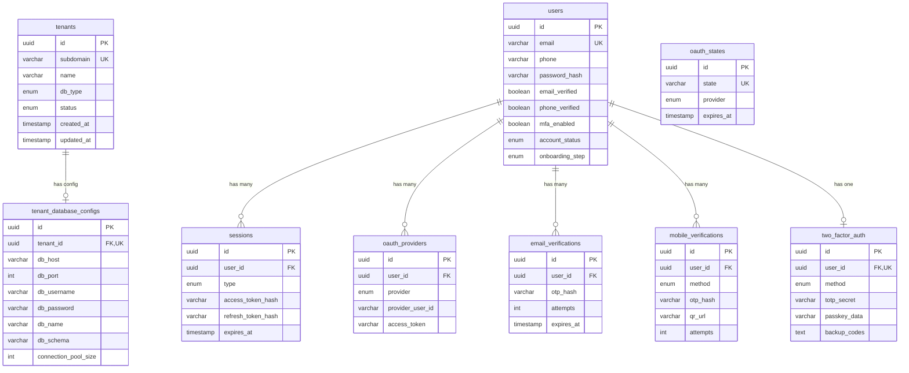

The primary database uses a `cloud` PostgreSQL schema containing all platform-level tables. Tenant-specific data lives in dedicated databases.

## Schema Namespace

```sql
CREATE SCHEMA cloud;
```

All primary database tables are created within this schema to avoid conflicts with the `public` schema.

## Entity Relationship Diagram



## Tables

### tenants

Stores tenant (organization) information.

```typescript
export const tenants = cloudSchema.table('tenants', {
  id: uuid('id').primaryKey().defaultRandom(),
  subdomain: varchar('subdomain', { length: 63 }).notNull().unique(),
  name: varchar('name', { length: 255 }).notNull(),
  dbType: databaseTypeEnum('db_type').notNull().default('DEDICATED'),
  status: tenantStatusEnum('status').notNull().default('ACTIVE'),
  createdAt: timestamp('created_at').notNull().defaultNow(),
  updatedAt: timestamp('updated_at').notNull().defaultNow().$onUpdate(() => new Date()),
});
```

| Column | Type | Description |
|--------|------|-------------|
| `id` | UUID | Primary key |
| `subdomain` | VARCHAR(63) | Unique identifier (e.g., "acme") |
| `name` | VARCHAR(255) | Display name |
| `db_type` | ENUM | `SHARED` or `DEDICATED` |
| `status` | ENUM | `ACTIVE`, `SUSPENDED`, `ARCHIVED` |
| `created_at` | TIMESTAMP | Creation time |
| `updated_at` | TIMESTAMP | Last update time |

### tenant_database_configs

Stores database connection details for each tenant.

```typescript
export const tenantDatabaseConfigs = cloudSchema.table('tenant_database_configs', {
  id: uuid('id').primaryKey().defaultRandom(),
  tenantId: uuid('tenant_id')
    .references(() => tenants.id, { onDelete: 'cascade' })
    .unique(),
  dbHost: varchar('db_host', { length: 255 }).notNull(),
  dbPort: integer('db_port').notNull().default(5432),
  dbUsername: varchar('db_username', { length: 255 }).notNull(),
  dbPassword: varchar('db_password', { length: 255 }).notNull(),
  dbName: varchar('db_name', { length: 255 }).notNull(),
  dbSchema: varchar('db_schema', { length: 255 }).default('public'),
  connectionPoolSize: integer('connection_pool_size').default(10),
  createdAt: timestamp('created_at').notNull().defaultNow(),
  updatedAt: timestamp('updated_at').notNull().defaultNow().$onUpdate(() => new Date()),
});
```

<Warning>
  Database credentials are stored encrypted at rest. Never log or expose these values.
</Warning>

### users

Stores user accounts.

```typescript
export const users = cloudSchema.table('users', {
  id: uuid('id').primaryKey().defaultRandom(),
  email: varchar('email', { length: 255 }).notNull().unique(),
  phone: varchar('phone', { length: 20 }),
  passwordHash: varchar('password_hash', { length: 255 }),
  locale: varchar('locale', { length: 10 }).default('en'),
  timezone: varchar('timezone', { length: 50 }).default('UTC'),
  profilePictureUrl: varchar('profile_picture_url', { length: 512 }),
  accountStatus: accountStatusEnum('account_status').notNull().default('PENDING_VERIFICATION'),
  currentOnboardingStep: onboardingStepEnum('current_onboarding_step').default('EMAIL_VERIFICATION'),
  emailVerified: boolean('email_verified').notNull().default(false),
  phoneVerified: boolean('phone_verified').notNull().default(false),
  mfaEnabled: boolean('mfa_enabled').notNull().default(false),
  createdAt: timestamp('created_at').notNull().defaultNow(),
  updatedAt: timestamp('updated_at').notNull().defaultNow().$onUpdate(() => new Date()),
}, (table) => [
  index('users_email_idx').on(table.email),
  index('users_account_status_idx').on(table.accountStatus),
]);
```

| Column | Type | Description |
|--------|------|-------------|
| `id` | UUID | Primary key |
| `email` | VARCHAR(255) | Unique email address |
| `phone` | VARCHAR(20) | Optional phone number |
| `password_hash` | VARCHAR(255) | Argon2 hashed password |
| `account_status` | ENUM | `PENDING_VERIFICATION`, `ACTIVE`, `INACTIVE` |
| `current_onboarding_step` | ENUM | Current step in onboarding flow |
| `email_verified` | BOOLEAN | Email verification status |
| `phone_verified` | BOOLEAN | Phone verification status |
| `mfa_enabled` | BOOLEAN | Whether 2FA is enabled |

### sessions

Stores active authentication sessions.

```typescript
export const sessions = cloudSchema.table('sessions', {
  id: uuid('id').primaryKey().defaultRandom(),
  userId: uuid('user_id').references(() => users.id, { onDelete: 'cascade' }).notNull(),
  type: sessionTypeEnum('type').notNull(),
  accessTokenHash: varchar('access_token_hash', { length: 255 }).notNull(),
  refreshTokenHash: varchar('refresh_token_hash', { length: 255 }).notNull(),
  refreshTokenBindingHash: varchar('refresh_token_binding_hash', { length: 255 }),
  expiresAt: timestamp('expires_at').notNull(),
  refreshExpiresAt: timestamp('refresh_expires_at').notNull(),
  userAgent: varchar('user_agent', { length: 500 }),
  ipAddress: varchar('ip_address', { length: 45 }),
  createdAt: timestamp('created_at').notNull().defaultNow(),
  updatedAt: timestamp('updated_at').notNull().defaultNow().$onUpdate(() => new Date()),
}, (table) => [
  index('sessions_user_id_idx').on(table.userId),
  index('sessions_access_token_hash_idx').on(table.accessTokenHash),
  index('sessions_refresh_token_hash_idx').on(table.refreshTokenHash),
]);
```

| Column | Type | Description |
|--------|------|-------------|
| `type` | ENUM | `ONBOARDING` or `CLOUD` |
| `access_token_hash` | VARCHAR(255) | SHA-256 hash of access token |
| `refresh_token_hash` | VARCHAR(255) | SHA-256 hash of refresh token |
| `refresh_token_binding_hash` | VARCHAR(255) | Binds access to refresh token |
| `expires_at` | TIMESTAMP | Access token expiry |
| `refresh_expires_at` | TIMESTAMP | Refresh token expiry |

### oauth_providers

Stores linked OAuth accounts.

```typescript
export const oauthProviders = cloudSchema.table('oauth_providers', {
  id: uuid('id').primaryKey().defaultRandom(),
  userId: uuid('user_id').references(() => users.id, { onDelete: 'cascade' }).notNull(),
  provider: oauthProviderEnum('provider').notNull(),
  providerUserId: varchar('provider_user_id', { length: 255 }).notNull(),
  accessToken: varchar('access_token', { length: 2000 }),
  refreshToken: varchar('refresh_token', { length: 2000 }),
  expiresAt: timestamp('expires_at'),
  createdAt: timestamp('created_at').notNull().defaultNow(),
  updatedAt: timestamp('updated_at').notNull().defaultNow().$onUpdate(() => new Date()),
}, (table) => [
  uniqueIndex('oauth_providers_provider_user_idx').on(table.provider, table.providerUserId),
  index('oauth_providers_user_id_idx').on(table.userId),
]);
```

| Provider | Supported |
|----------|-----------|
| `GOOGLE` | ✓ |
| `MICROSOFT` | ✓ |
| `APPLE` | Planned |
| `FACEBOOK` | Planned |
| `X` | Planned |

### email_verifications

Tracks email verification attempts.

```typescript
export const emailVerifications = cloudSchema.table('email_verifications', {
  id: uuid('id').primaryKey().defaultRandom(),
  userId: uuid('user_id').references(() => users.id, { onDelete: 'cascade' }).notNull(),
  otpHash: varchar('otp_hash', { length: 255 }).notNull(),
  attempts: integer('attempts').notNull().default(0),
  expiresAt: timestamp('expires_at').notNull(),
  createdAt: timestamp('created_at').notNull().defaultNow(),
});
```

### mobile_verifications

Tracks phone verification attempts.

```typescript
export const mobileVerifications = cloudSchema.table('mobile_verifications', {
  id: uuid('id').primaryKey().defaultRandom(),
  userId: uuid('user_id').references(() => users.id, { onDelete: 'cascade' }).notNull(),
  method: verificationMethodEnum('method').notNull(),
  otpHash: varchar('otp_hash', { length: 255 }).notNull(),
  qrUrl: varchar('qr_url', { length: 500 }),
  attempts: integer('attempts').notNull().default(0),
  expiresAt: timestamp('expires_at').notNull(),
  createdAt: timestamp('created_at').notNull().defaultNow(),
});
```

| Method | Description |
|--------|-------------|
| `WHATSAPP_QR` | Scan QR to open WhatsApp with OTP |
| `SMS_QR` | Scan QR to open SMS app with OTP |
| `MANUAL_OTP` | Enter OTP manually |

### two_factor_auth

Stores 2FA configuration per user.

```typescript
export const twoFactorAuth = cloudSchema.table('two_factor_auth', {
  id: uuid('id').primaryKey().defaultRandom(),
  userId: uuid('user_id').references(() => users.id, { onDelete: 'cascade' }).unique().notNull(),
  method: twoFactorMethodEnum('method').notNull(),
  totpSecret: varchar('totp_secret', { length: 255 }),
  passkeyCredentialId: varchar('passkey_credential_id', { length: 500 }),
  passkeyPublicKey: text('passkey_public_key'),
  backupCodes: text('backup_codes'), // JSON array of hashed codes
  createdAt: timestamp('created_at').notNull().defaultNow(),
  updatedAt: timestamp('updated_at').notNull().defaultNow().$onUpdate(() => new Date()),
});
```

| Method | Description |
|--------|-------------|
| `TOTP` | Time-based one-time password (Authenticator app) |
| `PASSKEY` | WebAuthn passkey (Touch ID, Face ID, YubiKey) |

### oauth_states

Stores OAuth CSRF state tokens.

```typescript
export const oauthStates = cloudSchema.table('oauth_states', {
  id: uuid('id').primaryKey().defaultRandom(),
  state: varchar('state', { length: 255 }).notNull().unique(),
  provider: oauthProviderEnum('provider').notNull(),
  redirectUri: varchar('redirect_uri', { length: 500 }),
  expiresAt: timestamp('expires_at').notNull(),
  createdAt: timestamp('created_at').notNull().defaultNow(),
});
```

## Enums

```typescript
// Database type
export const databaseTypeEnum = cloudSchema.enum('database_type', [
  'SHARED',
  'DEDICATED',
]);

// Tenant status
export const tenantStatusEnum = cloudSchema.enum('tenant_status', [
  'ACTIVE',
  'SUSPENDED',
  'ARCHIVED',
]);

// User account status
export const accountStatusEnum = cloudSchema.enum('account_status', [
  'PENDING_VERIFICATION',
  'ACTIVE',
  'INACTIVE',
]);

// Onboarding steps
export const onboardingStepEnum = cloudSchema.enum('onboarding_step', [
  'EMAIL_VERIFICATION',
  'SET_PASSWORD',
  'MOBILE_VERIFICATION',
  'TWO_FACTOR_SETUP',
  'COMPLETE',
]);

// Session type
export const sessionTypeEnum = cloudSchema.enum('session_type', [
  'ONBOARDING',
  'CLOUD',
]);

// OAuth providers
export const oauthProviderEnum = cloudSchema.enum('oauth_provider_type', [
  'GOOGLE',
  'MICROSOFT',
  'APPLE',
  'FACEBOOK',
  'X',
]);

// Verification methods
export const verificationMethodEnum = cloudSchema.enum('verification_method', [
  'WHATSAPP_QR',
  'SMS_QR',
  'MANUAL_OTP',
]);

// 2FA methods
export const twoFactorMethodEnum = cloudSchema.enum('two_factor_method', [
  'TOTP',
  'PASSKEY',
]);
```

## Indexes

Key indexes for query performance:

| Table | Index | Columns |
|-------|-------|---------|
| `users` | `users_email_idx` | `email` |
| `users` | `users_account_status_idx` | `account_status` |
| `sessions` | `sessions_user_id_idx` | `user_id` |
| `sessions` | `sessions_access_token_hash_idx` | `access_token_hash` |
| `oauth_providers` | `oauth_providers_provider_user_idx` | `provider`, `provider_user_id` |

## Next Steps

<CardGroup cols={2}>
  <Card title="Migrations" icon="code-branch" href="/architecture/database/migrations">
    Learn migration workflow
  </Card>
  <Card title="Multi-Tenant Schemas" icon="layer-group" href="/architecture/database/multi-tenant-schemas">
    Understand per-tenant databases
  </Card>
</CardGroup>
