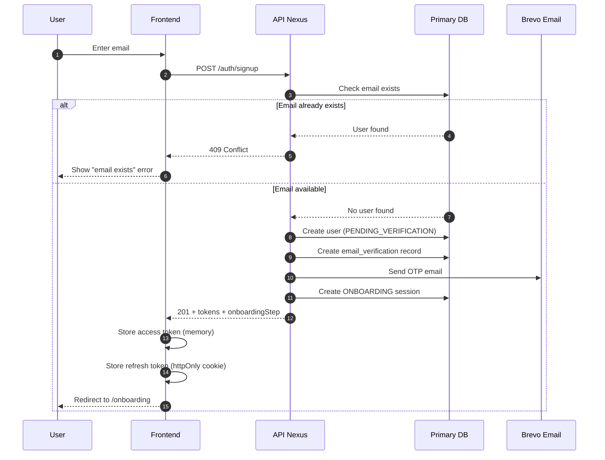
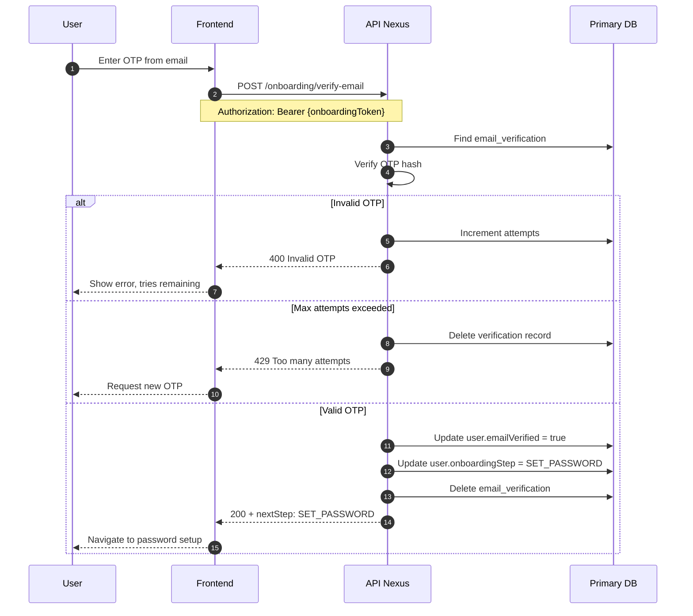
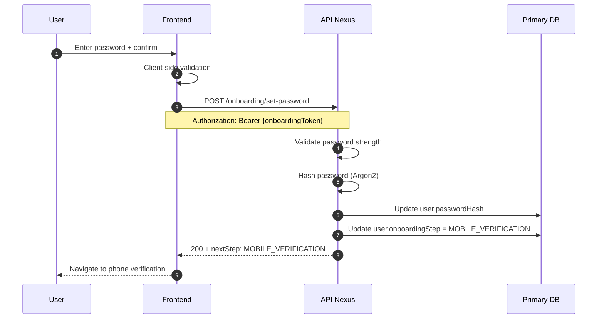
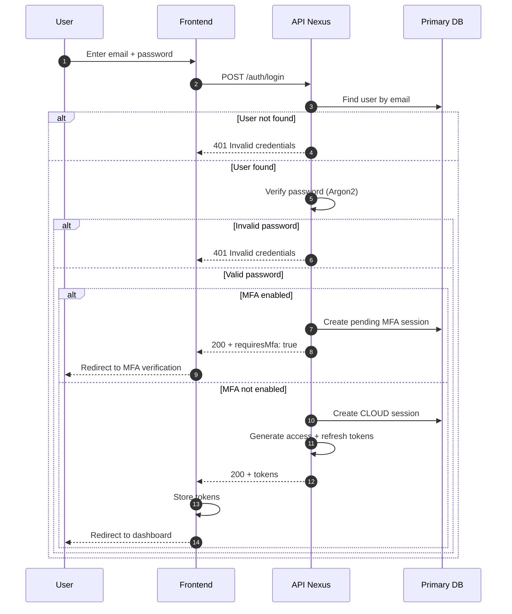
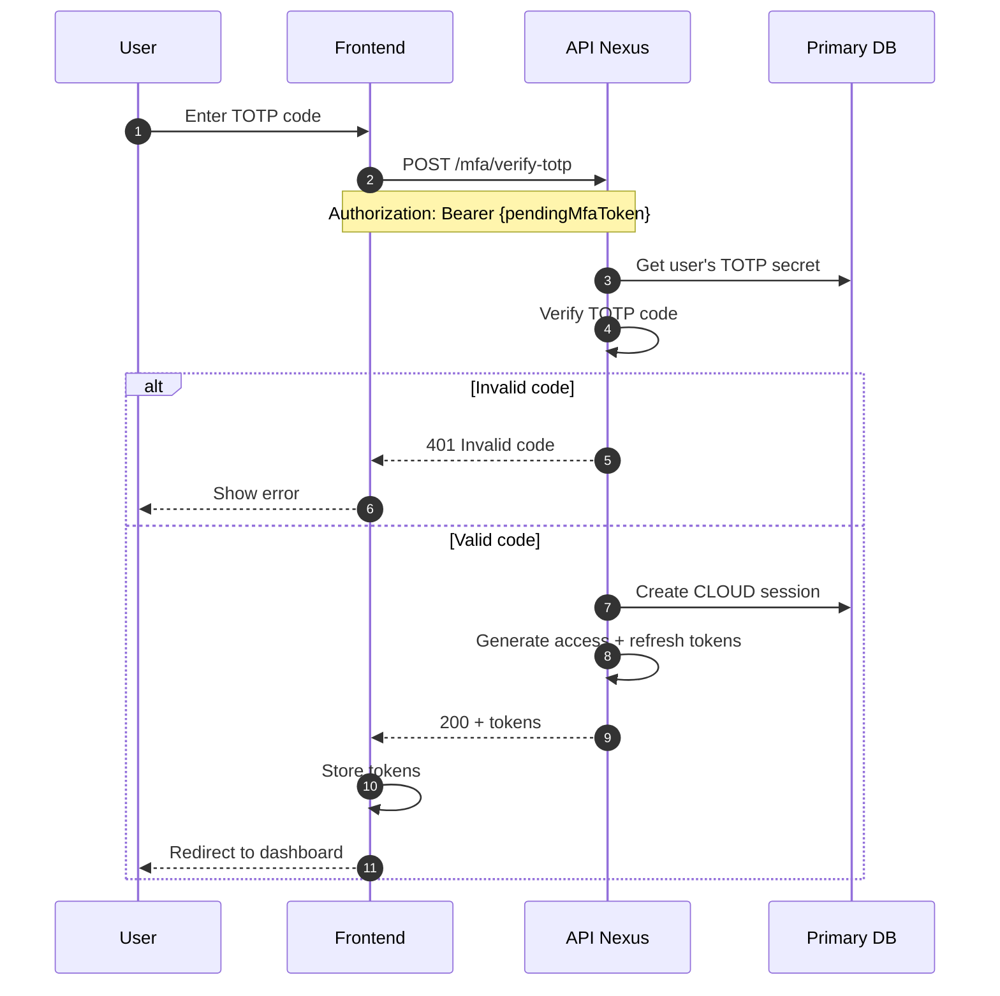
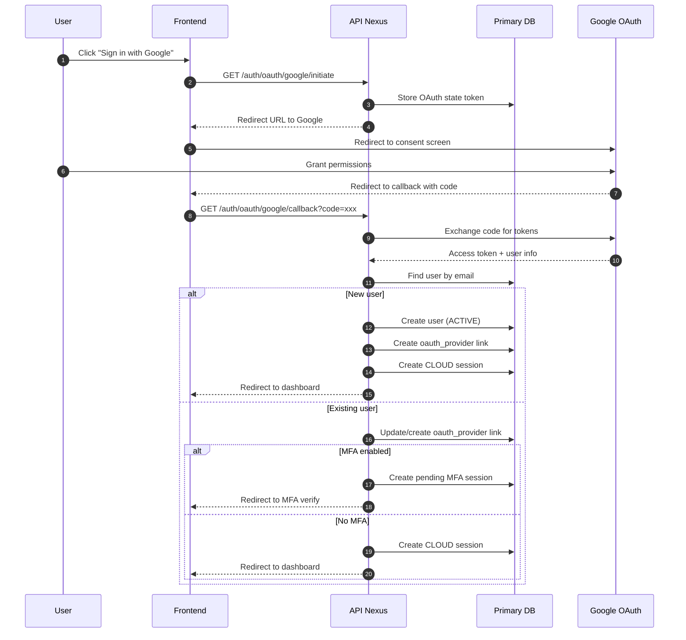
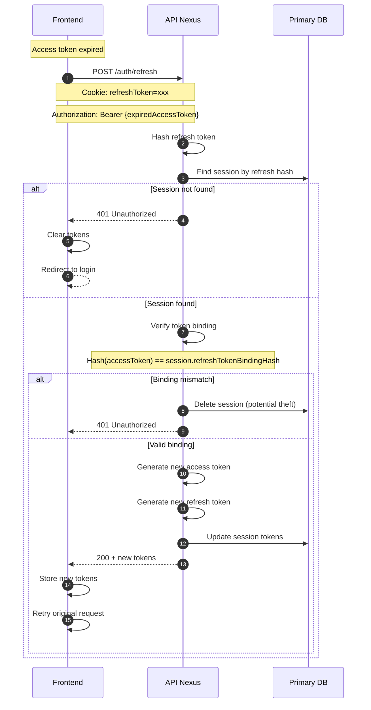
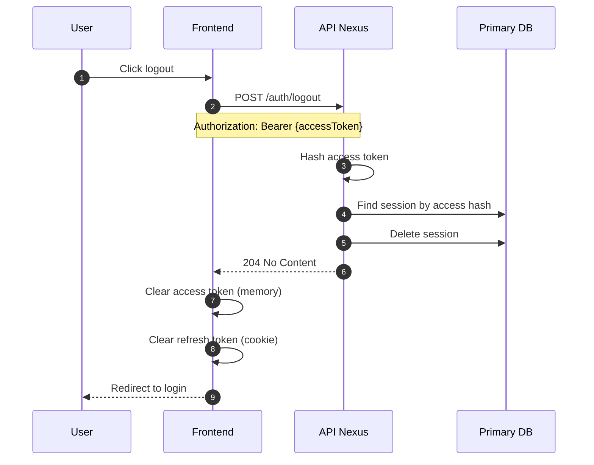
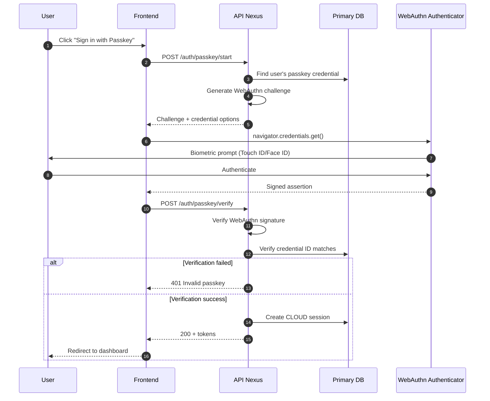
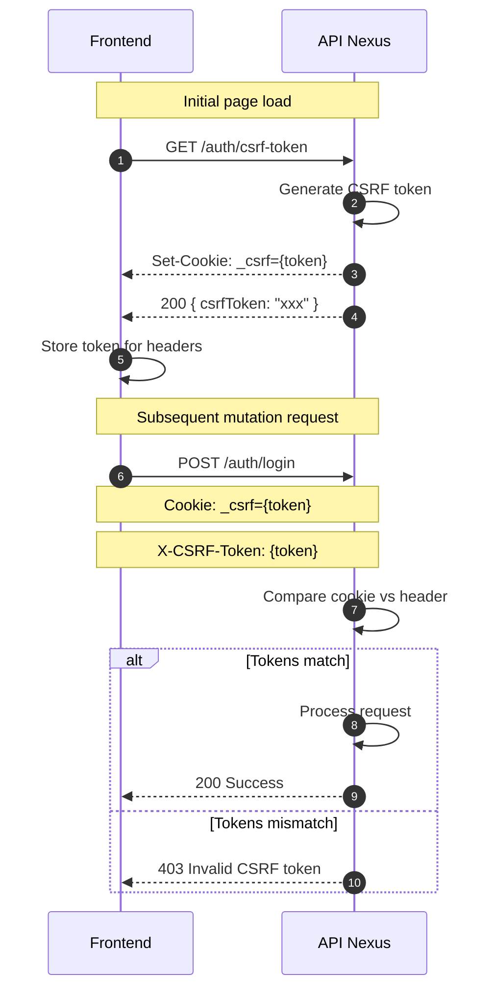

Detailed sequence diagrams showing authentication flows, token management, and session handling.

## Email/Password Signup Flow

## Email Verification Flow

## Password Setup Flow

## Login Flow

## MFA Verification Flow (TOTP)

## OAuth Flow (Google)

## Token Refresh Flow

## Logout Flow

## Passkey Authentication Flow

## CSRF Protection Flow

## Session Types

| Type | Purpose | Duration | Token Binding |
|------|---------|----------|---------------|
| `ONBOARDING` | Signup/onboarding flow | 1 hour | Yes |
| `CLOUD` | Full authenticated access | 15 min (access), 7 days (refresh) | Yes |
| `MFA_PENDING` | Awaiting MFA verification | 5 min | No |

## Security Features

<CardGroup cols={2}>
  <Card title="Token Binding" icon="link">
    Refresh tokens are bound to access tokens via hash. Prevents token theft attacks.
  </Card>
  <Card title="Argon2 Hashing" icon="lock">
    Passwords hashed with Argon2id, the winning algorithm from the Password Hashing Competition.
  </Card>
  <Card title="Short-lived Tokens" icon="clock">
    Access tokens expire in 15 minutes. Refresh tokens enable seamless renewal.
  </Card>
  <Card title="CSRF Protection" icon="shield">
    Double-submit cookie pattern prevents cross-site request forgery.
  </Card>
</CardGroup>

## Next Steps

<CardGroup cols={2}>
  <Card title="System Architecture" icon="sitemap" href="/architecture/diagrams/system-architecture">
    Overall system overview
  </Card>
  <Card title="Data Flow Diagram" icon="arrows-spin" href="/architecture/diagrams/data-flow">
    Request lifecycle visualization
  </Card>
</CardGroup>
