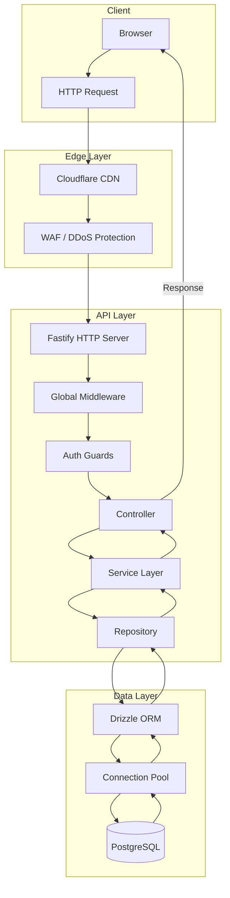
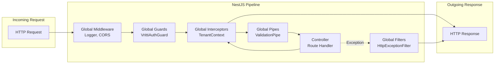
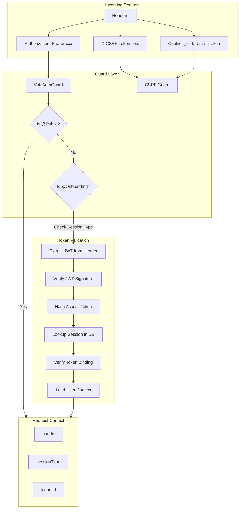
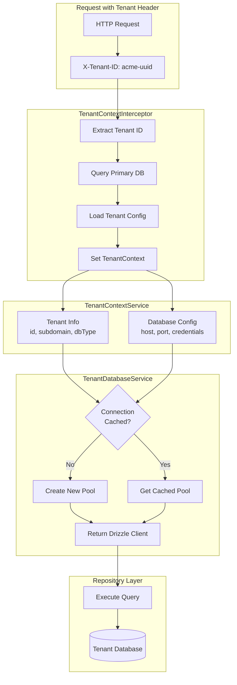
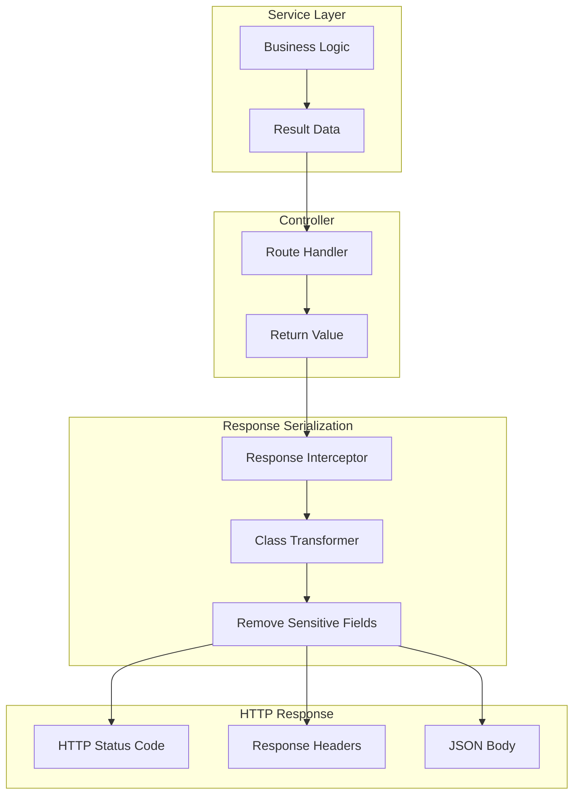
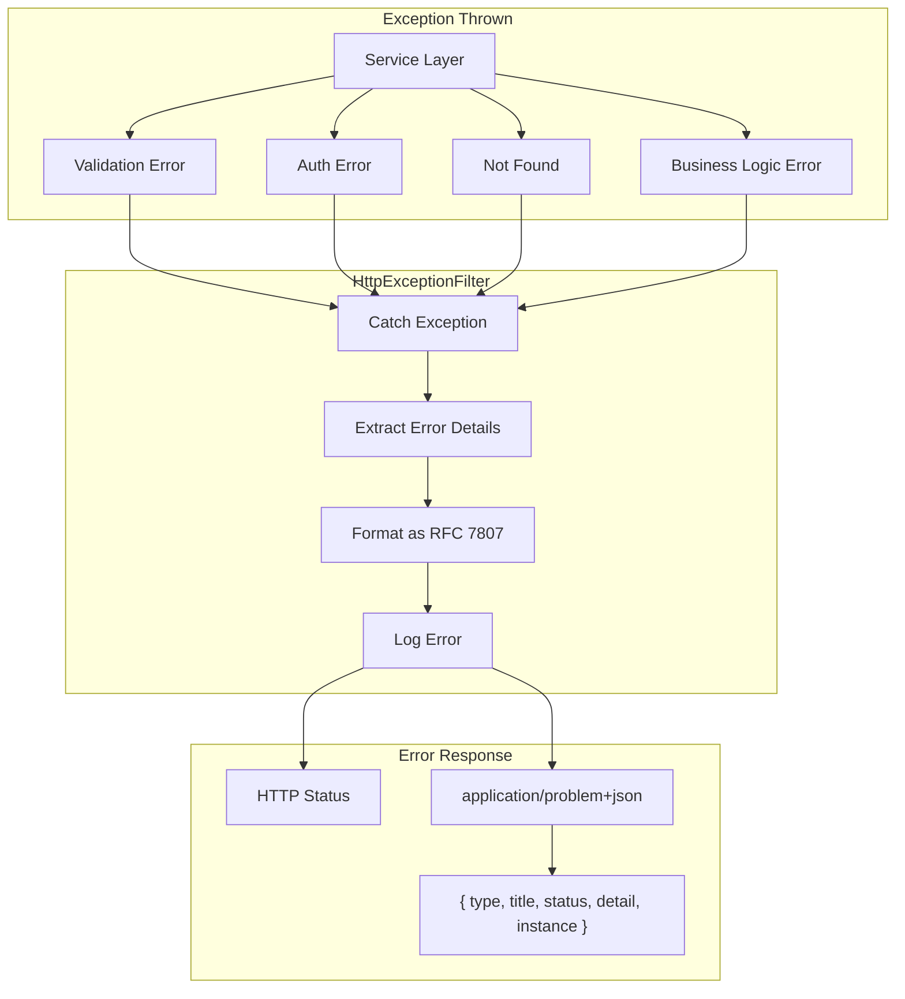
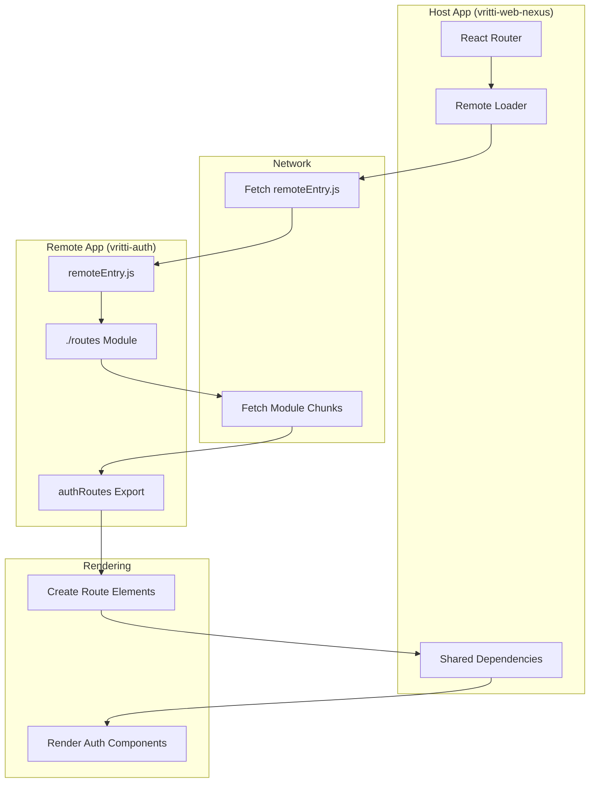
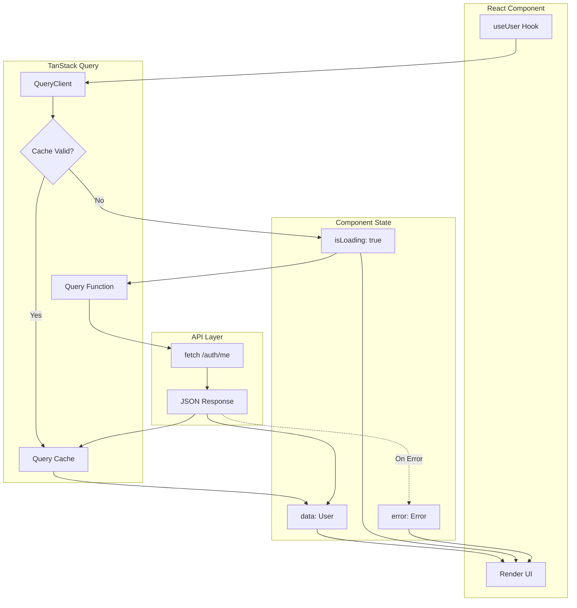
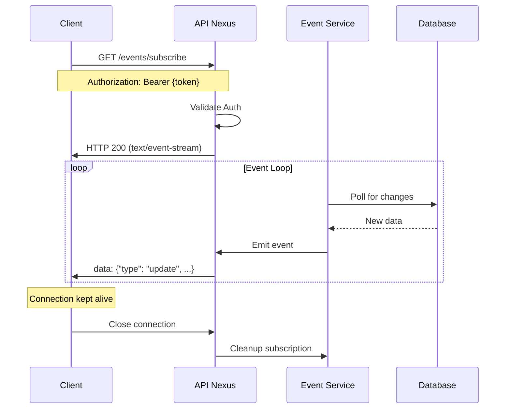

Detailed diagrams showing how requests flow through the system, from client to database and back.

## Request Lifecycle Overview

## NestJS Request Pipeline

## Authentication Data Flow

## Multi-Tenant Data Flow

## API Response Flow

## Error Handling Flow

## Database Query Flow (Drizzle ORM)

```mermaid
flowchart LR
    subgraph Repository["Repository"]
        Method[findByEmail]
        BuildQuery[Build Query]
    end

    subgraph Drizzle["Drizzle ORM"]
        QueryBuilder[Query Builder]
        SQL[Generate SQL]
        Params[Parameterized Query]
    end

    subgraph Pool["Connection Pool"]
        GetConn[Acquire Connection]
        Execute[Execute Query]
        ReleaseConn[Release Connection]
    end

    subgraph Database["PostgreSQL"]
        Parse[Parse SQL]
        Plan[Query Plan]
        Exec[Execute]
        Return[Return Rows]
    end

    subgraph Result["Result"]
        Map[Map to Types]
        TypedResult[Typed Result]
    end

    Method --> BuildQuery
    BuildQuery --> QueryBuilder
    QueryBuilder --> SQL
    SQL --> Params
    Params --> GetConn
    GetConn --> Execute
    Execute --> Parse
    Parse --> Plan
    Plan --> Exec
    Exec --> Return
    Return --> ReleaseConn
    ReleaseConn --> Map
    Map --> TypedResult
```

## Module Federation Data Flow

## State Management Flow (TanStack Query)

## SSE (Server-Sent Events) Flow

## Data Flow Summary

| Flow | Description | Key Components |
|------|-------------|----------------|
| **Request Pipeline** | Middleware → Guards → Interceptors → Pipes → Controller | NestJS lifecycle hooks |
| **Auth Validation** | JWT → Session lookup → Token binding → User context | VrittiAuthGuard |
| **Multi-Tenant** | Tenant header → Config lookup → Dynamic connection | TenantDatabaseService |
| **Database Query** | Repository → Drizzle → Connection Pool → PostgreSQL | Drizzle ORM |
| **Error Handling** | Exception → Filter → RFC 7807 response | HttpExceptionFilter |
| **Module Federation** | Host → Remote manifest → Module load → Shared deps | RSBuild + MF |
| **State Management** | Component → Query hook → Cache → API fetch | TanStack Query |

## Next Steps

<CardGroup cols={2}>
  <Card title="System Architecture" icon="sitemap" href="/architecture/diagrams/system-architecture">
    Overall system overview
  </Card>
  <Card title="Auth Flow Diagram" icon="key" href="/architecture/diagrams/auth-flow">
    Authentication sequences
  </Card>
</CardGroup>
