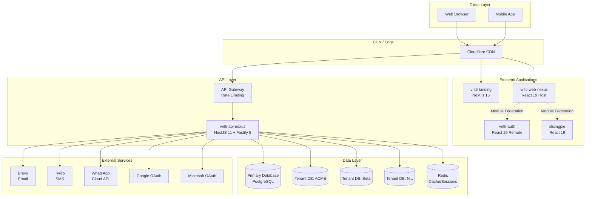
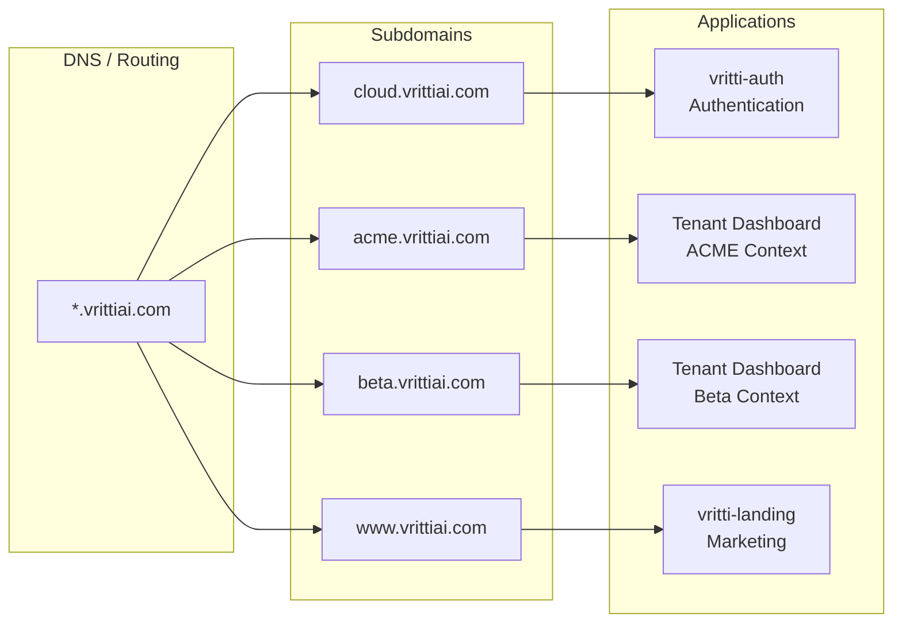
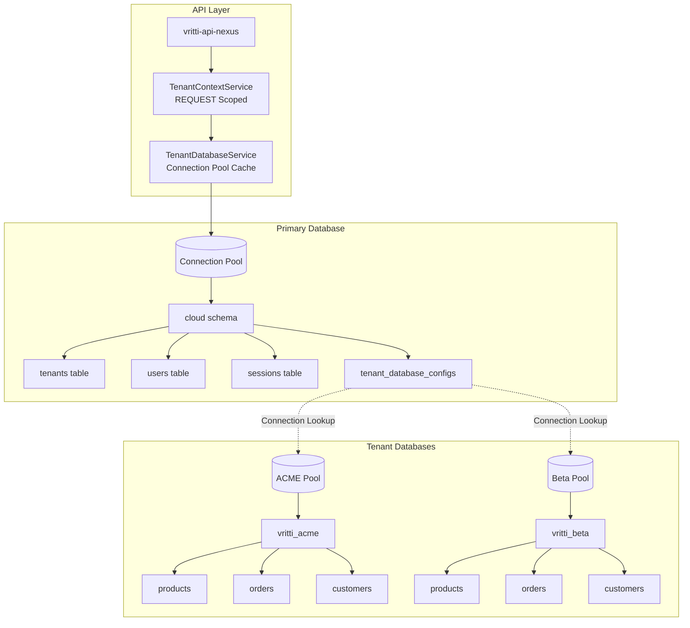
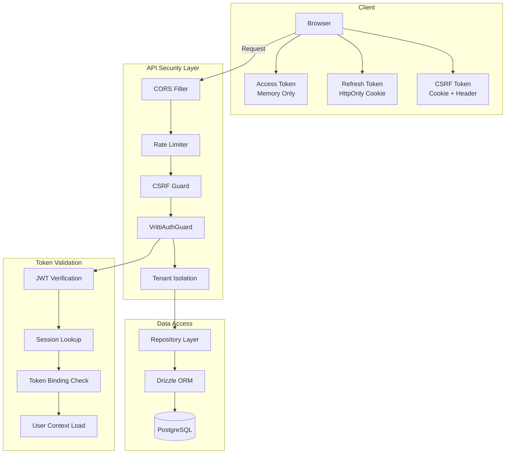
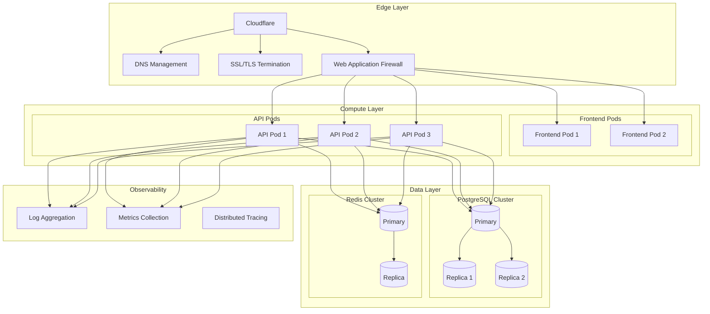

# System Architecture

Visual diagrams showing the overall system architecture, component relationships, and deployment topology.

## High-Level Architecture



## Subdomain Routing



## Module Federation Architecture

```mermaid
graph TB
    subgraph "Host Application"
        Host[vritti-web-nexus<br/>Port 3002]
        HostRouter[React Router v7]
        HostShared[Shared Dependencies<br/>React, React-DOM, TanStack Query]
    end

    subgraph "Remote: Auth"
        AuthRemote[vritti-auth<br/>Port 3003]
        AuthRoutes[authRoutes Export]
        AuthComponents[Login, Signup, Onboarding]
    end

    subgraph "Remote: SlicingPie"
        SlicingRemote[slicingpie<br/>Port 3004]
        SlicingRoutes[adminRoutes Export]
        SlicingComponents[Admin Dashboard]
    end

    subgraph "Shared Libraries"
        QuantumUI[@vritti/quantum-ui<br/>UI Components]
        APISDK[@vritti/api-sdk<br/>Auth Guards, DB Utils]
    end

    Host --> HostRouter
    Host --> HostShared

    HostRouter -.->|Dynamic Import| AuthRemote
    HostRouter -.->|Dynamic Import| SlicingRemote

    AuthRemote --> AuthRoutes
    AuthRoutes --> AuthComponents

    SlicingRemote --> SlicingRoutes
    SlicingRoutes --> SlicingComponents

    Host --> QuantumUI
    AuthRemote --> QuantumUI
    SlicingRemote --> QuantumUI

    Host --> APISDK
```

## Multi-Tenant Database Architecture



## Security Architecture



## Deployment Topology



## Technology Stack Summary

| Layer | Technology | Purpose |
|-------|------------|---------|
| **Frontend** | React 19, RSBuild | UI rendering, bundling |
| **Micro-frontends** | Module Federation | Code splitting, independent deployment |
| **State** | TanStack Query | Server state management |
| **Routing** | React Router v7 | Client-side navigation |
| **UI Components** | @vritti/quantum-ui | Shared component library |
| **API Framework** | NestJS 11 | Backend application framework |
| **HTTP Server** | Fastify 5 | High-performance HTTP |
| **ORM** | Drizzle ORM v1 | Type-safe database access |
| **Database** | PostgreSQL 16 | Primary data storage |
| **Cache** | Redis | Session cache, rate limiting |
| **Email** | Brevo | Transactional email |
| **SMS** | Twilio | SMS verification |
| **CDN** | Cloudflare | Edge caching, DDoS protection |

## Next Steps

<CardGroup cols={2}>
  <Card title="Auth Flow Diagram" icon="key" href="/architecture/diagrams/auth-flow">
    Authentication sequence diagrams
  </Card>
  <Card title="Data Flow Diagram" icon="arrows-spin" href="/architecture/diagrams/data-flow">
    Request lifecycle visualization
  </Card>
</CardGroup>
