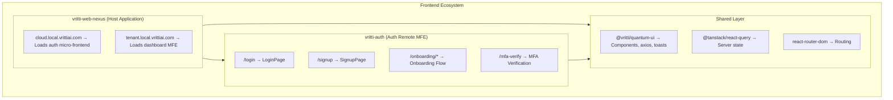

# Micro-Frontends

Vritti implements a micro-frontend architecture where the authentication flows are encapsulated in a separate application (`vritti-auth`) that integrates with the host (`vritti-web-nexus`) via Module Federation.

## Application Structure



## Auth Micro-Frontend (vritti-auth)

### Project Structure

```
vritti-auth/
├── src/
│   ├── App.tsx              # Standalone app entry
│   ├── routes.tsx           # Exported routes for MF
│   │
│   ├── pages/
│   │   ├── LoginPage.tsx
│   │   ├── SignupPage.tsx
│   │   ├── ForgotPasswordPage.tsx
│   │   ├── MFAVerificationPage.tsx
│   │   └── onboarding/
│   │       ├── VerifyEmailPage.tsx
│   │       ├── SetPasswordPage.tsx
│   │       ├── VerifyMobilePage.tsx
│   │       └── MFASetupPage.tsx
│   │
│   ├── components/
│   │   ├── AuthLayout.tsx
│   │   └── onboarding/
│   │       └── OnboardingRouter.tsx
│   │
│   ├── context/
│   │   └── OnboardingProvider.tsx
│   │
│   ├── hooks/
│   │   ├── useLogin.ts
│   │   ├── useSignup.ts
│   │   └── useOnboarding.ts
│   │
│   └── services/
│       └── auth.service.ts
│
├── rsbuild.config.ts        # Module Federation config
└── package.json
```

### Route Export Pattern

```typescript
// vritti-auth/src/routes.tsx
import { RouteObject, Navigate, Outlet, createBrowserRouter } from 'react-router-dom';

// Routes exported for Module Federation consumption
export const authRoutes: RouteObject[] = [
  {
    path: '/',
    element: <AuthLayout />,
    children: [
      // Redirect root to login
      { index: true, element: <Navigate to="/login" replace /> },

      // Public auth routes
      { path: 'login', element: <LoginPage /> },
      { path: 'signup', element: <SignupPage /> },
      { path: 'forgot-password', element: <ForgotPasswordPage /> },
      { path: 'mfa-verify', element: <MFAVerificationPage /> },

      // OAuth callback routes (OUTSIDE OnboardingProvider)
      { path: 'onboarding/oauth-success', element: <OAuthSuccessPage /> },
      { path: 'onboarding/oauth-error', element: <OAuthErrorPage /> },

      // Onboarding flow (WITH OnboardingProvider)
      {
        path: 'onboarding',
        element: (
          <OnboardingProvider>
            <Outlet />
          </OnboardingProvider>
        ),
        children: [
          { index: true, element: <OnboardingRouter /> },
        ],
      },
    ],
  },
];

// Browser router for standalone development/testing
export const router = createBrowserRouter(authRoutes);
```

<Warning>
  **OAuth routes are outside OnboardingProvider intentionally.** This prevents the provider's `useQuery` from firing during OAuth callbacks, which would cause race conditions when extracting tokens from URL params.
</Warning>

### Standalone vs Federated Mode

The auth app can run in two modes:

<Tabs>
  <Tab title="Standalone Mode">
    For local development and testing:

    ```typescript
    // vritti-auth/src/main.tsx
    import { StrictMode } from 'react';
    import { createRoot } from 'react-dom/client';
    import App from './App';

    createRoot(document.getElementById('root')!).render(
      <StrictMode>
        <App />
      </StrictMode>,
    );
    ```

    ```typescript
    // vritti-auth/src/App.tsx
    import { QueryClient, QueryClientProvider } from '@tanstack/react-query';
    import { RouterProvider } from 'react-router-dom';
    import { Toaster } from '@vritti/quantum-ui';
    import { router } from './routes';

    const queryClient = new QueryClient();

    export default function App() {
      return (
        <QueryClientProvider client={queryClient}>
          <RouterProvider router={router} />
          <Toaster position="top-center" richColors />
        </QueryClientProvider>
      );
    }
    ```

    ```bash
    # Run standalone
    cd vritti-auth
    pnpm dev
    # Access at http://local.vrittiai.com:3001
    ```
  </Tab>
  <Tab title="Federated Mode">
    When loaded by the host:

    ```typescript
    // vritti-web-nexus loads routes from vritti-auth
    <RemoteRoutes
      remoteName="VrittiAuth"
      moduleName="routes"
      dataKey="authRoutes"
    />
    ```

    The host's `QueryClientProvider` wraps the remote routes, so they share the same query cache.

    ```bash
    # Run as part of host
    cd vritti-auth && pnpm dev
    cd vritti-web-nexus && pnpm dev
    # Access at http://cloud.local.vrittiai.com:3012
    ```
  </Tab>
</Tabs>

## Host Application (vritti-web-nexus)

### Subdomain-Based Routing

```typescript
// vritti-web-nexus/src/routes.tsx
const hostname = window.location.hostname;
const subDomain = hostname.split('.')[0];

// cloud.* subdomains load auth micro-frontend
export const isCloud = subDomain === 'cloud';

export const routes: Route[] = [];

if (isCloud) {
  // Load auth routes from remote
  routes.push({
    path: '/*',
    element: (
      <RemoteRoutes
        remoteName="VrittiAuth"
        moduleName="routes"
        dataKey="authRoutes"
      />
    ),
  });
} else {
  // Load tenant dashboard routes
  routes.push({
    path: '/*',
    element: <TenantDashboard />,
  });
}
```

### App Shell

```typescript
// vritti-web-nexus/src/App.tsx
import { QueryClient, QueryClientProvider } from '@tanstack/react-query';
import { BrowserRouter } from 'react-router-dom';
import { Toaster } from '@vritti/quantum-ui';
import { AppRoutes } from './routes';

const queryClient = new QueryClient({
  defaultOptions: {
    queries: {
      staleTime: 5 * 60 * 1000, // 5 minutes
      retry: 1,
    },
  },
});

export default function App() {
  return (
    <QueryClientProvider client={queryClient}>
      <BrowserRouter>
        <AppRoutes />
      </BrowserRouter>
      <Toaster position="bottom-right" />
    </QueryClientProvider>
  );
}
```

## Communication Patterns

### Shared Context

The host provides global context that remotes can use:

```typescript
// Host provides QueryClient
<QueryClientProvider client={queryClient}>
  <RemoteRoutes ... />
</QueryClientProvider>

// Remote can use queries/mutations
const { data } = useQuery({ queryKey: ['user'] });
```

### Navigation

Remotes use `react-router-dom` for navigation, which works because it's shared:

```typescript
// In vritti-auth
import { useNavigate } from 'react-router-dom';

function LoginPage() {
  const navigate = useNavigate();

  const handleSuccess = () => {
    // Navigate to host's route
    navigate('/dashboard');
  };
}
```

### Authentication State

Auth tokens are managed through quantum-ui's axios instance:

```typescript
// Token stored in memory after login
const response = await axios.post('cloud-api/auth/login', credentials);
// axios interceptor stores token automatically

// Subsequent requests include token
const user = await axios.get('cloud-api/users/me');
// Authorization header added by interceptor
```

## Layouts

### Auth Layout

```typescript
// vritti-auth/src/components/AuthLayout.tsx
export function AuthLayout() {
  return (
    <div className="min-h-screen flex">
      {/* Left side - branding */}
      <div className="hidden lg:flex lg:w-1/2 bg-primary">
        <VrittiBranding />
      </div>

      {/* Right side - auth forms */}
      <div className="w-full lg:w-1/2 flex items-center justify-center p-8">
        <Outlet />
      </div>
    </div>
  );
}
```

### Onboarding Flow

```typescript
// vritti-auth/src/components/onboarding/OnboardingRouter.tsx
export function OnboardingRouter() {
  const { currentStep, isLoading } = useOnboarding();

  if (isLoading) return <LoadingSpinner />;

  // Server-driven routing based on onboarding status
  switch (currentStep) {
    case 'EMAIL_VERIFICATION':
      return <VerifyEmailPage />;
    case 'PHONE_VERIFICATION':
      return <VerifyMobilePage />;
    case 'SET_PASSWORD':
      return <SetPasswordPage />;
    case 'MFA_SETUP':
      return <MFASetupPage />;
    case 'COMPLETED':
      return <Navigate to="/dashboard" replace />;
    default:
      return <Navigate to="/login" replace />;
  }
}
```

## Error Boundaries

Each micro-frontend has its own error boundary:

```typescript
// vritti-auth/src/components/AuthErrorBoundary.tsx
export function AuthErrorBoundary({ children }: PropsWithChildren) {
  return (
    <ErrorBoundary
      fallback={
        <div className="p-8 text-center">
          <h2>Something went wrong</h2>
          <Button onClick={() => window.location.reload()}>
            Reload Page
          </Button>
        </div>
      }
    >
      {children}
    </ErrorBoundary>
  );
}
```

## Deployment Strategy

<Steps>
  <Step title="Build Remote">
    ```bash
    cd vritti-auth
    pnpm build
    # Output: dist/ with mf-manifest.json
    ```
  </Step>
  <Step title="Deploy Remote">
    Deploy to CDN or static hosting
    - Production manifest: `https://auth.vrittiai.com/mf-manifest.json`
  </Step>
  <Step title="Update Host Config">
    ```typescript
    // Update remote entry URL
    {
      name: 'VrittiAuth',
      entry: process.env.PUBLIC_VRITTI_AUTH_ENTRY
        || 'https://auth.vrittiai.com/mf-manifest.json',
    }
    ```
  </Step>
  <Step title="Deploy Host">
    ```bash
    cd vritti-web-nexus
    pnpm build && deploy
    ```
  </Step>
</Steps>

<Note>
  Remotes can be deployed independently. The host will fetch the latest manifest on page load.
</Note>

## Next Steps

<CardGroup cols={2}>
  <Card title="State Management" icon="database" href="/architecture/frontend/state-management">
    Learn about TanStack Query patterns
  </Card>
  <Card title="Routing" icon="route" href="/architecture/frontend/routing">
    Understand React Router v7 setup
  </Card>
</CardGroup>
