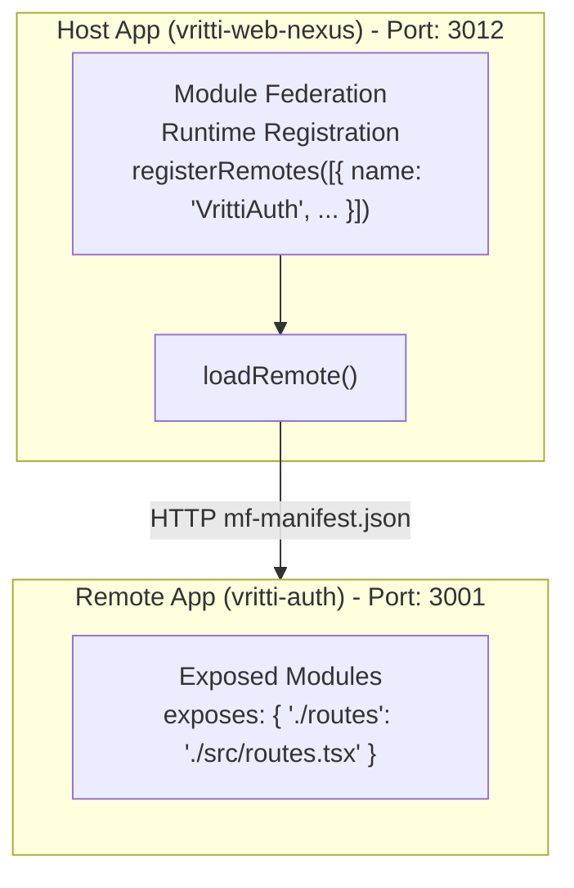

# Module Federation

Vritti uses **Module Federation** with **RSBuild** to implement a micro-frontend architecture. This allows independent deployment of frontend applications while sharing common dependencies.

## Why Module Federation?

<CardGroup cols={2}>
  <Card title="Independent Deployment" icon="rocket">
    Deploy the auth micro-frontend without rebuilding the host app
  </Card>
  <Card title="Shared Dependencies" icon="share-nodes">
    React, TanStack Query, and quantum-ui are loaded once and shared
  </Card>
  <Card title="Runtime Integration" icon="bolt">
    Remote modules are loaded at runtime, not build time
  </Card>
  <Card title="Team Scalability" icon="users">
    Different teams can own different micro-frontends
  </Card>
</CardGroup>

## Architecture



## Host Configuration

### RSBuild Config

```typescript
// vritti-web-nexus/rsbuild.config.ts
import { defineConfig } from '@rsbuild/core';
import { pluginReact } from '@rsbuild/plugin-react';
import { pluginModuleFederation } from '@module-federation/rsbuild-plugin';

export default defineConfig({
  plugins: [
    pluginReact(),
    pluginModuleFederation({
      name: 'vritti_nexus_host',
      remotes: {}, // Using runtime registration
      shared: {
        react: {
          singleton: true,
          requiredVersion: '^19.2.0',
          eager: true,
        },
        'react-dom': {
          singleton: true,
          requiredVersion: '^19.2.0',
          eager: true,
        },
        'react-router-dom': {
          singleton: true,
          eager: true,
        },
        '@vritti/quantum-ui': {
          singleton: true,
          eager: true,
        },
        axios: {
          singleton: true,
          eager: true,
        },
        '@tanstack/react-query': {
          singleton: true,
          eager: true,
        },
      },
      dts: false,
    }),
  ],
  server: {
    port: 3012,
    host: 'local.vrittiai.com',
  },
});
```

### Bootstrap with Runtime Registration

```typescript
// vritti-web-nexus/src/bootstrap.tsx
import { registerRemotes } from '@module-federation/enhanced/runtime';
import { ALL_REMOTES } from './config/remotes.config';

// Register all remotes at application startup
registerRemotes(
  ALL_REMOTES.map((remote) => ({
    name: remote.name,
    entry: remote.entry,
  })),
);

// Then render the app
import('./App').then(({ default: App }) => {
  createRoot(document.getElementById('root')!).render(
    <StrictMode>
      <App />
    </StrictMode>,
  );
});
```

### Remote Configuration

```typescript
// vritti-web-nexus/src/config/remotes.config.ts
export interface RemoteConfig {
  name: string;
  entry: string;
  exposedModule: string;
}

export const ALL_REMOTES: RemoteConfig[] = [
  {
    name: 'VrittiAuth',
    entry: process.env.PUBLIC_VRITTI_AUTH_ENTRY
      || 'http://local.vrittiai.com:3001/mf-manifest.json',
    exposedModule: 'routes',
  },
  // Future remotes can be added here
  // {
  //   name: 'VrittiDashboard',
  //   entry: 'http://local.vrittiai.com:3002/mf-manifest.json',
  //   exposedModule: 'routes',
  // },
];
```

## Remote Configuration

### RSBuild Config

```typescript
// vritti-auth/rsbuild.config.ts
import { defineConfig } from '@rsbuild/core';
import { pluginReact } from '@rsbuild/plugin-react';
import { pluginModuleFederation } from '@module-federation/rsbuild-plugin';

export default defineConfig({
  plugins: [
    pluginReact(),
    pluginModuleFederation({
      name: 'vritti_auth',
      exposes: {
        './routes': './src/routes.tsx',
      },
      shared: {
        react: {
          singleton: true,
          requiredVersion: '^19.2.0',
          eager: true,
        },
        'react-dom': {
          singleton: true,
          requiredVersion: '^19.2.0',
          eager: true,
        },
        'react-router-dom': {
          singleton: true,
          eager: true,
        },
        '@vritti/quantum-ui': {
          singleton: true,
          eager: true,
        },
        axios: {
          singleton: true,
          eager: true,
        },
        '@tanstack/react-query': {
          singleton: true,
          eager: true,
        },
      },
      dts: false,
    }),
    // Custom plugin to log manifest URL
    {
      name: 'log-manifest',
      setup(api) {
        api.onDevCompileDone(() => {
          console.log('\n📦 Module Federation Manifest:');
          console.log('   http://local.vrittiai.com:3001/mf-manifest.json\n');
        });
      },
    },
  ],
  server: {
    port: 3001,
    host: 'local.vrittiai.com',
  },
});
```

### Exposed Routes Module

```typescript
// vritti-auth/src/routes.tsx
import { RouteObject } from 'react-router-dom';

// Routes exported for Module Federation
export const authRoutes: RouteObject[] = [
  {
    path: '/',
    element: <AuthLayout />,
    children: [
      { index: true, element: <Navigate to="/login" replace /> },
      { path: 'login', element: <LoginPage /> },
      { path: 'signup', element: <SignupPage /> },
      { path: 'forgot-password', element: <ForgotPasswordPage /> },
      { path: 'mfa-verify', element: <MFAVerificationPage /> },
      {
        path: 'onboarding',
        element: <OnboardingProvider><Outlet /></OnboardingProvider>,
        children: [
          { index: true, element: <OnboardingRouter /> },
        ],
      },
    ],
  },
];

// Browser router for standalone development
export const router = createBrowserRouter(authRoutes);
```

## Loading Remote Modules

### RemoteRoutes Component

```typescript
// vritti-web-nexus/src/utils/RemoteRoutes.tsx
import { loadRemote } from '@module-federation/enhanced/runtime';
import { Suspense, useEffect, useState } from 'react';
import { RouteObject, useRoutes } from 'react-router-dom';

interface RemoteRoutesProps {
  remoteName: string;
  moduleName: string;
  dataKey?: string;
}

export const RemoteRoutes: React.FC<RemoteRoutesProps> = ({
  remoteName,
  moduleName,
  dataKey,
}) => {
  const [ready, setReady] = useState(false);
  const [routes, setRoutes] = useState<RouteObject[]>([]);

  useEffect(() => {
    const loadRoutes = async () => {
      try {
        // Load remote module at runtime
        const module = await loadRemote(`${remoteName}/${moduleName}`);
        const routeModule = (module as { default?: unknown })?.default || module;

        // Extract routes using dataKey if provided
        const extractedRoutes = dataKey
          ? (routeModule as Record<string, RouteObject[]>)[dataKey]
          : (routeModule as RouteObject[]);

        setRoutes(extractedRoutes || []);
        setReady(true);
      } catch (error) {
        console.error(`Failed to load ${remoteName}/${moduleName}:`, error);
      }
    };

    loadRoutes();
  }, [remoteName, moduleName, dataKey]);

  const routing = useRoutes(routes);

  if (!ready) {
    return <MicrofrontendSkeletonFullPage />;
  }

  return (
    <Suspense fallback={<MicrofrontendSkeletonFullPage />}>
      {routing}
    </Suspense>
  );
};
```

### Usage in Host Routes

```typescript
// vritti-web-nexus/src/routes.tsx
const subDomain = window.location.hostname.split('.')[0];
export const isCloud = subDomain === 'cloud';

export const routes: Route[] = [];

if (isCloud) {
  routes.push({
    path: '/*',
    element: (
      <RemoteRoutes
        remoteName="VrittiAuth"
        moduleName="routes"
        dataKey="authRoutes"
      />
    ),
  });
}
```

## Shared Dependencies

Shared dependencies are loaded once and shared between host and remotes:

| Dependency | Strategy | Why |
|------------|----------|-----|
| `react` | Singleton, Eager | Must be single instance |
| `react-dom` | Singleton, Eager | Must match React version |
| `react-router-dom` | Singleton, Eager | Shared routing context |
| `@tanstack/react-query` | Singleton, Eager | Shared cache |
| `@vritti/quantum-ui` | Singleton, Eager | Shared components |
| `axios` | Singleton, Eager | Shared interceptors |

<Warning>
  **Singleton Mode Critical**: React must be singleton to prevent "hooks can only be called inside the body of a function component" errors.
</Warning>

## Manifest Files

Each remote exposes a manifest file at `/mf-manifest.json`:

```json
{
  "id": "vritti_auth",
  "name": "vritti_auth",
  "metaData": {
    "name": "vritti_auth",
    "type": "app"
  },
  "remoteEntry": {
    "name": "remoteEntry.js",
    "path": "http://local.vrittiai.com:3001/"
  },
  "exposes": [
    {
      "id": "vritti_auth:./routes",
      "name": "./routes",
      "path": ".",
      "assets": { ... }
    }
  ],
  "shared": [ ... ]
}
```

## Development Workflow

<Steps>
  <Step title="Start Remote">
    ```bash
    cd vritti-auth
    pnpm dev
    # Manifest at: http://local.vrittiai.com:3001/mf-manifest.json
    ```
  </Step>
  <Step title="Start Host">
    ```bash
    cd vritti-web-nexus
    pnpm dev
    # App at: http://local.vrittiai.com:3012
    ```
  </Step>
  <Step title="Verify Integration">
    - Open http://local.vrittiai.com:3012
    - Navigate to /login
    - Auth routes should load from remote
  </Step>
</Steps>

## Troubleshooting

<Accordion title="Manifest not loading">
  **Error:** `Failed to load http://local.vrittiai.com:3001/mf-manifest.json`

  **Solution:**
  - Ensure vritti-auth is running on port 3001
  - Check `/etc/hosts` has `127.0.0.1 local.vrittiai.com`
  - Verify manifest is accessible: `curl http://local.vrittiai.com:3001/mf-manifest.json`
</Accordion>

<Accordion title="React hooks error">
  **Error:** `Invalid hook call. Hooks can only be called inside a function component.`

  **Cause:** Multiple React instances loaded

  **Solution:**
  - Ensure `singleton: true` for React in both configs
  - Ensure same React version in both package.json files
  - Clear node_modules and reinstall
</Accordion>

<Accordion title="Shared module not found">
  **Error:** `Shared module not found: @vritti/quantum-ui`

  **Solution:**
  - Add `eager: true` to shared config
  - Ensure package is installed in both host and remote
  - Verify same version in both package.json files
</Accordion>

## Next Steps

<CardGroup cols={2}>
  <Card title="Micro-Frontends" icon="puzzle-piece" href="/architecture/frontend/micro-frontends">
    Learn about vritti-auth remote setup
  </Card>
  <Card title="State Management" icon="database" href="/architecture/frontend/state-management">
    Understand TanStack Query patterns
  </Card>
</CardGroup>
