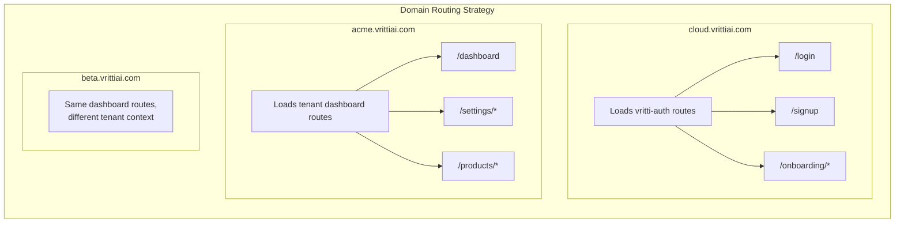

Vritti uses **React Router v7** for client-side routing. The routing architecture supports subdomain-based routing, server-driven navigation, and micro-frontend integration.

## Router Setup

### Host Application

```typescript
// vritti-web-nexus/src/App.tsx
import { BrowserRouter } from 'react-router-dom';
import { QueryClientProvider } from '@tanstack/react-query';
import { AppRoutes } from './routes';

export default function App() {
  return (
    <QueryClientProvider client={queryClient}>
      <BrowserRouter>
        <AppRoutes />
      </BrowserRouter>
    </QueryClientProvider>
  );
}
```

### Route Configuration

```typescript
// vritti-web-nexus/src/routes.tsx
import { Routes, Route, Navigate } from 'react-router-dom';
import { RemoteRoutes } from './utils/RemoteRoutes';

// Detect subdomain for routing decisions
const hostname = window.location.hostname;
const subDomain = hostname.split('.')[0];
export const isCloud = subDomain === 'cloud';

export function AppRoutes() {
  return (
    <Routes>
      {isCloud ? (
        // Cloud subdomain → Auth micro-frontend
        <Route
          path="/*"
          element={
            <RemoteRoutes
              remoteName="VrittiAuth"
              moduleName="routes"
              dataKey="authRoutes"
            />
          }
        />
      ) : (
        // Tenant subdomain → Dashboard
        <>
          <Route path="/" element={<DashboardLayout />}>
            <Route index element={<Navigate to="/dashboard" replace />} />
            <Route path="dashboard" element={<DashboardPage />} />
            <Route path="settings/*" element={<SettingsRoutes />} />
          </Route>
          <Route path="*" element={<NotFoundPage />} />
        </>
      )}
    </Routes>
  );
}
```

## Subdomain-Based Routing



### Implementation

```typescript
// Detect subdomain at app initialization
const getSubdomain = () => {
  const hostname = window.location.hostname;
  const parts = hostname.split('.');

  // Handle localhost
  if (hostname === 'localhost') return 'localhost';

  // Handle *.local.vrittiai.com (development)
  if (hostname.includes('local.vrittiai.com')) {
    return parts[0];
  }

  // Handle *.vrittiai.com (production)
  if (parts.length >= 3) {
    return parts[0];
  }

  return 'unknown';
};

export const subdomain = getSubdomain();
export const isCloud = subdomain === 'cloud';
export const isTenant = !isCloud && subdomain !== 'localhost';
```

## Server-Driven Routing

The onboarding flow uses server-driven routing where the backend determines which step the user should be on:

```typescript
// vritti-auth/src/components/onboarding/OnboardingRouter.tsx
import { Navigate } from 'react-router-dom';
import { useOnboarding } from '@/context/OnboardingProvider';

export function OnboardingRouter() {
  const { currentStep, isLoading, onboardingComplete } = useOnboarding();

  // Show loading while fetching status
  if (isLoading) {
    return <OnboardingLoader />;
  }

  // Redirect to dashboard if complete
  if (onboardingComplete || currentStep === 'COMPLETED') {
    return <Navigate to="/dashboard" replace />;
  }

  // Render step based on server state
  // URL doesn't change - prevents step skipping
  switch (currentStep) {
    case 'EMAIL_VERIFICATION':
      return <VerifyEmailPage />;
    case 'PHONE_VERIFICATION':
      return <VerifyMobilePage />;
    case 'SET_PASSWORD':
      return <SetPasswordPage />;
    case 'MFA_SETUP':
      return <MFASetupPage />;
    default:
      return <Navigate to="/login" replace />;
  }
}
```

<Note>
  **Why server-driven routing?** Users can't skip onboarding steps by manipulating the URL. The server controls the flow, and the frontend just renders the current step.
</Note>

## Auth Remote Routes

```typescript
// vritti-auth/src/routes.tsx
import { RouteObject, Navigate, Outlet } from 'react-router-dom';

export const authRoutes: RouteObject[] = [
  {
    path: '/',
    element: <AuthLayout />,
    children: [
      // Redirect root to login
      { index: true, element: <Navigate to="/login" replace /> },

      // Public auth routes
      { path: 'login', element: <LoginPage /> },
      { path: 'signup', element: <SignupPage /> },
      { path: 'forgot-password', element: <ForgotPasswordPage /> },
      { path: 'mfa-verify', element: <MFAVerificationPage /> },

      // OAuth callbacks (outside OnboardingProvider)
      { path: 'onboarding/oauth-success', element: <OAuthSuccessPage /> },
      { path: 'onboarding/oauth-error', element: <OAuthErrorPage /> },

      // Onboarding flow (with OnboardingProvider)
      {
        path: 'onboarding',
        element: (
          <OnboardingProvider>
            <Outlet />
          </OnboardingProvider>
        ),
        children: [
          { index: true, element: <OnboardingRouter /> },
        ],
      },
    ],
  },
];
```

## Navigation Patterns

### Programmatic Navigation

```typescript
import { useNavigate } from 'react-router-dom';

function LoginForm() {
  const navigate = useNavigate();

  const handleLogin = async (credentials) => {
    const result = await login(credentials);

    if (result.requiresMfa) {
      navigate('/mfa-verify');
    } else if (result.requiresOnboarding) {
      navigate('/onboarding');
    } else {
      navigate('/dashboard');
    }
  };
}
```

### Link Component

```typescript
import { Link } from 'react-router-dom';

function Navbar() {
  return (
    <nav>
      <Link to="/dashboard">Dashboard</Link>
      <Link to="/settings">Settings</Link>
    </nav>
  );
}
```

### Navigate Component

```typescript
import { Navigate } from 'react-router-dom';

function ProtectedRoute({ children }) {
  const { isAuthenticated } = useAuth();

  if (!isAuthenticated) {
    return <Navigate to="/login" replace />;
  }

  return children;
}
```

## Protected Routes

### Auth Guard Pattern

```typescript
// components/AuthGuard.tsx
import { Navigate, useLocation } from 'react-router-dom';

interface AuthGuardProps {
  children: React.ReactNode;
  requireAuth?: boolean;
  requireOnboarding?: boolean;
}

export function AuthGuard({
  children,
  requireAuth = true,
  requireOnboarding = false,
}: AuthGuardProps) {
  const location = useLocation();
  const { isAuthenticated, isOnboarding } = useAuth();

  if (requireAuth && !isAuthenticated) {
    // Redirect to login with return URL
    return <Navigate to="/login" state={{ from: location }} replace />;
  }

  if (requireOnboarding && !isOnboarding) {
    return <Navigate to="/onboarding" replace />;
  }

  return <>{children}</>;
}
```

### Usage in Routes

```typescript
<Route
  path="/dashboard"
  element={
    <AuthGuard requireAuth>
      <DashboardPage />
    </AuthGuard>
  }
/>
```

## Layout Pattern

```typescript
// components/DashboardLayout.tsx
import { Outlet } from 'react-router-dom';

export function DashboardLayout() {
  return (
    <div className="flex min-h-screen">
      <Sidebar />
      <main className="flex-1">
        <Header />
        <div className="p-6">
          <Outlet /> {/* Nested routes render here */}
        </div>
      </main>
    </div>
  );
}
```

```typescript
// routes.tsx
<Route path="/" element={<DashboardLayout />}>
  <Route path="dashboard" element={<DashboardPage />} />
  <Route path="products" element={<ProductsPage />} />
  <Route path="settings" element={<SettingsPage />} />
</Route>
```

## Route Parameters

### Path Parameters

```typescript
// Route definition
<Route path="/products/:productId" element={<ProductDetailPage />} />

// Accessing in component
import { useParams } from 'react-router-dom';

function ProductDetailPage() {
  const { productId } = useParams<{ productId: string }>();

  const { data: product } = useProduct(productId!);
}
```

### Query Parameters

```typescript
import { useSearchParams } from 'react-router-dom';

function ProductListPage() {
  const [searchParams, setSearchParams] = useSearchParams();

  const page = parseInt(searchParams.get('page') || '1');
  const category = searchParams.get('category');

  const handlePageChange = (newPage: number) => {
    setSearchParams({ page: String(newPage), category: category || '' });
  };
}
```

## Loading States

```typescript
// Using Suspense with lazy loading
import { lazy, Suspense } from 'react';

const DashboardPage = lazy(() => import('./pages/DashboardPage'));

<Route
  path="/dashboard"
  element={
    <Suspense fallback={<PageSkeleton />}>
      <DashboardPage />
    </Suspense>
  }
/>
```

## Error Handling

```typescript
// Using errorElement
<Route
  path="/products/:id"
  element={<ProductDetailPage />}
  errorElement={<ProductErrorPage />}
/>

// Error page component
import { useRouteError } from 'react-router-dom';

function ProductErrorPage() {
  const error = useRouteError() as Error;

  return (
    <div className="p-8 text-center">
      <h1>Error loading product</h1>
      <p>{error.message}</p>
      <Link to="/products">Back to products</Link>
    </div>
  );
}
```

## Best Practices

<CardGroup cols={2}>
  <Card title="Use replace for Redirects" icon="exchange">
    Use `replace` prop to avoid back button issues: `<Navigate to="/login" replace />`
  </Card>
  <Card title="Type Route Params" icon="code">
    Always type `useParams` and `useSearchParams` for type safety
  </Card>
  <Card title="Lazy Load Routes" icon="bolt">
    Use `React.lazy()` for route components to reduce initial bundle size
  </Card>
  <Card title="Preserve State in Navigation" icon="save">
    Use `state` prop to pass data: `navigate('/confirm', { state: { orderId } })`
  </Card>
</CardGroup>

## Next Steps

<CardGroup cols={2}>
  <Card title="Database Architecture" icon="database" href="/architecture/database/drizzle-orm">
    Learn about Drizzle ORM setup
  </Card>
  <Card title="Component Patterns" icon="puzzle-piece" href="/guidelines/frontend/component-patterns">
    See React component best practices
  </Card>
</CardGroup>
