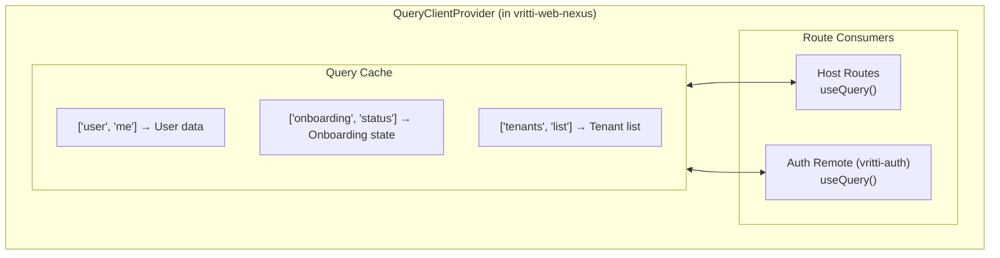

Vritti uses **TanStack Query** (formerly React Query) for server state management and **React Context** for minimal client state. This pattern keeps the application simple while providing powerful caching and synchronization.

## Philosophy

<CardGroup cols={2}>
  <Card title="Server State ≠ Client State" icon="server">
    Server state (API data) is managed by TanStack Query with caching, refetching, and synchronization
  </Card>
  <Card title="Minimal Client State" icon="layer-group">
    Client state (UI state) is kept in component state or minimal contexts
  </Card>
  <Card title="No Redux" icon="ban">
    We avoid global state managers like Redux - TanStack Query handles most use cases better
  </Card>
  <Card title="Cache as Source of Truth" icon="database">
    The query cache is the single source of truth for server data
  </Card>
</CardGroup>

## Query Client Setup

### Host Application

```typescript
// vritti-web-nexus/src/App.tsx
import { QueryClient, QueryClientProvider } from '@tanstack/react-query';

const queryClient = new QueryClient({
  defaultOptions: {
    queries: {
      // Data is fresh for 5 minutes
      staleTime: 5 * 60 * 1000,
      // Retry failed requests once
      retry: 1,
      // Don't refetch on window focus in dev
      refetchOnWindowFocus: process.env.NODE_ENV === 'production',
    },
    mutations: {
      // Show error toasts by default
      onError: (error) => {
        toast.error(error.message);
      },
    },
  },
});

export default function App() {
  return (
    <QueryClientProvider client={queryClient}>
      <BrowserRouter>
        <AppRoutes />
      </BrowserRouter>
    </QueryClientProvider>
  );
}
```

### Shared Across Micro-Frontends

Because TanStack Query is a shared singleton, the query cache is shared between host and remotes:



## Query Patterns

### Basic Query Hook

```typescript
// hooks/useUser.ts
import { useQuery } from '@tanstack/react-query';
import { axios } from '@vritti/quantum-ui';

interface User {
  id: string;
  email: string;
  name: string;
}

export function useUser() {
  return useQuery({
    queryKey: ['user', 'me'],
    queryFn: async () => {
      const response = await axios.get<User>('cloud-api/users/me');
      return response.data;
    },
  });
}

// Usage
function ProfilePage() {
  const { data: user, isLoading, error } = useUser();

  if (isLoading) return <Skeleton />;
  if (error) return <ErrorMessage error={error} />;

  return <UserProfile user={user} />;
}
```

### Mutation Hook

```typescript
// hooks/useLogin.ts
import { useMutation, UseMutationOptions } from '@tanstack/react-query';
import { axios } from '@vritti/quantum-ui';

interface LoginDto {
  email: string;
  password: string;
}

interface LoginResponse {
  userId: string;
  requiresMfa: boolean;
}

type UseLoginOptions = Omit<
  UseMutationOptions<LoginResponse, Error, LoginDto>,
  'mutationFn'
>;

export function useLogin(options?: UseLoginOptions) {
  return useMutation<LoginResponse, Error, LoginDto>({
    mutationFn: async (data: LoginDto) => {
      const response = await axios.post<LoginResponse>(
        'cloud-api/auth/login',
        data,
        { public: true }, // Skip token recovery
      );
      return response.data;
    },
    ...options,
  });
}

// Usage
function LoginForm() {
  const navigate = useNavigate();

  const login = useLogin({
    onSuccess: (data) => {
      if (data.requiresMfa) {
        navigate('/mfa-verify');
      } else {
        navigate('/dashboard');
      }
    },
    onError: (error) => {
      toast.error(error.message);
    },
  });

  const onSubmit = (data: LoginDto) => {
    login.mutate(data);
  };

  return (
    <form onSubmit={handleSubmit(onSubmit)}>
      {/* form fields */}
      <Button loading={login.isPending}>Login</Button>
    </form>
  );
}
```

### Query with Parameters

```typescript
// hooks/useTenant.ts
export function useTenant(tenantId: string) {
  return useQuery({
    queryKey: ['tenants', tenantId],
    queryFn: async () => {
      const response = await axios.get(`cloud-api/tenants/${tenantId}`);
      return response.data;
    },
    // Only fetch if tenantId is provided
    enabled: !!tenantId,
  });
}
```

### Dependent Queries

```typescript
// Fetch user, then fetch their tenant
function Dashboard() {
  const { data: user } = useUser();

  const { data: tenant } = useQuery({
    queryKey: ['tenants', user?.tenantId],
    queryFn: () => fetchTenant(user!.tenantId),
    // Only run when user is loaded
    enabled: !!user?.tenantId,
  });
}
```

## Context + Query Combination

For complex features, combine React Context with TanStack Query:

```typescript
// context/OnboardingProvider.tsx
import { createContext, useContext, PropsWithChildren } from 'react';
import { useQuery } from '@tanstack/react-query';
import { axios } from '@vritti/quantum-ui';

interface OnboardingState {
  currentStep: string;
  emailVerified: boolean;
  passwordSet: boolean;
  phoneVerified: boolean;
  mfaConfigured: boolean;
  onboardingComplete: boolean;
  isLoading: boolean;
  error: string | null;
  refetch: () => Promise<void>;
}

const OnboardingContext = createContext<OnboardingState | null>(null);

export function OnboardingProvider({ children }: PropsWithChildren) {
  const { data, isLoading, error, refetch } = useQuery({
    queryKey: ['onboarding', 'status'],
    queryFn: async () => {
      const response = await axios.get('cloud-api/onboarding/status');
      return response.data;
    },
    staleTime: 5 * 60 * 1000,
    retry: false, // Don't retry in auth flows
  });

  const value: OnboardingState = {
    currentStep: data?.currentStep ?? 'EMAIL_VERIFICATION',
    emailVerified: data?.emailVerified ?? false,
    passwordSet: data?.passwordSet ?? false,
    phoneVerified: data?.phoneVerified ?? false,
    mfaConfigured: data?.mfaConfigured ?? false,
    onboardingComplete: data?.onboardingComplete ?? false,
    isLoading,
    error: error?.message ?? null,
    refetch: async () => { await refetch(); },
  };

  return (
    <OnboardingContext.Provider value={value}>
      {children}
    </OnboardingContext.Provider>
  );
}

export function useOnboarding() {
  const context = useContext(OnboardingContext);
  if (!context) {
    throw new Error('useOnboarding must be used within OnboardingProvider');
  }
  return context;
}
```

## Cache Invalidation

### After Mutation

```typescript
const queryClient = useQueryClient();

const updateProfile = useMutation({
  mutationFn: (data) => axios.put('cloud-api/users/me', data),
  onSuccess: () => {
    // Invalidate user query to refetch
    queryClient.invalidateQueries({ queryKey: ['user', 'me'] });
  },
});
```

### Manual Invalidation

```typescript
// After successful email verification
const verifyEmail = useMutation({
  mutationFn: (otp) => axios.post('cloud-api/onboarding/verify-email', { otp }),
  onSuccess: () => {
    // Invalidate onboarding status to get updated step
    queryClient.invalidateQueries({ queryKey: ['onboarding', 'status'] });
  },
});
```

### Optimistic Updates

```typescript
const updateTenant = useMutation({
  mutationFn: (data) => axios.put(`cloud-api/tenants/${data.id}`, data),
  onMutate: async (newData) => {
    // Cancel outgoing refetches
    await queryClient.cancelQueries({ queryKey: ['tenants', newData.id] });

    // Snapshot previous value
    const previousTenant = queryClient.getQueryData(['tenants', newData.id]);

    // Optimistically update
    queryClient.setQueryData(['tenants', newData.id], newData);

    return { previousTenant };
  },
  onError: (err, newData, context) => {
    // Rollback on error
    queryClient.setQueryData(['tenants', newData.id], context?.previousTenant);
  },
  onSettled: () => {
    // Refetch after mutation settles
    queryClient.invalidateQueries({ queryKey: ['tenants'] });
  },
});
```

## Query Key Conventions

```typescript
// Entity lists
['tenants', 'list']
['users', 'list', { page: 1, limit: 10 }]

// Single entity
['tenants', tenantId]
['users', userId]

// Current user
['user', 'me']

// Nested resources
['tenants', tenantId, 'users']
['tenants', tenantId, 'users', userId]

// Feature-specific
['onboarding', 'status']
['mfa', 'setup', 'totp']
```

## Error Handling

### Global Error Handler

```typescript
const queryClient = new QueryClient({
  defaultOptions: {
    queries: {
      retry: (failureCount, error) => {
        // Don't retry on 401 (handled by axios interceptor)
        if (error.response?.status === 401) return false;
        // Don't retry on 404
        if (error.response?.status === 404) return false;
        // Retry other errors once
        return failureCount < 1;
      },
    },
    mutations: {
      onError: (error) => {
        // Don't show toast for handled errors
        if (error.handled) return;
        toast.error(error.message || 'Something went wrong');
      },
    },
  },
});
```

### Per-Query Error Handling

```typescript
const { data, error, isError } = useQuery({
  queryKey: ['user', 'me'],
  queryFn: fetchUser,
});

if (isError) {
  if (error.response?.status === 404) {
    return <UserNotFound />;
  }
  return <GenericError error={error} />;
}
```

## Best Practices

<CardGroup cols={2}>
  <Card title="Use Query Keys Consistently" icon="key">
    Follow the convention: `[entity, ...params]`. Makes invalidation predictable.
  </Card>
  <Card title="Configure staleTime" icon="clock">
    Set appropriate stale times. Auth data: 5min. User preferences: 30min. Static data: 1hr.
  </Card>
  <Card title="Handle Loading States" icon="spinner">
    Always show loading indicators. Use `isPending` for mutations, `isLoading` for queries.
  </Card>
  <Card title="Avoid Waterfalls" icon="water">
    Use parallel queries when possible. Use `enabled` for dependent queries.
  </Card>
</CardGroup>

## Next Steps

<CardGroup cols={2}>
  <Card title="Routing" icon="route" href="/architecture/frontend/routing">
    Learn about React Router v7 setup
  </Card>
  <Card title="Form Handling" icon="file-lines" href="/guidelines/frontend/form-handling">
    See form patterns with react-hook-form
  </Card>
</CardGroup>
