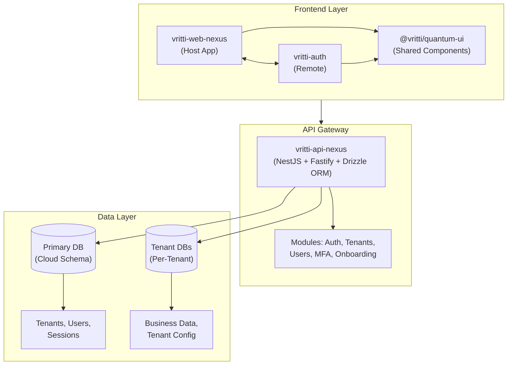
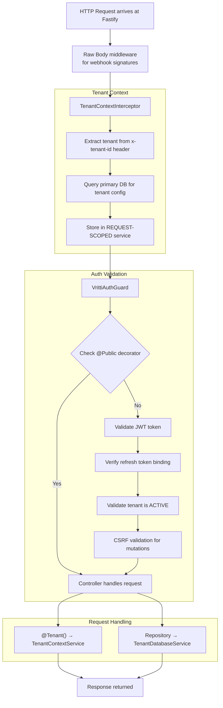

# System Overview

Vritti is a multi-tenant SaaS platform built with a micro-frontend architecture on the frontend and a modular NestJS backend. The system prioritizes security, scalability, and developer experience.

## Architecture Principles

<CardGroup cols={2}>
  <Card title="Multi-Tenant by Design" icon="building">
    Complete tenant isolation with dedicated or shared database options per tenant
  </Card>
  <Card title="Micro-Frontends" icon="puzzle-piece">
    Module Federation enables independent deployment of frontend applications
  </Card>
  <Card title="Type Safety" icon="shield-check">
    End-to-end TypeScript with Drizzle ORM for compile-time database safety
  </Card>
  <Card title="Security First" icon="lock">
    JWT + CSRF protection, token binding, and comprehensive auth guards
  </Card>
</CardGroup>

## High-Level Architecture



## Key Components

### Frontend Applications

| Project | Purpose | Technology |
|---------|---------|------------|
| **vritti-web-nexus** | Host application for Module Federation | React 19, RSBuild, TanStack Query |
| **vritti-auth** | Authentication micro-frontend (remote) | React 19, RSBuild, react-hook-form |
| **vritti-landing** | Public marketing site | Next.js 15 |
| **slicingpie** | Admin dashboard | React 19, RSBuild |

### Shared Libraries

| Package | Purpose | Version |
|---------|---------|---------|
| **@vritti/quantum-ui** | Component library with shadcn/ui | 0.2.x |
| **@vritti/api-sdk** | NestJS modules for auth, database, logging | 0.1.x |

### Backend Services

| Service | Purpose | Stack |
|---------|---------|-------|
| **vritti-api-nexus** | Main API gateway | NestJS 11, Fastify 5, Drizzle ORM |

## Security Architecture

The platform implements multiple layers of security:

<Steps>
  <Step title="Authentication">
    JWT-based authentication with separate access and refresh tokens. Access tokens are short-lived (15 min), refresh tokens are HTTP-only cookies.
  </Step>
  <Step title="Token Binding">
    Access tokens contain a hash of the refresh token, preventing stolen access tokens from being used without the refresh cookie.
  </Step>
  <Step title="CSRF Protection">
    HMAC-based CSRF tokens required for all state-changing requests (POST, PUT, DELETE). Tokens are double-submit cookies with header validation.
  </Step>
  <Step title="Tenant Isolation">
    Request-scoped tenant context prevents cross-tenant data access. Each request is validated against an active tenant.
  </Step>
</Steps>

## Multi-Tenancy Model

Vritti supports two multi-tenancy models:

<Tabs>
  <Tab title="Shared Database">
    Multiple tenants share a PostgreSQL instance with schema-level isolation. Best for smaller tenants with cost optimization.

    ```
    PostgreSQL Instance
    └── cloud (schema)
        ├── tenants
        ├── users
        └── shared tables...
    ```
  </Tab>
  <Tab title="Dedicated Database">
    Each tenant has a completely separate PostgreSQL database. Best for enterprise tenants requiring full isolation.

    ```
    PostgreSQL Instance (Tenant A)
    └── tenant_a (database)
        └── All tenant tables...

    PostgreSQL Instance (Tenant B)
    └── tenant_b (database)
        └── All tenant tables...
    ```
  </Tab>
</Tabs>

## Request Lifecycle

Every API request follows this lifecycle:



## Environment Architecture

<CardGroup cols={3}>
  <Card title="Development" icon="laptop-code">
    - Local Docker PostgreSQL
    - `local.vrittiai.com` domain
    - Hot reload enabled
  </Card>
  <Card title="Staging" icon="flask">
    - Shared staging database
    - `staging.vrittiai.com`
    - Production-like config
  </Card>
  <Card title="Production" icon="rocket">
    - Kubernetes deployment
    - `cloud.vrittiai.com`
    - Full monitoring
  </Card>
</CardGroup>

## Next Steps

<CardGroup cols={2}>
  <Card title="Monorepo Structure" icon="folder-tree" href="/architecture/monorepo-structure">
    Understand how projects are organized
  </Card>
  <Card title="Project Relationships" icon="diagram-project" href="/architecture/project-relationships">
    See how projects depend on each other
  </Card>
</CardGroup>
