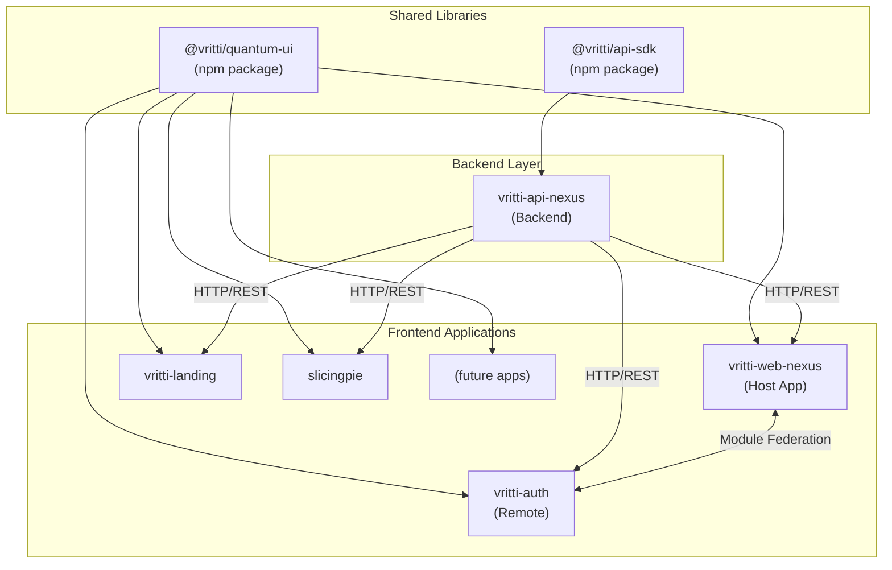

# Project Relationships

Understanding how projects depend on each other is crucial for making changes without breaking the system. This page documents all inter-project dependencies and communication patterns.

## Dependency Graph



## Package Dependencies

### @vritti/quantum-ui

<Accordion title="Consumers">
| Consumer | Usage |
|----------|-------|
| vritti-web-nexus | UI components, axios instance, toasts |
| vritti-auth | Form components, UI primitives, axios |
| slicingpie | Admin UI components |
| vritti-landing | Marketing page components |
</Accordion>

**Key Exports:**
```typescript
// UI Components
export * from './components/ui/button';
export * from './components/ui/card';
export * from './components/ui/dialog';
// ... 40+ components

// Utilities
export { cn } from './lib/utils';
export { axios } from './lib/axios';
export { Toaster, toast } from './components/ui/sonner';

// Form Components
export * from './components/form';
```

**Breaking Change Impact:** High - All frontend applications depend on these components.

### @vritti/api-sdk

<Accordion title="Consumers">
| Consumer | Usage |
|----------|-------|
| vritti-api-nexus | All NestJS modules, guards, decorators |
| Future microservices | Auth, database, logging modules |
</Accordion>

**Key Exports:**
```typescript
// Auth Module
export { AuthConfigModule } from './auth/auth-config.module';
export { VrittiAuthGuard } from './auth/vritti-auth.guard';
export { Public, Onboarding, SkipCsrf } from './auth/decorators';
export { UserId, Tenant } from './auth/param-decorators';

// Database Module
export { DatabaseModule } from './database/database.module';
export { TenantDatabaseService } from './database/services';
export { PrimaryBaseRepository, TenantBaseRepository } from './database/repositories';

// Logger Module
export { LoggerModule } from './logger/logger.module';
```

**Breaking Change Impact:** Critical - Backend will not start if this package breaks.

## Communication Patterns

### Frontend ↔ Backend

All frontend applications communicate with the backend via HTTP REST:

<Tabs>
  <Tab title="Direct HTTP Calls">
    ```typescript
    // Using quantum-ui's axios instance
    import { axios } from '@vritti/quantum-ui';

    // Auth endpoints
    const response = await axios.post('cloud-api/auth/login', {
      email,
      password
    });
    ```

    **Features:**
    - Automatic CSRF token injection
    - Token refresh on 401
    - Session recovery
    - Base URL configuration
  </Tab>
  <Tab title="TanStack Query">
    ```typescript
    // Query hook pattern
    const { data, isLoading } = useQuery({
      queryKey: ['onboarding', 'status'],
      queryFn: () => axios.get('cloud-api/onboarding/status')
    });

    // Mutation hook pattern
    const mutation = useMutation({
      mutationFn: (data: LoginDto) => axios.post('cloud-api/auth/login', data)
    });
    ```

    **Features:**
    - Automatic caching
    - Stale-while-revalidate
    - Optimistic updates
  </Tab>
</Tabs>

### Module Federation (Host ↔ Remote)

vritti-web-nexus loads vritti-auth at runtime:

```typescript
// Host registers remotes at bootstrap
registerRemotes([{
  name: 'VrittiAuth',
  entry: 'http://local.vrittiai.com:3001/mf-manifest.json'
}]);

// Host loads remote routes dynamically
<RemoteRoutes
  remoteName="VrittiAuth"
  moduleName="routes"
  dataKey="authRoutes"
/>
```

**Key Points:**
- Remote exposes `./routes` module
- Shared dependencies are singletons (React, TanStack Query)
- Remote can run standalone for development

### Backend ↔ Database

The backend uses Drizzle ORM with multi-tenant database routing:

```typescript
// Primary database (tenant registry)
@Injectable()
class TenantRepository extends PrimaryBaseRepository<typeof tenants> {
  constructor(primaryDb: PrimaryDatabaseService) {
    super(primaryDb);
  }
}

// Tenant database (per-tenant data)
@Injectable()
class ProductRepository extends TenantBaseRepository<typeof products> {
  constructor(tenantDb: TenantDatabaseService) {
    super(tenantDb);
  }
}
```

## Shared Dependencies

These dependencies MUST be kept in sync across projects:

| Dependency | Constraint | Projects |
|------------|------------|----------|
| react | `^19.2.0` | All frontend |
| react-dom | `^19.2.0` | All frontend |
| react-router-dom | `^7.x` | web-nexus, auth |
| @tanstack/react-query | `^5.x` | web-nexus, auth, slicingpie |
| drizzle-orm | `1.0.0-beta.x` | api-nexus, api-sdk |
| @nestjs/* | `^11.x` | api-nexus, api-sdk |
| fastify | `^5.x` | api-nexus |

<Warning>
  **Version Mismatch Issues:**
  - React version mismatch causes hydration errors in Module Federation
  - Drizzle ORM version mismatch causes schema incompatibilities
  - NestJS version mismatch breaks dependency injection
</Warning>

## Update Propagation

When updating shared packages, follow this order:

<Steps>
  <Step title="Update Shared Library">
    Make changes to `@vritti/quantum-ui` or `@vritti/api-sdk`

    ```bash
    cd quantum-ui
    pnpm build
    pnpm publish --access public
    ```
  </Step>
  <Step title="Update Consumers">
    Update the dependency in consuming projects

    ```bash
    cd vritti-web-nexus
    pnpm update @vritti/quantum-ui
    ```
  </Step>
  <Step title="Test Integration">
    Run the full stack locally to verify integration

    ```bash
    # Terminal 1: Backend
    cd vritti-api-nexus && pnpm start:dev

    # Terminal 2: Host
    cd vritti-web-nexus && pnpm dev

    # Terminal 3: Remote
    cd vritti-auth && pnpm dev
    ```
  </Step>
  <Step title="Deploy">
    Deploy in dependency order:
    1. Backend (if api-sdk changed)
    2. Remotes (vritti-auth)
    3. Host (vritti-web-nexus)
  </Step>
</Steps>

## Circular Dependency Prevention

<Card title="Rule: No Circular Dependencies">
  Projects should only depend on projects "below" them in the dependency graph:

  ```mermaid
  flowchart TB
      L3["Level 3: Applications<br/>(web-nexus, auth, landing, slicingpie)"]
      L2["Level 2: Shared Libraries<br/>(quantum-ui, api-sdk)"]
      L1["Level 1: External Packages<br/>(react, nestjs, drizzle)"]

      L3 --> L2
      L2 --> L1
  ```

  **Never allow:**
  - quantum-ui importing from vritti-auth
  - api-sdk importing from vritti-api-nexus
  - Any upward dependencies
</Card>

## API Contracts

### REST API Contract

The OpenAPI specification (`openapi.json`) serves as the contract between frontend and backend:

```bash
# Generate from backend
cd vritti-api-nexus
pnpm build
# openapi.json is generated automatically

# Copy to docs
cp openapi.json ../developer-docs/
```

### TypeScript Types

Shared types are exported from each package:

```typescript
// From quantum-ui
import type { AxiosRequestConfig } from '@vritti/quantum-ui';

// From api-sdk
import type { TenantInfo } from '@vritti/api-sdk';

// DTOs can be shared if needed
// Consider creating a shared types package for complex projects
```

## Health Check Flow

Verify all services are connected:

```bash
# Backend health
curl http://localhost:3000/health

# Frontend host
curl http://local.vrittiai.com:3012

# Auth remote manifest
curl http://local.vrittiai.com:3001/mf-manifest.json

# API docs
curl http://localhost:3000/api/docs
```

## Next Steps

<CardGroup cols={2}>
  <Card title="Backend Architecture" icon="server" href="/architecture/backend/nestjs-fastify">
    Deep dive into NestJS + Fastify setup
  </Card>
  <Card title="Frontend Architecture" icon="browser" href="/architecture/frontend/module-federation">
    Learn about Module Federation setup
  </Card>
</CardGroup>
