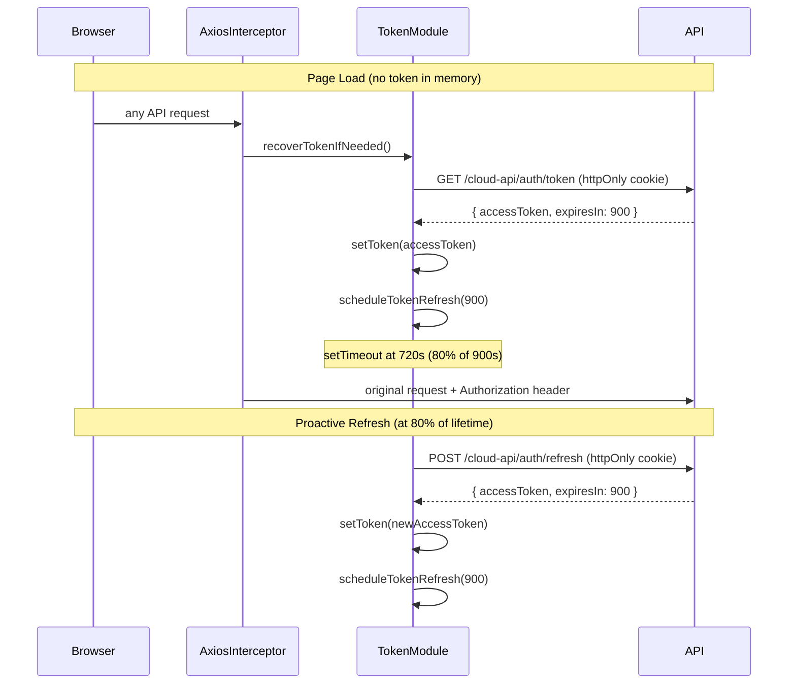
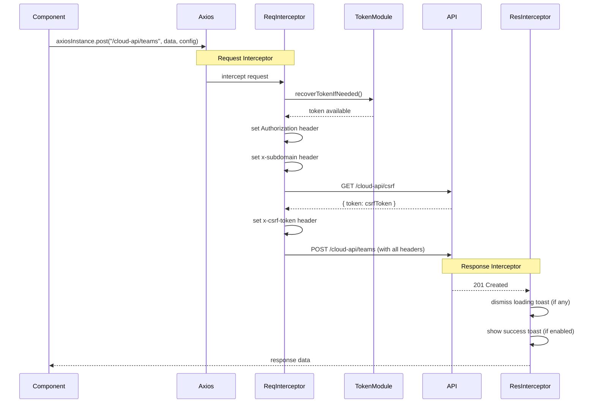

## Overview

<Info>
**Implemented in:** quantum-ui (`lib/utils/axios.ts`), web-nexus (`AuthProvider`), auth-microfrontend (`OnboardingProvider`, routes, services)
**Last Updated:** February 2026
**Status:** Production
</Info>

The frontend auth architecture is built around a centralized Axios instance with request/response interceptors that handle token injection, CSRF protection, and error handling transparently. Tokens are stored exclusively in memory (never `localStorage`) and are recovered from httpOnly cookies on page reload. Two React context providers manage auth and onboarding state, while a service layer encapsulates all API calls.

## What It Does

- Injects Bearer tokens and CSRF tokens into outgoing requests automatically
- Recovers sessions on page reload by exchanging httpOnly cookies for in-memory tokens
- Schedules proactive token refresh at 80% of token lifetime
- Provides auth state (`user`, `isAuthenticated`) and onboarding state (`currentStep`, `onboardingComplete`) via React context
- Routes users through public pages, OAuth callbacks, and onboarding steps based on auth/onboarding status
- Handles 401 redirects, server errors, and network errors with appropriate toast notifications

## Axios Instance

The shared Axios instance is configured in `quantum-ui/lib/utils/axios.ts` and used across all microfrontends.

### Base Configuration

```typescript
const axiosInstance = axios.create({
  baseURL: config.apiBaseUrl,
  withCredentials: true,   // sends httpOnly cookies on every request
  timeout: 30_000,         // 30-second timeout
});
```

### Custom Request Config Options

The Axios instance extends `AxiosRequestConfig` with custom properties that control interceptor behavior per-request:

| Property | Type | Default | Purpose |
|----------|------|---------|---------|
| `public` | `boolean` | `false` | Skip token injection and 401 redirect handling |
| `skipAuthRedirect` | `boolean` | `false` | Suppress redirect to `/login` on 401 |
| `showSuccessToast` | `boolean` | `false` | Show success toast on mutation responses |
| `showErrorToast` | `boolean` | `true` | Show error toast on failure |
| `successMessage` | `string` | — | Custom success toast message |
| `loadingMessage` | `string` | — | Show loading toast during request |
| `_toastId` | `string` | — | Internal: tracks the active loading toast ID |

Usage example:

```typescript
// Public request (no token, no 401 redirect)
await axiosInstance.get("/cloud-api/auth/me", { public: true });

// Mutation with loading + success toast
await axiosInstance.post("/cloud-api/teams", payload, {
  loadingMessage: "Creating team...",
  showSuccessToast: true,
  successMessage: "Team created",
});
```

## Request Interceptor

Every outgoing request passes through the request interceptor, which handles token injection, subdomain identification, CSRF protection, and loading toasts.

```
Request Interceptor Pipeline
─────────────────────────────

1. Token Recovery (non-public requests only)
   │
   ├─ Is token in memory?
   │   ├─ Yes → continue
   │   └─ No  → recoverTokenIfNeeded()
   │            └─ GET /cloud-api/auth/token (uses httpOnly cookie)
   │            └─ Stores token in memory + schedules refresh
   │
2. Authorization Header
   │   Authorization: Bearer {token}
   │
3. Subdomain Header
   │   x-subdomain: {extracted from window.location.hostname}
   │
4. CSRF Token (POST, PUT, PATCH, DELETE only)
   │   └─ fetchCsrfToken()
   │       └─ GET /cloud-api/csrf (cached, deduplicated)
   │   x-csrf-token: {csrfToken}
   │
5. Loading Toast (if loadingMessage provided)
       └─ Shows toast, stores _toastId on config
```

### Token Recovery

When no token exists in memory (e.g., after a page reload), the interceptor calls `recoverTokenIfNeeded()` before the request proceeds:

```typescript
// Simplified logic
async function recoverTokenIfNeeded(): Promise<void> {
  if (getToken()) return;             // already have a token
  if (recoveryPromise) return recoveryPromise; // deduplicate concurrent calls
  recoveryPromise = recoverToken();
  await recoveryPromise;
  recoveryPromise = null;
}
```

This ensures that if multiple requests fire simultaneously on page load, only one recovery call is made.

### CSRF Protection

For state-changing methods (`POST`, `PUT`, `PATCH`, `DELETE`), the interceptor fetches a CSRF token and attaches it:

```typescript
async function fetchCsrfToken(): Promise<string> {
  if (csrfToken) return csrfToken;        // return cached token
  if (csrfPromise) return csrfPromise;    // deduplicate concurrent fetches
  csrfPromise = axiosInstance
    .get("/cloud-api/csrf", { public: true })
    .then((res) => {
      csrfToken = res.data.token;
      return csrfToken;
    });
  const token = await csrfPromise;
  csrfPromise = null;
  return token;
}
```

## Response Interceptor

The response interceptor handles success toasts, auth failures, and error categorization.

```
Response Interceptor Pipeline
──────────────────────────────

Success (2xx)
  └─ Is mutation (POST/PUT/PATCH/DELETE) AND showSuccessToast?
      └─ Yes → dismiss loading toast, show success toast
      └─ No  → dismiss loading toast (if any)

Error: 401 Unauthorized
  └─ Is public request?
      ├─ Yes → pass through (no redirect)
      └─ No  → clearToken()
              → cancelTokenRefresh()
              → redirect to /login

Error: 5xx Server Error
  └─ Show "Server error" toast

Error: Network Error (no response)
  └─ Show "Network error" toast

Error: 4xx Client Error
  └─ Has loading toast (_toastId)?
      ├─ Yes → dismiss loading toast, show error message toast
      └─ No  → pass through (handled by form inline errors)
```

### 401 Handling

When a non-public request receives a 401, the interceptor performs a full cleanup and redirect:

```typescript
if (status === 401 && !config.public) {
  clearToken();            // wipe in-memory token
  cancelTokenRefresh();    // clear scheduled refresh timer
  window.location.href = "/login";
}
```

Requests marked with `skipAuthRedirect: true` or `public: true` bypass this redirect, which is used for endpoints like `/auth/me` that probe auth state without forcing a redirect.

### 4xx Error Strategy

Client errors (400, 403, 409, 422, etc.) are intentionally **not** shown as toasts by default. Instead, they are propagated to the calling code so that forms can display inline validation errors. The exception is when a `loadingMessage` was provided -- in that case, the loading toast is dismissed and replaced with the error message.

## Token Management

All token functions are exported from `quantum-ui/lib/utils/axios.ts`. The token is stored in a module-level variable -- never in `localStorage` or `sessionStorage`.

### Exported Functions

| Function | Signature | Description |
|----------|-----------|-------------|
| `setToken` | `(token: string) => void` | Stores the access token in the module-level variable |
| `getToken` | `() => string \| null` | Returns the current in-memory token |
| `clearToken` | `() => void` | Clears the token and cancels the refresh timer |
| `scheduleTokenRefresh` | `(expiresIn: number) => void` | Sets a timeout at 80% of lifetime to call `POST /cloud-api/auth/refresh` |
| `recoverToken` | `() => Promise<{ success: boolean; expiresIn: number }>` | Calls `GET /cloud-api/auth/token` to recover session from httpOnly cookie |
| `recoverTokenIfNeeded` | `() => Promise<void>` | Calls `recoverToken()` only if no token in memory; deduplicates concurrent calls |

### Token Lifecycle



### Why In-Memory Only

Storing tokens in a module-level variable instead of `localStorage` provides:

- **XSS protection**: JavaScript injected via XSS cannot read `localStorage` to exfiltrate tokens. The module variable is not globally accessible.
- **Automatic cleanup**: Closing the tab clears the token. No stale tokens persist across sessions.
- **Trade-off**: Page reloads require a recovery call (`GET /cloud-api/auth/token`), which exchanges the httpOnly refresh cookie for a new access token. This adds one request on reload but is a worthwhile security trade-off.

## Auth State (AuthProvider)

The `AuthProvider` lives in **web-nexus** and wraps the entire authenticated application shell.

```typescript
// Provided context shape
interface AuthContext {
  user: User | null;
  isAuthenticated: boolean;
  isLoading: boolean;
  logout: () => void;
}
```

### How It Works

1. On mount, calls `GET /cloud-api/auth/me` via the `useUser` hook (React Query)
2. If the call succeeds, `isAuthenticated = true` and `user` is populated
3. If the call fails (401), `isAuthenticated = false` and `user` is `null`
4. The `logout` function calls `clearToken()` and `queryClient.clear()` -- the caller is responsible for triggering a page reload

```typescript
function logout() {
  clearToken();
  queryClient.clear();
  // Caller should reload: window.location.href = "/login"
}
```

## Onboarding State (OnboardingProvider)

The `OnboardingProvider` lives in **auth-microfrontend** and wraps the onboarding route subtree.

```typescript
// Provided context shape
interface OnboardingContext {
  userId: string;
  email: string;
  currentStep: OnboardingStep;
  onboardingComplete: boolean;
  // ... additional onboarding fields
  refetch: () => Promise<void>;
}
```

### How It Works

1. On mount, calls `GET /cloud-api/onboarding/status` via React Query with `staleTime: 5 minutes`
2. While loading, renders a full-screen spinner
3. Provides the current onboarding step so the `OnboardingRouter` can render the correct page
4. The `refetch` function lets child components re-fetch status after completing a step

## Route Structure

All routes in the auth-microfrontend are nested under `AuthLayout`.

### Route Table

| Path | Access | Provider | Description |
|------|--------|----------|-------------|
| `/login` | Public | — | Login form |
| `/signup` | Public | — | Signup form |
| `/signup-success` | Public | — | Signup confirmation |
| `/forgot-password` | Public | — | Password reset request |
| `/mfa-verify` | Public | — | MFA verification during login |
| `/onboarding/oauth-success` | OAuth callback | — | OAuth success handler (outside OnboardingProvider) |
| `/onboarding/oauth-error` | OAuth callback | — | OAuth error handler (outside OnboardingProvider) |
| `/onboarding/*` | Authenticated | `OnboardingProvider` | Onboarding flow (step-based routing) |

### Route Hierarchy

```
AuthLayout
├── /login                          (public)
├── /signup                         (public)
├── /signup-success                 (public)
├── /forgot-password                (public)
├── /mfa-verify                     (public)
├── /onboarding/oauth-success       (OAuth callback, NO OnboardingProvider)
├── /onboarding/oauth-error         (OAuth callback, NO OnboardingProvider)
└── OnboardingProvider
    └── /onboarding/*               (OnboardingRouter renders step-based page)
```

<Warning>
OAuth callback routes (`/onboarding/oauth-success` and `/onboarding/oauth-error`) are intentionally placed **outside** the `OnboardingProvider`. This is because the OAuth redirect lands on these routes before onboarding status is available, and wrapping them in the provider would cause a loading spinner or failed status fetch.
</Warning>

### Onboarding Routing

The `OnboardingRouter` does not use path-based routing for individual steps. Instead, it reads `currentStep` from the `OnboardingProvider` context and renders the corresponding page component. Navigating between steps is driven by API state changes (calling `refetch()` after each step completion), not by URL changes.

## Service Layer

The service layer encapsulates all auth and onboarding API calls. Each function returns a promise that resolves with the API response or rejects with an Axios error.

### auth.service.ts

| Function | Method | Endpoint | Purpose |
|----------|--------|----------|---------|
| `signup()` | POST | `/cloud-api/auth/signup` | Register a new user |
| `login()` | POST | `/cloud-api/auth/login` | Credential-based login |
| `verifyTotp()` | POST | `/cloud-api/auth/mfa/totp/verify` | Verify TOTP code during login |
| `sendSmsCode()` | POST | `/cloud-api/auth/mfa/sms/send` | Request SMS verification code |
| `verifySms()` | POST | `/cloud-api/auth/mfa/sms/verify` | Verify SMS code during login |
| `startPasskeyVerification()` | POST | `/cloud-api/auth/mfa/passkey/start` | Begin passkey MFA challenge |
| `verifyPasskeyMfa()` | POST | `/cloud-api/auth/mfa/passkey/verify` | Complete passkey MFA verification |
| `startPasskeyLogin()` | POST | `/cloud-api/auth/passkey/login/start` | Begin passkey-based login |
| `verifyPasskeyLogin()` | POST | `/cloud-api/auth/passkey/login/verify` | Complete passkey login |
| `forgotPassword()` | POST | `/cloud-api/auth/forgot-password` | Request password reset OTP |
| `verifyResetOtp()` | POST | `/cloud-api/auth/verify-reset-otp` | Verify password reset OTP |
| `resetPassword()` | POST | `/cloud-api/auth/reset-password` | Set new password after OTP verification |

### onboarding.service.ts

| Function | Method | Endpoint | Purpose |
|----------|--------|----------|---------|
| `verifyEmail()` | POST | `/cloud-api/onboarding/verify-email` | Verify email with OTP |
| `resendEmailOtp()` | POST | `/cloud-api/onboarding/resend-email-otp` | Resend email verification OTP |
| `getStatus()` | GET | `/cloud-api/onboarding/status` | Get current onboarding state |
| `startOnboarding()` | POST | `/cloud-api/onboarding/start` | Initialize onboarding flow |
| `setPassword()` | POST | `/cloud-api/onboarding/set-password` | Set account password |
| `initiateTotpSetup()` | POST | `/cloud-api/onboarding/2fa/totp/initiate` | Begin TOTP setup (returns QR code) |
| `verifyTotpSetup()` | POST | `/cloud-api/onboarding/2fa/totp/verify` | Verify TOTP setup with code |
| `skip2FASetup()` | POST | `/cloud-api/onboarding/2fa/skip` | Skip 2FA setup step |
| `get2FAStatus()` | GET | `/cloud-api/onboarding/2fa/status` | Get current 2FA configuration |
| `initiatePasskeySetup()` | POST | `/cloud-api/onboarding/2fa/passkey/initiate` | Begin passkey registration |
| `verifyPasskeySetup()` | POST | `/cloud-api/onboarding/2fa/passkey/verify` | Complete passkey registration |
| `initiateMobileVerification()` | POST | `/cloud-api/onboarding/mobile/initiate` | Start phone number verification |
| `getMobileVerificationStatus()` | GET | `/cloud-api/onboarding/mobile/status` | Check mobile verification state |
| `resendMobileVerification()` | POST | `/cloud-api/onboarding/mobile/resend` | Resend mobile verification code |
| `verifyMobileOtp()` | POST | `/cloud-api/onboarding/mobile/verify` | Verify mobile OTP |

## Full Request Lifecycle

Putting it all together, here is the complete lifecycle of an authenticated API request from the frontend:


