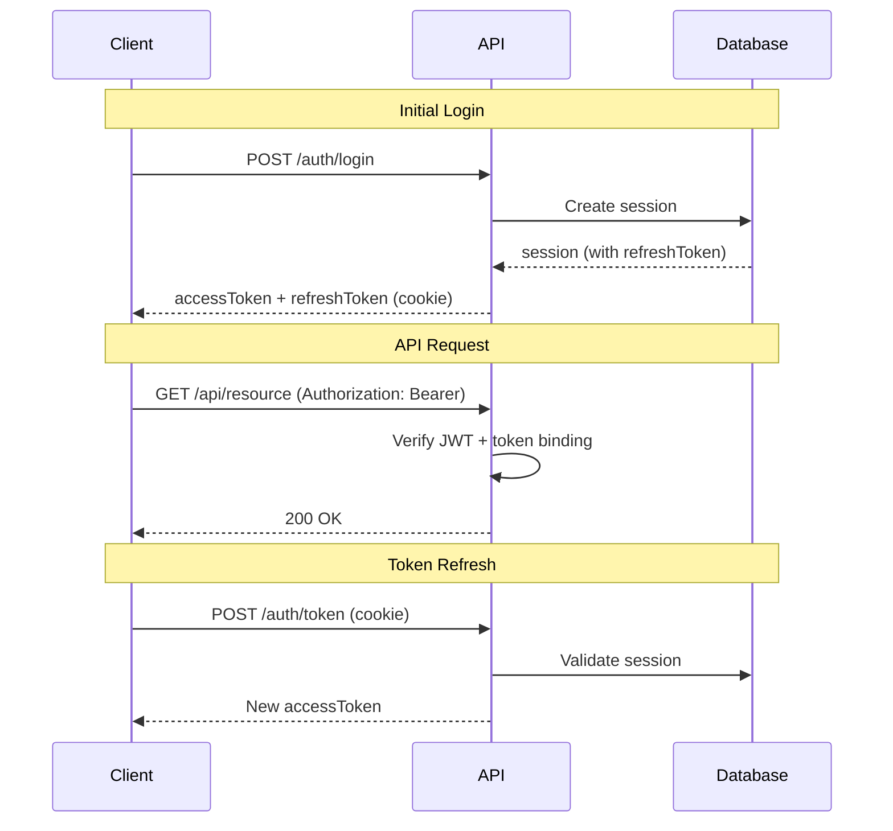
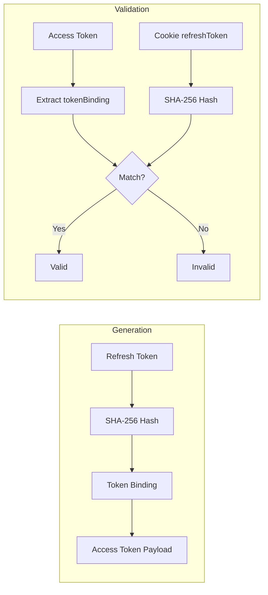

## Overview

<Info>
**Implemented in:** vritti-api-nexus, @vritti/api-sdk
**Last Updated:** January 2026
**Status:** Production
</Info>

Vritti uses JWT (JSON Web Tokens) for stateless authentication combined with database-backed sessions for security features like token revocation and rotation. The system implements token binding to cryptographically link access and refresh tokens.

## What It Does

- Issues short-lived access tokens (15 min) for API authorization
- Manages long-lived refresh tokens (7-30 days) in httpOnly cookies
- Binds access tokens to refresh tokens using SHA-256 hashing
- Supports multiple session types (ONBOARDING, CLOUD)
- Enables token revocation through session invalidation
- Tracks session activity for security monitoring

## Token Architecture

### Token Types

| Token Type | Storage | Expiry | Purpose |
|------------|---------|--------|---------|
| Access Token | Memory/LocalStorage | 15 minutes | API request authorization |
| Refresh Token | httpOnly Cookie | 7-30 days | Access token renewal |
| Signup Token | httpOnly Cookie | 10 minutes | Onboarding flow authorization |
| MFA Token | Response body | 5 minutes | MFA verification flow |

### Token Flow



## Access Token Structure

### JWT Payload

```typescript
interface AccessTokenPayload {
  // Standard JWT claims
  sub: string;        // User ID
  iat: number;        // Issued at timestamp
  exp: number;        // Expiration timestamp
  jti: string;        // Unique token ID (session ID)

  // Custom claims
  email: string;      // User email
  sessionType: 'ONBOARDING' | 'CLOUD';
  tokenBinding: string;  // SHA-256(refreshToken)

  // Optional claims
  tenantId?: string;  // For tenant-scoped tokens
  roles?: string[];   // User roles
}
```

### Example Decoded Token

```json
{
  "sub": "usr_abc123def456",
  "email": "user@example.com",
  "sessionType": "CLOUD",
  "tokenBinding": "a9f8d7c6b5e4f3g2h1i0j9k8l7m6n5o4",
  "iat": 1705312200,
  "exp": 1705313100,
  "jti": "sess_xyz789"
}
```

### Token Generation

```typescript
// jwt-auth.service.ts
@Injectable()
export class JwtAuthService {
  constructor(
    private readonly jwtService: JwtService,
    private readonly configService: ConfigService,
  ) {}

  async generateTokens(user: User, session: Session): Promise<TokenPair> {
    // Create token binding (SHA-256 of refresh token)
    const tokenBinding = this.createTokenBinding(session.refreshToken);

    const payload: AccessTokenPayload = {
      sub: user.id,
      email: user.email,
      sessionType: session.type,
      tokenBinding,
      jti: session.id,
    };

    const accessToken = this.jwtService.sign(payload, {
      expiresIn: this.configService.get('JWT_ACCESS_EXPIRY', '15m'),
    });

    return {
      accessToken,
      expiresIn: 900, // 15 minutes in seconds
    };
  }

  private createTokenBinding(refreshToken: string): string {
    return crypto
      .createHash('sha256')
      .update(refreshToken)
      .digest('hex')
      .substring(0, 32);
  }
}
```

## Token Binding

Token binding prevents token theft by cryptographically linking the access token to the refresh token.

### How It Works



### Validation Implementation

```typescript
// vritti-auth.guard.ts (in @vritti/api-sdk)
@Injectable()
export class VrittiAuthGuard implements CanActivate {
  async canActivate(context: ExecutionContext): Promise<boolean> {
    const request = context.switchToHttp().getRequest<FastifyRequest>();

    // 1. Extract access token from Authorization header
    const accessToken = this.extractToken(request);
    if (!accessToken) {
      throw new UnauthorizedException('Missing access token');
    }

    // 2. Verify JWT signature and decode
    const payload = this.jwtService.verify<AccessTokenPayload>(accessToken);

    // 3. Extract refresh token from cookie
    const refreshToken = request.cookies['refreshToken'];

    // 4. Validate token binding
    if (refreshToken) {
      const expectedBinding = this.createTokenBinding(refreshToken);
      if (payload.tokenBinding !== expectedBinding) {
        throw new UnauthorizedException('Token binding mismatch');
      }
    }

    // 5. Attach user to request
    request.user = payload;
    return true;
  }
}
```

### Security Benefits

<CardGroup cols={2}>
  <Card title="Theft Prevention" icon="shield-check">
    Stolen access tokens are useless without the refresh token cookie
  </Card>
  <Card title="Session Binding" icon="link">
    Tokens are tied to specific sessions, preventing reuse
  </Card>
  <Card title="Revocation Support" icon="ban">
    Invalidating the refresh token invalidates all access tokens
  </Card>
  <Card title="Cross-Site Protection" icon="globe">
    httpOnly cookies protect refresh tokens from XSS
  </Card>
</CardGroup>

## Session Management

### Session Entity

```typescript
// session schema (Drizzle)
export const sessions = pgTable('sessions', {
  id: text('id').primaryKey(),          // Session ID (used as JWT jti)
  userId: text('user_id').notNull(),
  type: sessionTypeEnum('type').notNull(), // ONBOARDING | CLOUD
  refreshToken: text('refresh_token').notNull().unique(),
  expiresAt: timestamp('expires_at').notNull(),
  lastUsedAt: timestamp('last_used_at').notNull(),
  userAgent: text('user_agent'),
  ipAddress: text('ip_address'),
  createdAt: timestamp('created_at').defaultNow(),
});
```

### Session Types

| Type | Purpose | Expiry | Permissions |
|------|---------|--------|-------------|
| `ONBOARDING` | Signup/verification flow | 10 minutes | Limited to onboarding endpoints |
| `CLOUD` | Full authenticated access | 7-30 days | Full API access |

### Creating Sessions

```typescript
// session.service.ts
@Injectable()
export class SessionService {
  async create(input: CreateSessionInput): Promise<Session> {
    const sessionId = `sess_${nanoid(24)}`;
    const refreshToken = crypto.randomBytes(32).toString('hex');

    const session = await this.sessionRepository.create({
      id: sessionId,
      userId: input.userId,
      type: input.type,
      refreshToken,
      expiresAt: input.expiresAt,
      lastUsedAt: new Date(),
      userAgent: input.userAgent,
      ipAddress: input.ipAddress,
    });

    return session;
  }

  async findByRefreshToken(token: string): Promise<Session | null> {
    return this.sessionRepository.findByRefreshToken(token);
  }

  async updateLastUsed(sessionId: string): Promise<void> {
    await this.sessionRepository.update(sessionId, {
      lastUsedAt: new Date(),
    });
  }

  async invalidate(sessionId: string): Promise<void> {
    await this.sessionRepository.delete(sessionId);
  }

  async invalidateAllForUser(userId: string): Promise<void> {
    await this.sessionRepository.deleteByUserId(userId);
  }
}
```

## Token Expiry Configuration

### Environment Variables

```bash
# .env
JWT_SECRET=your-256-bit-secret-key-here
JWT_ACCESS_EXPIRY=15m           # Access token expiry
JWT_REFRESH_EXPIRY=30d          # Refresh token expiry (CLOUD sessions)
JWT_SIGNUP_EXPIRY=10m           # Signup token expiry (ONBOARDING sessions)
JWT_MFA_EXPIRY=5m               # MFA token expiry
```

### Expiry Values

| Token | Environment Variable | Default | Range |
|-------|---------------------|---------|-------|
| Access Token | `JWT_ACCESS_EXPIRY` | 15m | 5m - 1h |
| Refresh Token (CLOUD) | `JWT_REFRESH_EXPIRY` | 30d | 7d - 90d |
| Signup Token | `JWT_SIGNUP_EXPIRY` | 10m | 5m - 30m |
| MFA Token | `JWT_MFA_EXPIRY` | 5m | 2m - 10m |

### Dynamic Expiry

```typescript
// jwt-auth.service.ts
getExpiryForSessionType(type: SessionType): Date {
  const now = new Date();

  switch (type) {
    case 'ONBOARDING':
      return addMinutes(now, 10);
    case 'CLOUD':
      const days = this.configService.get('REFRESH_TOKEN_ROTATION_DAYS', 7);
      return addDays(now, days);
    default:
      return addDays(now, 30);
  }
}
```

## JWT Module Configuration

### NestJS Setup

```typescript
// auth.module.ts
@Module({
  imports: [
    JwtModule.registerAsync({
      imports: [ConfigModule],
      inject: [ConfigService],
      useFactory: (configService: ConfigService) => ({
        secret: configService.getOrThrow<string>('JWT_SECRET'),
        signOptions: {
          issuer: 'vritti-api-nexus',
          audience: 'vritti-clients',
        },
      }),
    }),
  ],
})
export class AuthModule {}
```

### JWT Verification Options

```typescript
// jwt-auth.service.ts
verifyToken(token: string): AccessTokenPayload {
  return this.jwtService.verify<AccessTokenPayload>(token, {
    issuer: 'vritti-api-nexus',
    audience: 'vritti-clients',
    ignoreExpiration: false,
  });
}
```

## Session Activity Tracking

### Tracking Last Used

```typescript
// vritti-auth.guard.ts
async canActivate(context: ExecutionContext): Promise<boolean> {
  // ... token validation ...

  // Update session last used (async, non-blocking)
  this.sessionService.updateLastUsed(payload.jti).catch((error) => {
    this.logger.warn('Failed to update session activity', error);
  });

  return true;
}
```

### Session Listing

```typescript
// Get active sessions for user
async getActiveSessions(userId: string): Promise<SessionInfo[]> {
  const sessions = await this.sessionRepository.findByUserId(userId);

  return sessions.map((session) => ({
    id: session.id,
    type: session.type,
    createdAt: session.createdAt,
    lastUsedAt: session.lastUsedAt,
    userAgent: session.userAgent,
    ipAddress: session.ipAddress,
    current: session.id === currentSessionId,
  }));
}
```

## Security Best Practices

<Warning>
**Security Checklist:**
</Warning>

1. **Never store access tokens in localStorage** - Use memory or secure state management
2. **Always use httpOnly cookies for refresh tokens** - Prevents XSS token theft
3. **Implement token binding** - Links access and refresh tokens cryptographically
4. **Set appropriate expiry times** - Balance security and UX
5. **Use secure cookie settings** - `secure: true`, `sameSite: 'lax'`

### Recommended Settings

```typescript
// Cookie settings for refresh token
{
  httpOnly: true,           // Prevent XSS access
  secure: true,             // HTTPS only in production
  sameSite: 'lax',          // CSRF protection
  path: '/cloud-api/auth',  // Limit cookie scope
  maxAge: 30 * 24 * 60 * 60 // 30 days
}
```

## Troubleshooting

<Accordion title="JWT signature verification failed">
  **Causes:**
  - Wrong `JWT_SECRET` between services
  - Token tampering
  - Token from different environment

  **Solution:**
  - Verify `JWT_SECRET` matches across all services
  - Check token hasn't been modified
  - Ensure tokens match the environment (dev/staging/prod)
</Accordion>

<Accordion title="Token binding mismatch">
  **Cause:** Access token was issued with different refresh token

  **Solution:**
  - Clear cookies and re-authenticate
  - Check for cookie domain/path mismatch
  - Verify refresh token rotation isn't clearing cookies
</Accordion>

<Accordion title="Session not found">
  **Causes:**
  - Session expired and was cleaned up
  - User logged out from another device
  - Session revoked by admin

  **Solution:**
  - Re-authenticate to create new session
  - Check session cleanup jobs aren't too aggressive
  - Verify logout didn't revoke all sessions
</Accordion>

<Accordion title="Token expired immediately">
  **Cause:** Server and client time mismatch

  **Solution:**
  - Sync server time with NTP
  - Check `iat` and `exp` claims in decoded token
  - Verify `JWT_ACCESS_EXPIRY` isn't set too low
</Accordion>

## Related Documentation

<CardGroup cols={2}>
  <Card title="Signup & Login" icon="right-to-bracket" href="/features/auth/signup-login">
    Authentication flows that create sessions
  </Card>
  <Card title="Token Refresh" icon="rotate" href="/features/auth/token-refresh">
    Access token renewal and rotation
  </Card>
  <Card title="Guards & Decorators" icon="shield" href="/architecture/backend/guards-decorators">
    Authentication guard implementation
  </Card>
  <Card title="CSRF Protection" icon="lock" href="/features/csrf">
    Cross-site request forgery protection
  </Card>
</CardGroup>
