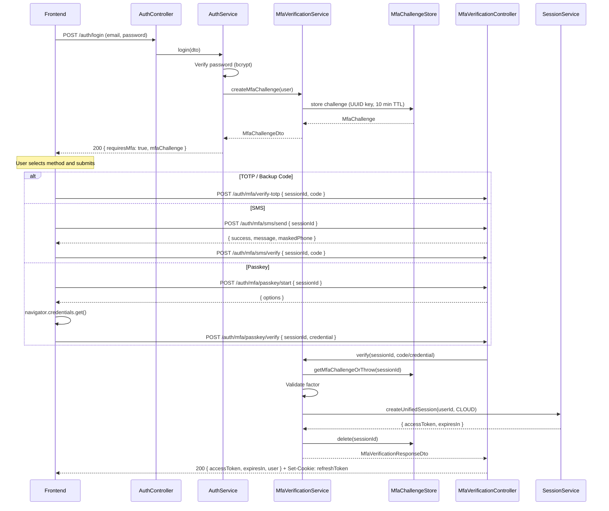
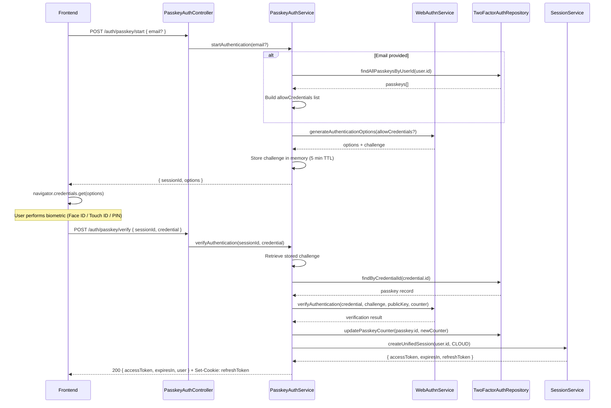

## Overview

<Info>
**Implemented in:** vritti-api-nexus, vritti-auth
**Last Updated:** February 2026
**Status:** Production
</Info>

This document covers two distinct authentication flows that share underlying WebAuthn infrastructure:

1. **MFA Verification** -- Second-factor verification during login when a user has 2FA enabled (TOTP, SMS, or Passkey).
2. **Passkey as Primary Login** -- Passwordless authentication using WebAuthn as the sole credential.

Both flows ultimately produce the same result: a `CLOUD` session with an access token and httpOnly refresh cookie.

## What It Does

**MFA Verification (post-password):**
- Creates an in-memory MFA challenge with a 10-minute TTL after successful password authentication
- Supports three verification methods: TOTP (authenticator app), SMS OTP, and Passkey (WebAuthn)
- Falls back to backup codes when TOTP is the active method
- Returns a full session on successful verification

**Passkey Primary Login (passwordless):**
- Initiates a WebAuthn authentication ceremony without requiring a password
- Stores challenges in memory with a 5-minute TTL
- Validates the WebAuthn signature and updates the credential counter for replay protection
- Creates a `CLOUD` session directly on success

## Where It's Used

| Location | Purpose |
|----------|---------|
| `vritti-api-nexus/src/modules/cloud-api/auth/mfa-verification/mfa-verification.controller.ts` | MFA verification endpoints |
| `vritti-api-nexus/src/modules/cloud-api/auth/mfa-verification/mfa-verification.service.ts` | MFA verification logic |
| `vritti-api-nexus/src/modules/cloud-api/auth/mfa-verification/mfa-challenge.store.ts` | In-memory challenge storage |
| `vritti-api-nexus/src/modules/cloud-api/auth/controllers/passkey-auth.controller.ts` | Passkey login endpoints |
| `vritti-api-nexus/src/modules/cloud-api/auth/services/passkey-auth.service.ts` | Passkey login logic |
| `vritti-api-nexus/src/modules/cloud-api/onboarding/services/webauthn.service.ts` | Shared WebAuthn operations |
| `vritti-auth/src/pages/auth/MFAVerificationPage.tsx` | MFA verification UI |
| `vritti-auth/src/hooks/usePasskey.ts` | Frontend WebAuthn hooks |
| `vritti-auth/src/components/auth/mfa-verification/` | Method-specific verification components |

---

## MFA Verification Flow

When a user with 2FA enabled submits correct credentials at `/cloud-api/auth/login`, the API does **not** issue tokens. Instead, it returns an `MfaChallengeDto` that the frontend uses to drive the MFA verification page.

### Flow Diagram



### MFA Challenge DTO

When `requiresMfa` is `true` in the login response, the `mfaChallenge` object is returned:

```typescript
// MfaChallengeDto - returned in login response body
{
  sessionId: string;                              // UUID identifying this challenge
  availableMethods: ('totp' | 'sms' | 'passkey')[];  // Methods the user has configured
  defaultMethod: 'totp' | 'sms' | 'passkey';     // Recommended method (TOTP > SMS > Passkey)
  maskedPhone?: string;                           // e.g. "+91 *** ***1234" (present if SMS available)
}
```

### MFA Challenge Store

Challenges are stored in an **in-memory `Map`**, not in the database. The store uses UUID keys and enforces a 10-minute TTL with automatic cleanup.

```typescript
// mfa-challenge.store.ts
export interface MfaChallenge {
  sessionId: string;            // UUID key
  userId: string;
  availableMethods: MfaMethod[];
  defaultMethod: MfaMethod;
  maskedPhone?: string;
  passkeyChallenge?: string;    // Populated when passkey/start is called
  smsOtpHash?: string;          // Populated when sms/send is called
  expiresAt: Date;              // 10 minutes from creation
  ipAddress?: string;
  userAgent?: string;
}

@Injectable()
export class MfaChallengeStore {
  private readonly challenges = new Map<string, MfaChallenge>();
  private readonly MFA_CHALLENGE_TTL_MINUTES = 10;

  create(userId: string, availableMethods: MfaMethod[], options): MfaChallenge {
    const sessionId = crypto.randomUUID();
    const defaultMethod = availableMethods.includes('totp') ? 'totp'
                        : availableMethods.includes('sms') ? 'sms'
                        : 'passkey';

    const challenge: MfaChallenge = {
      sessionId,
      userId,
      availableMethods,
      defaultMethod,
      maskedPhone: options.maskedPhone,
      expiresAt: addMinutes(new Date(), this.MFA_CHALLENGE_TTL_MINUTES),
      ipAddress: options.ipAddress,
      userAgent: options.userAgent,
    };

    this.challenges.set(sessionId, challenge);
    this.scheduleCleanup(sessionId);
    return challenge;
  }

  getMfaChallengeOrThrow(sessionId: string): MfaChallenge {
    const challenge = this.challenges.get(sessionId);
    if (!challenge || challenge.expiresAt < new Date()) {
      throw new BadRequestException('MFA session expired or invalid');
    }
    return challenge;
  }

  delete(sessionId: string): void {
    this.challenges.delete(sessionId);
  }
}
```

<Warning>
The `MfaChallengeStore` uses an in-memory `Map`. In a horizontally scaled deployment with multiple API instances, a challenge created on instance A cannot be verified on instance B. For distributed deployments, consider migrating to Redis.
</Warning>

### MFA Verification Endpoints

All MFA verification endpoints are under the `MfaVerificationController` and prefixed with `/cloud-api/auth/mfa`.

| Method | Endpoint | Request Body | Response | Description |
|--------|----------|-------------|----------|-------------|
| POST | `/auth/mfa/verify-totp` | `{ sessionId, code }` | `MfaVerificationResponseDto` + refresh cookie | Verifies a 6-digit TOTP code or 8-character backup code |
| POST | `/auth/mfa/sms/send` | `{ sessionId }` | `{ success, message, maskedPhone }` | Sends an SMS OTP to the user's verified phone |
| POST | `/auth/mfa/sms/verify` | `{ sessionId, code }` | `MfaVerificationResponseDto` + refresh cookie | Verifies the SMS OTP code |
| POST | `/auth/mfa/passkey/start` | `{ sessionId }` | `{ options }` | Generates WebAuthn authentication options |
| POST | `/auth/mfa/passkey/verify` | `{ sessionId, credential }` | `MfaVerificationResponseDto` + refresh cookie | Verifies the WebAuthn assertion |

All endpoints that complete MFA verification return the same response shape:

```typescript
// MfaVerificationResponseDto
{
  accessToken: string;       // JWT access token
  expiresIn: number;         // Token lifetime in seconds
  user: {
    id: string;
    email: string;
    firstName: string;
    lastName: string;
  }
}
// + httpOnly refresh token cookie (Set-Cookie header)
```

### TOTP / Backup Code Verification

The `/auth/mfa/verify-totp` endpoint accepts both TOTP codes and backup codes in the same `code` field. The service tries TOTP first, then falls back to backup code matching.

```typescript
// mfa-verification.service.ts
async verifyTotp(sessionId: string, code: string) {
  const challenge = this.mfaChallengeStore.getMfaChallengeOrThrow(sessionId);
  const twoFactorAuth = await this.twoFactorAuthRepo.findByUserIdAndMethod(
    challenge.userId,
    'TOTP',
  );

  // Try TOTP code first
  const isValid = this.totpService.verifyToken(code, twoFactorAuth.totpSecret);

  if (!isValid) {
    // Fall back to backup code
    const backupResult = await this.tryBackupCode(code, twoFactorAuth);
    if (!backupResult.valid) {
      throw new BadRequestException('Invalid verification code');
    }
    // Used backup code is removed from the stored hashes
  }

  return this.completeMfaVerification(challenge);
}
```

### SMS OTP Verification

SMS verification is a two-step process: send then verify.

```typescript
// Step 1: POST /auth/mfa/sms/send { sessionId }
// -> Sends OTP via Twilio, stores bcrypt hash in challenge.smsOtpHash
// -> Returns { success: true, message: "OTP sent", maskedPhone: "+91 *** ***1234" }

// Step 2: POST /auth/mfa/sms/verify { sessionId, code }
// -> Compares code against challenge.smsOtpHash
// -> On success: creates CLOUD session, returns MfaVerificationResponseDto
```

### Passkey MFA Verification

Passkey MFA is also a two-step process: start then verify.

```typescript
// Step 1: POST /auth/mfa/passkey/start { sessionId }
// -> Generates WebAuthn authentication options
// -> Stores challenge string in challenge.passkeyChallenge
// -> Returns { options } (PublicKeyCredentialRequestOptions)

// Step 2: POST /auth/mfa/passkey/verify { sessionId, credential }
// -> Verifies WebAuthn signature against stored public key
// -> Updates passkey counter for replay protection
// -> Creates CLOUD session, returns MfaVerificationResponseDto
```

### Completing MFA Verification

All three methods converge on the same completion logic:

```typescript
// mfa-verification.service.ts
private async completeMfaVerification(challenge: MfaChallenge) {
  // Create a CLOUD session with access + refresh tokens
  const { accessToken, expiresIn } = await this.sessionService.createUnifiedSession(
    challenge.userId,
    'CLOUD',
    challenge.ipAddress,
    challenge.userAgent,
  );

  // Remove the used challenge from the in-memory store
  this.mfaChallengeStore.delete(challenge.sessionId);

  return new MfaVerificationResponseDto({
    accessToken,
    expiresIn,
    user: { id, email, firstName, lastName },
  });
  // The controller also sets the refresh token as an httpOnly cookie
}
```

---

## Passkey as Primary Login

Passkey login is a completely separate flow from MFA. It allows users to sign in with **only** a passkey -- no password required. This is handled by the `PasskeyAuthController`.

### Flow Diagram



### Passkey Login Endpoints

| Method | Endpoint | Request Body | Response | Description |
|--------|----------|-------------|----------|-------------|
| POST | `/auth/passkey/start` | `{ email?: string }` | `{ sessionId, options }` | Generates WebAuthn authentication options. If `email` is provided, limits `allowCredentials` to that user's registered passkeys. |
| POST | `/auth/passkey/verify` | `{ sessionId, credential }` | `{ accessToken, expiresIn, user }` + refresh cookie | Verifies the WebAuthn assertion, updates the counter, and creates a `CLOUD` session. |

### Start Authentication

```typescript
// passkey-auth.service.ts
async startAuthentication(email?: string): Promise<PasskeyAuthOptionsDto> {
  let allowCredentials: PublicKeyCredentialDescriptor[] | undefined;

  if (email) {
    const user = await this.userService.findByEmail(email);
    const passkeys = await this.twoFactorAuthRepo.findAllPasskeysByUserId(user.id);
    allowCredentials = passkeys.map((pk) => ({
      id: pk.passkeyCredentialId,
    }));
  }

  const options = await this.webAuthnService.generateAuthenticationOptions(allowCredentials);
  const sessionId = crypto.randomUUID();

  // Store challenge in memory with 5-minute TTL
  pendingAuthentications.set(sessionId, {
    challenge: options.challenge,
    userId: user?.id,
    expiresAt: addMinutes(new Date(), 5),
  });

  return new PasskeyAuthOptionsDto(options, sessionId);
}
```

### Verify Authentication

```typescript
// passkey-auth.service.ts
async verifyAuthentication(sessionId: string, credential: AuthenticationResponseJSON, ipAddress?: string, userAgent?: string) {
  const pending = pendingAuthentications.get(sessionId);
  if (!pending || pending.expiresAt < new Date()) {
    throw new BadRequestException('Passkey session expired');
  }

  const passkey = await this.twoFactorAuthRepo.findByCredentialId(credential.id);
  if (!passkey) {
    throw new UnauthorizedException('Unknown passkey');
  }

  const verification = await this.webAuthnService.verifyAuthentication(
    credential,
    pending.challenge,
    passkey.passkeyPublicKey,
    passkey.passkeyCounter,
    passkey.passkeyCredentialId,
    passkey.passkeyTransports,
  );

  if (!verification.verified) {
    throw new UnauthorizedException('Passkey verification failed');
  }

  // Update counter for replay protection
  await this.twoFactorAuthRepo.updatePasskeyCounter(
    passkey.id,
    verification.authenticationInfo.newCounter,
  );

  // Create CLOUD session
  const session = await this.sessionService.createUnifiedSession(
    passkey.userId, 'CLOUD', ipAddress, userAgent,
  );

  pendingAuthentications.delete(sessionId);

  return { accessToken: session.accessToken, expiresIn: session.expiresIn, user };
}
```

---

## MFA vs Passkey Login Comparison

| Aspect | MFA Verification | Passkey Primary Login |
|--------|-----------------|----------------------|
| **Controller** | `MfaVerificationController` | `PasskeyAuthController` |
| **Prefix** | `/cloud-api/auth/mfa/*` | `/cloud-api/auth/passkey/*` |
| **Trigger** | After successful password login | Standalone (no password) |
| **Challenge storage** | `MfaChallengeStore` (in-memory Map) | `pendingAuthentications` (in-memory Map) |
| **Challenge TTL** | 10 minutes | 5 minutes |
| **Challenge key** | `sessionId` (UUID) | `sessionId` (UUID) |
| **Methods** | TOTP, SMS, Passkey | Passkey only |
| **Session created** | `CLOUD` via `createUnifiedSession` | `CLOUD` via `createUnifiedSession` |
| **Response shape** | `MfaVerificationResponseDto` | Same structure (accessToken, expiresIn, user) |
| **Refresh cookie** | Set on successful verification | Set on successful verification |

---

## Frontend Integration

### MFA Verification Page

The `MFAVerificationPage.tsx` receives the `mfaChallenge` from the login response via React Router's `location.state`. It renders the appropriate verification component based on the active method and allows switching between available methods.

```typescript
// vritti-auth/src/pages/auth/MFAVerificationPage.tsx
const MFAVerificationPage = () => {
  const location = useLocation();
  const navigate = useNavigate();
  const mfaChallenge: MfaChallengeDto = location.state?.mfaChallenge;

  const [activeMethod, setActiveMethod] = useState(mfaChallenge.defaultMethod);

  const handleSuccess = (response: MfaVerificationResponseDto) => {
    setToken(response.accessToken);
    scheduleTokenRefresh(response.expiresIn);
    navigate('/dashboard');
  };

  return (
    <>
      {activeMethod === 'totp' && (
        <TOTPVerification
          sessionId={mfaChallenge.sessionId}
          onSuccess={handleSuccess}
        />
      )}
      {activeMethod === 'sms' && (
        <SMSVerification
          sessionId={mfaChallenge.sessionId}
          maskedPhone={mfaChallenge.maskedPhone}
          onSuccess={handleSuccess}
        />
      )}
      {activeMethod === 'passkey' && (
        <PasskeyVerification
          sessionId={mfaChallenge.sessionId}
          onSuccess={handleSuccess}
        />
      )}

      <MethodSwitcher
        availableMethods={mfaChallenge.availableMethods}
        activeMethod={activeMethod}
        onSwitch={setActiveMethod}
      />
    </>
  );
};
```

### Login Page MFA Redirect

```typescript
// vritti-auth/src/pages/LoginPage.tsx (relevant excerpt)
const handleLogin = async (data: LoginFormData) => {
  const response = await api.post('/auth/login', data);

  if (response.data.requiresMfa) {
    // Navigate to MFA page, passing challenge via location state
    navigate('/login/mfa', {
      state: { mfaChallenge: response.data.mfaChallenge },
    });
    return;
  }

  // No MFA - direct login
  setAccessToken(response.data.tokens.accessToken);
  navigate('/dashboard');
};
```

### Passkey Login

```typescript
// vritti-auth/src/hooks/usePasskey.ts
export const usePasskeyLogin = () => {
  return useMutation<LoginResponse, Error, string | undefined>({
    mutationFn: async (email?: string) => {
      // 1. Get authentication options from server
      const { options, sessionId } = await api.post('/auth/passkey/start', { email });

      // 2. Trigger browser WebAuthn prompt (biometric/PIN)
      const credential = await startAuthentication({ optionsJSON: options });

      // 3. Send credential to server for verification
      return await api.post('/auth/passkey/verify', { sessionId, credential });
    },
  });
};
```

---

## Security Considerations

<CardGroup cols={2}>
  <Card title="In-Memory Challenge Storage" icon="memory">
    Both MFA and passkey challenges are stored in-memory Maps, not the database. This means challenges are lost on server restart and are not shared across instances.
  </Card>
  <Card title="Challenge Expiry" icon="clock">
    MFA challenges expire after 10 minutes. Passkey login challenges expire after 5 minutes. Both use automatic cleanup via `setTimeout`.
  </Card>
  <Card title="Replay Protection" icon="shield">
    Passkey counters are incremented after each use. A credential presenting a counter lower than or equal to the stored value is rejected.
  </Card>
  <Card title="Backup Code Consumption" icon="key">
    Backup codes are single-use. When one is used during TOTP verification, its bcrypt hash is removed from the stored array.
  </Card>
</CardGroup>

### Method Priority

When multiple MFA methods are available, the default is chosen in this order:

1. **TOTP** (authenticator app) -- most common, no network dependency
2. **SMS** -- requires carrier delivery
3. **Passkey** -- requires compatible hardware

This priority is hardcoded in `MfaChallengeStore.create()`.

---

## Error Handling

### MFA Verification Errors

| Status | Error | Cause |
|--------|-------|-------|
| 400 | MFA session expired or invalid | `sessionId` not found in store or TTL exceeded |
| 400 | Invalid verification code | TOTP code incorrect and no backup code match |
| 400 | Invalid SMS code | SMS OTP does not match stored hash |
| 401 | Passkey verification failed | WebAuthn signature validation failed |
| 404 | No MFA method configured | User has no TOTP/Passkey record for the requested method |

### Passkey Login Errors

| Status | Error | Cause |
|--------|-------|-------|
| 400 | Passkey session expired | `sessionId` not found or 5-minute TTL exceeded |
| 401 | Unknown passkey | `credential.id` does not match any stored credential |
| 401 | Passkey verification failed | WebAuthn signature or counter validation failed |

### Frontend Error Handling

```typescript
// Common WebAuthn errors surfaced by the browser
if (error.name === 'NotAllowedError') {
  // User cancelled the biometric prompt
}
if (error.name === 'NotSupportedError') {
  // Browser or device does not support WebAuthn
}
if (error.name === 'SecurityError') {
  // Origin mismatch or insecure context
}
```

---

## Limitations

<Warning>
**Known Limitations:**
</Warning>

1. **In-memory challenge storage** -- MFA challenges and passkey authentication sessions use in-memory Maps. In a multi-instance deployment, a challenge created on one instance cannot be verified on another. Consider migrating to Redis for horizontal scaling.
2. **Method priority is hardcoded** -- The default MFA method order (TOTP > SMS > Passkey) is not user-configurable.
3. **Single passkey per device** -- The `excludeCredentials` list during registration prevents duplicate passkeys on the same device, but the user must register separately on each device.
4. **SMS requires verified phone** -- The SMS MFA method is only available if the user has a verified phone number from the onboarding flow.
5. **No remember-this-device** -- There is no mechanism to skip MFA on trusted devices. Users must complete MFA on every login.

---

## Troubleshooting

<Accordion title="MFA session expired before user could verify">
  **Cause:** The 10-minute TTL on the MFA challenge elapsed before the user completed verification.

  **Solution:**
  - The user must re-enter their password to generate a new MFA challenge
  - If this is a recurring issue, consider increasing `MFA_CHALLENGE_TTL_MINUTES` in `MfaChallengeStore`
</Accordion>

<Accordion title="TOTP code rejected but authenticator app shows valid code">
  **Causes:**
  - Clock drift between the user's device and the server exceeds the 30-second tolerance window
  - User entered a code that just rotated

  **Solution:**
  - Ensure the server's system clock is NTP-synchronized
  - The `window: 1` setting in TOTP configuration allows +/- 1 step (30 seconds) of drift
  - Advise the user to wait for a fresh code and enter it immediately
</Accordion>

<Accordion title="SMS OTP not received">
  **Causes:**
  - Carrier delivery delay
  - Phone number not verified during onboarding
  - Twilio service issue or rate limiting

  **Solution:**
  - Wait 30 seconds and use the send endpoint again
  - Switch to TOTP or passkey method using the method switcher
  - Check Twilio dashboard for delivery status
</Accordion>

<Accordion title="Passkey verification fails during MFA">
  **Causes:**
  - The `passkeyChallenge` was not populated (user did not call `/passkey/start` first)
  - Counter mismatch (possible credential cloning)
  - Origin or RP ID mismatch

  **Solution:**
  - Ensure the frontend calls `/auth/mfa/passkey/start` before `/auth/mfa/passkey/verify`
  - Check `WEBAUTHN_RP_ID` and `WEBAUTHN_ORIGIN` environment variables match the deployment domain
  - If counter mismatch is suspected, the passkey may need to be re-registered
</Accordion>

<Accordion title="Passkey login works locally but fails in production">
  **Cause:** WebAuthn RP ID and origin must exactly match the production domain.

  **Solution:**
  - Set `WEBAUTHN_RP_ID` to the production domain (e.g., `vrittiai.com`)
  - Set `WEBAUTHN_ORIGIN` to the full production origin (e.g., `https://auth.vrittiai.com`)
  - Passkeys registered on `localhost` will not work on production and vice versa
</Accordion>

---

## Related Documentation

<CardGroup cols={2}>
  <Card title="MFA Setup & Configuration" icon="shield-check" href="/features/mfa">
    TOTP, SMS, and Passkey MFA setup details
  </Card>
  <Card title="Passkeys (WebAuthn)" icon="fingerprint" href="/features/passkeys">
    WebAuthn registration, configuration, and database schema
  </Card>
  <Card title="Signup & Login" icon="right-to-bracket" href="/features/auth/signup-login">
    Core login flow that triggers MFA challenges
  </Card>
  <Card title="JWT Sessions" icon="key" href="/features/auth/jwt-sessions">
    Token structure and session management after MFA completion
  </Card>
  <Card title="Token Refresh" icon="rotate" href="/features/auth/token-refresh">
    Access token renewal using the refresh cookie
  </Card>
  <Card title="2FA Setup (Onboarding)" icon="list-check" href="/features/onboarding/2fa-setup">
    How users configure 2FA during onboarding
  </Card>
</CardGroup>
