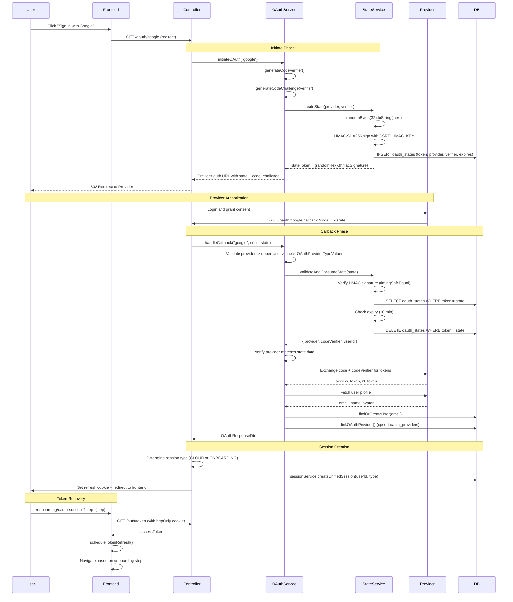
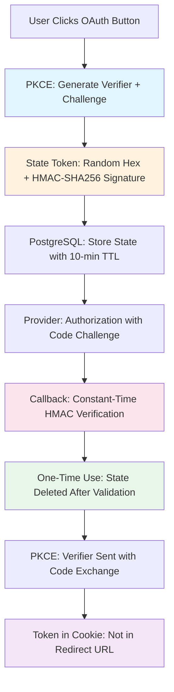

## Overview

<Info>
**Implemented in:** vritti-api-nexus, vritti-auth
**Last Updated:** February 2026
**Status:** Production
</Info>

Vritti implements OAuth 2.0 with PKCE (Proof Key for Code Exchange) for secure social login across five providers. The system uses HMAC-signed state tokens stored in PostgreSQL, constant-time comparison for CSRF protection, and integrates with the unified session and onboarding systems.

## What It Does

- Authenticates users via Google, Microsoft, Apple, Facebook, or Twitter/X
- Uses PKCE with SHA-256 challenge method to prevent authorization code interception
- Signs state tokens with HMAC-SHA256 for tamper detection
- Stores OAuth state in PostgreSQL (`oauth_states` table) with 10-minute TTL
- Finds or creates users on callback, setting `emailVerified: true`
- Links OAuth providers to existing accounts via a dedicated endpoint
- Redirects to the frontend without tokens in the URL (tokens recovered via httpOnly cookie)

## Where It's Used

| Location | Purpose |
|----------|---------|
| `vritti-api-nexus/src/modules/cloud-api/auth/oauth/controllers/auth-oauth.controller.ts` | OAuth endpoints (initiate, callback, link) |
| `vritti-api-nexus/src/modules/cloud-api/auth/oauth/services/oauth.service.ts` | Core OAuth logic (PKCE, handleCallback) |
| `vritti-api-nexus/src/modules/cloud-api/auth/oauth/services/oauth-state.service.ts` | State token creation, validation, and consumption |
| `vritti-api-nexus/src/modules/cloud-api/auth/oauth/providers/` | Provider-specific implementations (IOAuthProvider) |
| `vritti-auth/src/components/SocialAuthButtons.tsx` | Frontend OAuth login buttons |
| `vritti-auth/src/pages/OAuthSuccessPage.tsx` | Post-OAuth token recovery and routing |
| `vritti-auth/src/pages/OAuthErrorPage.tsx` | OAuth error handling and display |

## Supported Providers

| Provider | Authorization Server | Scopes | Interface |
|----------|---------------------|--------|-----------|
| Google | `accounts.google.com` | `openid email profile` | `IOAuthProvider` |
| Microsoft | `login.microsoftonline.com` | `openid email profile User.Read` | `IOAuthProvider` |
| Apple | `appleid.apple.com` | `name email` | `IOAuthProvider` |
| Facebook | `facebook.com` | `email public_profile` | `IOAuthProvider` |
| Twitter/X | `twitter.com` | `tweet.read users.read offline.access` | `IOAuthProvider` |

All providers implement the `IOAuthProvider` interface, which standardizes token exchange and profile fetching across providers.

## API Endpoints

### Initiate OAuth

```http
GET /cloud-api/auth/oauth/:provider
```

**Access:** Public (no authentication required)

**Path Parameters:**

| Parameter | Type | Description |
|-----------|------|-------------|
| `provider` | `string` | OAuth provider: `google`, `microsoft`, `apple`, `facebook`, `twitter` |

**Behavior:** Generates PKCE verifier and challenge, creates a signed state token, stores state in PostgreSQL, and redirects the user to the provider's authorization endpoint.

<Warning>
The callback route (`/cloud-api/auth/oauth/:provider/callback`) is defined **before** this generic `:provider` route in the controller to prevent NestJS from matching `callback` as a provider name.
</Warning>

### OAuth Callback

```http
GET /cloud-api/auth/oauth/:provider/callback
```

**Access:** Public (called by the OAuth provider)

**Query Parameters:**

| Parameter | Type | Description |
|-----------|------|-------------|
| `code` | `string` | Authorization code from the provider |
| `state` | `string` | Signed state token from the initiate step |

**Behavior:** Validates state, exchanges code for tokens (with PKCE verifier), fetches user profile, finds or creates the user, creates a session, sets the refresh cookie, and redirects to the frontend.

**Redirect Target:**
```
{FRONTEND_BASE_URL}/onboarding/oauth-success?step={onboardingStep}
```

<Note>
The access/onboarding token is **not** included in the redirect URL. The frontend recovers it by calling `GET /auth/token` which reads the httpOnly refresh cookie.
</Note>

### Link OAuth Provider

```http
GET /cloud-api/auth/oauth/:provider/link
```

**Access:** Requires `@Onboarding` token (authenticated user in onboarding flow)

**Behavior:** Links an OAuth provider to the currently authenticated user's account. Used when a user who signed up via email wants to add a social login method.

## Complete OAuth Flow

### Sequence Diagram



## PKCE Implementation

PKCE (Proof Key for Code Exchange) prevents authorization code interception attacks. The verifier is stored server-side in the OAuth state, and only the challenge is sent to the provider.

### Code Verifier Generation

```typescript
// oauth.service.ts
private generateCodeVerifier(): string {
  return crypto.randomBytes(32).toString('base64url');
}
```

Generates a cryptographically random 32-byte value encoded as a base64url string.

### Code Challenge Generation

```typescript
// oauth.service.ts
private generateCodeChallenge(verifier: string): string {
  return crypto
    .createHash('sha256')
    .update(verifier)
    .digest('base64url');
}
```

Computes the SHA-256 hash of the verifier and encodes it as base64url. The provider uses the S256 challenge method to verify that `SHA256(verifier) === challenge`.

### PKCE Flow

| Step | What Happens | Where |
|------|-------------|-------|
| 1. Initiate | Generate verifier, compute challenge, store verifier in state | Backend |
| 2. Authorize | Send `code_challenge` + `code_challenge_method=S256` to provider | Provider |
| 3. Callback | Retrieve verifier from state, send with authorization code | Backend |
| 4. Verify | Provider computes `SHA256(verifier)` and compares to stored challenge | Provider |

## State Management

### State Token Format

The state token is a compound value consisting of a random hex string and an HMAC-SHA256 signature:

```
{randomHex}.{hmacSignature}
```

### State Token Generation

```typescript
// oauth-state.service.ts
async createState(provider: string, codeVerifier: string, userId?: string): Promise<string> {
  // 1. Generate random state token
  const randomHex = crypto.randomBytes(32).toString('hex');

  // 2. Sign with HMAC-SHA256
  const hmacSignature = crypto
    .createHmac('sha256', this.CSRF_HMAC_KEY)
    .update(randomHex)
    .digest('hex');

  const stateToken = `${randomHex}.${hmacSignature}`;

  // 3. Store in PostgreSQL
  await this.oauthStateRepository.create({
    stateToken,
    provider,
    userId,           // nullable - set when linking to existing account
    codeVerifier,
    expiresAt: addMinutes(new Date(), 10),
  });

  return stateToken;
}
```

### State Storage (PostgreSQL)

State is stored in the `oauth_states` table, **not** in Redis:

```typescript
// oauth_states table schema
export const oauthStates = pgTable('oauth_states', {
  stateToken: text('state_token').primaryKey(),
  provider: text('provider').notNull(),
  userId: text('user_id'),                    // Nullable - only set for account linking
  codeVerifier: text('code_verifier').notNull(),
  expiresAt: timestamp('expires_at').notNull(),
  createdAt: timestamp('created_at').defaultNow(),
});
```

| Field | Type | Description |
|-------|------|-------------|
| `stateToken` | `text` (PK) | The `{randomHex}.{hmacSignature}` compound token |
| `provider` | `text` | OAuth provider name (e.g., `GOOGLE`) |
| `userId` | `text` (nullable) | Set when linking OAuth to an existing account |
| `codeVerifier` | `text` | PKCE code verifier for token exchange |
| `expiresAt` | `timestamp` | Expiration time (10 minutes from creation) |

### State Validation and Consumption

State tokens are **one-time use** -- they are deleted immediately after validation:

```typescript
// oauth-state.service.ts
async validateAndConsumeState(stateToken: string): Promise<OAuthStateData> {
  // 1. Split token into parts
  const [randomHex, providedHmac] = stateToken.split('.');

  // 2. Recompute HMAC
  const expectedHmac = crypto
    .createHmac('sha256', this.CSRF_HMAC_KEY)
    .update(randomHex)
    .digest('hex');

  // 3. Constant-time comparison to prevent timing attacks
  const isValid = crypto.timingSafeEqual(
    Buffer.from(providedHmac, 'hex'),
    Buffer.from(expectedHmac, 'hex'),
  );

  if (!isValid) {
    throw new UnauthorizedException('Invalid state token');
  }

  // 4. Retrieve and validate from database
  const state = await this.oauthStateRepository.findByToken(stateToken);
  if (!state) {
    throw new UnauthorizedException('State not found or already consumed');
  }

  // 5. Check expiry
  if (new Date() > state.expiresAt) {
    await this.oauthStateRepository.delete(stateToken);
    throw new UnauthorizedException('State token expired');
  }

  // 6. Delete state (one-time use)
  await this.oauthStateRepository.delete(stateToken);

  return {
    provider: state.provider,
    codeVerifier: state.codeVerifier,
    userId: state.userId,
  };
}
```

<Warning>
State validation uses `crypto.timingSafeEqual` for constant-time comparison. This prevents timing side-channel attacks that could be used to guess valid HMAC signatures.
</Warning>

## Callback Handling

### OAuthService.handleCallback()

The `handleCallback` method orchestrates the full callback processing:

```typescript
// oauth.service.ts
async handleCallback(
  provider: string,
  code: string,
  state: string,
): Promise<OAuthResponseDto> {
  // 1. Validate and normalize provider
  const normalizedProvider = provider.toUpperCase();
  if (!OAuthProviderTypeValues.includes(normalizedProvider)) {
    throw new BadRequestException(`Unsupported provider: ${provider}`);
  }

  // 2. Validate and consume state (verifies HMAC, checks expiry, deletes)
  const stateData = await this.oauthStateService.validateAndConsumeState(state);

  // 3. Verify provider matches state
  if (stateData.provider !== normalizedProvider) {
    throw new UnauthorizedException('Provider mismatch');
  }

  // 4. Exchange authorization code for tokens (with PKCE verifier)
  const tokens = await this.getProviderService(normalizedProvider)
    .exchangeCodeForTokens(code, stateData.codeVerifier);

  // 5. Get user profile from provider
  const profile = await this.getProviderService(normalizedProvider)
    .getUserProfile(tokens.accessToken);

  // 6. Find or create user
  const { user, isNewUser } = await this.findOrCreateUser(profile);

  // 7. Link OAuth provider (upsert)
  await this.linkOAuthProvider(user.id, normalizedProvider, profile, tokens);

  // 8. Generate onboarding token
  const onboardingToken = await this.jwtService.generateOnboardingToken(user);

  // 9. Return response
  return {
    onboardingToken,
    user,
    isNewUser,
    requiresPasswordSetup: !user.passwordHash,
  };
}
```

### findOrCreateUser()

```typescript
// oauth.service.ts
private async findOrCreateUser(
  profile: OAuthUserProfile,
): Promise<{ user: User; isNewUser: boolean }> {
  // Try to find existing user by email
  const existingUser = await this.userService.findByEmail(profile.email);

  if (existingUser) {
    return { user: existingUser, isNewUser: false };
  }

  // Create new user with OAuth defaults
  const newUser = await this.userService.create({
    email: profile.email,
    emailVerified: true,           // Trusted from OAuth provider
    onboardingStep: 'SET_PASSWORD', // OAuth users need to set a password
    firstName: profile.firstName,
    lastName: profile.lastName,
    avatarUrl: profile.avatarUrl,
  });

  return { user: newUser, isNewUser: true };
}
```

### linkOAuthProvider()

```typescript
// oauth.service.ts - upserts to oauth_providers table
private async linkOAuthProvider(
  userId: string,
  provider: string,
  profile: OAuthUserProfile,
  tokens: OAuthTokens,
): Promise<void> {
  await this.oauthProviderRepository.upsert({
    userId,
    provider,
    providerUserId: profile.providerUserId,
    accessToken: tokens.accessToken,   // Encrypted at rest
    refreshToken: tokens.refreshToken, // Encrypted at rest
  });
}
```

### Controller Callback Handler

The controller in `auth-oauth.controller.ts` wraps the service callback with session creation and redirect logic:

```typescript
// auth-oauth.controller.ts
@Get(':provider/callback')
async handleOAuthCallback(
  @Param('provider') provider: string,
  @Query('code') code: string,
  @Query('state') state: string,
  @Res() reply: FastifyReply,
): Promise<void> {
  // 1. Process OAuth callback
  const result = await this.oauthService.handleCallback(provider, code, state);

  // 2. Determine session type based on onboarding status
  const sessionType = result.user.onboardingStep === 'COMPLETE'
    ? 'CLOUD'
    : 'ONBOARDING';

  // 3. Create unified session
  const session = await this.sessionService.createUnifiedSession(
    result.user.id,
    sessionType,
  );

  // 4. Set refresh token as httpOnly cookie
  this.jwtService.setRefreshTokenCookie(reply, session.refreshToken);

  // 5. Redirect to frontend (token NOT in URL)
  const redirectUrl = `${this.FRONTEND_BASE_URL}/onboarding/oauth-success?step=${result.user.onboardingStep}`;
  reply.redirect(redirectUrl);
}
```

### OAuthResponseDto

```typescript
interface OAuthResponseDto {
  onboardingToken: string;        // JWT for onboarding flow
  user: User;                     // User entity
  isNewUser: boolean;             // Whether user was just created
  requiresPasswordSetup: boolean; // True if user has no password
}
```

## Session Type Determination

The controller determines the session type based on the user's onboarding status:

| `onboardingStep` | Session Type | Behavior |
|-------------------|-------------|----------|
| `COMPLETE` | `CLOUD` | Full access session, user goes to dashboard |
| Any other value | `ONBOARDING` | Limited session, user continues onboarding |

## Frontend Integration

### Social Auth Buttons

```typescript
// vritti-auth/src/components/SocialAuthButtons.tsx
const SocialAuthButtons: React.FC = () => {
  const handleOAuthLogin = (provider: string) => {
    // Navigate to backend OAuth initiation endpoint
    // This triggers a server-side redirect to the provider
    window.location.href = `/api/cloud-api/auth/oauth/${provider}`;
  };

  return (
    <div className="flex flex-col gap-3">
      <Button onClick={() => handleOAuthLogin('google')}>
        Sign in with Google
      </Button>
      <Button onClick={() => handleOAuthLogin('microsoft')}>
        Sign in with Microsoft
      </Button>
      <Button onClick={() => handleOAuthLogin('apple')}>
        Sign in with Apple
      </Button>
      <Button onClick={() => handleOAuthLogin('facebook')}>
        Sign in with Facebook
      </Button>
      <Button onClick={() => handleOAuthLogin('twitter')}>
        Sign in with X
      </Button>
    </div>
  );
};
```

### OAuth Success Page

After the backend redirects to `/onboarding/oauth-success?step={step}`, the success page recovers the token from the httpOnly cookie:

```typescript
// vritti-auth/src/pages/OAuthSuccessPage.tsx
const OAuthSuccessPage: React.FC = () => {
  const [searchParams] = useSearchParams();
  const step = searchParams.get('step');

  useEffect(() => {
    const handleSuccess = async () => {
      // 1. Recover access token from httpOnly refresh cookie
      const token = await recoverToken(); // Calls GET /auth/token

      // 2. Schedule automatic token refresh
      scheduleTokenRefresh();

      // 3. Navigate based on onboarding step
      switch (step) {
        case 'COMPLETE':
          navigate('/dashboard');
          break;
        case 'SET_PASSWORD':
          navigate('/onboarding/set-password');
          break;
        case 'PHONE_VERIFICATION':
          navigate('/onboarding/verify-phone');
          break;
        default:
          navigate('/onboarding');
      }
    };

    handleSuccess();
  }, [step]);

  return <LoadingSpinner message="Completing sign in..." />;
};
```

<Note>
The token is never exposed in the URL. The `recoverToken()` function calls `GET /auth/token` which reads the httpOnly refresh cookie set during the callback redirect, and returns a fresh access token.
</Note>

### OAuth Error Page

```typescript
// vritti-auth/src/pages/OAuthErrorPage.tsx
const errorMessages: Record<string, string> = {
  access_denied: 'You denied access to your account.',
  invalid_state: 'The authentication session has expired. Please try again.',
  email_exists: 'An account with this email already exists. Try logging in instead.',
  provider_error: 'The authentication provider encountered an error. Please try again.',
};
```

## Configuration

### Environment Variables

```bash
# OAuth State Security
CSRF_HMAC_KEY=your-256-bit-hmac-key-here

# Frontend URL for redirects
FRONTEND_BASE_URL=https://app.vritti.com

# Google OAuth
GOOGLE_CLIENT_ID=your-google-client-id
GOOGLE_CLIENT_SECRET=your-google-client-secret
GOOGLE_CALLBACK_URL=https://api.vritti.app/cloud-api/auth/oauth/google/callback

# Microsoft OAuth
MICROSOFT_CLIENT_ID=your-microsoft-client-id
MICROSOFT_CLIENT_SECRET=your-microsoft-client-secret
MICROSOFT_CALLBACK_URL=https://api.vritti.app/cloud-api/auth/oauth/microsoft/callback

# Apple OAuth
APPLE_CLIENT_ID=your-apple-service-id
APPLE_TEAM_ID=your-apple-team-id
APPLE_KEY_ID=your-apple-key-id
APPLE_PRIVATE_KEY=your-apple-private-key
APPLE_CALLBACK_URL=https://api.vritti.app/cloud-api/auth/oauth/apple/callback

# Facebook OAuth
FACEBOOK_CLIENT_ID=your-facebook-app-id
FACEBOOK_CLIENT_SECRET=your-facebook-app-secret
FACEBOOK_CALLBACK_URL=https://api.vritti.app/cloud-api/auth/oauth/facebook/callback

# Twitter/X OAuth
TWITTER_CLIENT_ID=your-twitter-client-id
TWITTER_CLIENT_SECRET=your-twitter-client-secret
TWITTER_CALLBACK_URL=https://api.vritti.app/cloud-api/auth/oauth/twitter/callback
```

## Security Architecture

### Defense Layers



<CardGroup cols={2}>
  <Card title="PKCE (S256)" icon="shield-check">
    Prevents authorization code interception. The code verifier never leaves the server.
  </Card>
  <Card title="HMAC-Signed State" icon="signature">
    State tokens are signed with HMAC-SHA256 using `CSRF_HMAC_KEY`, preventing forgery.
  </Card>
  <Card title="Constant-Time Comparison" icon="clock">
    `crypto.timingSafeEqual` prevents timing side-channel attacks on HMAC verification.
  </Card>
  <Card title="One-Time State" icon="trash">
    State tokens are deleted from PostgreSQL immediately after use, preventing replay attacks.
  </Card>
  <Card title="Token Not in URL" icon="eye-slash">
    Access tokens are never included in redirect URLs. The frontend recovers tokens via httpOnly cookies.
  </Card>
  <Card title="10-Minute Expiry" icon="hourglass">
    State tokens expire after 10 minutes, limiting the window for attacks.
  </Card>
</CardGroup>

## Error Handling

| Error Code | HTTP Status | Cause | Resolution |
|------------|-------------|-------|------------|
| `access_denied` | 403 | User denied consent at provider | Display message, offer retry |
| `invalid_state` | 401 | State token expired, tampered, or already consumed | Restart OAuth flow |
| `email_exists` | 409 | OAuth email matches existing non-OAuth account | Prompt user to link account or use password login |
| `provider_error` | 502 | Provider returned an error during token exchange | Log details, display generic message, retry |
| `provider_mismatch` | 401 | State was created for a different provider than the callback | Restart OAuth flow |

## Troubleshooting

<Accordion title="Invalid state token error on callback">
  **Causes:**
  - User took longer than 10 minutes to complete provider authorization
  - State token HMAC signature verification failed (possible tampering)
  - State was already consumed (user double-clicked or reloaded callback URL)
  - `CSRF_HMAC_KEY` environment variable changed between initiate and callback

  **Solution:**
  - Restart the OAuth flow from the login page
  - Verify `CSRF_HMAC_KEY` is consistent across server instances
  - Check PostgreSQL `oauth_states` table for expired entries
</Accordion>

<Accordion title="Provider mismatch error">
  **Cause:** The callback URL was called with a different provider than the one used to create the state token. For example, a Google state token was used on the Microsoft callback endpoint.

  **Solution:**
  - Verify callback URLs are correctly configured per provider
  - Ensure provider names in routes match the stored state
</Accordion>

<Accordion title="User created without password (requiresPasswordSetup: true)">
  **Cause:** This is expected behavior. New OAuth users are created with `onboardingStep: SET_PASSWORD` and no `passwordHash`. The user needs to complete password setup during onboarding.

  **Solution:**
  - The frontend should route the user to the password setup page
  - Check the `step` query parameter in the redirect URL
</Accordion>

<Accordion title="Callback route matching 'callback' as a provider name">
  **Cause:** NestJS route ordering issue. If the generic `:provider` route is defined before the `/callback` route, the string `callback` is interpreted as a provider name.

  **Solution:**
  - The callback route (`@Get(':provider/callback')`) must be defined **before** the generic initiate route (`@Get(':provider')`) in the controller
  - Verify route ordering in `auth-oauth.controller.ts`
</Accordion>

<Accordion title="OAuth tokens not reaching frontend after redirect">
  **Cause:** The access token is intentionally not included in the redirect URL. The frontend must call `GET /auth/token` to recover it from the httpOnly refresh cookie.

  **Solution:**
  - Verify `OAuthSuccessPage.tsx` calls `recoverToken()` on mount
  - Check that the refresh cookie domain/path matches the token endpoint
  - Ensure `FRONTEND_BASE_URL` is correctly set for the redirect
</Accordion>

## Related Documentation

<CardGroup cols={2}>
  <Card title="JWT Sessions" icon="key" href="/features/auth/jwt-sessions">
    Token structure and session management
  </Card>
  <Card title="Token Refresh" icon="rotate" href="/features/auth/token-refresh">
    Access token renewal and rotation
  </Card>
  <Card title="Signup & Login" icon="right-to-bracket" href="/features/auth/signup-login">
    Credential-based authentication flows
  </Card>
  <Card title="Onboarding Flow" icon="list-check" href="/features/onboarding/flow-overview">
    Post-OAuth onboarding steps
  </Card>
  <Card title="CSRF Protection" icon="lock" href="/features/csrf">
    Cross-site request forgery prevention
  </Card>
  <Card title="Provider-Specific Guides" icon="puzzle-piece" href="/features/oauth/overview">
    Individual provider setup and configuration
  </Card>
</CardGroup>
