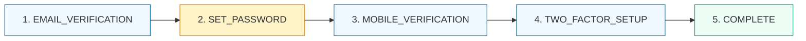
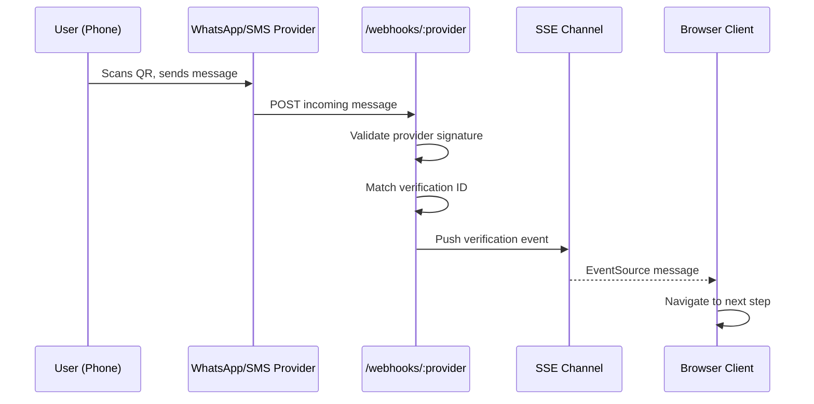
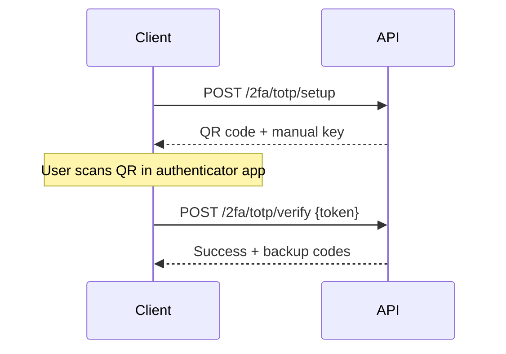
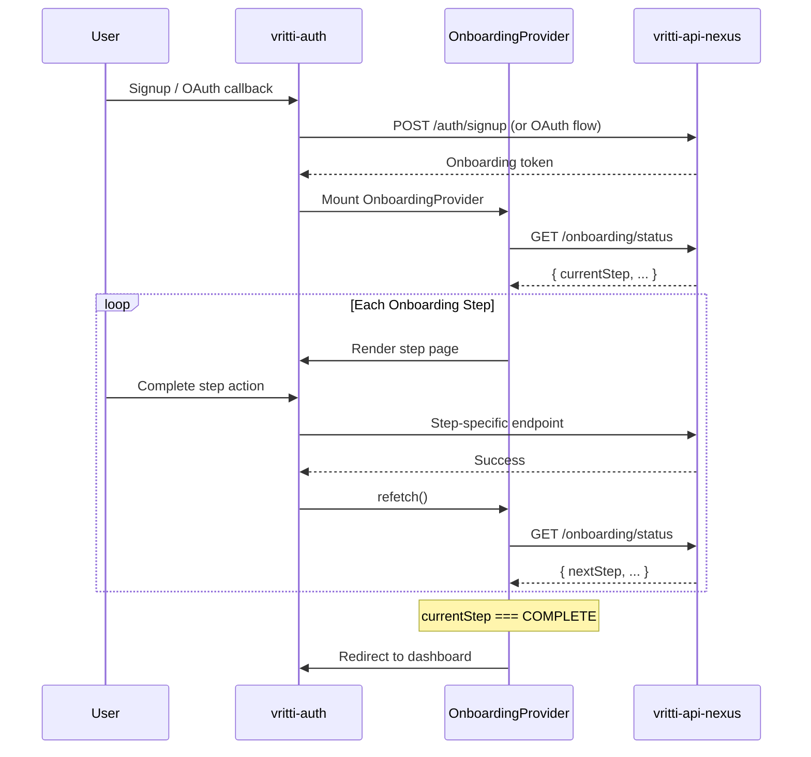

## Overview

<Info>
**Implemented in:** vritti-api-nexus, vritti-auth
**Last Updated:** February 2026
**Status:** Production
</Info>

After signup (email or OAuth), every user passes through a multi-step onboarding flow before their account is activated. The flow is gated by an `@Onboarding` token (short-lived `ONBOARDING` session) and tracks progress via the `onboardingStep` field on the user record. Each step must be completed in order; users cannot skip ahead or go backwards.

## Step Progression



| Step | Enum Value | Description | Skippable? |
|------|-----------|-------------|------------|
| 1 | `EMAIL_VERIFICATION` | Verify email via 6-digit OTP | No |
| 2 | `SET_PASSWORD` | Create a password (OAuth users who signed up without one) | Auto-skipped if password already set |
| 3 | `MOBILE_VERIFICATION` | Verify phone via WhatsApp QR, SMS QR, or manual OTP | No |
| 4 | `TWO_FACTOR_SETUP` | Configure TOTP or Passkey for MFA | Yes (user can skip) |
| 5 | `COMPLETE` | Account activated, `accountStatus` set to `ACTIVE` | N/A |

<Note>
**Email signup users** who already provided a password during registration skip `SET_PASSWORD` entirely. The step transition goes directly from `EMAIL_VERIFICATION` to `MOBILE_VERIFICATION`.
</Note>

## Registration Path Comparison

```mermaid
flowchart TD
    subgraph email["Email Signup (password provided)"]
        direction LR
        E1[EMAIL_VERIFICATION] --> E3[MOBILE_VERIFICATION]
        E3 --> E4[TWO_FACTOR_SETUP]
        E4 --> E5[COMPLETE]
    end

    subgraph oauth["OAuth Signup (no password)"]
        direction LR
        O1[EMAIL_VERIFICATION] --> O2[SET_PASSWORD]
        O2 --> O3[MOBILE_VERIFICATION]
        O3 --> O4[TWO_FACTOR_SETUP]
        O4 --> O5[COMPLETE]
    end

    style email fill:#f8fafc,stroke:#94a3b8
    style oauth fill:#f8fafc,stroke:#94a3b8
```



## API Endpoints

All onboarding endpoints are prefixed with `/cloud-api/onboarding` and require the `@Onboarding` token (sent as a cookie or `Authorization: Bearer` header).

### Global Endpoints

| Method | Endpoint | Description |
|--------|----------|-------------|
| `GET` | `/cloud-api/onboarding/status` | Get current onboarding state |
| `POST` | `/cloud-api/onboarding/start` | Trigger OTP sending for the current step |

### Step 1: Email Verification

| Method | Endpoint | Body | Description |
|--------|----------|------|-------------|
| `POST` | `/cloud-api/onboarding/verify-email` | `{ otp }` | Verify the 6-digit email OTP |
| `POST` | `/cloud-api/onboarding/resend-email-otp` | -- | Resend the email OTP |

### Step 2: Set Password

| Method | Endpoint | Body | Description |
|--------|----------|------|-------------|
| `POST` | `/cloud-api/onboarding/set-password` | `{ password }` | Set password for OAuth users |

### Step 3: Mobile Verification

| Method | Endpoint | Body / Params | Description |
|--------|----------|---------------|-------------|
| `POST` | `/cloud-api/onboarding/mobile-verification/initiate` | `{ phone?, phoneCountry?, method? }` | Start phone verification |
| `GET` | `/cloud-api/onboarding/mobile-verification/status` | -- | Poll current verification status |
| `POST` | `/cloud-api/onboarding/mobile-verification/verify-otp` | `{ otp }` | Verify OTP (for `MANUAL_OTP` method) |
| `POST` | `/cloud-api/onboarding/mobile-verification/resend` | -- | Resend verification |
| `GET` | `/cloud-api/onboarding/mobile-verification/events?token=<jwt>` | Query param: `token` | SSE stream for real-time QR verification updates |

### Step 4: Two-Factor Authentication Setup

| Method | Endpoint | Body | Description |
|--------|----------|------|-------------|
| `POST` | `/cloud-api/onboarding/2fa/totp/setup` | -- | Generate TOTP QR code and manual key |
| `POST` | `/cloud-api/onboarding/2fa/totp/verify` | `{ token }` | Verify TOTP code and activate |
| `POST` | `/cloud-api/onboarding/2fa/passkey/setup` | -- | Get WebAuthn registration options |
| `POST` | `/cloud-api/onboarding/2fa/passkey/verify` | `{ credential }` | Verify passkey registration |
| `POST` | `/cloud-api/onboarding/2fa/skip` | -- | Skip 2FA setup and complete onboarding |
| `GET` | `/cloud-api/onboarding/2fa/status` | -- | Get current 2FA configuration status |

### Webhook Endpoints

| Method | Endpoint | Description |
|--------|----------|-------------|
| `POST` | `/cloud-api/onboarding/webhooks/whatsapp` | WhatsApp incoming message webhook |
| `POST` | `/cloud-api/onboarding/webhooks/sms` | SMS incoming message webhook |

---

## Onboarding Status

```http
GET /cloud-api/onboarding/status
Authorization: Bearer <onboarding_token>
```

### Response

```json
{
  "userId": "usr_abc123",
  "email": "user@example.com",
  "firstName": "Jane",
  "lastName": "Doe",
  "currentStep": "EMAIL_VERIFICATION",
  "onboardingComplete": false,
  "accountStatus": "PENDING_VERIFICATION",
  "emailVerified": false,
  "phoneVerified": false,
  "signupMethod": "email"
}
```

| Field | Type | Description |
|-------|------|-------------|
| `userId` | `string` | The user's unique ID |
| `email` | `string` | The user's email address |
| `firstName` | `string` | First name |
| `lastName` | `string` | Last name |
| `currentStep` | `enum` | One of the 5 onboarding steps |
| `onboardingComplete` | `boolean` | `true` when `currentStep` is `COMPLETE` |
| `accountStatus` | `enum` | `PENDING_VERIFICATION` until onboarding finishes, then `ACTIVE` |
| `emailVerified` | `boolean` | Whether email has been verified |
| `phoneVerified` | `boolean` | Whether phone has been verified |
| `signupMethod` | `string` | `email`, `google`, `microsoft`, etc. |

## Start Onboarding

```http
POST /cloud-api/onboarding/start
Authorization: Bearer <onboarding_token>
```

Triggers OTP sending based on the user's current step. For `EMAIL_VERIFICATION`, it sends an email OTP. For other steps, it sends the appropriate verification.

### Response

```json
{
  "success": true,
  "message": "Verification code sent",
  "currentStep": "EMAIL_VERIFICATION",
  "otpSentTo": "email",
  "otpDestination": "u***@example.com"
}
```

---

## Step 1: Email Verification

The first onboarding step verifies the user owns the email address they registered with.

### Verify Email

```http
POST /cloud-api/onboarding/verify-email
Authorization: Bearer <onboarding_token>
Content-Type: application/json

{
  "otp": "482901"
}
```

On success, the user's `emailVerified` flag is set to `true` and the step advances. If the user already has a password hash (email signup), the step advances to `MOBILE_VERIFICATION`. If not (OAuth signup), it advances to `SET_PASSWORD`.

### Resend Email OTP

```http
POST /cloud-api/onboarding/resend-email-otp
Authorization: Bearer <onboarding_token>
```

Resends the 6-digit OTP to the user's registered email. Subject to rate limiting.

### Frontend

**Component:** `VerifyEmailPage.tsx`

---

## Step 2: Set Password

This step only appears for OAuth users who registered without a password. Email signup users who provided a password at registration skip this step automatically.

### Set Password

```http
POST /cloud-api/onboarding/set-password
Authorization: Bearer <onboarding_token>
Content-Type: application/json

{
  "password": "MySecure!Pass1"
}
```

### Password Requirements

The password is validated against the following regex:

```
^(?=.*[a-z])(?=.*[A-Z])(?=.*\d)(?=.*[^A-Za-z0-9])
```

| Requirement | Rule |
|-------------|------|
| Lowercase letter | At least 1 |
| Uppercase letter | At least 1 |
| Digit | At least 1 |
| Special character | At least 1 (any non-alphanumeric character) |

### Frontend

**Component:** `SetPasswordPage.tsx`

---

## Step 3: Mobile Verification

Phone verification supports three methods, managed by the `MobileVerificationController`.

| Method | Enum Value | How It Works |
|--------|-----------|--------------|
| WhatsApp QR | `WHATSAPP_QR` | User scans a QR code with WhatsApp; verification confirmed via webhook |
| SMS QR | `SMS_QR` | User scans a QR code to send an SMS; verification confirmed via webhook |
| Manual OTP | `MANUAL_OTP` | User receives an OTP via SMS and enters it manually |

### Initiate Verification

```http
POST /cloud-api/onboarding/mobile-verification/initiate
Authorization: Bearer <onboarding_token>
Content-Type: application/json

{
  "phone": "+14155551234",
  "phoneCountry": "US",
  "method": "WHATSAPP_QR"
}
```

All body fields are optional. If `method` is not provided, the server selects a default.

### Response

```json
{
  "verificationId": "ver_xyz789",
  "method": "WHATSAPP_QR",
  "verificationToken": "eyJhbGciOi...",
  "isVerified": false,
  "phone": "+14155551234",
  "phoneCountry": "US",
  "expiresAt": "2026-02-07T12:15:00Z",
  "message": "Scan the QR code with WhatsApp",
  "instructions": "Open WhatsApp > Scan QR Code",
  "whatsappNumber": "+14155550000"
}
```

| Field | Type | Description |
|-------|------|-------------|
| `verificationId` | `string` | Unique ID for this verification attempt |
| `method` | `enum` | `WHATSAPP_QR`, `SMS_QR`, or `MANUAL_OTP` |
| `verificationToken` | `string?` | JWT token for SSE connection (QR methods) |
| `isVerified` | `boolean` | Whether verification is already complete |
| `phone` | `string?` | Phone number in E.164 format |
| `phoneCountry` | `string?` | ISO country code |
| `expiresAt` | `string` | Expiration timestamp for this verification |
| `message` | `string` | Human-readable status message |
| `instructions` | `string?` | Step-by-step instructions for the user |
| `whatsappNumber` | `string?` | The WhatsApp number to message (for WhatsApp method) |

### Poll Verification Status

```http
GET /cloud-api/onboarding/mobile-verification/status
Authorization: Bearer <onboarding_token>
```

Used for polling-based verification status checks.

### Verify OTP (Manual OTP Method)

```http
POST /cloud-api/onboarding/mobile-verification/verify-otp
Authorization: Bearer <onboarding_token>
Content-Type: application/json

{
  "otp": "592017"
}
```

Only used when the verification method is `MANUAL_OTP`.

### Resend Verification

```http
POST /cloud-api/onboarding/mobile-verification/resend
Authorization: Bearer <onboarding_token>
```

### SSE Real-Time Events

```http
GET /cloud-api/onboarding/mobile-verification/events?token=<jwt>
```

<Warning>
The SSE endpoint uses a query parameter `token` for authentication instead of the `Authorization` header. This is because the browser's `EventSource` API does not support custom headers. The endpoint uses `SseAuthGuard` to validate the JWT from the query parameter.
</Warning>

This endpoint streams server-sent events for QR-based verification methods (`WHATSAPP_QR` and `SMS_QR`). When the user scans the QR code and sends a message, the webhook processes the incoming message and pushes a verification event through SSE to the client in real time.

### Webhook Processing



Webhooks at `/cloud-api/onboarding/webhooks/:provider` (where `:provider` is `whatsapp` or `sms`) validate the provider's signature on the incoming payload and process the message to confirm verification.

### Frontend

**Component:** `VerifyMobileFlowPage.tsx`

---

## Step 4: Two-Factor Authentication Setup

Users can configure TOTP (authenticator app) or Passkey (WebAuthn) as their 2FA method. This step can be skipped, which completes onboarding without 2FA.

### TOTP Setup Flow



#### Generate TOTP Secret

```http
POST /cloud-api/onboarding/2fa/totp/setup
Authorization: Bearer <onboarding_token>
```

**Response:**

```json
{
  "qrCodeDataUrl": "data:image/png;base64,iVBOR...",
  "manualSetupKey": "JBSWY3DPEHPK3PXP",
  "issuer": "Vritti",
  "accountName": "user@example.com"
}
```

#### Verify TOTP Token

```http
POST /cloud-api/onboarding/2fa/totp/verify
Authorization: Bearer <onboarding_token>
Content-Type: application/json

{
  "token": "482901"
}
```

**Response:**

```json
{
  "success": true,
  "message": "TOTP successfully configured",
  "backupCodes": [
    "a1b2c3d4",
    "e5f6g7h8",
    "i9j0k1l2",
    "m3n4o5p6",
    "q7r8s9t0",
    "u1v2w3x4",
    "y5z6a7b8",
    "c9d0e1f2"
  ],
  "warning": "Store these backup codes in a safe place. They will not be shown again."
}
```

### Passkey Setup Flow

#### Generate Registration Options

```http
POST /cloud-api/onboarding/2fa/passkey/setup
Authorization: Bearer <onboarding_token>
```

Returns WebAuthn `PublicKeyCredentialCreationOptions` for the browser's Credential Management API.

#### Verify Passkey Registration

```http
POST /cloud-api/onboarding/2fa/passkey/verify
Authorization: Bearer <onboarding_token>
Content-Type: application/json

{
  "credential": { /* WebAuthn AuthenticatorAttestationResponse */ }
}
```

**Response:**

```json
{
  "success": true,
  "message": "Passkey successfully registered",
  "backupCodes": ["a1b2c3d4", "e5f6g7h8", "..."],
  "warning": "Store these backup codes in a safe place. They will not be shown again."
}
```

### Skip 2FA

```http
POST /cloud-api/onboarding/2fa/skip
Authorization: Bearer <onboarding_token>
```

Skips 2FA setup entirely and completes the onboarding flow. The user's `onboardingStep` is set to `COMPLETE` and `accountStatus` becomes `ACTIVE`.

### 2FA Status

```http
GET /cloud-api/onboarding/2fa/status
Authorization: Bearer <onboarding_token>
```

**Response:**

```json
{
  "isEnabled": false,
  "method": null,
  "backupCodesRemaining": 0,
  "lastUsedAt": null,
  "createdAt": null
}
```

### Frontend

**Component:** `MFASetupFlowPage.tsx`

The frontend flow: method selection (TOTP or Passkey) -> setup (QR code display or passkey prompt) -> verify (enter code or confirm passkey) -> backup codes display.

---

## Frontend Architecture

### OnboardingProvider

The `OnboardingProvider` context wraps all onboarding pages and provides shared state to child components.

```typescript
interface OnboardingContextType {
  userId: string;
  email: string;
  firstName: string;
  lastName: string;
  currentStep: OnboardingStep;
  onboardingComplete: boolean;
  accountStatus: string;
  emailVerified: boolean;
  phoneVerified: boolean;
  signupMethod: string;
  isLoading: boolean;
  error: Error | null;
  refetch: () => void;
}
```

The provider uses `useQuery` to fetch `GET /cloud-api/onboarding/status` and exposes the response data along with loading/error states and a `refetch` function that child components call after completing a step.

### OnboardingRouter

The `OnboardingRouter` component reads `currentStep` from the context and renders the correct page component:

| `currentStep` | Page Component |
|---------------|----------------|
| `EMAIL_VERIFICATION` | `VerifyEmailPage` |
| `SET_PASSWORD` | `SetPasswordPage` |
| `MOBILE_VERIFICATION` | `VerifyMobileFlowPage` |
| `TWO_FACTOR_SETUP` | `MFASetupFlowPage` |
| `COMPLETE` | Redirects to dashboard |

<Warning>
OAuth callback routes (`oauth-success`, `oauth-error`) are rendered **outside** the `OnboardingProvider`. They handle the OAuth redirect before entering the onboarding flow.
</Warning>

### Full Onboarding Sequence



## Where It's Used

| Location | Purpose |
|----------|---------|
| `vritti-api-nexus/src/modules/cloud-api/onboarding/onboarding.controller.ts` | Status and start endpoints |
| `vritti-api-nexus/src/modules/cloud-api/onboarding/onboarding.service.ts` | Step transitions and orchestration |
| `vritti-api-nexus/src/modules/cloud-api/onboarding/controllers/mobile-verification.controller.ts` | Phone verification endpoints |
| `vritti-api-nexus/src/modules/cloud-api/onboarding/controllers/two-factor.controller.ts` | 2FA setup endpoints |
| `vritti-api-nexus/src/modules/cloud-api/onboarding/webhooks/` | WhatsApp and SMS webhook handlers |
| `vritti-auth/src/pages/onboarding/VerifyEmailPage.tsx` | Email verification UI |
| `vritti-auth/src/pages/onboarding/SetPasswordPage.tsx` | Password setup UI |
| `vritti-auth/src/pages/onboarding/VerifyMobileFlowPage.tsx` | Mobile verification UI |
| `vritti-auth/src/pages/onboarding/MFASetupFlowPage.tsx` | 2FA setup UI |
| `vritti-auth/src/providers/OnboardingProvider.tsx` | Shared onboarding state context |
| `vritti-auth/src/routes/OnboardingRouter.tsx` | Step-based page routing |

## Error Handling

### Common Errors

| Status | Error | Cause |
|--------|-------|-------|
| 400 | `INVALID_ONBOARDING_STEP` | User attempted an action for a step they are not on |
| 400 | `INVALID_OTP` | Wrong OTP code |
| 400 | `OTP_EXPIRED` | OTP has expired |
| 400 | `PASSWORD_VALIDATION_FAILED` | Password does not meet requirements |
| 401 | `UNAUTHORIZED` | Missing or invalid onboarding token |
| 401 | `SESSION_EXPIRED` | Onboarding session (10 min) expired |
| 429 | `TOO_MANY_REQUESTS` | OTP resend rate limit exceeded |

## Troubleshooting

<Accordion title="User stuck on wrong onboarding step">
  **Cause:** Database state mismatch -- the user's `onboardingStep` does not match their actual verified state.

  **Solution:**
  - Check the user's `onboardingStep`, `emailVerified`, `phoneVerified`, and `passwordHash` fields in the database
  - If the verified flags are correct but the step is wrong, manually update `onboardingStep`
  - Ensure step transition logic handles the user's signup method correctly
</Accordion>

<Accordion title="Onboarding token expires before completion">
  **Cause:** `ONBOARDING` sessions have a 10-minute expiry. If the user takes too long, the token becomes invalid.

  **Solution:**
  - The user must log in again with their credentials to get a new onboarding session
  - All verified progress (email, phone) is preserved on the user record
  - The new session picks up from the user's current `onboardingStep`
</Accordion>

<Accordion title="SSE events not arriving for QR verification">
  **Cause:** The `EventSource` connection requires the JWT token as a query parameter, not a header.

  **Solution:**
  - Verify the `token` query parameter is set correctly in the `EventSource` URL
  - Check that `SseAuthGuard` is correctly validating the token
  - Ensure the webhook endpoint is receiving and processing provider messages
  - Verify the provider's webhook signature validation is passing
</Accordion>

<Accordion title="OAuth user not seeing SET_PASSWORD step">
  **Cause:** The step transition from `EMAIL_VERIFICATION` checks `user.passwordHash`. If it is truthy, the step skips to `MOBILE_VERIFICATION`.

  **Solution:**
  - Verify the user's `passwordHash` is `null` (as expected for OAuth users)
  - Check the OAuth callback is not inadvertently setting a password hash
</Accordion>

<Accordion title="Webhook not confirming mobile verification">
  **Cause:** Provider webhook signature validation is failing, or the verification ID cannot be matched.

  **Solution:**
  - Check webhook logs for signature validation errors
  - Verify the provider API keys and webhook secrets are configured correctly
  - Ensure the verification ID in the incoming message matches an active verification
</Accordion>

## Related Documentation

<CardGroup cols={2}>
  <Card title="Signup & Login" icon="right-to-bracket" href="/features/auth/signup-login">
    Registration flows that initiate onboarding
  </Card>
  <Card title="JWT Sessions" icon="key" href="/features/auth/jwt-sessions">
    Token structure and ONBOARDING session type
  </Card>
  <Card title="Onboarding Flow Overview" icon="list-check" href="/features/onboarding/flow-overview">
    High-level overview of the 5-step process
  </Card>
  <Card title="Phone Verification" icon="phone" href="/features/onboarding/phone-verification">
    Detailed phone verification documentation
  </Card>
  <Card title="2FA Setup" icon="shield" href="/features/onboarding/2fa-setup">
    TOTP and Passkey configuration details
  </Card>
  <Card title="SSE Real-Time" icon="bolt" href="/features/communication/sse-realtime">
    Server-Sent Events implementation
  </Card>
</CardGroup>
