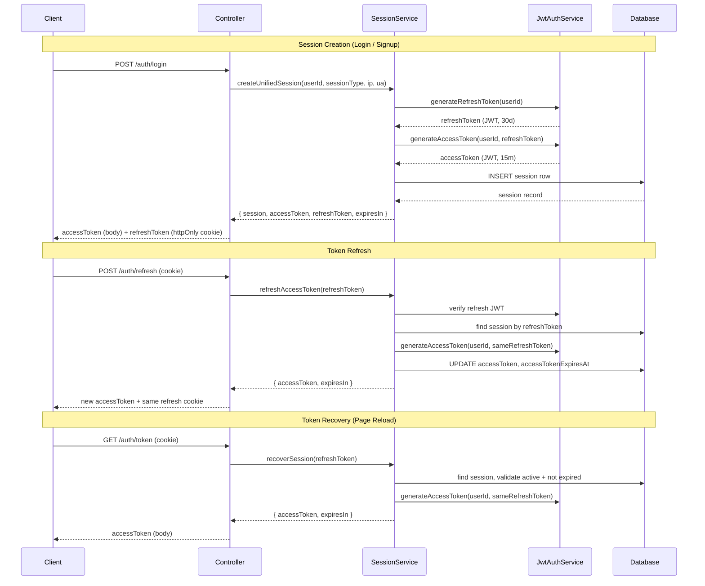
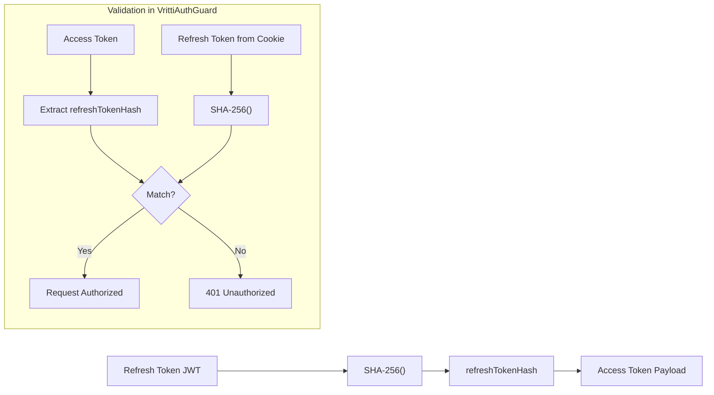
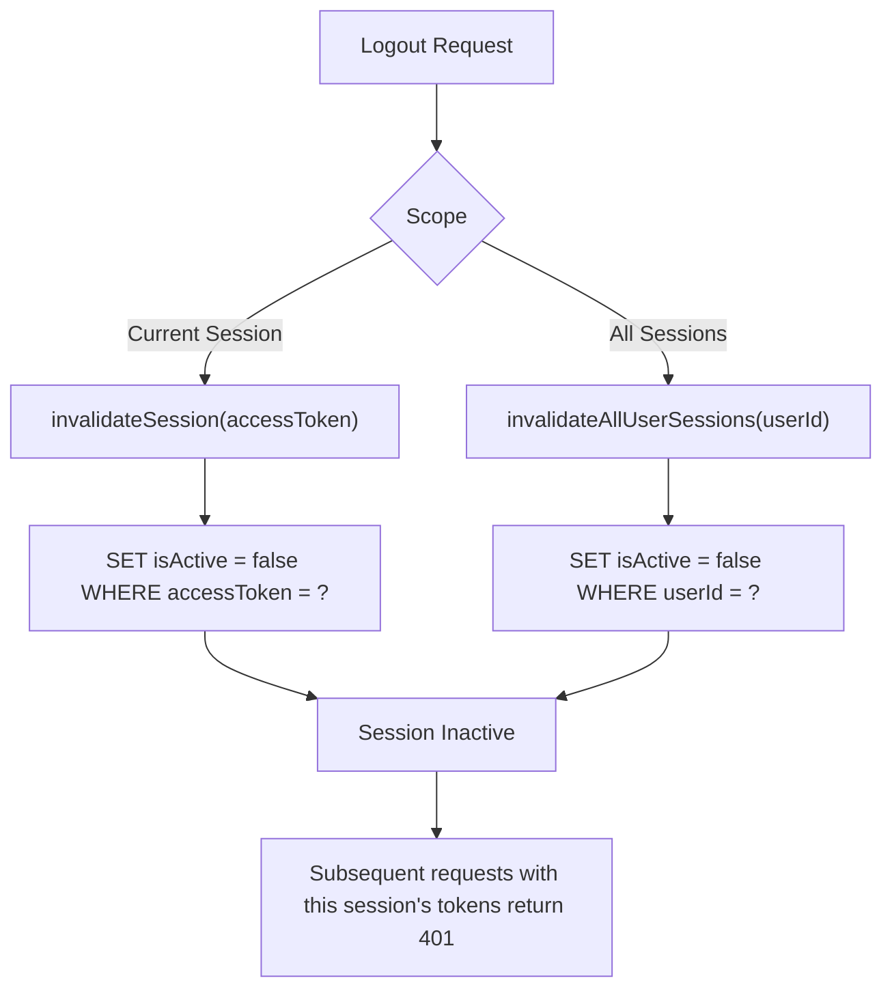

## Overview

<Info>
**Implemented in:** vritti-api-nexus (`SessionService`, `JwtAuthService`), @vritti/api-sdk (`VrittiAuthGuard`, `configureApiSdk`)
**Last Updated:** February 2026
**Status:** Production
</Info>

Vritti manages authentication state through database-backed sessions paired with JWT access and refresh tokens. Sessions are created via `SessionService.createUnifiedSession`, access tokens are short-lived (15 min) and cryptographically bound to their refresh token via SHA-256, and refresh tokens are long-lived (30 days) and delivered exclusively through httpOnly cookies.

## What It Does

- Creates unified sessions that bundle access and refresh tokens with DB-backed metadata
- Generates access tokens bound to refresh tokens using a SHA-256 hash (`refreshTokenHash`)
- Refreshes access tokens from httpOnly cookies without rotating the refresh token
- Recovers sessions on page reload via a public token endpoint
- Invalidates individual sessions or all sessions for a user
- Tracks IP address, user agent, and active status per session

## Session & Token Lifecycle



## Session Creation

`SessionService.createUnifiedSession(userId, sessionType, ipAddress?, userAgent?)` orchestrates the full token generation and database persistence in a single call.

### Step-by-Step Flow

<Steps>
  <Step title="Generate Refresh Token">
    `JwtAuthService.generateRefreshToken(userId)` creates a JWT with:

    ```json
    {
      "userId": "usr_abc123",
      "type": "refresh"
    }
    ```

    Expiry: **30 days**
  </Step>

  <Step title="Generate Access Token">
    For `CLOUD` sessions, `JwtAuthService.generateAccessToken(userId, refreshToken)` creates a JWT with:

    ```json
    {
      "userId": "usr_abc123",
      "type": "access",
      "refreshTokenHash": "a9f8d7c6b5e4..."
    }
    ```

    The `refreshTokenHash` is `SHA-256(refreshToken)`. Expiry: **15 minutes** (configurable).

    For `ONBOARDING` sessions, `generateOnboardingToken(userId, refreshToken)` is used instead:

    ```json
    {
      "userId": "usr_abc123",
      "type": "onboarding",
      "refreshTokenHash": "a9f8d7c6b5e4..."
    }
    ```

    Expiry: **24 hours**
  </Step>

  <Step title="Persist Session to Database">
    A row is inserted into the `sessions` table:

    | Column | Value |
    |--------|-------|
    | `userId` | The authenticated user's ID |
    | `type` | `ONBOARDING` or `CLOUD` |
    | `accessToken` | The generated access token JWT |
    | `refreshToken` | The generated refresh token JWT |
    | `tokenType` | `'Bearer'` |
    | `ipAddress` | Client IP (optional) |
    | `userAgent` | Client user agent string (optional) |
    | `isActive` | `true` |
    | `accessTokenExpiresAt` | Timestamp (now + 15 min or 24h) |
    | `refreshTokenExpiresAt` | Timestamp (now + 30 days) |
  </Step>

  <Step title="Return Session Bundle">
    The method returns:

    ```typescript
    {
      session,        // The full DB session record
      accessToken,    // JWT string
      refreshToken,   // JWT string
      expiresIn       // Access token TTL in seconds
    }
    ```
  </Step>
</Steps>

### Token Payloads Summary

| Token Type | Payload Fields | Expiry |
|------------|---------------|--------|
| Refresh | `{ userId, type: 'refresh' }` | 30 days |
| Access (CLOUD) | `{ userId, type: 'access', refreshTokenHash }` | 15 minutes |
| Access (ONBOARDING) | `{ userId, type: 'onboarding', refreshTokenHash }` | 24 hours |

## Token Binding

Access tokens are cryptographically bound to their corresponding refresh token. The `refreshTokenHash` field in the access token payload is the SHA-256 digest of the refresh token.



This binding means a stolen access token is useless without the refresh token cookie, and vice versa. The `VrittiAuthGuard` in `@vritti/api-sdk` enforces this check on every authenticated request.

## Token Refresh

### Endpoint

```http
POST /cloud-api/auth/refresh
Cookie: vritti_refresh=<refresh-token-jwt>
```

The refresh token is read from the **httpOnly cookie**, not from the request body.

### How It Works

1. Controller extracts the refresh token from the httpOnly cookie
2. `SessionService.refreshAccessToken(refreshToken)` is called
3. The refresh token's JWT signature is verified
4. The session is looked up by `refreshToken` in the database
5. The session is validated: `isActive === true` and refresh token not expired
6. A new access token is generated, bound to the **same** refresh token (no rotation)
7. The session's `accessToken` and `accessTokenExpiresAt` are updated in the database
8. Controller sets a new refresh cookie and returns the response

### Response

```json
{
  "accessToken": "eyJhbGciOiJIUzI1NiIs...",
  "expiresIn": 900
}
```

<Note>
The refresh token is **not rotated** on refresh. The same refresh token remains valid for its full 30-day lifetime. This simplifies multi-tab scenarios where concurrent refresh requests would otherwise invalidate each other.
</Note>

## Token Recovery (Page Reload)

### Endpoint

```http
GET /cloud-api/auth/token
Cookie: vritti_refresh=<refresh-token-jwt>
```

This is a **public endpoint** (no access token required). It enables the client to recover a valid access token after a page reload using only the refresh cookie.

### How It Works

1. `SessionService.recoverSession()` is called with the refresh token from the cookie
2. The session is found by refresh token in the database
3. The session is validated: `isActive === true` and refresh token not expired
4. A new access token is generated (same refresh token, no rotation)
5. Returns `{ accessToken, expiresIn }`

### Client-Side Usage

```typescript
// On app initialization / page reload
async function recoverSession(): Promise<string | null> {
  try {
    const response = await api.get('/cloud-api/auth/token', {
      withCredentials: true, // Send the refresh cookie
    });
    return response.data.accessToken;
  } catch {
    // No valid session - redirect to login
    return null;
  }
}
```

## Session Invalidation

### Individual Session

`invalidateSession(accessToken)` finds the session by its `accessToken` field and sets `isActive = false`.

```typescript
// Logout current session
await sessionService.invalidateSession(currentAccessToken);
```

### All User Sessions

`invalidateAllUserSessions(userId)` sets `isActive = false` for every session belonging to the user.

```typescript
// Logout everywhere (e.g., password change, security concern)
await sessionService.invalidateAllUserSessions(userId);
```

### Active Session Listing

`getUserActiveSessions(userId)` returns all sessions where `isActive === true` for the given user.

```typescript
const sessions = await sessionService.getUserActiveSessions(userId);
// Returns: Array<{ id, type, ipAddress, userAgent, isActive, ... }>
```

### Invalidation Flow



## Cookie Configuration

The refresh token is delivered as an httpOnly cookie configured through `@vritti/api-sdk`'s `configureApiSdk()` function.

### Cookie Properties

| Property | Value | Source |
|----------|-------|--------|
| Cookie Name | Value of `REFRESH_COOKIE_NAME` env var | Default: `'vritti_refresh'` |
| `httpOnly` | `true` | Prevents JavaScript access (XSS protection) |
| `secure` | `true` in production | HTTPS-only in production |
| `sameSite` | `'strict'` | Blocks cross-site cookie sending |
| `domain` | Value of `REFRESH_COOKIE_DOMAIN` env var | Scopes cookie to domain |
| `maxAge` | `2592000000` (30 days in ms) | `30 * 24 * 60 * 60 * 1000` |

### Environment Variables

```bash
# .env
REFRESH_COOKIE_NAME=vritti_refresh       # Cookie name for the refresh token
REFRESH_COOKIE_DOMAIN=.yourdomain.com    # Cookie domain scope
```

### Cookie Setting in Controller

```typescript
// After login or refresh, the controller sets the cookie on the response:
reply.setCookie(cookieName, refreshToken, {
  httpOnly: true,
  secure: process.env.NODE_ENV === 'production',
  sameSite: 'strict',
  domain: process.env.REFRESH_COOKIE_DOMAIN,
  maxAge: 30 * 24 * 60 * 60 * 1000, // 30 days
});
```

## Session Database Schema

The `sessions` table stores all active and inactive sessions:

```typescript
// Drizzle schema
export const sessions = pgTable('sessions', {
  id: text('id').primaryKey(),
  userId: text('user_id').notNull(),
  type: sessionTypeEnum('type').notNull(),       // 'ONBOARDING' | 'CLOUD'
  accessToken: text('access_token').notNull(),
  refreshToken: text('refresh_token').notNull(),
  tokenType: text('token_type').notNull(),        // Always 'Bearer'
  ipAddress: text('ip_address'),
  userAgent: text('user_agent'),
  isActive: boolean('is_active').default(true),
  accessTokenExpiresAt: timestamp('access_token_expires_at').notNull(),
  refreshTokenExpiresAt: timestamp('refresh_token_expires_at').notNull(),
  createdAt: timestamp('created_at').defaultNow(),
  updatedAt: timestamp('updated_at').defaultNow(),
});
```

## Configuration Reference

| Setting | Environment Variable | Default | Description |
|---------|---------------------|---------|-------------|
| Access token expiry | `JWT_ACCESS_EXPIRY` | 15 minutes | Short-lived API authorization |
| Refresh token expiry | `JWT_REFRESH_EXPIRY` | 30 days | Long-lived session token |
| Onboarding token expiry | - | 24 hours | Extended access for signup flow |
| Cookie name | `REFRESH_COOKIE_NAME` | `vritti_refresh` | httpOnly cookie identifier |
| Cookie domain | `REFRESH_COOKIE_DOMAIN` | - | Domain scope for the refresh cookie |

## Security Properties

<CardGroup cols={2}>
  <Card title="Token Binding" icon="link">
    Access tokens contain a SHA-256 hash of their refresh token, preventing use of a stolen access token without the corresponding cookie
  </Card>
  <Card title="httpOnly Cookies" icon="cookie">
    Refresh tokens are stored in httpOnly cookies inaccessible to JavaScript, mitigating XSS attacks
  </Card>
  <Card title="No Rotation on Refresh" icon="rotate">
    Refresh tokens are not rotated, avoiding race conditions in multi-tab scenarios while relying on httpOnly + strict sameSite for security
  </Card>
  <Card title="DB-Backed Revocation" icon="ban">
    Sessions can be individually or bulk-invalidated in the database, immediately blocking further token refresh or recovery
  </Card>
</CardGroup>

## Troubleshooting

<Accordion title="Token refresh returns 401 even though the user just logged in">
  **Causes:**
  - The refresh cookie is not being sent with the request
  - Cookie domain does not match the API domain
  - `withCredentials: true` is missing from the HTTP client config

  **Solution:**
  - Verify the `vritti_refresh` cookie exists in browser DevTools (Application > Cookies)
  - Check that `REFRESH_COOKIE_DOMAIN` matches the API host
  - Ensure axios or fetch is configured with `withCredentials: true`
</Accordion>

<Accordion title="Token binding mismatch (401 from VrittiAuthGuard)">
  **Cause:** The access token was generated with a different refresh token than the one in the cookie.

  **Solution:**
  - Clear cookies and re-authenticate
  - Check for cookie domain or path mismatch between login and API endpoints
  - Verify the refresh token in the cookie matches the one used during session creation
</Accordion>

<Accordion title="Page reload does not recover the session">
  **Cause:** `GET /cloud-api/auth/token` is failing silently.

  **Solution:**
  - Check that the refresh cookie is present and not expired (30-day maxAge)
  - Verify the session's `isActive` is `true` in the database
  - Check that `refreshTokenExpiresAt` has not passed
  - Ensure the endpoint is being called with `withCredentials: true`
</Accordion>

<Accordion title="Onboarding token expires too quickly">
  **Cause:** The session was created with `CLOUD` type instead of `ONBOARDING`, resulting in a 15-minute access token instead of 24 hours.

  **Solution:**
  - Verify the session type passed to `createUnifiedSession` is `'ONBOARDING'` during the signup flow
  - Check that `generateOnboardingToken` is being called (not `generateAccessToken`)
</Accordion>

<Accordion title="invalidateAllUserSessions does not log out other devices">
  **Cause:** Other devices still have a valid access token in memory that has not yet expired.

  **Solution:**
  - Access tokens remain valid until they expire (up to 15 min) even after session invalidation
  - The next token refresh or recovery attempt will fail with 401
  - For immediate revocation, implement access token blacklisting or reduce `JWT_ACCESS_EXPIRY`
</Accordion>

## Related Documentation

<CardGroup cols={2}>
  <Card title="JWT Sessions" icon="key" href="/features/auth/jwt-sessions">
    Token structure, JWT payload details, and session entity schema
  </Card>
  <Card title="Token Refresh" icon="rotate" href="/features/auth/token-refresh">
    Detailed refresh strategies, rotation, and client-side interceptor patterns
  </Card>
  <Card title="Signup & Login" icon="right-to-bracket" href="/features/auth/signup-login">
    Authentication flows that trigger session creation
  </Card>
  <Card title="CSRF Protection" icon="lock" href="/features/csrf">
    Cross-site request forgery protection alongside cookie-based tokens
  </Card>
</CardGroup>
