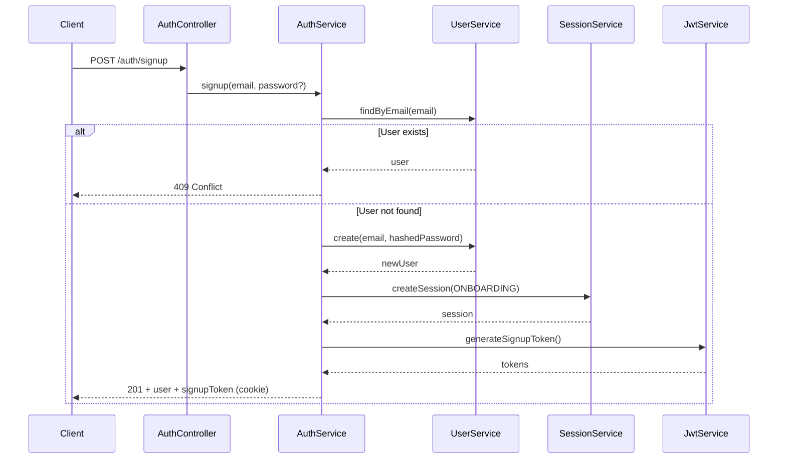
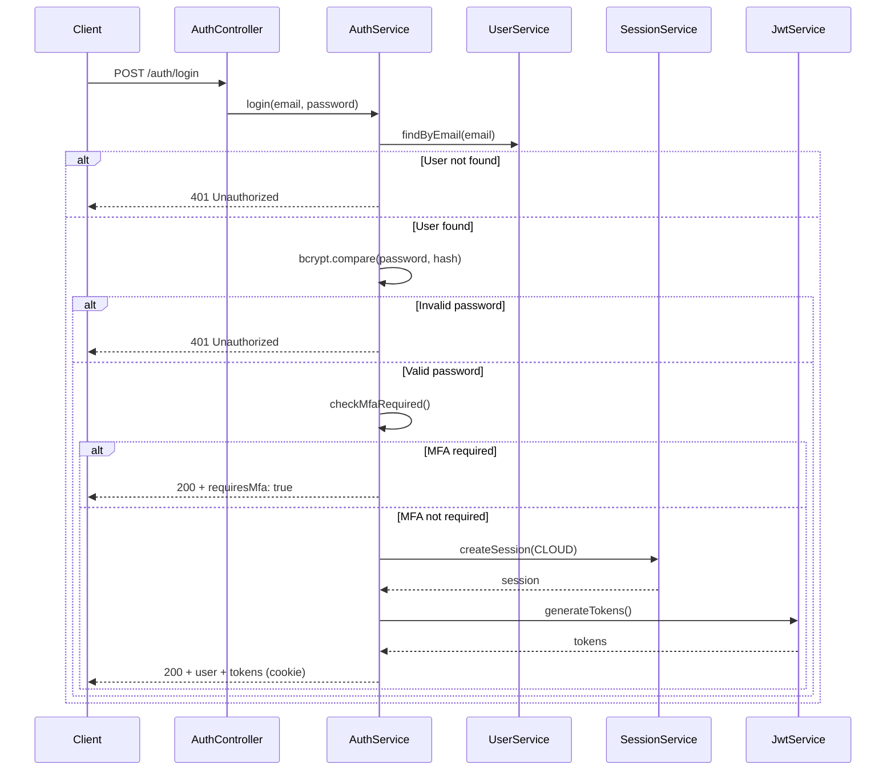

## Overview

<Info>
**Implemented in:** vritti-api-nexus
**Last Updated:** January 2026
**Status:** Production
</Info>

The signup and login flows form the foundation of Vritti's authentication system. Both flows use JWT tokens with secure cookie storage and integrate with the multi-step onboarding process.

## What It Does

**Signup:**
- Creates a new user account with email
- Hashes password using bcrypt (10 salt rounds)
- Initiates the onboarding flow with `PENDING_VERIFICATION` status
- Creates an `ONBOARDING` session with 10-minute expiry
- Returns signup token for onboarding continuation

**Login:**
- Validates email/password credentials
- Checks MFA requirements before issuing tokens
- Creates a `CLOUD` session with configurable expiry
- Returns access/refresh token pair with token binding

## Where It's Used

| Location | Purpose |
|----------|---------|
| `vritti-api-nexus/src/modules/cloud-api/auth/auth.controller.ts` | Auth endpoints |
| `vritti-api-nexus/src/modules/cloud-api/auth/services/auth.service.ts` | Core auth logic |
| `vritti-api-nexus/src/modules/cloud-api/auth/services/session.service.ts` | Session management |
| `vritti-api-nexus/src/modules/cloud-api/auth/services/jwt-auth.service.ts` | Token generation |
| `vritti-auth/src/pages/SignupPage.tsx` | Frontend signup form |
| `vritti-auth/src/pages/LoginPage.tsx` | Frontend login form |

## Signup Flow

### Flow Diagram



### Endpoint

```http
POST /cloud-api/auth/signup
Content-Type: application/json

{
  "email": "user@example.com",
  "password": "SecurePass123!"  // Optional for OAuth users
}
```

### Response

```json
{
  "user": {
    "id": "usr_abc123",
    "email": "user@example.com",
    "accountStatus": "PENDING_VERIFICATION",
    "onboardingStep": "EMAIL_VERIFICATION",
    "emailVerified": false,
    "phoneVerified": false
  },
  "tokens": {
    "accessToken": "eyJhbGciOiJIUzI1NiIs...",
    "expiresIn": 600  // 10 minutes for onboarding
  }
}
```

The signup token is also set as an httpOnly cookie for secure storage.

### Implementation

```typescript
// auth.service.ts
@Injectable()
export class AuthService {
  async signup(dto: SignupDto): Promise<AuthResponse> {
    // 1. Check for existing user
    const existingUser = await this.userService.findByEmail(dto.email);
    if (existingUser) {
      throw new ConflictException('Email already registered');
    }

    // 2. Hash password if provided
    let passwordHash: string | undefined;
    if (dto.password) {
      passwordHash = await bcrypt.hash(dto.password, 10);
    }

    // 3. Create user with pending status
    const user = await this.userService.create({
      email: dto.email.toLowerCase(),
      passwordHash,
      accountStatus: 'PENDING_VERIFICATION',
      onboardingStep: 'EMAIL_VERIFICATION',
    });

    // 4. Create onboarding session (10 min expiry)
    const session = await this.sessionService.create({
      userId: user.id,
      type: 'ONBOARDING',
      expiresAt: addMinutes(new Date(), 10),
    });

    // 5. Generate signup token
    const tokens = await this.jwtService.generateSignupToken(user, session);

    return { user, tokens };
  }
}
```

### Password Requirements

Passwords must meet these requirements (validated by `class-validator`):

```typescript
// signup.dto.ts
export class SignupDto {
  @IsEmail()
  email: string;

  @IsOptional()
  @IsString()
  @MinLength(8)
  @Matches(
    /^(?=.*[a-z])(?=.*[A-Z])(?=.*\d)(?=.*[@$!%*?&])[A-Za-z\d@$!%*?&]+$/,
    {
      message: 'Password must contain uppercase, lowercase, number, and special character',
    }
  )
  password?: string;
}
```

| Requirement | Rule |
|-------------|------|
| Minimum length | 8 characters |
| Uppercase | At least 1 |
| Lowercase | At least 1 |
| Number | At least 1 |
| Special character | At least 1 (`@$!%*?&`) |

## Login Flow

### Flow Diagram



### Endpoint

```http
POST /cloud-api/auth/login
Content-Type: application/json

{
  "email": "user@example.com",
  "password": "SecurePass123!"
}
```

### Response (Success - No MFA)

```json
{
  "user": {
    "id": "usr_abc123",
    "email": "user@example.com",
    "accountStatus": "ACTIVE",
    "onboardingStep": "COMPLETE",
    "emailVerified": true,
    "phoneVerified": true
  },
  "tokens": {
    "accessToken": "eyJhbGciOiJIUzI1NiIs...",
    "expiresIn": 900  // 15 minutes
  }
}
```

The refresh token is set as an httpOnly cookie (not in response body).

### Response (MFA Required)

```json
{
  "requiresMfa": true,
  "mfaToken": "eyJhbGciOiJIUzI1NiIs...",
  "availableMethods": ["totp", "passkey"]
}
```

The client must complete MFA verification at `/mfa/totp/verify` or `/mfa/passkey/verify`.

### Implementation

```typescript
// auth.service.ts
async login(dto: LoginDto): Promise<AuthResponse | MfaRequiredResponse> {
  // 1. Find user
  const user = await this.userService.findByEmail(dto.email);
  if (!user) {
    throw new UnauthorizedException('Invalid credentials');
  }

  // 2. Verify password
  const isValid = await bcrypt.compare(dto.password, user.passwordHash);
  if (!isValid) {
    throw new UnauthorizedException('Invalid credentials');
  }

  // 3. Check account status
  if (user.accountStatus !== 'ACTIVE') {
    throw new UnauthorizedException('Account not active');
  }

  // 4. Check MFA requirement
  if (user.mfaEnabled) {
    const mfaToken = await this.jwtService.generateMfaToken(user);
    const methods = await this.mfaService.getEnabledMethods(user.id);
    return {
      requiresMfa: true,
      mfaToken,
      availableMethods: methods,
    };
  }

  // 5. Create session and generate tokens
  const session = await this.sessionService.create({
    userId: user.id,
    type: 'CLOUD',
    expiresAt: addDays(new Date(), 30),
  });

  const tokens = await this.jwtService.generateTokens(user, session);

  return { user, tokens };
}
```

## Session Types

| Type | Purpose | Default Expiry | Use Case |
|------|---------|----------------|----------|
| `ONBOARDING` | Signup/verification | 10 minutes | User completing onboarding steps |
| `CLOUD` | Full access | 30 days | Authenticated user sessions |

```typescript
// session.service.ts
async create(input: CreateSessionInput): Promise<Session> {
  const session = await this.sessionRepository.create({
    id: generateSessionId(),
    userId: input.userId,
    type: input.type,
    refreshToken: generateSecureToken(),
    expiresAt: input.expiresAt,
    lastUsedAt: new Date(),
  });

  return session;
}
```

## Cookie Configuration

Tokens are stored in httpOnly cookies for security:

```typescript
// jwt-auth.service.ts
setRefreshTokenCookie(reply: FastifyReply, refreshToken: string): void {
  reply.setCookie('refreshToken', refreshToken, {
    httpOnly: true,
    secure: process.env.NODE_ENV === 'production',
    sameSite: 'lax',
    path: '/cloud-api/auth',
    maxAge: 30 * 24 * 60 * 60, // 30 days
  });
}

setSignupTokenCookie(reply: FastifyReply, signupToken: string): void {
  reply.setCookie('signupToken', signupToken, {
    httpOnly: true,
    secure: process.env.NODE_ENV === 'production',
    sameSite: 'lax',
    path: '/cloud-api/onboarding',
    maxAge: 10 * 60, // 10 minutes
  });
}
```

## Error Handling

### Common Errors

| Status | Error | Cause |
|--------|-------|-------|
| 400 | Validation failed | Invalid email format or password requirements |
| 401 | Invalid credentials | Wrong email/password combination |
| 401 | Account not active | User hasn't completed onboarding |
| 409 | Email already registered | Duplicate signup attempt |
| 429 | Too many requests | Rate limit exceeded |

### Error Response Format

```json
{
  "statusCode": 401,
  "message": "Invalid credentials",
  "error": "Unauthorized",
  "timestamp": "2026-01-15T10:30:00Z"
}
```

## Frontend Integration

### Signup Form

```typescript
// vritti-auth/src/pages/SignupPage.tsx
const handleSignup = async (data: SignupFormData) => {
  try {
    const response = await api.post('/auth/signup', {
      email: data.email,
      password: data.password,
    });

    // Store access token in memory
    setAccessToken(response.data.tokens.accessToken);

    // Redirect to onboarding
    navigate('/onboarding/verify-email');
  } catch (error) {
    if (error.response?.status === 409) {
      setError('email', { message: 'Email already registered' });
    }
  }
};
```

### Login Form

```typescript
// vritti-auth/src/pages/LoginPage.tsx
const handleLogin = async (data: LoginFormData) => {
  try {
    const response = await api.post('/auth/login', {
      email: data.email,
      password: data.password,
    });

    if (response.data.requiresMfa) {
      // Store MFA token and redirect
      setMfaToken(response.data.mfaToken);
      navigate('/login/mfa', {
        state: { methods: response.data.availableMethods },
      });
      return;
    }

    // Store access token and redirect
    setAccessToken(response.data.tokens.accessToken);
    navigate('/dashboard');
  } catch (error) {
    setError('password', { message: 'Invalid email or password' });
  }
};
```

## Security Considerations

<CardGroup cols={2}>
  <Card title="Password Hashing" icon="lock">
    bcrypt with 10 salt rounds ensures passwords are securely stored
  </Card>
  <Card title="Token Binding" icon="link">
    Access tokens contain SHA-256 hash of refresh token for binding validation
  </Card>
  <Card title="httpOnly Cookies" icon="cookie">
    Refresh tokens stored in httpOnly cookies prevent XSS attacks
  </Card>
  <Card title="Rate Limiting" icon="gauge">
    Login attempts are rate-limited to prevent brute force attacks
  </Card>
</CardGroup>

## Troubleshooting

<Accordion title="401 Unauthorized on login">
  **Causes:**
  - Wrong email/password combination
  - User hasn't completed onboarding (`accountStatus` !== 'ACTIVE')
  - Password not set (OAuth-only user)

  **Solution:**
  - Verify credentials are correct
  - Check user's `accountStatus` in database
  - For OAuth users, use OAuth login flow instead
</Accordion>

<Accordion title="409 Conflict on signup">
  **Cause:** Email already exists in database

  **Solution:**
  - Use login flow instead
  - If user forgot password, implement password reset flow
  - Check for case sensitivity issues (emails are lowercased)
</Accordion>

<Accordion title="Signup token expires too quickly">
  **Cause:** ONBOARDING sessions have 10-minute expiry

  **Solution:**
  - Implement token refresh for onboarding flow
  - Guide users to complete verification promptly
  - Allow re-sending verification email which creates new session
</Accordion>

<Accordion title="MFA prompt not appearing">
  **Cause:** User's `mfaEnabled` flag is false

  **Solution:**
  - Verify user completed 2FA setup in onboarding
  - Check `mfaEnabled` field in users table
  - Ensure at least one MFA method is configured
</Accordion>

## Related Documentation

<CardGroup cols={2}>
  <Card title="JWT Sessions" icon="key" href="/features/auth/jwt-sessions">
    Token structure and session management
  </Card>
  <Card title="Token Refresh" icon="rotate" href="/features/auth/token-refresh">
    Access token renewal and rotation
  </Card>
  <Card title="MFA" icon="shield" href="/features/mfa">
    Multi-factor authentication setup and verification
  </Card>
  <Card title="Onboarding" icon="list-check" href="/features/onboarding/flow-overview">
    Multi-step user onboarding process
  </Card>
</CardGroup>
