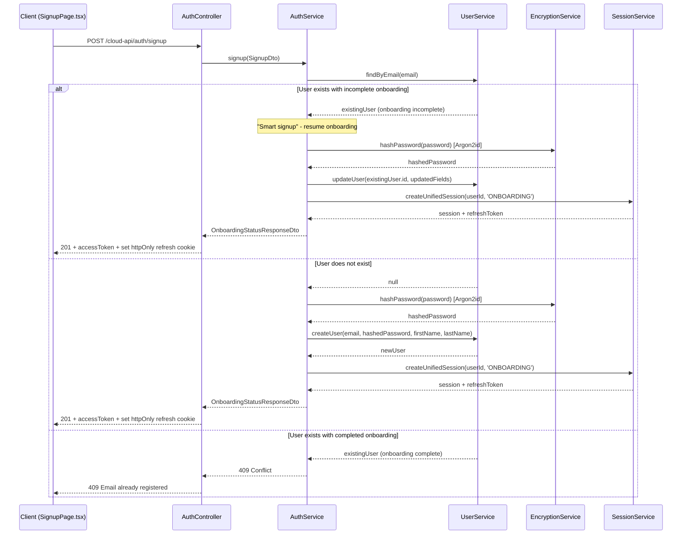
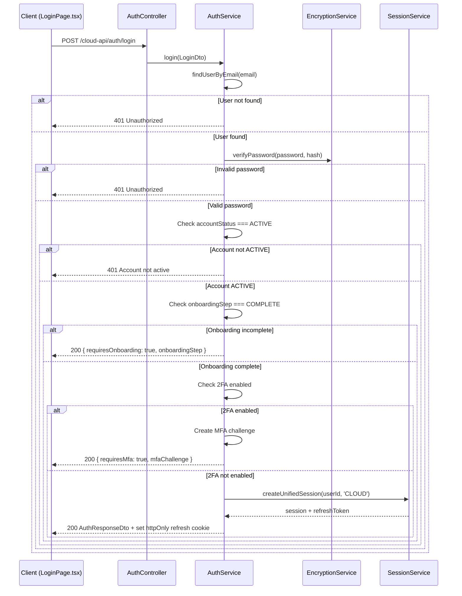
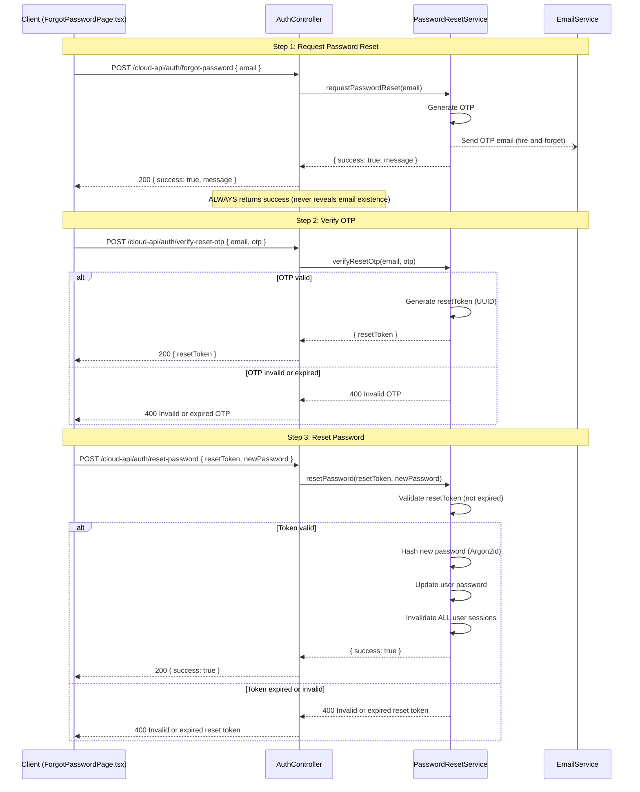
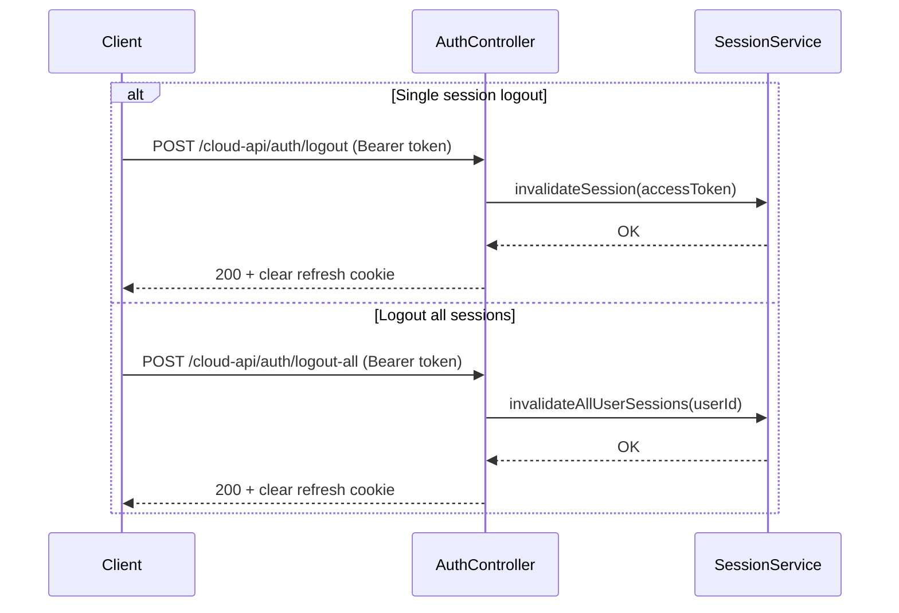

## Overview

<Info>
**Implemented in:** vritti-api-nexus (backend), vritti-auth (frontend)
**Last Updated:** January 2026
**Status:** Production
</Info>

Vritti's authentication system provides five core flows: **signup**, **login**, **password reset**, **logout**, and **auth status**. All flows use JWT access tokens with httpOnly refresh token cookies, Argon2id password hashing via `EncryptionService`, and integrate with the unified session system.

## Where It's Used

| Location | Purpose |
|----------|---------|
| `vritti-api-nexus/src/modules/cloud-api/auth/auth.controller.ts` | Auth endpoints |
| `vritti-api-nexus/src/modules/cloud-api/auth/services/auth.service.ts` | Core auth logic (signup, login) |
| `vritti-api-nexus/src/modules/cloud-api/auth/services/password-reset.service.ts` | Password reset logic |
| `vritti-api-nexus/src/modules/cloud-api/auth/services/session.service.ts` | Unified session management |
| `vritti-api-nexus/src/modules/cloud-api/auth/services/encryption.service.ts` | Argon2id password hashing |
| `vritti-auth/src/pages/SignupPage.tsx` | Frontend signup form |
| `vritti-auth/src/pages/LoginPage.tsx` | Frontend login form |
| `vritti-auth/src/pages/ForgotPasswordPage.tsx` | Frontend password reset (multi-step) |
| `vritti-auth/src/services/auth.service.ts` | Frontend auth API calls |

---

## Signup

### Endpoint

```http
POST /cloud-api/auth/signup
Content-Type: application/json
```

### Flow Diagram



### Request DTO — `SignupDto`

| Field | Type | Required | Validation |
|-------|------|----------|------------|
| `email` | `string` | Yes | Must be a valid email address |
| `password` | `string` | Yes | Min 8 chars, must match password regex |
| `firstName` | `string` | Yes | Non-empty string |
| `lastName` | `string` | Yes | Non-empty string |

### Password Requirements

Passwords are validated against the following regex:

```
^(?=.*[a-z])(?=.*[A-Z])(?=.*\d)(?=.*[^A-Za-z0-9])
```

| Requirement | Rule |
|-------------|------|
| Minimum length | 8 characters |
| Lowercase letter | At least 1 (`a-z`) |
| Uppercase letter | At least 1 (`A-Z`) |
| Digit | At least 1 (`0-9`) |
| Special character | At least 1 (any character that is not `A-Z`, `a-z`, or `0-9`) |

<Warning>
Passwords are hashed using **Argon2id** via `EncryptionService`, not bcrypt. Argon2id is the recommended algorithm for password hashing as it provides resistance against both GPU and side-channel attacks.
</Warning>

### Request Example

```json
{
  "email": "user@example.com",
  "password": "SecurePass123!",
  "firstName": "Jane",
  "lastName": "Doe"
}
```

### Response — `OnboardingStatusResponseDto`

```json
{
  "accessToken": "eyJhbGciOiJIUzI1NiIs...",
  "expiresIn": 600,
  "currentStep": "EMAIL_VERIFICATION",
  "isNewUser": true,
  "signupMethod": "EMAIL",
  "userId": "usr_abc123",
  "email": "user@example.com",
  "firstName": "Jane",
  "lastName": "Doe",
  "onboardingComplete": false,
  "accountStatus": "PENDING_VERIFICATION",
  "emailVerified": false,
  "phoneVerified": false
}
```

| Field | Type | Description |
|-------|------|-------------|
| `accessToken` | `string` | JWT access token for onboarding requests |
| `expiresIn` | `number` | Token expiry in seconds |
| `currentStep` | `string` | Current onboarding step the user should resume from |
| `isNewUser` | `boolean` | `true` if account was just created, `false` if resuming |
| `signupMethod` | `string` | How the user signed up (e.g., `"EMAIL"`) |
| `userId` | `string` | The user's unique identifier |
| `email` | `string` | The user's email address |
| `firstName` | `string` | The user's first name |
| `lastName` | `string` | The user's last name |
| `onboardingComplete` | `boolean` | Whether onboarding is finished |
| `accountStatus` | `string` | Current account status |
| `emailVerified` | `boolean` | Whether email has been verified |
| `phoneVerified` | `boolean` | Whether phone has been verified |

The refresh token is set as an **httpOnly cookie** (it is not included in the response body).

### Smart Signup Logic

The signup endpoint implements "smart signup" behavior:

1. If a user with the given email **does not exist**, a new account is created.
2. If a user with the given email **exists but has incomplete onboarding**, the existing account is resumed (not duplicated). The user's details are updated and a new onboarding session is created.
3. If a user with the given email **exists and has completed onboarding**, a `409 Conflict` error is returned.

This prevents abandoned signups from blocking the email address permanently.

### Frontend Integration

```typescript
// vritti-auth/src/pages/SignupPage.tsx
const handleSignup = async (data: SignupFormData) => {
  try {
    const response = await authService.signup({
      email: data.email,
      password: data.password,
      firstName: data.firstName,
      lastName: data.lastName,
    });

    // Store access token in memory and schedule refresh
    storeToken(response.accessToken);
    scheduleTokenRefresh(response.expiresIn);

    // Navigate to signup success / onboarding
    navigate('/signup-success');
  } catch (error) {
    if (error.response?.status === 409) {
      setError('email', { message: 'Email already registered' });
    }
  }
};
```

---

## Login

### Endpoint

```http
POST /cloud-api/auth/login
Content-Type: application/json
```

### Flow Diagram



### Request DTO — `LoginDto`

| Field | Type | Required | Validation |
|-------|------|----------|------------|
| `email` | `string` | Yes | Must be a valid email address |
| `password` | `string` | Yes | Non-empty string |

### Request Example

```json
{
  "email": "user@example.com",
  "password": "SecurePass123!"
}
```

### Response — `AuthResponseDto`

The response shape varies depending on the login outcome.

**Success (no MFA, onboarding complete):**

```json
{
  "accessToken": "eyJhbGciOiJIUzI1NiIs...",
  "expiresIn": 900,
  "user": {
    "id": "usr_abc123",
    "email": "user@example.com",
    "accountStatus": "ACTIVE",
    "emailVerified": true,
    "phoneVerified": true
  }
}
```

**MFA Required (user has 2FA enabled):**

```json
{
  "requiresMfa": true,
  "mfaChallenge": {
    "sessionId": "mfa_sess_xyz789",
    "availableMethods": ["totp", "sms"],
    "defaultMethod": "totp",
    "maskedPhone": "+1****5678"
  }
}
```

**Onboarding Incomplete:**

```json
{
  "requiresOnboarding": true,
  "onboardingStep": "PHONE_VERIFICATION"
}
```

### Response DTO Fields

| Field | Type | Presence | Description |
|-------|------|----------|-------------|
| `accessToken` | `string` | On success | JWT access token |
| `expiresIn` | `number` | On success | Token expiry in seconds |
| `user` | `object` | On success | User profile information |
| `requiresOnboarding` | `boolean` | When onboarding incomplete | Indicates user must complete onboarding |
| `onboardingStep` | `string` | When onboarding incomplete | The step the user needs to resume |
| `requiresMfa` | `boolean` | When 2FA enabled | Indicates MFA verification is needed |
| `mfaChallenge` | `object` | When 2FA enabled | MFA challenge details |
| `mfaChallenge.sessionId` | `string` | When 2FA enabled | Session ID for the MFA verification request |
| `mfaChallenge.availableMethods` | `string[]` | When 2FA enabled | List of configured MFA methods |
| `mfaChallenge.defaultMethod` | `string` | When 2FA enabled | The user's preferred MFA method |
| `mfaChallenge.maskedPhone` | `string` | When SMS available | Partially masked phone number |

### Login Steps (Internal)

1. **Find user** by email address.
2. **Verify password** using `EncryptionService.verifyPassword()` (Argon2id).
3. **Check account status** is `ACTIVE`. Reject if not.
4. **Check onboarding step** is `COMPLETE`. If not, return `{ requiresOnboarding: true, onboardingStep }`.
5. **Check 2FA**. If the user has 2FA enabled, create an MFA challenge and return `{ requiresMfa: true, mfaChallenge }`.
6. **Create session**. If no MFA: call `createUnifiedSession(userId, 'CLOUD')`, set refresh token as httpOnly cookie, and return the access token and user data.

### Frontend Integration

```typescript
// vritti-auth/src/pages/LoginPage.tsx
const handleLogin = async (data: LoginFormData) => {
  try {
    const response = await authService.login({
      email: data.email,
      password: data.password,
    });

    if (response.requiresMfa) {
      // Redirect to MFA verification
      navigate('/mfa-verify', {
        state: { mfaChallenge: response.mfaChallenge },
      });
      return;
    }

    if (response.requiresOnboarding) {
      // Redirect to onboarding at the correct step
      navigate('/onboarding', {
        state: { step: response.onboardingStep },
      });
      return;
    }

    // Full login success - hard navigate to app
    window.location.href = '/';
  } catch (error) {
    setError('password', { message: 'Invalid email or password' });
  }
};
```

<Note>
On successful login (no MFA, no onboarding), the frontend uses `window.location.href = '/'` instead of client-side navigation. This triggers a full page load to ensure the main application picks up the new session cookies.
</Note>

---

## Password Reset

Password reset is a **three-step flow** that uses OTP verification and a time-limited reset token.

### Flow Diagram



### Step 1: Request Password Reset

```http
POST /cloud-api/auth/forgot-password
Content-Type: application/json
```

**Request — `ForgotPasswordDto`:**

| Field | Type | Required | Description |
|-------|------|----------|-------------|
| `email` | `string` | Yes | The email address to send the reset OTP to |

```json
{
  "email": "user@example.com"
}
```

**Response:**

```json
{
  "success": true,
  "message": "If an account with that email exists, a password reset code has been sent."
}
```

<Warning>
This endpoint **always** returns `{ success: true }` regardless of whether the email exists in the system. This is a deliberate security measure to prevent email enumeration attacks.
</Warning>

The OTP email is sent asynchronously (fire-and-forget) so the response is not delayed by email delivery.

### Step 2: Verify OTP

```http
POST /cloud-api/auth/verify-reset-otp
Content-Type: application/json
```

**Request — `VerifyResetOtpDto`:**

| Field | Type | Required | Description |
|-------|------|----------|-------------|
| `email` | `string` | Yes | The email address used in step 1 |
| `otp` | `string` | Yes | The OTP code received via email |

```json
{
  "email": "user@example.com",
  "otp": "482917"
}
```

**Response:**

```json
{
  "resetToken": "a1b2c3d4-e5f6-7890-abcd-ef1234567890"
}
```

The `resetToken` is a UUID that is valid for **10 minutes** after OTP verification (`RESET_TOKEN_EXPIRY_MINUTES = 10`).

### Step 3: Reset Password

```http
POST /cloud-api/auth/reset-password
Content-Type: application/json
```

**Request — `ResetPasswordDto`:**

| Field | Type | Required | Description |
|-------|------|----------|-------------|
| `resetToken` | `string` | Yes | The UUID token received from step 2 |
| `newPassword` | `string` | Yes | The new password (must meet password requirements) |

```json
{
  "resetToken": "a1b2c3d4-e5f6-7890-abcd-ef1234567890",
  "newPassword": "NewSecurePass456!"
}
```

**Response:**

```json
{
  "success": true
}
```

<Warning>
When a password is successfully reset, **all existing sessions for the user are invalidated**. The user must log in again on all devices.
</Warning>

### Frontend Integration

The `ForgotPasswordPage.tsx` component implements a multi-step form with four states:

| Step | Component | Description |
|------|-----------|-------------|
| 1 | `EmailStep` | User enters their email address |
| 2 | `OtpStep` | User enters the OTP received via email |
| 3 | `ResetPasswordStep` | User enters and confirms new password |
| 4 | `SuccessStep` | Confirmation message with link to login |

---

## Logout

### Single Session Logout

```http
POST /cloud-api/auth/logout
Authorization: Bearer <accessToken>
```

- **Auth required:** Yes (`VrittiAuthGuard`)
- Calls `invalidateSession(accessToken)` to invalidate the current session only
- Clears the refresh token httpOnly cookie

**Response:**

```json
{
  "success": true
}
```

### Logout All Sessions

```http
POST /cloud-api/auth/logout-all
Authorization: Bearer <accessToken>
```

- **Auth required:** Yes (`VrittiAuthGuard`)
- Calls `invalidateAllUserSessions(userId)` to invalidate every session for the user across all devices

**Response:**

```json
{
  "success": true
}
```

### Logout Flow Diagram



---

## Auth Status

### Endpoint

```http
GET /cloud-api/auth/me
```

<Note>
This is a **public endpoint**. It never returns a `401` status code. If the user is not authenticated, it returns `{ isAuthenticated: false }`.
</Note>

### Response — `AuthStatusResponseDto`

**Authenticated:**

```json
{
  "isAuthenticated": true,
  "user": {
    "id": "usr_abc123",
    "email": "user@example.com",
    "firstName": "Jane",
    "lastName": "Doe"
  },
  "accessToken": "eyJhbGciOiJIUzI1NiIs...",
  "expiresIn": 900
}
```

**Not authenticated:**

```json
{
  "isAuthenticated": false
}
```

| Field | Type | Presence | Description |
|-------|------|----------|-------------|
| `isAuthenticated` | `boolean` | Always | Whether the user has a valid session |
| `user` | `object` | When authenticated | User profile data |
| `accessToken` | `string` | When authenticated | Current or refreshed access token |
| `expiresIn` | `number` | When authenticated | Token expiry in seconds |

### Session Recovery

If the access token has expired but a valid refresh token exists in the httpOnly cookie, the `/me` endpoint will **recover the session** by issuing a new access token from the cookie. This allows the frontend to silently restore authentication state on page load.

### Frontend Integration

The `AuthProvider` in the web-nexus application calls this endpoint on mount via the `useUser` hook to establish the initial authentication state:

```typescript
// web-nexus AuthProvider
const { data, isLoading } = useUser(); // calls GET /cloud-api/auth/me

if (isLoading) return <LoadingSpinner />;
if (!data.isAuthenticated) return <RedirectToLogin />;
```

---

## Session Types

| Type | Purpose | Use Case |
|------|---------|----------|
| `ONBOARDING` | Signup / verification | User is completing onboarding steps after signup |
| `CLOUD` | Full access | Authenticated user with completed onboarding |

---

## Error Handling

### Common Errors

| Status | Error | Endpoint | Cause |
|--------|-------|----------|-------|
| 400 | Validation failed | All | Invalid email format, password too weak, missing fields |
| 400 | Invalid or expired OTP | `verify-reset-otp` | OTP is wrong or has expired |
| 400 | Invalid or expired reset token | `reset-password` | Reset token has expired (>10 min) or is invalid |
| 401 | Invalid credentials | `login` | Wrong email/password combination |
| 401 | Account not active | `login` | User account status is not `ACTIVE` |
| 409 | Email already registered | `signup` | User with completed onboarding already exists |
| 429 | Too many requests | All | Rate limit exceeded |

### Error Response Format

```json
{
  "statusCode": 401,
  "message": "Invalid credentials",
  "error": "Unauthorized",
  "timestamp": "2026-01-15T10:30:00Z"
}
```

---

## Security Considerations

<CardGroup cols={2}>
  <Card title="Argon2id Hashing" icon="lock">
    Passwords are hashed using Argon2id via EncryptionService, providing resistance against GPU and side-channel attacks.
  </Card>
  <Card title="httpOnly Cookies" icon="cookie">
    Refresh tokens are stored in httpOnly cookies, preventing access from JavaScript and mitigating XSS attacks.
  </Card>
  <Card title="Email Enumeration Prevention" icon="eye-slash">
    The forgot-password endpoint always returns success, preventing attackers from discovering valid email addresses.
  </Card>
  <Card title="Session Invalidation on Reset" icon="ban">
    Password reset invalidates all sessions across all devices, ensuring compromised sessions cannot persist.
  </Card>
  <Card title="Time-Limited Reset Tokens" icon="clock">
    Reset tokens expire 10 minutes after OTP verification, minimizing the window for token misuse.
  </Card>
  <Card title="Rate Limiting" icon="gauge">
    Login and password reset endpoints are rate-limited to prevent brute force and abuse.
  </Card>
</CardGroup>

---

## Troubleshooting

<Accordion title="401 Unauthorized on login">
  **Causes:**
  - Wrong email/password combination
  - User account status is not `ACTIVE`
  - Password not set (OAuth-only user attempting credential login)

  **Solution:**
  - Verify credentials are correct
  - Check user's `accountStatus` in database
  - For OAuth users, use the OAuth login flow instead
</Accordion>

<Accordion title="Login returns requiresOnboarding instead of tokens">
  **Cause:** The user's onboarding step is not `COMPLETE`. They signed up but did not finish all onboarding steps.

  **Solution:**
  - The frontend should redirect to the onboarding flow at the returned `onboardingStep`
  - Check the user's `onboardingStep` field in the database
</Accordion>

<Accordion title="409 Conflict on signup">
  **Cause:** A user with that email already exists and has completed onboarding.

  **Solution:**
  - Use the login flow instead
  - If the user forgot their password, use the password reset flow
  - Note: if the user exists but has incomplete onboarding, smart signup will resume instead of returning 409
</Accordion>

<Accordion title="Reset token expired">
  **Cause:** More than 10 minutes elapsed between OTP verification (step 2) and password reset (step 3).

  **Solution:**
  - Restart the password reset flow from step 1
  - Instruct users to complete the reset promptly after receiving the OTP
</Accordion>

<Accordion title="MFA challenge returned on login but user did not set up 2FA">
  **Cause:** The user's 2FA flag is enabled in the database, possibly set during onboarding.

  **Solution:**
  - Verify the user actually completed 2FA setup
  - Check `mfaEnabled` and configured MFA methods in the database
</Accordion>

<Accordion title="Auth status returns isAuthenticated: false unexpectedly">
  **Cause:** Both the access token and the refresh token cookie are invalid or expired.

  **Solution:**
  - Check that the httpOnly refresh cookie is being sent with the request
  - Verify the session has not been invalidated (e.g., by logout-all or password reset)
  - Ensure cookie domain and path settings match the request URL
</Accordion>

---

## Related Documentation

<CardGroup cols={2}>
  <Card title="JWT Sessions" icon="key" href="/features/auth/jwt-sessions">
    Token structure, unified sessions, and session management internals
  </Card>
  <Card title="Token Refresh" icon="rotate" href="/features/auth/token-refresh">
    Access token renewal, refresh rotation, and silent refresh
  </Card>
  <Card title="MFA" icon="shield" href="/features/mfa">
    Multi-factor authentication setup and verification flows
  </Card>
  <Card title="Onboarding" icon="list-check" href="/features/onboarding/flow-overview">
    Multi-step user onboarding process after signup
  </Card>
</CardGroup>
