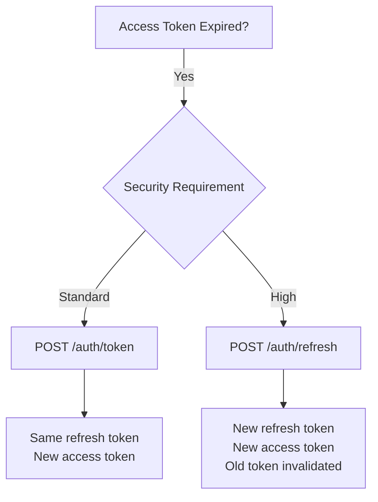
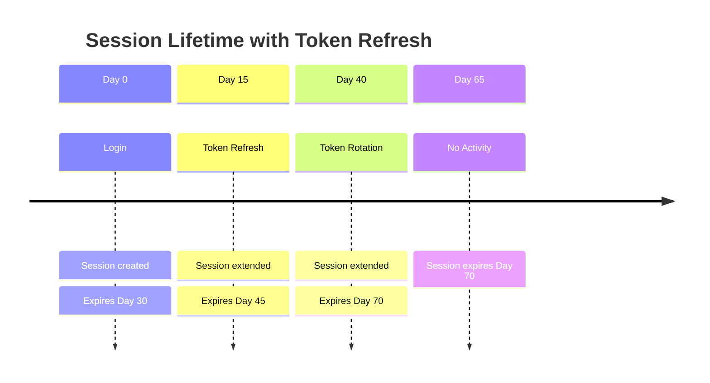
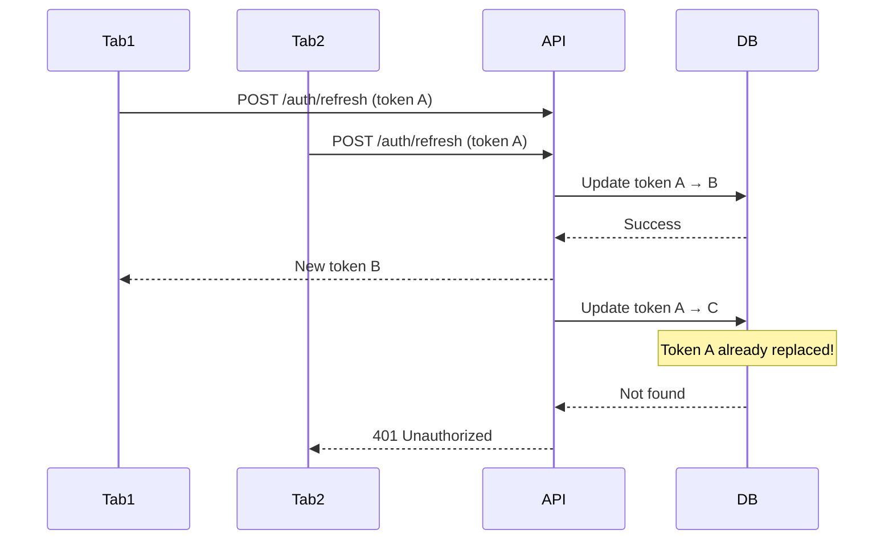

## Overview

<Info>
**Implemented in:** vritti-api-nexus
**Last Updated:** January 2026
**Status:** Production
</Info>

Token refresh allows clients to obtain new access tokens without re-authentication. Vritti supports two strategies: simple token refresh (same refresh token) and full token rotation (new refresh token issued).

## What It Does

- Renews expired access tokens using valid refresh tokens
- Supports optional refresh token rotation for enhanced security
- Extends session lifetime on each refresh
- Validates session status and token binding
- Handles concurrent refresh requests safely

## Refresh Strategies

| Strategy | Endpoint | Refresh Token | Use Case |
|----------|----------|---------------|----------|
| Token Refresh | `POST /auth/token` | Same | Quick access token renewal |
| Token Rotation | `POST /auth/refresh` | New | Enhanced security, mobile apps |

### When to Use Each



## Token Refresh (Same Token)

### Endpoint

```http
POST /cloud-api/auth/token
Cookie: refreshToken=<token>
```

No request body needed - the refresh token comes from the httpOnly cookie.

### Response

```json
{
  "accessToken": "eyJhbGciOiJIUzI1NiIs...",
  "expiresIn": 900
}
```

### Implementation

```typescript
// auth.controller.ts
@Post('token')
@Public()  // No access token required
@HttpCode(HttpStatus.OK)
async refreshAccessToken(
  @Req() request: FastifyRequest,
  @Res({ passthrough: true }) reply: FastifyReply,
): Promise<TokenResponse> {
  const refreshToken = request.cookies['refreshToken'];

  if (!refreshToken) {
    throw new UnauthorizedException('Refresh token not found');
  }

  return this.authService.refreshAccessToken(refreshToken);
}

// auth.service.ts
async refreshAccessToken(refreshToken: string): Promise<TokenResponse> {
  // 1. Find session by refresh token
  const session = await this.sessionService.findByRefreshToken(refreshToken);

  if (!session) {
    throw new UnauthorizedException('Invalid refresh token');
  }

  // 2. Check session expiry
  if (new Date() > session.expiresAt) {
    await this.sessionService.invalidate(session.id);
    throw new UnauthorizedException('Session expired');
  }

  // 3. Get user
  const user = await this.userService.findById(session.userId);
  if (!user) {
    throw new UnauthorizedException('User not found');
  }

  // 4. Generate new access token (same refresh token)
  const tokens = await this.jwtService.generateTokens(user, session);

  // 5. Update session last used
  await this.sessionService.updateLastUsed(session.id);

  return tokens;
}
```

### Use Cases

- **Web applications**: Quick token refresh without cookie changes
- **SPA refresh**: Background token refresh before expiry
- **Low-risk operations**: When refresh token theft risk is low

## Token Rotation (New Token)

### Endpoint

```http
POST /cloud-api/auth/refresh
Cookie: refreshToken=<token>
```

### Response

```json
{
  "accessToken": "eyJhbGciOiJIUzI1NiIs...",
  "expiresIn": 900
}
```

The new refresh token is set in the httpOnly cookie (not in response body).

### Implementation

```typescript
// auth.controller.ts
@Post('refresh')
@Public()
@HttpCode(HttpStatus.OK)
async rotateTokens(
  @Req() request: FastifyRequest,
  @Res({ passthrough: true }) reply: FastifyReply,
): Promise<TokenResponse> {
  const refreshToken = request.cookies['refreshToken'];

  if (!refreshToken) {
    throw new UnauthorizedException('Refresh token not found');
  }

  const result = await this.authService.rotateTokens(refreshToken);

  // Set new refresh token cookie
  this.jwtService.setRefreshTokenCookie(reply, result.newRefreshToken);

  return {
    accessToken: result.accessToken,
    expiresIn: result.expiresIn,
  };
}

// auth.service.ts
async rotateTokens(oldRefreshToken: string): Promise<RotationResult> {
  // 1. Find and validate session
  const session = await this.sessionService.findByRefreshToken(oldRefreshToken);

  if (!session) {
    throw new UnauthorizedException('Invalid refresh token');
  }

  if (new Date() > session.expiresAt) {
    await this.sessionService.invalidate(session.id);
    throw new UnauthorizedException('Session expired');
  }

  // 2. Get user
  const user = await this.userService.findById(session.userId);
  if (!user) {
    throw new UnauthorizedException('User not found');
  }

  // 3. Generate new refresh token
  const newRefreshToken = crypto.randomBytes(32).toString('hex');

  // 4. Calculate new expiry (extend session)
  const rotationDays = this.configService.get('REFRESH_TOKEN_ROTATION_DAYS', 7);
  const newExpiresAt = addDays(new Date(), rotationDays);

  // 5. Update session with new refresh token
  await this.sessionService.update(session.id, {
    refreshToken: newRefreshToken,
    expiresAt: newExpiresAt,
    lastUsedAt: new Date(),
  });

  // 6. Generate new access token with new binding
  const updatedSession = { ...session, refreshToken: newRefreshToken };
  const tokens = await this.jwtService.generateTokens(user, updatedSession);

  return {
    accessToken: tokens.accessToken,
    expiresIn: tokens.expiresIn,
    newRefreshToken,
  };
}
```

### Use Cases

- **Mobile apps**: Detect stolen tokens via rotation
- **High-security contexts**: Financial or sensitive operations
- **Long-lived sessions**: Periodic rotation for security

## Automatic Client-Side Refresh

### Axios Interceptor Pattern

```typescript
// utils/api.ts
let isRefreshing = false;
let refreshSubscribers: ((token: string) => void)[] = [];

function subscribeTokenRefresh(callback: (token: string) => void) {
  refreshSubscribers.push(callback);
}

function onTokenRefreshed(token: string) {
  refreshSubscribers.forEach((callback) => callback(token));
  refreshSubscribers = [];
}

api.interceptors.response.use(
  (response) => response,
  async (error) => {
    const originalRequest = error.config;

    // Check if 401 and not already retrying
    if (error.response?.status === 401 && !originalRequest._retry) {
      if (isRefreshing) {
        // Wait for ongoing refresh
        return new Promise((resolve) => {
          subscribeTokenRefresh((token) => {
            originalRequest.headers.Authorization = `Bearer ${token}`;
            resolve(api(originalRequest));
          });
        });
      }

      originalRequest._retry = true;
      isRefreshing = true;

      try {
        const response = await api.post('/auth/token');
        const { accessToken } = response.data;

        // Update stored token
        setAccessToken(accessToken);

        // Notify waiting requests
        onTokenRefreshed(accessToken);

        // Retry original request
        originalRequest.headers.Authorization = `Bearer ${accessToken}`;
        return api(originalRequest);
      } catch (refreshError) {
        // Refresh failed - redirect to login
        clearTokens();
        window.location.href = '/login';
        return Promise.reject(refreshError);
      } finally {
        isRefreshing = false;
      }
    }

    return Promise.reject(error);
  }
);
```

### Proactive Refresh Pattern

```typescript
// utils/tokenManager.ts
const TOKEN_REFRESH_THRESHOLD = 60; // seconds before expiry

function getTokenExpiry(accessToken: string): number {
  const payload = JSON.parse(atob(accessToken.split('.')[1]));
  return payload.exp * 1000; // Convert to milliseconds
}

function shouldRefreshToken(accessToken: string): boolean {
  const expiry = getTokenExpiry(accessToken);
  const now = Date.now();
  const threshold = TOKEN_REFRESH_THRESHOLD * 1000;

  return expiry - now < threshold;
}

// Check before each request
api.interceptors.request.use(async (config) => {
  const accessToken = getAccessToken();

  if (accessToken && shouldRefreshToken(accessToken)) {
    try {
      const response = await api.post('/auth/token');
      setAccessToken(response.data.accessToken);
      config.headers.Authorization = `Bearer ${response.data.accessToken}`;
    } catch (error) {
      // Continue with current token, let response interceptor handle 401
    }
  }

  return config;
});
```

## Session Extension

### How Session Expiry Extends



### Configuration

```bash
# .env
REFRESH_TOKEN_ROTATION_DAYS=7   # Days to extend on rotation
JWT_REFRESH_EXPIRY=30d          # Initial session length
```

### Extension Logic

```typescript
// session.service.ts
async extendSession(sessionId: string): Promise<void> {
  const rotationDays = this.configService.get('REFRESH_TOKEN_ROTATION_DAYS', 7);
  const newExpiresAt = addDays(new Date(), rotationDays);

  // Only extend if new expiry is later than current
  const session = await this.sessionRepository.findById(sessionId);
  if (session && newExpiresAt > session.expiresAt) {
    await this.sessionRepository.update(sessionId, {
      expiresAt: newExpiresAt,
      lastUsedAt: new Date(),
    });
  }
}
```

## Concurrent Refresh Handling

### Problem: Race Conditions

When multiple tabs/requests try to refresh simultaneously:



### Solution: Rotation Window

```typescript
// session.service.ts
async rotateRefreshToken(
  sessionId: string,
  oldToken: string,
): Promise<string | null> {
  const session = await this.sessionRepository.findById(sessionId);

  // Allow rotation if token matches OR was rotated within window
  const rotationWindow = 10000; // 10 seconds
  const rotationTime = session.lastRotatedAt?.getTime() || 0;
  const withinWindow = Date.now() - rotationTime < rotationWindow;

  if (session.refreshToken !== oldToken && !withinWindow) {
    // Token was rotated and we're outside the grace window
    return null;
  }

  // If within window, return current token instead of rotating again
  if (withinWindow && session.refreshToken !== oldToken) {
    return session.refreshToken;
  }

  // Perform rotation
  const newToken = crypto.randomBytes(32).toString('hex');
  await this.sessionRepository.update(sessionId, {
    refreshToken: newToken,
    lastRotatedAt: new Date(),
  });

  return newToken;
}
```

## Error Handling

### Common Errors

| Status | Error | Cause | Resolution |
|--------|-------|-------|------------|
| 401 | Refresh token not found | Cookie missing/expired | Re-authenticate |
| 401 | Invalid refresh token | Token doesn't exist in DB | Re-authenticate |
| 401 | Session expired | Session past expiry date | Re-authenticate |
| 401 | User not found | User deleted | Contact support |

### Error Response Format

```json
{
  "statusCode": 401,
  "message": "Session expired",
  "error": "Unauthorized",
  "code": "SESSION_EXPIRED"
}
```

### Client-Side Error Handling

```typescript
// Handle refresh errors
async function handleRefreshError(error: AxiosError): Promise<never> {
  const errorCode = error.response?.data?.code;

  switch (errorCode) {
    case 'SESSION_EXPIRED':
    case 'INVALID_REFRESH_TOKEN':
      // Clear local state and redirect
      clearAuthState();
      window.location.href = '/login?reason=session_expired';
      break;

    case 'USER_NOT_FOUND':
      // Account issue - show error
      showError('Your account is no longer available');
      clearAuthState();
      window.location.href = '/login';
      break;

    default:
      // Generic error - try re-login
      window.location.href = '/login';
  }

  throw error;
}
```

## Security Considerations

<Warning>
**Token Refresh Security:**
</Warning>

1. **Never expose refresh tokens in URLs or logs**
2. **Use httpOnly cookies** to prevent XSS access
3. **Implement rotation** for high-security applications
4. **Monitor refresh patterns** for anomaly detection
5. **Limit refresh token lifetime** (30 days max recommended)

### Refresh Token Theft Detection

```typescript
// Detect potential token theft
async validateRefresh(session: Session, request: FastifyRequest): Promise<void> {
  const currentUA = request.headers['user-agent'];
  const currentIP = request.ip;

  // Significant change in client fingerprint
  if (session.userAgent && session.userAgent !== currentUA) {
    this.logger.warn('User agent changed during session', {
      sessionId: session.id,
      originalUA: session.userAgent,
      newUA: currentUA,
    });

    // Optionally require re-authentication
    // throw new UnauthorizedException('Session validation failed');
  }

  // Geographic impossibility (IP geolocation)
  if (this.isGeographicallyImpossible(session.ipAddress, currentIP)) {
    this.logger.warn('Impossible travel detected', {
      sessionId: session.id,
      originalIP: session.ipAddress,
      newIP: currentIP,
    });

    // Invalidate session and require re-auth
    await this.sessionService.invalidate(session.id);
    throw new UnauthorizedException('Session invalidated for security');
  }
}
```

## Troubleshooting

<Accordion title="Token refresh returns 401 immediately after login">
  **Causes:**
  - Cookie not being sent with request
  - Cookie domain/path mismatch

  **Solution:**
  - Verify `withCredentials: true` in axios config
  - Check cookie domain matches API domain
  - Ensure cookie path includes `/auth` endpoints
</Accordion>

<Accordion title="Multiple tabs cause logout">
  **Cause:** Token rotation without grace window

  **Solution:**
  - Implement rotation window (see Concurrent Refresh section)
  - Use token refresh (`/auth/token`) instead of rotation for web apps
  - Coordinate refresh across tabs using BroadcastChannel
</Accordion>

<Accordion title="Session keeps expiring despite activity">
  **Cause:** `lastUsedAt` not being updated

  **Solution:**
  - Verify `updateLastUsed()` is called on token refresh
  - Check for database transaction issues
  - Ensure session extension logic uses later of current/new expiry
</Accordion>

## Related Documentation

<CardGroup cols={2}>
  <Card title="JWT Sessions" icon="key" href="/features/auth/jwt-sessions">
    Token structure and session management
  </Card>
  <Card title="Signup & Login" icon="right-to-bracket" href="/features/auth/signup-login">
    Initial authentication flows
  </Card>
  <Card title="CSRF Protection" icon="lock" href="/features/csrf">
    Cross-site request forgery protection
  </Card>
  <Card title="Guards & Decorators" icon="shield" href="/architecture/backend/guards-decorators">
    Authentication guard implementation
  </Card>
</CardGroup>
