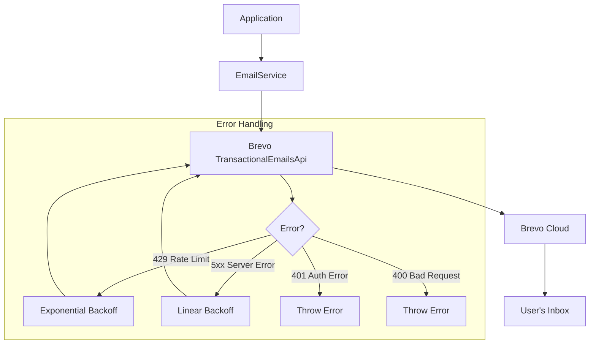

## Overview

<Info>
**Implemented in:** vritti-api-nexus
**Last Updated:** January 2026
**Status:** Production
</Info>

The email service handles transactional emails using Brevo (formerly Sendinblue). It provides email verification and password reset functionality with professionally designed templates, retry logic, and comprehensive error handling.

## What It Does

- Sends 6-digit OTP verification emails during onboarding
- Sends password reset emails for account recovery
- Provides professional, responsive HTML email templates
- Implements retry logic with exponential backoff
- Supports fire-and-forget sending (non-blocking)
- Validates configuration at service startup

## Where It's Used

| Location | Purpose |
|----------|---------|
| `vritti-api-nexus/src/services/email.service.ts` | Core Brevo integration |
| `vritti-api-nexus/src/modules/cloud-api/onboarding/services/email-verification.service.ts` | Email verification flow |
| `vritti-api-nexus/src/services/services.module.ts` | Service registration |
| `vritti-api-nexus/src/config/env.validation.ts` | Configuration validation |

## Architecture



## Email Templates

### Email Verification

Professional template sent during onboarding:

```typescript
// email.service.ts
async sendVerificationEmail(
  email: string,
  otp: string,
  firstName?: string
): Promise<void>
```

**Template Features:**
- Purple gradient OTP display box (#667eea → #764ba2)
- Personalized greeting with user's first name
- Clear 10-minute expiration notice
- Responsive design for all devices
- Plain text fallback included

**Example Email:**
```
Subject: Verify Your Email - Vritti AI Cloud

Hello {firstName},

Thank you for signing up with Vritti AI Cloud.
Please use the following verification code:

╔═══════════════════════╗
║       123456          ║
╚═══════════════════════╝

This code will expire in 10 minutes.
```

### Password Reset

Template for password recovery flow:

```typescript
// email.service.ts
async sendPasswordResetEmail(
  email: string,
  otp: string,
  firstName?: string
): Promise<void>
```

**Template Features:**
- Pink/red gradient OTP box (#f093fb → #f5576c)
- Security warning about not sharing the code
- Clear instructions for reset process
- 15-minute expiration notice

## Implementation

### Service Initialization

```typescript
// email.service.ts
@Injectable()
export class EmailService {
  private readonly brevoApi: TransactionalEmailsApi;
  private readonly senderEmail: string;
  private readonly senderName: string;
  private readonly maxRetries: number = 3;

  constructor(private readonly configService: ConfigService) {
    // Initialize Brevo API client
    this.brevoApi = new TransactionalEmailsApi();
    const apiKey = this.configService.get<string>('BREVO_API_KEY');

    if (!apiKey) {
      throw new Error('Email service configuration error: Missing BREVO_API_KEY');
    }

    this.brevoApi.setApiKey(TransactionalEmailsApiApiKeys.apiKey, apiKey);

    this.senderEmail = this.configService.getOrThrow('SENDER_EMAIL');
    this.senderName = this.configService.getOrThrow('SENDER_NAME');

    this.logger.log('Brevo email service initialized successfully');
  }
}
```

### Sending Emails

```typescript
// email.service.ts
private async sendEmail(
  emailData: {
    to: Array<{ email: string; name?: string }>;
    subject: string;
    htmlContent: string;
    textContent: string;
  },
  attempt: number = 1,
): Promise<void> {
  try {
    const result = await this.brevoApi.sendTransacEmail({
      sender: {
        email: this.senderEmail,
        name: this.senderName,
      },
      to: emailData.to,
      subject: emailData.subject,
      htmlContent: emailData.htmlContent,
      textContent: emailData.textContent,
    });

    this.logger.debug(`Email sent. Message ID: ${result.body.messageId}`);
  } catch (err) {
    // Handle errors with retry logic
    await this.handleSendError(err, emailData, attempt);
  }
}
```

### Error Handling with Retry

```typescript
// email.service.ts
private async handleSendError(err: BrevoError, emailData, attempt: number) {
  const errorStatus = err?.status || err?.response?.status;
  const errorMessage = err?.body?.message || err?.message;

  // Rate limiting - exponential backoff
  if (errorStatus === 429 && attempt < this.maxRetries) {
    const waitTime = 2 ** attempt * 1000;  // 2s, 4s, 8s
    this.logger.warn(`Rate limit. Retrying in ${waitTime}ms (${attempt}/${this.maxRetries})`);
    await this.delay(waitTime);
    return this.sendEmail(emailData, attempt + 1);
  }

  // Authentication errors - throw immediately
  if (errorStatus === 401) {
    this.logger.error('Brevo authentication failed. Check API key.');
    throw new Error('Email service authentication failed');
  }

  // Bad request - throw with details
  if (errorStatus === 400) {
    throw new Error(`Invalid email parameters: ${errorMessage}`);
  }

  // Server errors - linear backoff retry
  if (errorStatus >= 500 && attempt < this.maxRetries) {
    const waitTime = 1000 * attempt;  // 1s, 2s, 3s
    this.logger.warn(`Server error. Retrying in ${waitTime}ms`);
    await this.delay(waitTime);
    return this.sendEmail(emailData, attempt + 1);
  }

  throw new Error(`Email sending failed: ${errorMessage}`);
}
```

### Fire-and-Forget Pattern

Emails are sent asynchronously to avoid blocking API responses:

```typescript
// email-verification.service.ts
async sendVerificationOtp(userId: string, email: string, firstName?: string): Promise<void> {
  // Generate and store OTP first
  const otp = this.otpService.generateOtp();
  const hashedOtp = await this.otpService.hashOtp(otp);
  await this.emailVerificationRepo.create({ userId, email, otp: hashedOtp, expiresAt });

  // Fire and forget - don't block response
  this.emailService
    .sendVerificationEmail(email, otp, firstName)
    .then(() => {
      this.logger.log(`Sent verification email to ${email}`);
    })
    .catch((error) => {
      this.logger.error(`Failed to send email: ${error.message}`);
    });
}
```

## Configuration

### Environment Variables

```bash
# Required - Brevo API key
BREVO_API_KEY=xkeysib-xxxxxxxxxx

# Required - Sender email (must be verified in Brevo)
SENDER_EMAIL=noreply@vritti.io

# Required - Display name for sender
SENDER_NAME=Vritti AI Cloud
```

### Validation Schema

```typescript
// env.validation.ts
@IsString()
BREVO_API_KEY: string;

@IsEmail()
SENDER_EMAIL: string;

@IsString()
SENDER_NAME: string;
```

<Warning>
All three environment variables are **required**. The application will fail to start if any are missing.
</Warning>

## Connection Verification

Verify Brevo connection at application startup:

```typescript
// email.service.ts
async verifyConnection(): Promise<boolean> {
  try {
    // Attempt to send to self (will fail but proves API is reachable)
    await this.brevoApi.sendTransacEmail({
      sender: { email: this.senderEmail, name: this.senderName },
      to: [{ email: this.senderEmail }],
      subject: 'Connection Test',
      htmlContent: '<p>Test</p>',
    });
    return true;
  } catch (err) {
    // 400 means API is reachable (just bad request)
    if (err?.status === 400) return true;
    return false;
  }
}
```

## Retry Configuration

| Error Type | Strategy | Max Retries | Backoff |
|------------|----------|-------------|---------|
| 429 Rate Limit | Exponential | 3 | 2s, 4s, 8s |
| 5xx Server Error | Linear | 3 | 1s, 2s, 3s |
| 401 Auth Error | No retry | - | Throw immediately |
| 400 Bad Request | No retry | - | Throw immediately |
| Network Error | Linear | 3 | 1s, 2s, 3s |

## Module Registration

```typescript
// services.module.ts
@Module({
  providers: [EmailService, EncryptionService, SmsService, WhatsAppService],
  exports: [EmailService, EncryptionService, SmsService, WhatsAppService],
})
export class ServicesModule {}
```

## API Endpoints

Email sending is triggered by onboarding endpoints:

| Endpoint | Email Sent |
|----------|------------|
| `POST /onboarding/start` | Verification email |
| `POST /onboarding/resend-email-otp` | Verification email (resend) |
| `POST /auth/forgot-password` | Password reset email |

## HTML Template Structure

```html
<!DOCTYPE html>
<html>
  <body style="background-color: #f5f5f5;">
    <table style="max-width: 600px; margin: 0 auto;">
      <!-- Header -->
      <tr>
        <td style="text-align: center; border-bottom: 1px solid #e0e0e0;">
          <h1>Email Verification</h1>
        </td>
      </tr>

      <!-- Content -->
      <tr>
        <td style="padding: 40px;">
          <p>Hello <strong>{firstName}</strong>,</p>

          <!-- OTP Box with Gradient -->
          <div style="background: linear-gradient(135deg, #667eea 0%, #764ba2 100%);
                      padding: 30px; text-align: center; border-radius: 8px;">
            <div style="color: #fff; font-size: 36px; letter-spacing: 10px;">
              {otp}
            </div>
          </div>

          <p>This code expires in <strong>10 minutes</strong>.</p>
        </td>
      </tr>

      <!-- Footer -->
      <tr>
        <td style="text-align: center; border-top: 1px solid #e0e0e0;">
          <p>Vritti AI Cloud - Cloud Management Platform</p>
        </td>
      </tr>
    </table>
  </body>
</html>
```

## Dependencies

```json
// package.json
{
  "dependencies": {
    "@getbrevo/brevo": "^3.0.1"
  }
}
```

## Error Handling

| Error | Cause | Resolution |
|-------|-------|------------|
| `Missing BREVO_API_KEY` | Environment variable not set | Add key to .env |
| `Missing SENDER_EMAIL` | Sender email not configured | Add to .env |
| `Authentication failed` | Invalid API key | Verify key in Brevo dashboard |
| `Invalid email parameters` | Malformed email address | Validate email format |
| `Rate limit exceeded` | Too many requests | Automatic retry with backoff |

## Troubleshooting

<Accordion title="Emails not being sent">
  **Causes:**
  - Invalid or expired API key
  - Sender email not verified in Brevo
  - Rate limiting

  **Solution:**
  - Verify BREVO_API_KEY in Brevo dashboard
  - Ensure SENDER_EMAIL is verified in Brevo
  - Check application logs for error messages
  - Test with `verifyConnection()` method
</Accordion>

<Accordion title="Emails going to spam">
  **Causes:**
  - Sender domain not authenticated
  - Missing SPF/DKIM records

  **Solution:**
  - Set up SPF record for your domain in DNS
  - Configure DKIM in Brevo and add DNS record
  - Verify domain authentication in Brevo dashboard
</Accordion>

<Accordion title="Rate limit errors">
  **Cause:** Exceeded Brevo API rate limits

  **Solution:**
  - The service automatically retries with exponential backoff
  - If persistent, check Brevo plan limits
  - Consider upgrading Brevo plan for higher limits
</Accordion>

## Brevo Dashboard Setup

<Steps>
  <Step title="Create Account">
    Sign up at [brevo.com](https://brevo.com) and create an account
  </Step>

  <Step title="Get API Key">
    Go to **SMTP & API** > **API Keys** and generate a new key
  </Step>

  <Step title="Verify Sender">
    Add and verify your sender email in **Senders & Domains**
  </Step>

  <Step title="Configure DNS (Optional)">
    Set up SPF/DKIM for better deliverability
  </Step>
</Steps>

## Related Documentation

<CardGroup cols={2}>
  <Card title="Email Verification" icon="envelope" href="/features/onboarding/email-verification">
    OTP verification flow
  </Card>
  <Card title="SMS Twilio" icon="comment-sms" href="/features/communication/sms-twilio">
    SMS sending service
  </Card>
  <Card title="WhatsApp" icon="comment" href="/features/communication/whatsapp">
    WhatsApp Cloud API
  </Card>
  <Card title="Onboarding Flow" icon="list-check" href="/features/onboarding/flow-overview">
    Complete onboarding process
  </Card>
</CardGroup>
