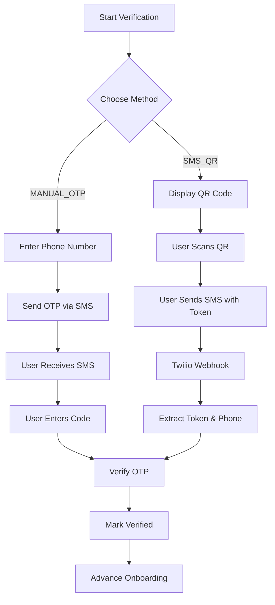
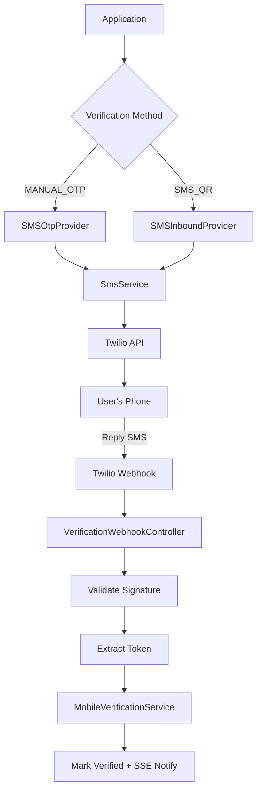

## Overview

<Info>
**Implemented in:** vritti-api-nexus
**Last Updated:** January 2026
**Status:** Stub (Ready for Integration)
</Info>

The SMS service handles phone number verification using Twilio. It supports two verification methods: manual OTP entry (user receives code and types it) and SMS QR (user scans QR and replies with a token). The infrastructure is fully built with providers, webhooks, and validation - ready for Twilio integration.

## What It Does

- Sends 6-digit OTP codes for phone verification
- Supports inbound SMS verification (reply-based)
- Validates E.164 phone number format
- Handles Twilio webhook signature verification
- Provides masked phone display for privacy
- Integrates with mobile verification during onboarding

## Verification Methods

| Method | Code | Flow |
|--------|------|------|
| Manual OTP | `MANUAL_OTP` | User receives SMS → Enters 6-digit code in app |
| SMS QR | `SMS_QR` | User scans QR → Sends token via SMS → Webhook verifies |



## Where It's Used

| Location | Purpose |
|----------|---------|
| `vritti-api-nexus/src/services/sms.service.ts` | Core SMS sending service |
| `vritti-api-nexus/src/modules/cloud-api/onboarding/providers/sms-otp.provider.ts` | OTP-based verification |
| `vritti-api-nexus/src/modules/cloud-api/onboarding/providers/sms-inbound.provider.ts` | Reply-based verification |
| `vritti-api-nexus/src/modules/cloud-api/onboarding/controllers/verification-webhook.controller.ts` | Webhook handler |
| `vritti-api-nexus/src/modules/cloud-api/auth/mfa-verification/` | MFA SMS codes |

## Architecture



## Implementation

### SMS Service

```typescript
// sms.service.ts
@Injectable()
export class SmsService {
  private readonly logger = new Logger(SmsService.name);

  constructor(private readonly configService: ConfigService) {}

  async sendVerificationSms(
    phoneNumber: string,
    otp: string,
    firstName?: string,
  ): Promise<void> {
    // Validate phone number format
    if (!this.validatePhoneNumber(phoneNumber)) {
      throw new Error('Invalid phone number format. Must be E.164 format.');
    }

    const message = firstName
      ? `Hi ${firstName}, your Vritti verification code is: ${otp}\n\nThis code expires in 5 minutes. Do not share this code with anyone.`
      : `Your Vritti verification code is: ${otp}\n\nThis code expires in 5 minutes. Do not share this code with anyone.`;

    // TODO: Integrate with Twilio
    // const accountSid = this.configService.get<string>('TWILIO_ACCOUNT_SID');
    // const authToken = this.configService.get<string>('TWILIO_AUTH_TOKEN');
    // const fromNumber = this.configService.get<string>('TWILIO_PHONE_NUMBER');
    // const client = twilio(accountSid, authToken);
    // await client.messages.create({
    //   body: message,
    //   from: fromNumber,
    //   to: phoneNumber,
    // });

    this.logger.warn(`SMS service not configured. Would send to ${phoneNumber}: ${message}`);
  }

  validatePhoneNumber(phoneNumber: string): boolean {
    // E.164 format: + followed by 1-15 digits
    const e164Regex = /^\+[1-9]\d{1,14}$/;
    return e164Regex.test(phoneNumber);
  }
}
```

### SMS OTP Provider

```typescript
// sms-otp.provider.ts
@Injectable()
export class SMSOtpProvider implements VerificationProvider {
  readonly method: VerificationMethod = VerificationMethodValues.MANUAL_OTP;
  private readonly smsPhoneNumber: string;
  private readonly smsApiKey: string;
  private readonly smsApiSecret: string;

  constructor(private readonly configService: ConfigService) {
    this.smsPhoneNumber = this.configService.get<string>('SMS_PHONE_NUMBER') || '';
    this.smsApiKey = this.configService.get<string>('SMS_API_KEY') || '';
    this.smsApiSecret = this.configService.get<string>('SMS_API_SECRET') || '';
  }

  async sendVerification(
    phone: string,
    phoneCountry: string,
    otp: string,
  ): Promise<SendVerificationResult> {
    // TODO: Integrate with Twilio
    // const client = require('twilio')(this.smsApiKey, this.smsApiSecret);
    // await client.messages.create({
    //   body: `Your Vritti verification code is: ${otp}...`,
    //   from: this.smsPhoneNumber,
    //   to: phone,
    // });

    this.logger.warn(`SMS OTP Provider: Would send ${otp} to ${phone}`);

    return {
      success: true,
      messageId: `mock-sms-${Date.now()}`,
    };
  }

  getInstructions(token: string, phone?: string): string {
    return 'Enter the 6-digit verification code sent to your phone via SMS.';
  }

  isConfigured(): boolean {
    return !!this.smsApiKey && !!this.smsApiSecret && !!this.smsPhoneNumber;
  }
}
```

### SMS Inbound Provider

```typescript
// sms-inbound.provider.ts
@Injectable()
export class SMSInboundProvider implements VerificationProvider {
  readonly method: VerificationMethod = VerificationMethodValues.SMS_QR;
  private readonly smsWebhookSecret: string;

  constructor(private readonly configService: ConfigService) {
    this.smsWebhookSecret = this.configService.get<string>('SMS_WEBHOOK_SECRET') || '';
  }

  async sendVerification(
    phone: string,
    phoneCountry: string,
    token: string,
  ): Promise<SendVerificationResult> {
    // For SMS_QR, we don't send SMS - user initiates by scanning QR
    // QR code contains: sms:+{twilioNumber}?body={token}
    return {
      success: true,
      qrData: this.generateQrData(token),
    };
  }

  private generateQrData(token: string): string {
    return `sms:${this.smsPhoneNumber}?body=${token}`;
  }

  validateWebhook(payload: string, signature: string): boolean {
    // Twilio uses HMAC-SHA1 for webhook signatures
    const expectedSignature = crypto
      .createHmac('sha1', this.smsWebhookSecret)
      .update(payload)
      .digest('base64');

    // Timing-safe comparison
    try {
      return crypto.timingSafeEqual(
        Buffer.from(signature),
        Buffer.from(expectedSignature),
      );
    } catch {
      return false;
    }
  }
}
```

## Webhook Handler

### Twilio SMS Webhook DTO

```typescript
// sms-webhook.dto.ts
export class TwilioSmsWebhookDto {
  @IsString()
  @IsNotEmpty()
  From: string;  // Sender phone (E.164 with + prefix)

  @IsString()
  @IsNotEmpty()
  To: string;    // Receiver (Vritti's Twilio number)

  @IsString()
  @IsNotEmpty()
  Body: string;  // Message content

  @IsString()
  @IsNotEmpty()
  MessageSid: string;  // Twilio message ID (SM...)

  @IsString()
  @IsNotEmpty()
  AccountSid: string;  // Twilio Account SID

  @IsOptional()
  @IsString()
  SmsStatus?: string;  // Status: 'received'

  @IsOptional()
  @IsString()
  FromCountry?: string;  // Sender's country

  @IsOptional()
  @IsString()
  FromCity?: string;  // Sender's city
}
```

### Webhook Controller

```typescript
// verification-webhook.controller.ts
@Controller('cloud-api/onboarding/webhooks')
export class VerificationWebhookController {
  @Get(':provider')
  @Public()
  async verifyWebhook(
    @Param('provider') provider: string,
    @Query() query: Record<string, string>,
  ): Promise<string> {
    // Webhook verification handshake
    if (provider === 'sms') {
      const verifyToken = this.configService.get<string>('SMS_VERIFY_TOKEN');
      if (query['verify_token'] === verifyToken) {
        return query['challenge'] || 'OK';
      }
      throw new UnauthorizedException('Invalid verify token');
    }
    throw new BadRequestException('Unknown provider');
  }

  @Post(':provider')
  @Public()
  async handleWebhook(
    @Param('provider') provider: string,
    @Body() body: any,
    @Headers('x-twilio-signature') twilioSignature: string,
    @Req() req: FastifyRequest,
  ): Promise<void> {
    if (provider === 'sms') {
      // Validate Twilio signature
      const rawBody = req.rawBody?.toString() || '';
      const isValid = this.smsProvider.validateWebhook(rawBody, twilioSignature);

      if (!isValid) {
        this.logger.warn('Invalid Twilio webhook signature');
        return;  // Don't throw - Twilio will retry
      }

      // Process SMS verification
      await this.processSmsWebhook(body as TwilioSmsWebhookDto);
    }
  }

  private async processSmsWebhook(payload: TwilioSmsWebhookDto): Promise<void> {
    const { Body: message, From: phoneNumber } = payload;

    // Extract verification token from message
    // Pattern: VER-ABC123 or VERABC123
    const tokenMatch = message.match(/VER-?([A-Z0-9]{6})/i);
    if (!tokenMatch) {
      this.logger.debug('No verification token found in SMS');
      return;
    }

    const token = `VER-${tokenMatch[1].toUpperCase()}`;

    // Verify phone number
    await this.mobileVerificationService.verifyFromWebhook(token, phoneNumber);
  }
}
```

## Configuration

### Environment Variables

```bash
# Twilio Account Credentials
TWILIO_ACCOUNT_SID=ACxxxxxxxxxxxxxxxxxxxxxxxxxxxxxxxx
TWILIO_AUTH_TOKEN=xxxxxxxxxxxxxxxxxxxxxxxxxxxxxxxx

# SMS-specific (alternative naming)
SMS_API_KEY=ACxxxxxxxxxxxxxxxxxxxxxxxxxxxxxxxx      # Same as TWILIO_ACCOUNT_SID
SMS_API_SECRET=xxxxxxxxxxxxxxxxxxxxxxxxxxxxxxxx     # Same as TWILIO_AUTH_TOKEN
SMS_PHONE_NUMBER=+1234567890                        # Your Twilio phone number

# Webhook Security
SMS_WEBHOOK_SECRET=your-webhook-signing-secret      # For signature validation
SMS_VERIFY_TOKEN=random-verification-token          # For webhook registration
```

### Twilio Console Setup

<Steps>
  <Step title="Create Twilio Account">
    Sign up at [twilio.com](https://www.twilio.com) and get your Account SID and Auth Token
  </Step>

  <Step title="Get Phone Number">
    Purchase a phone number with SMS capabilities in your target region
  </Step>

  <Step title="Configure Webhook">
    Set the webhook URL for incoming messages:
    ```
    https://your-domain.com/cloud-api/onboarding/webhooks/sms
    ```
  </Step>

  <Step title="Set Environment Variables">
    Add Twilio credentials to your `.env` file
  </Step>
</Steps>

## Phone Number Handling

### E.164 Format

All phone numbers are stored and validated in E.164 format:

```typescript
// Phone number validation
const e164Regex = /^\+[1-9]\d{1,14}$/;

// Examples:
// +14155551234  (US)
// +919876543210 (India)
// +447911123456 (UK)
```

### Phone Masking

Phone numbers are masked for display to protect privacy:

```typescript
function maskPhoneNumber(phone: string): string {
  // Input: +14155551234
  // Output: +1 *** *** 1234
  const countryCode = phone.slice(0, phone.length - 10);
  const lastFour = phone.slice(-4);
  return `${countryCode} *** *** ${lastFour}`;
}
```

## OTP Configuration

| Setting | Value | Description |
|---------|-------|-------------|
| Length | 6 digits | Numeric code (000000-999999) |
| OTP Expiry | 5 minutes | Time before code expires |
| Verification Expiry | 10 minutes | Time for entire verification flow |
| Max Attempts | 5 | Failed attempts before lockout |

```typescript
// otp.service.ts
@Injectable()
export class OtpService {
  private readonly OTP_EXPIRY_MINUTES = 5;
  private readonly MAX_ATTEMPTS = 3;

  generateOtp(): string {
    // Generate 6-digit OTP
    return this.encryptionService.generateNumericOtp(6);
  }

  validateOtpAttempt(verification: { attempts: number; expiresAt: Date }): void {
    if (this.isOtpExpired(verification.expiresAt)) {
      throw new BadRequestException('Verification code has expired');
    }
    if (this.isMaxAttemptsExceeded(verification.attempts)) {
      throw new BadRequestException('Too many attempts. Please request a new code.');
    }
  }
}
```

## API Endpoints

### Initiate SMS Verification

```http
POST /cloud-api/onboarding/mobile-verification/initiate
Authorization: Bearer <signup_token>
Content-Type: application/json

{
  "method": "MANUAL_OTP",
  "phoneNumber": "+919876543210",
  "countryCode": "IN"
}
```

**Response:**
```json
{
  "verificationId": "ver_abc123",
  "method": "MANUAL_OTP",
  "maskedPhone": "+91 *** *** 3210",
  "expiresAt": "2026-01-15T10:40:00Z",
  "instructions": {
    "message": "Enter the 6-digit verification code sent to your phone via SMS."
  }
}
```

### Verify OTP

```http
POST /cloud-api/onboarding/mobile-verification/verify-otp
Authorization: Bearer <signup_token>
Content-Type: application/json

{
  "otp": "123456"
}
```

### MFA SMS OTP (Login)

```http
POST /cloud-api/auth/mfa/send-sms-otp
Content-Type: application/json

{
  "sessionId": "mfa_session_abc123"
}
```

**Response:**
```json
{
  "success": true,
  "maskedPhone": "+91 *** *** 3210",
  "message": "Verification code sent to your phone"
}
```

## Error Handling

| Error | Cause | Resolution |
|-------|-------|------------|
| `Invalid phone number format` | Not E.164 format | Use `+` prefix with country code |
| `Verification code expired` | OTP older than 5 minutes | Request new code |
| `Too many attempts` | 5+ failed verifications | Request new code |
| `Phone already registered` | Phone linked to another account | Use different phone |
| `SMS service not configured` | Missing Twilio credentials | Configure environment variables |

## Security Features

<CardGroup cols={2}>
  <Card title="HMAC Signature" icon="shield-check">
    Twilio webhooks validated with HMAC-SHA1
  </Card>
  <Card title="Timing-Safe Compare" icon="clock">
    Prevents timing attacks on signature validation
  </Card>
  <Card title="OTP Hashing" icon="lock">
    OTPs stored as bcrypt hashes, never plaintext
  </Card>
  <Card title="Phone Masking" icon="eye-slash">
    Only last 4 digits displayed to users
  </Card>
</CardGroup>

### Webhook Signature Validation

```typescript
// Twilio HMAC-SHA1 validation
validateWebhook(payload: string, signature: string): boolean {
  const expectedSignature = crypto
    .createHmac('sha1', this.webhookSecret)
    .update(payload)
    .digest('base64');

  // Timing-safe comparison prevents timing attacks
  return crypto.timingSafeEqual(
    Buffer.from(signature),
    Buffer.from(expectedSignature),
  );
}
```

## Integration Status

<Warning>
The SMS service infrastructure is complete but Twilio integration is pending. The service currently logs warnings instead of sending actual SMS messages.
</Warning>

### To Complete Integration

1. **Install Twilio SDK:**
   ```bash
   npm install twilio
   ```

2. **Uncomment Twilio code** in `sms.service.ts`:
   ```typescript
   const client = twilio(accountSid, authToken);
   await client.messages.create({
     body: message,
     from: fromNumber,
     to: phoneNumber,
   });
   ```

3. **Configure environment variables** with Twilio credentials

4. **Set up webhook** in Twilio console pointing to your server

## Module Registration

```typescript
// onboarding.module.ts
@Module({
  imports: [ServicesModule, UserModule],
  providers: [
    MobileVerificationService,
    OtpService,
    SMSOtpProvider,
    SMSInboundProvider,
    VerificationProviderFactory,
    MobileVerificationRepository,
  ],
  controllers: [
    OnboardingController,
    VerificationWebhookController,
  ],
})
export class OnboardingModule {}
```

## Troubleshooting

<Accordion title="SMS not being sent">
  **Causes:**
  - Twilio not configured (check logs for warning)
  - Invalid phone number format
  - Twilio account balance depleted

  **Solution:**
  - Verify Twilio credentials in environment variables
  - Check phone number is E.164 format (+1234567890)
  - Review Twilio dashboard for account status
  - Check application logs for specific errors
</Accordion>

<Accordion title="Webhook not receiving messages">
  **Causes:**
  - Incorrect webhook URL in Twilio console
  - SSL certificate issues
  - Firewall blocking Twilio IPs
  - Signature validation failing

  **Solution:**
  - Verify webhook URL matches your server
  - Ensure SSL certificate is valid
  - Check SMS_WEBHOOK_SECRET matches Twilio
  - Review Twilio webhook logs for errors
</Accordion>

<Accordion title="Invalid signature errors">
  **Cause:** Webhook secret mismatch or payload modification

  **Solution:**
  - Ensure SMS_WEBHOOK_SECRET matches Twilio's auth token
  - Verify raw body is preserved (not parsed before validation)
  - Check no proxy is modifying the request
</Accordion>

<Accordion title="OTP always showing invalid">
  **Causes:**
  - OTP expired (older than 5 minutes)
  - Typo in entered code
  - Using old OTP after resend

  **Solution:**
  - Request a fresh OTP
  - Enter code immediately after receiving
  - Ensure using most recent code
</Accordion>

## Related Documentation

<CardGroup cols={2}>
  <Card title="Phone Verification" icon="phone" href="/features/onboarding/phone-verification">
    Mobile verification during onboarding
  </Card>
  <Card title="WhatsApp" icon="comment" href="/features/communication/whatsapp">
    WhatsApp Cloud API integration
  </Card>
  <Card title="Email Brevo" icon="envelope" href="/features/communication/email-brevo">
    Transactional email service
  </Card>
  <Card title="MFA" icon="shield" href="/features/auth/mfa">
    Multi-factor authentication
  </Card>
</CardGroup>
