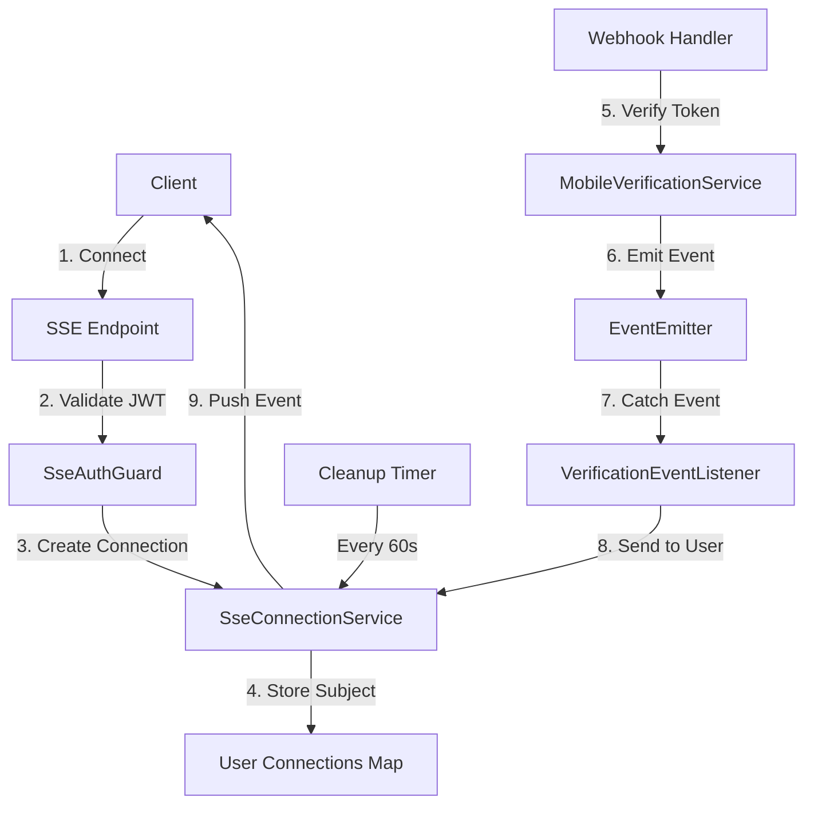
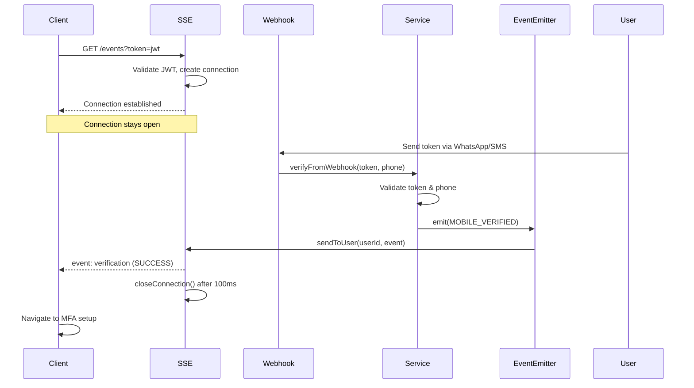

## Overview

<Info>
**Implemented in:** vritti-api-nexus
**Last Updated:** January 2026
**Status:** Production
</Info>

Server-Sent Events (SSE) provide real-time push notifications for mobile verification during onboarding. Instead of polling, clients subscribe to an event stream and receive instant updates when verification status changes. This enables seamless user experience when users verify their phone via WhatsApp or SMS.

## What It Does

- Pushes verification status updates to connected clients in real-time
- Maintains per-user connection management
- Automatically closes connections after verification completes
- Handles connection lifecycle with automatic cleanup
- Supports JWT authentication via query parameters

## Why SSE Over Polling

| Polling | SSE |
|---------|-----|
| Repeated requests every 2-5 seconds | Single persistent connection |
| Server load increases with users | Efficient resource usage |
| Delayed status updates | Instant notifications |
| Wasted bandwidth on "no change" responses | Only sends when status changes |

## Where It's Used

| Location | Purpose |
|----------|---------|
| `vritti-api-nexus/src/modules/cloud-api/onboarding/controllers/verification-sse.controller.ts` | SSE endpoint |
| `vritti-api-nexus/src/modules/cloud-api/onboarding/services/sse-connection.service.ts` | Connection management |
| `vritti-api-nexus/src/modules/cloud-api/onboarding/services/verification-event.listener.ts` | Event broadcasting |
| `vritti-api-nexus/src/modules/cloud-api/onboarding/events/verification.events.ts` | Event types |

## Architecture



## Event Types

| Event | Code | Description |
|-------|------|-------------|
| Verified | `verification.mobile.verified` | Phone successfully verified |
| Failed | `verification.mobile.failed` | Verification attempt failed |
| Expired | `verification.mobile.expired` | Verification token expired |

```typescript
// verification.events.ts
export const VERIFICATION_EVENTS = {
  MOBILE_VERIFIED: 'verification.mobile.verified',
  MOBILE_FAILED: 'verification.mobile.failed',
  MOBILE_EXPIRED: 'verification.mobile.expired',
};

export class MobileVerificationEvent {
  constructor(
    public readonly userId: string,
    public readonly verificationId: string,
    public readonly status: 'verified' | 'failed' | 'expired',
    public readonly phone?: string,
    public readonly message?: string,
  ) {}
}
```

## API Endpoint

### Connect to Event Stream

```http
GET /cloud-api/onboarding/mobile-verification/events?token=<jwt>
Accept: text/event-stream
```

**Query Parameters:**
| Parameter | Required | Description |
|-----------|----------|-------------|
| `token` | Yes | JWT authentication token |

**Response Headers:**
```
Content-Type: text/event-stream
Cache-Control: no-cache
Connection: keep-alive
```

**Event Format:**
```json
event: verification
id: ver_abc123-1706350200000
data: {"type":"SUCCESS","verificationId":"ver_abc123","phone":"+91 *** *** 3210","message":"Phone number verified successfully","timestamp":"2026-01-27T10:30:00.000Z"}
```

## Implementation

### SSE Controller

```typescript
// verification-sse.controller.ts
@Controller('cloud-api/onboarding/mobile-verification')
export class VerificationSseController {
  constructor(
    private readonly sseConnectionService: SseConnectionService,
    private readonly verificationService: MobileVerificationService,
  ) {}

  @Sse('events')
  @Public()  // EventSource can't send Authorization header
  @SkipCsrf()  // EventSource can't send CSRF tokens
  @UseGuards(SseAuthGuard)  // Validates JWT from query param
  async events(
    @UserId() userId: string,
    @Query('token') token: string,
  ): Promise<Observable<MessageEvent>> {
    // Verify user has pending verification
    const verification = await this.verificationService.getPendingVerification(userId);
    if (!verification) {
      throw new NotFoundException('No pending verification found');
    }

    // Get or create connection for user
    const connection = this.sseConnectionService.getOrCreateConnection(
      userId,
      verification.expiresAt,
    );

    // Return observable that emits events
    return connection.subject.pipe(
      map((event) => this.formatEvent(event)),
      takeUntil(timer(this.getRemainingTime(verification.expiresAt))),
      finalize(() => {
        this.sseConnectionService.closeConnection(userId);
      }),
    );
  }

  private formatEvent(event: MobileVerificationEvent): MessageEvent {
    return {
      data: JSON.stringify({
        type: this.mapStatusToType(event.status),
        verificationId: event.verificationId,
        phone: event.phone,
        message: event.message,
        timestamp: new Date().toISOString(),
      }),
      id: `${event.verificationId}-${Date.now()}`,
      type: 'verification',
    };
  }

  private mapStatusToType(status: string): string {
    switch (status) {
      case 'verified': return 'SUCCESS';
      case 'failed': return 'FAILED';
      case 'expired': return 'EXPIRED';
      default: return 'UNKNOWN';
    }
  }
}
```

### Connection Service

```typescript
// sse-connection.service.ts
@Injectable()
export class SseConnectionService implements OnModuleDestroy {
  private readonly connections = new Map<string, UserConnection>();
  private readonly logger = new Logger(SseConnectionService.name);
  private cleanupInterval: NodeJS.Timeout;

  constructor() {
    // Cleanup expired connections every 60 seconds
    this.cleanupInterval = setInterval(() => {
      this.cleanupExpiredConnections();
    }, 60_000);
  }

  getOrCreateConnection(userId: string, expiresAt: Date): UserConnection {
    let connection = this.connections.get(userId);

    if (!connection || connection.subject.closed) {
      connection = {
        subject: new Subject<MobileVerificationEvent>(),
        expiresAt,
        createdAt: new Date(),
      };
      this.connections.set(userId, connection);
      this.logger.debug(`Created SSE connection for user ${userId}`);
    }

    return connection;
  }

  sendToUser(userId: string, event: MobileVerificationEvent): boolean {
    const connection = this.connections.get(userId);

    if (!connection || connection.subject.closed) {
      this.logger.debug(`No active connection for user ${userId}`);
      return false;
    }

    connection.subject.next(event);
    this.logger.debug(`Sent event to user ${userId}: ${event.status}`);
    return true;
  }

  closeConnection(userId: string): void {
    const connection = this.connections.get(userId);

    if (connection && !connection.subject.closed) {
      connection.subject.complete();
      this.logger.debug(`Closed SSE connection for user ${userId}`);
    }

    this.connections.delete(userId);
  }

  hasConnection(userId: string): boolean {
    const connection = this.connections.get(userId);
    return !!connection && !connection.subject.closed;
  }

  getConnectionCount(): number {
    return this.connections.size;
  }

  private cleanupExpiredConnections(): void {
    const now = new Date();
    let cleaned = 0;

    for (const [userId, connection] of this.connections) {
      if (now > connection.expiresAt || connection.subject.closed) {
        this.closeConnection(userId);
        cleaned++;
      }
    }

    if (cleaned > 0) {
      this.logger.debug(`Cleaned up ${cleaned} expired SSE connections`);
    }
  }

  onModuleDestroy(): void {
    clearInterval(this.cleanupInterval);
    for (const [userId] of this.connections) {
      this.closeConnection(userId);
    }
  }
}

interface UserConnection {
  subject: Subject<MobileVerificationEvent>;
  expiresAt: Date;
  createdAt: Date;
}
```

### Event Listener

```typescript
// verification-event.listener.ts
@Injectable()
export class VerificationEventListener {
  constructor(
    private readonly sseConnectionService: SseConnectionService,
  ) {}

  @OnEvent(VERIFICATION_EVENTS.MOBILE_VERIFIED)
  handleMobileVerified(event: MobileVerificationEvent): void {
    const sent = this.sseConnectionService.sendToUser(event.userId, event);

    if (sent) {
      // Close connection after successful verification
      setTimeout(() => {
        this.sseConnectionService.closeConnection(event.userId);
      }, 100);
    }
  }

  @OnEvent(VERIFICATION_EVENTS.MOBILE_FAILED)
  handleMobileFailed(event: MobileVerificationEvent): void {
    // Send failure event but keep connection open for retry
    this.sseConnectionService.sendToUser(event.userId, event);
  }

  @OnEvent(VERIFICATION_EVENTS.MOBILE_EXPIRED)
  handleMobileExpired(event: MobileVerificationEvent): void {
    const sent = this.sseConnectionService.sendToUser(event.userId, event);

    if (sent) {
      this.sseConnectionService.closeConnection(event.userId);
    }
  }
}
```

## Verification Flow with SSE



## Authentication

### SseAuthGuard

EventSource API cannot send custom headers, so JWT is passed via query parameter:

```typescript
// SseAuthGuard from @vritti/api-sdk
@Injectable()
export class SseAuthGuard implements CanActivate {
  canActivate(context: ExecutionContext): boolean {
    const request = context.switchToHttp().getRequest();
    const token = request.query.token;

    if (!token) {
      throw new UnauthorizedException('Missing token');
    }

    try {
      const payload = this.jwtService.verify(token);
      request.user = payload;
      return true;
    } catch {
      throw new UnauthorizedException('Invalid token');
    }
  }
}
```

### Decorator Stack

```typescript
@Sse('events')
@Public()      // Bypass global VrittiAuthGuard
@SkipCsrf()    // Bypass CSRF guard
@UseGuards(SseAuthGuard)  // Validate JWT from query param
```

## Client Integration

### Browser JavaScript

```typescript
// Connect to SSE endpoint
const token = localStorage.getItem('signupToken');
const eventSource = new EventSource(
  `/cloud-api/onboarding/mobile-verification/events?token=${token}`
);

// Listen for verification events
eventSource.addEventListener('verification', (event) => {
  const data = JSON.parse(event.data);

  switch (data.type) {
    case 'SUCCESS':
      console.log(`Verified: ${data.phone}`);
      eventSource.close();
      window.location.href = '/onboarding/setup-2fa';
      break;

    case 'FAILED':
      console.log(`Failed: ${data.message}`);
      // Show retry option, keep connection open
      break;

    case 'EXPIRED':
      console.log('Verification expired');
      eventSource.close();
      // Show "start over" option
      break;
  }
});

// Handle connection errors
eventSource.onerror = (error) => {
  console.error('SSE connection error:', error);
  if (eventSource.readyState === EventSource.CLOSED) {
    // Connection closed by server
    console.log('Connection closed');
  }
};

// Cleanup on page unload
window.addEventListener('beforeunload', () => {
  eventSource.close();
});
```

### React Hook Example

```typescript
// useVerificationSSE.ts
function useVerificationSSE(token: string) {
  const [status, setStatus] = useState<'pending' | 'success' | 'failed' | 'expired'>('pending');
  const [message, setMessage] = useState<string | null>(null);

  useEffect(() => {
    const eventSource = new EventSource(
      `/cloud-api/onboarding/mobile-verification/events?token=${token}`
    );

    eventSource.addEventListener('verification', (event) => {
      const data = JSON.parse(event.data);

      if (data.type === 'SUCCESS') {
        setStatus('success');
        setMessage('Phone verified successfully');
        eventSource.close();
      } else if (data.type === 'FAILED') {
        setStatus('failed');
        setMessage(data.message);
      } else if (data.type === 'EXPIRED') {
        setStatus('expired');
        setMessage('Verification expired');
        eventSource.close();
      }
    });

    eventSource.onerror = () => {
      setStatus('failed');
      setMessage('Connection error');
    };

    return () => {
      eventSource.close();
    };
  }, [token]);

  return { status, message };
}
```

## Connection Lifecycle

| Phase | Duration | Action |
|-------|----------|--------|
| Connect | Instant | Create Subject, add to Map |
| Active | Up to 10 min | Wait for webhook events |
| Success | +100ms | Send event, then close |
| Failure | Immediate | Send event, keep open |
| Expired | At expiry | Send event, close |
| Cleanup | Every 60s | Remove stale connections |

## Event Emission

Events are emitted from `MobileVerificationService.verifyFromWebhook()`:

```typescript
// mobile-verification.service.ts
async verifyFromWebhook(token: string, phone: string): Promise<void> {
  const verification = await this.findByToken(token);

  // ... validation logic ...

  // Mark as verified
  await this.markVerified(verification.id, phone);

  // Emit success event
  this.eventEmitter.emit(
    VERIFICATION_EVENTS.MOBILE_VERIFIED,
    new MobileVerificationEvent(
      verification.userId,
      verification.id,
      'verified',
      this.maskPhone(phone),
      'Phone number verified successfully',
    ),
  );
}
```

## Configuration

### Module Registration

```typescript
// onboarding.module.ts
@Module({
  imports: [
    EventEmitterModule.forRoot(),  // Enable event system
  ],
  providers: [
    SseConnectionService,
    VerificationEventListener,
    VerificationSseController,
  ],
})
export class OnboardingModule {}
```

### Dependencies

```json
{
  "dependencies": {
    "@nestjs/event-emitter": "^3.0.1",
    "rxjs": "^7.8.1"
  }
}
```

## Security Features

<CardGroup cols={2}>
  <Card title="JWT Authentication" icon="key">
    Token validated via SseAuthGuard
  </Card>
  <Card title="Connection Isolation" icon="user-lock">
    Events routed only to correct user
  </Card>
  <Card title="Auto Cleanup" icon="broom">
    Expired connections removed every 60s
  </Card>
  <Card title="Timeout Protection" icon="clock">
    Connections auto-close after 10 minutes
  </Card>
</CardGroup>

## Error Handling

| Scenario | Behavior |
|----------|----------|
| Invalid JWT | 401 Unauthorized |
| No pending verification | 404 Not Found |
| Already verified | 404 Not Found |
| Connection error | Client onerror triggered |
| Server restart | All connections close |

## Monitoring

```typescript
// Get active connection count
const count = sseConnectionService.getConnectionCount();
console.log(`Active SSE connections: ${count}`);

// Check if user has connection
const hasConnection = sseConnectionService.hasConnection(userId);
```

## Troubleshooting

<Accordion title="Client not receiving events">
  **Causes:**
  - Invalid JWT token
  - No pending verification
  - EventSource closed prematurely

  **Solution:**
  - Verify token is valid and not expired
  - Ensure user has initiated verification
  - Check browser console for connection errors
  - Verify CORS is configured correctly
</Accordion>

<Accordion title="Connection closes immediately">
  **Causes:**
  - Verification already completed
  - JWT token expired
  - Server error during connection

  **Solution:**
  - Check onboarding status endpoint
  - Refresh authentication token
  - Check server logs for errors
</Accordion>

<Accordion title="Events delayed or missing">
  **Causes:**
  - Webhook not reaching server
  - Event emitter not registered
  - Connection created after event emitted

  **Solution:**
  - Verify webhook is receiving messages
  - Check EventEmitterModule is imported
  - Ensure client connects before verification
</Accordion>

<Accordion title="Memory leak from connections">
  **Cause:** Connections not being cleaned up

  **Solution:**
  - Verify cleanupInterval is running
  - Check onModuleDestroy is called on shutdown
  - Monitor connection count over time
</Accordion>

## Related Documentation

<CardGroup cols={2}>
  <Card title="Phone Verification" icon="phone" href="/features/onboarding/phone-verification">
    Mobile verification flow
  </Card>
  <Card title="WhatsApp" icon="comment" href="/features/communication/whatsapp">
    WhatsApp webhook integration
  </Card>
  <Card title="SMS Twilio" icon="comment-sms" href="/features/communication/sms-twilio">
    SMS webhook integration
  </Card>
  <Card title="Onboarding Flow" icon="list-check" href="/features/onboarding/flow-overview">
    Complete onboarding process
  </Card>
</CardGroup>
