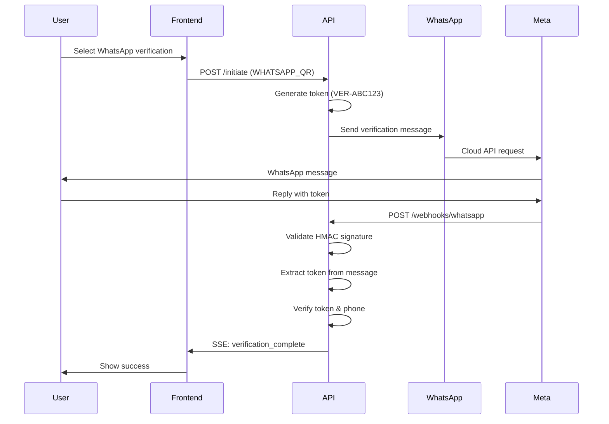
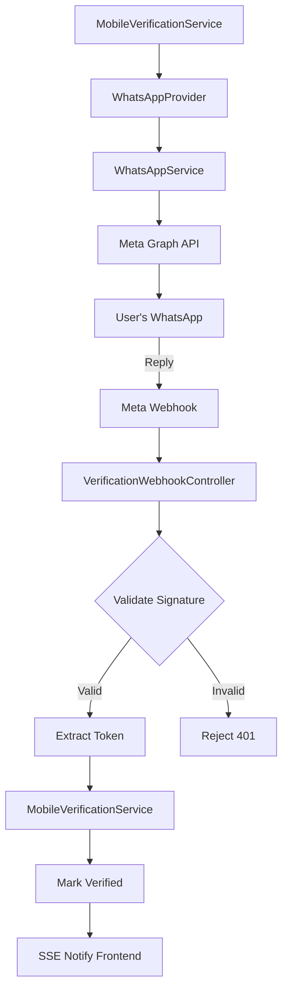

## Overview

<Info>
**Implemented in:** vritti-api-nexus
**Last Updated:** January 2026
**Status:** Production
</Info>

The WhatsApp service integrates with Meta's WhatsApp Cloud API to provide phone verification during onboarding. Users receive a verification token via WhatsApp and reply to confirm their phone number. The system uses webhooks to receive replies and real-time SSE to notify the frontend of verification completion.

## What It Does

- Sends verification tokens via WhatsApp Cloud API
- Receives user replies via webhooks
- Validates webhook signatures using HMAC-SHA256
- Extracts and validates verification tokens from messages
- Updates user verification status in real-time via SSE
- Supports both text messages and pre-approved templates

## Verification Flow



## Where It's Used

| Location | Purpose |
|----------|---------|
| `vritti-api-nexus/src/services/whatsapp.service.ts` | Core WhatsApp Cloud API client |
| `vritti-api-nexus/src/modules/cloud-api/onboarding/providers/whatsapp.provider.ts` | Verification provider implementation |
| `vritti-api-nexus/src/modules/cloud-api/onboarding/controllers/verification-webhook.controller.ts` | Webhook handler |
| `vritti-api-nexus/src/modules/cloud-api/onboarding/dto/whatsapp-webhook.dto.ts` | Webhook payload DTOs |

## Architecture



## Implementation

### WhatsApp Service

```typescript
// whatsapp.service.ts
@Injectable()
export class WhatsAppService {
  private phoneNumberId: string;
  private accessToken: string;
  private appSecret: string;
  private apiVersion: string = 'v18.0';
  private whatsappClient: AxiosInstance;

  constructor(private readonly configService: ConfigService) {
    this.phoneNumberId = this.configService.get<string>('WHATSAPP_PHONE_NUMBER_ID') || '';
    this.accessToken = this.configService.get<string>('WHATSAPP_ACCESS_TOKEN') || '';
    this.appSecret = this.configService.get<string>('WHATSAPP_APP_SECRET') || '';
    this.apiVersion = this.configService.get<string>('WHATSAPP_API_VERSION') || 'v18.0';

    // Initialize axios client for WhatsApp Cloud API
    this.whatsappClient = axios.create({
      baseURL: `https://graph.facebook.com/${this.apiVersion}`,
      timeout: 10000,
      headers: {
        Authorization: `Bearer ${this.accessToken}`,
        'Content-Type': 'application/json',
      },
    });
  }

  async sendVerificationMessage(
    toPhone: string,
    verificationToken: string,
  ): Promise<string> {
    // WhatsApp expects phone without + prefix
    const phone = toPhone.startsWith('+') ? toPhone.slice(1) : toPhone;

    const message = `Your Vritti verification code is: ${verificationToken}

Reply with this code to verify your phone number.

This code expires in 10 minutes.`;

    try {
      const response = await this.whatsappClient.post(
        `/${this.phoneNumberId}/messages`,
        {
          messaging_product: 'whatsapp',
          recipient_type: 'individual',
          to: phone,
          type: 'text',
          text: { body: message },
        },
      );

      return response.data.messages[0].id;
    } catch (error) {
      this.logger.error('Failed to send WhatsApp message', error);
      throw new Error('Failed to send WhatsApp verification message');
    }
  }

  async sendVerificationTemplate(
    toPhone: string,
    verificationToken: string,
    templateName: string = 'verification_code',
  ): Promise<string> {
    const phone = toPhone.startsWith('+') ? toPhone.slice(1) : toPhone;

    try {
      const response = await this.whatsappClient.post(
        `/${this.phoneNumberId}/messages`,
        {
          messaging_product: 'whatsapp',
          recipient_type: 'individual',
          to: phone,
          type: 'template',
          template: {
            name: templateName,
            language: { code: 'en_US' },
            components: [
              {
                type: 'body',
                parameters: [
                  { type: 'text', text: verificationToken },
                ],
              },
            ],
          },
        },
      );

      return response.data.messages[0].id;
    } catch (error) {
      this.logger.warn('Template failed, falling back to text message');
      return this.sendVerificationMessage(toPhone, verificationToken);
    }
  }
}
```

### Webhook Signature Validation

```typescript
// whatsapp.service.ts
validateWebhookSignature(payload: string, signature: string): boolean {
  if (!this.appSecret) {
    this.logger.warn('WhatsApp app secret not configured');
    return false;
  }

  // Signature format: "sha256=<hex_hash>"
  if (!signature.startsWith('sha256=')) {
    return false;
  }

  const expectedSignature = signature.substring(7);

  // Compute HMAC-SHA256
  const computedSignature = crypto
    .createHmac('sha256', this.appSecret)
    .update(payload)
    .digest('hex');

  // Timing-safe comparison to prevent timing attacks
  try {
    return crypto.timingSafeEqual(
      Buffer.from(computedSignature, 'hex'),
      Buffer.from(expectedSignature, 'hex'),
    );
  } catch {
    return false;
  }
}
```

### WhatsApp Provider

```typescript
// whatsapp.provider.ts
@Injectable()
export class WhatsAppProvider implements VerificationProvider {
  readonly method: VerificationMethod = VerificationMethodValues.WHATSAPP_QR;

  constructor(
    private readonly whatsappService: WhatsAppService,
    private readonly configService: ConfigService,
  ) {}

  async sendVerification(
    phone: string,
    _phoneCountry: string,
    token: string,
  ): Promise<SendVerificationResult> {
    try {
      const messageId = await this.whatsappService.sendVerificationMessage(phone, token);
      return { success: true, messageId };
    } catch (error) {
      return { success: false, error: error.message };
    }
  }

  validateWebhook(payload: string, signature: string): boolean {
    return this.whatsappService.validateWebhookSignature(payload, signature);
  }

  getInstructions(token: string, _phone?: string): string {
    const businessNumber = this.configService.get<string>('WHATSAPP_BUSINESS_NUMBER');
    return `Send "${token}" to our WhatsApp business number (${businessNumber}) to verify your phone.`;
  }

  isConfigured(): boolean {
    const phoneNumberId = this.configService.get<string>('WHATSAPP_PHONE_NUMBER_ID');
    const accessToken = this.configService.get<string>('WHATSAPP_ACCESS_TOKEN');
    const appSecret = this.configService.get<string>('WHATSAPP_APP_SECRET');
    return !!phoneNumberId && !!accessToken && !!appSecret;
  }
}
```

## Webhook Handler

### Webhook Verification (GET)

Meta sends a GET request to verify webhook subscription:

```typescript
// verification-webhook.controller.ts
@Get(':provider')
@Public()
@SkipCsrf()
async verifyWebhook(
  @Param('provider') provider: string,
  @Query('hub.mode') mode: string,
  @Query('hub.challenge') challenge: string,
  @Query('hub.verify_token') verifyToken: string,
): Promise<string> {
  if (provider !== 'whatsapp') {
    throw new BadRequestException('Unknown provider');
  }

  if (mode !== 'subscribe') {
    throw new BadRequestException('Invalid mode');
  }

  const expectedToken = this.configService.get<string>('WHATSAPP_VERIFY_TOKEN');
  if (verifyToken !== expectedToken) {
    throw new UnauthorizedException('Invalid verify token');
  }

  // Echo back the challenge to confirm subscription
  return challenge;
}
```

### Incoming Messages (POST)

```typescript
// verification-webhook.controller.ts
@Post(':provider')
@Public()
@SkipCsrf()
async handleWebhook(
  @Param('provider') provider: string,
  @Body() body: WhatsAppWebhookDto,
  @Headers('x-hub-signature-256') signature: string,
  @Req() req: FastifyRequest,
): Promise<{ status: string }> {
  if (provider !== 'whatsapp') {
    throw new BadRequestException('Unknown provider');
  }

  // Get raw body for signature validation
  const rawBody = req.rawBody?.toString();
  if (!rawBody) {
    throw new UnauthorizedException('Missing request body');
  }

  // Validate signature
  if (!this.whatsappProvider.validateWebhook(rawBody, signature)) {
    throw new UnauthorizedException('Invalid signature');
  }

  // Respond immediately (Meta requires quick response)
  // Process asynchronously
  this.processWhatsAppWebhook(body).catch((err) => {
    this.logger.error('Failed to process WhatsApp webhook', err);
  });

  return { status: 'ok' };
}

private async processWhatsAppWebhook(payload: WhatsAppWebhookDto): Promise<void> {
  for (const entry of payload.entry) {
    for (const change of entry.changes) {
      if (change.field !== 'messages') continue;

      const messages = change.value.messages || [];
      for (const message of messages) {
        if (message.type !== 'text') continue;

        const messageText = message.text?.body || '';
        const phoneNumber = `+${message.from}`; // Add + prefix

        // Extract verification token
        const tokenMatch = messageText.match(/VER-?([A-Z0-9]{6})/i);
        if (!tokenMatch) continue;

        const token = `VER-${tokenMatch[1].toUpperCase()}`;

        // Verify the token
        await this.mobileVerificationService.verifyFromWebhook(token, phoneNumber);
      }
    }
  }
}
```

## Webhook Payload Structure

```typescript
// whatsapp-webhook.dto.ts
export class WhatsAppWebhookDto {
  @IsString()
  object: string; // "whatsapp_business_account"

  @ValidateNested({ each: true })
  @Type(() => WhatsAppEntryDto)
  entry: WhatsAppEntryDto[];
}

export class WhatsAppEntryDto {
  @IsString()
  id: string; // Business Account ID

  @ValidateNested({ each: true })
  @Type(() => WhatsAppChangeDto)
  changes: WhatsAppChangeDto[];
}

export class WhatsAppChangeDto {
  @IsString()
  field: string; // "messages"

  @ValidateNested()
  @Type(() => WhatsAppValueDto)
  value: WhatsAppValueDto;
}

export class WhatsAppValueDto {
  @IsString()
  messaging_product: string; // "whatsapp"

  @ValidateNested()
  @Type(() => WhatsAppMetadataDto)
  metadata: WhatsAppMetadataDto;

  @IsOptional()
  @ValidateNested({ each: true })
  @Type(() => WhatsAppContactDto)
  contacts?: WhatsAppContactDto[];

  @IsOptional()
  @ValidateNested({ each: true })
  @Type(() => WhatsAppMessageDto)
  messages?: WhatsAppMessageDto[];
}

export class WhatsAppMessageDto {
  @IsString()
  from: string; // Phone without +, e.g., "919876543210"

  @IsString()
  id: string; // Message ID

  @IsString()
  timestamp: string; // Unix timestamp

  @IsString()
  type: string; // "text", "image", etc.

  @IsOptional()
  @ValidateNested()
  @Type(() => WhatsAppTextDto)
  text?: WhatsAppTextDto;
}

export class WhatsAppTextDto {
  @IsString()
  body: string; // Message content
}
```

### Example Webhook Payload

```json
{
  "object": "whatsapp_business_account",
  "entry": [{
    "id": "123456789012345",
    "changes": [{
      "field": "messages",
      "value": {
        "messaging_product": "whatsapp",
        "metadata": {
          "display_phone_number": "+14155238886",
          "phone_number_id": "123456789012345"
        },
        "contacts": [{
          "profile": { "name": "John Doe" },
          "wa_id": "919876543210"
        }],
        "messages": [{
          "from": "919876543210",
          "id": "wamid.HBgLMTIzNDU2Nzg5MBUCABIYIDA2Q0E0NkYxMkYx",
          "timestamp": "1704067200",
          "type": "text",
          "text": { "body": "VER-A1B2C3" }
        }]
      }
    }]
  }]
}
```

## Configuration

### Environment Variables

```bash
# WhatsApp Cloud API Configuration
WHATSAPP_PHONE_NUMBER_ID=838135942722087
  # From Meta Business Manager - Phone number ID

WHATSAPP_ACCESS_TOKEN=EAAj6V20rcZCQBQ...
  # From Meta Developer Portal - API access token

WHATSAPP_APP_SECRET=811fb2ce864239f28a4955ef908d2d1b
  # From Meta App Settings - For HMAC signature validation

WHATSAPP_API_VERSION=v18.0
  # API version (defaults to v18.0)

WHATSAPP_VERIFY_TOKEN=helloVritti
  # Custom token for webhook subscription verification

WHATSAPP_BUSINESS_NUMBER=+14155238886
  # Business phone number (for user instructions)
```

### Meta Business Manager Setup

<Steps>
  <Step title="Create Meta Developer App">
    Go to [developers.facebook.com](https://developers.facebook.com) and create a new app with WhatsApp product
  </Step>

  <Step title="Set Up WhatsApp Business">
    - Add WhatsApp product to your app
    - Create or connect a Meta Business Account
    - Get a test phone number or connect your business number
  </Step>

  <Step title="Get API Credentials">
    From the WhatsApp dashboard:
    - Copy `Phone number ID` → `WHATSAPP_PHONE_NUMBER_ID`
    - Generate access token → `WHATSAPP_ACCESS_TOKEN`
    - Get App Secret from Basic Settings → `WHATSAPP_APP_SECRET`
  </Step>

  <Step title="Configure Webhook">
    - Set webhook URL: `https://your-domain.com/cloud-api/onboarding/webhooks/whatsapp`
    - Set verify token: your `WHATSAPP_VERIFY_TOKEN` value
    - Subscribe to `messages` field
  </Step>

  <Step title="Approve Message Templates">
    For production, create and get approval for message templates in Meta Business Manager
  </Step>
</Steps>

## Token Format

| Property | Value |
|----------|-------|
| Prefix | `VER-` or `VER` |
| Length | 6 alphanumeric characters |
| Case | Uppercase |
| Pattern | `/VER-?([A-Z0-9]{6})/i` |
| Examples | `VER-A1B2C3`, `VERA1B2C3` |

## Phone Number Handling

```typescript
// WhatsApp API expects phone without + prefix
// Incoming webhooks have phone without + prefix

// Outbound (sending message)
const phone = "+919876543210";
const apiPhone = phone.slice(1); // "919876543210"

// Inbound (receiving webhook)
const webhookPhone = "919876543210";
const normalizedPhone = `+${webhookPhone}`; // "+919876543210"
```

## Security Features

<CardGroup cols={2}>
  <Card title="HMAC-SHA256" icon="shield-check">
    All webhooks validated with cryptographic signature
  </Card>
  <Card title="Timing-Safe Compare" icon="clock">
    Uses crypto.timingSafeEqual() to prevent timing attacks
  </Card>
  <Card title="Token Expiry" icon="hourglass">
    10-minute window for verification completion
  </Card>
  <Card title="Attempt Limits" icon="ban">
    Maximum 5 verification attempts per token
  </Card>
</CardGroup>

## Error Handling

| Error | Cause | Resolution |
|-------|-------|------------|
| `Invalid signature` | Webhook signature mismatch | Check WHATSAPP_APP_SECRET |
| `Missing request body` | Raw body not preserved | Configure Fastify rawBody |
| `Template not approved` | Using unapproved template | Use text message or get template approved |
| `Phone number not verified` | Sending to unverified number | Use verified test numbers |
| `Rate limit exceeded` | Too many API calls | Implement backoff, check Meta limits |

## Rate Limits

| Tier | Messages/Day | Notes |
|------|--------------|-------|
| Unverified | 250 | Test numbers only |
| Business Verified | 1,000 | With verified business |
| Tier 1 | 10,000 | After quality rating improves |
| Tier 2 | 100,000 | Higher volume |

## Message Templates (Production)

For production use, create pre-approved templates:

```json
{
  "name": "verification_code",
  "language": "en_US",
  "category": "AUTHENTICATION",
  "components": [
    {
      "type": "BODY",
      "text": "Your Vritti verification code is: {{1}}. This code expires in 10 minutes."
    }
  ]
}
```

<Warning>
Template messages require approval from Meta and can take 24-48 hours. Use text messages for development and testing.
</Warning>

## Troubleshooting

<Accordion title="Webhook not receiving messages">
  **Causes:**
  - Webhook URL not configured in Meta dashboard
  - SSL certificate invalid
  - Verify token mismatch
  - Not subscribed to `messages` field

  **Solution:**
  - Verify webhook URL in Meta Business Manager
  - Check SSL certificate (must be valid, not self-signed)
  - Confirm WHATSAPP_VERIFY_TOKEN matches dashboard
  - Subscribe to `messages` webhook field
</Accordion>

<Accordion title="Invalid signature errors">
  **Causes:**
  - WHATSAPP_APP_SECRET mismatch
  - Raw body not preserved
  - Proxy modifying request

  **Solution:**
  - Copy App Secret exactly from Meta App Settings
  - Ensure Fastify is configured with `rawBody: true`
  - Check no proxy/CDN is modifying the payload
</Accordion>

<Accordion title="Messages not sending">
  **Causes:**
  - Invalid access token
  - Phone number not in test list
  - Rate limit exceeded
  - Template not approved

  **Solution:**
  - Regenerate access token in Meta dashboard
  - Add recipient to test phone numbers
  - Check rate limits in Meta dashboard
  - Use text message instead of template for testing
</Accordion>

<Accordion title="Verification token not found">
  **Causes:**
  - User replied with wrong format
  - Token expired (10 minutes)
  - Token already used

  **Solution:**
  - Tell user to reply with exact token (e.g., "VER-ABC123")
  - Generate new token if expired
  - Check verification record status
</Accordion>

## Module Registration

```typescript
// onboarding.module.ts
@Module({
  imports: [ServicesModule],
  providers: [
    WhatsAppProvider,
    MobileVerificationService,
    VerificationProviderFactory,
  ],
  controllers: [
    VerificationWebhookController,
  ],
})
export class OnboardingModule {}

// services.module.ts
@Module({
  providers: [WhatsAppService, SmsService, EmailService],
  exports: [WhatsAppService, SmsService, EmailService],
})
export class ServicesModule {}
```

## Related Documentation

<CardGroup cols={2}>
  <Card title="Phone Verification" icon="phone" href="/features/onboarding/phone-verification">
    Mobile verification during onboarding
  </Card>
  <Card title="SMS Twilio" icon="comment-sms" href="/features/communication/sms-twilio">
    Alternative SMS verification
  </Card>
  <Card title="SSE Realtime" icon="bolt" href="/features/communication/sse-realtime">
    Real-time verification updates
  </Card>
  <Card title="Onboarding Flow" icon="list-check" href="/features/onboarding/flow-overview">
    Complete onboarding process
  </Card>
</CardGroup>
