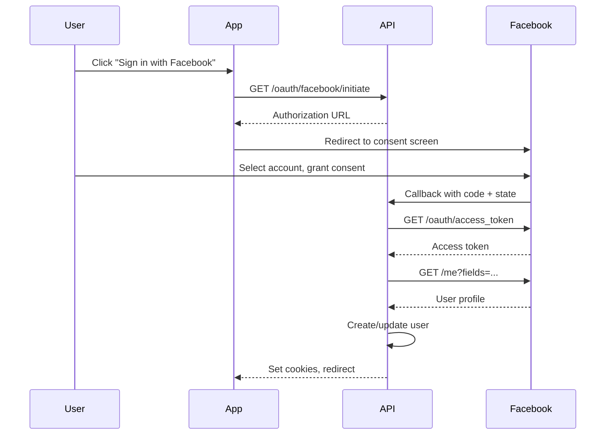

## Overview

<Info>
**Implemented in:** vritti-api-nexus
**Last Updated:** January 2026
**Status:** Production
</Info>

Facebook OAuth allows users to sign in using their Facebook account. The implementation uses OAuth 2.0 with optional PKCE and retrieves user profile information from the Facebook Graph API v18.0.

## What It Does

- Authenticates users via Facebook accounts
- Retrieves email, name, and profile picture via Graph API
- Supports PKCE with S256 challenge method (optional)
- Uses Facebook Graph API v18.0

## Where It's Used

| Location | Purpose |
|----------|---------|
| `vritti-api-nexus/src/modules/cloud-api/auth/oauth/facebook-oauth.provider.ts` | Facebook OAuth provider |
| `vritti-auth/src/pages/login/` | "Sign in with Facebook" button |

## Configuration

### Facebook Developer Console Setup

1. Go to [Facebook Developers](https://developers.facebook.com/)
2. Create or select an app
3. Navigate to **Settings** > **Basic**
4. Note the **App ID** and **App Secret**
5. Go to **Facebook Login** > **Settings**
6. Add Valid OAuth Redirect URIs

### Valid OAuth Redirect URIs

| Environment | Redirect URI |
|-------------|--------------|
| Local | `http://localhost:3000/cloud-api/auth/oauth/facebook/callback` |
| Staging | `https://api-staging.vritti.app/cloud-api/auth/oauth/facebook/callback` |
| Production | `https://api.vritti.app/cloud-api/auth/oauth/facebook/callback` |

### Environment Variables

```bash
# Facebook OAuth credentials
FACEBOOK_CLIENT_ID=your-app-id
FACEBOOK_CLIENT_SECRET=your-app-secret
FACEBOOK_CALLBACK_URL=https://api.vritti.app/cloud-api/auth/oauth/facebook/callback
```

## OAuth Scopes

| Scope | Purpose |
|-------|---------|
| `email` | User's email address |
| `public_profile` | User's name and profile picture |

## Implementation

### Provider Configuration

```typescript
// facebook-oauth.provider.ts
@Injectable()
export class FacebookOAuthProvider implements IOAuthProvider {
  private readonly AUTHORIZATION_URL = 'https://www.facebook.com/v18.0/dialog/oauth';
  private readonly TOKEN_URL = 'https://graph.facebook.com/v18.0/oauth/access_token';
  private readonly USER_INFO_URL = 'https://graph.facebook.com/v18.0/me';

  constructor(private readonly configService: ConfigService) {
    this.clientId = this.configService.getOrThrow<string>('FACEBOOK_CLIENT_ID');
    this.clientSecret = this.configService.getOrThrow<string>('FACEBOOK_CLIENT_SECRET');
    this.redirectUri = this.configService.getOrThrow<string>('FACEBOOK_CALLBACK_URL');
  }
}
```

### Authorization URL

```typescript
getAuthorizationUrl(state: string, codeChallenge?: string): string {
  const params = new URLSearchParams({
    client_id: this.clientId,
    redirect_uri: this.redirectUri,
    response_type: 'code',
    scope: 'email public_profile',
    state,
  });

  // Add PKCE if code challenge provided
  if (codeChallenge) {
    params.append('code_challenge', codeChallenge);
    params.append('code_challenge_method', 'S256');
  }

  return `${this.AUTHORIZATION_URL}?${params.toString()}`;
}
```

### Token Exchange

```typescript
async exchangeCodeForToken(code: string, codeVerifier?: string): Promise<OAuthTokens> {
  const params = {
    code,
    client_id: this.clientId,
    client_secret: this.clientSecret,
    redirect_uri: this.redirectUri,
    code_verifier: codeVerifier,
  };

  const response = await axios.get(this.TOKEN_URL, { params });

  return {
    accessToken: response.data.access_token,
    tokenType: response.data.token_type || 'bearer',
    expiresIn: response.data.expires_in,
  };
}
```

### User Profile via Graph API

```typescript
async getUserProfile(accessToken: string): Promise<OAuthUserProfile> {
  const response = await axios.get(this.USER_INFO_URL, {
    params: {
      fields: 'id,email,first_name,last_name,name,picture',
      access_token: accessToken,
    },
  });

  const data = response.data;

  return {
    provider: 'FACEBOOK',
    providerId: data.id,
    email: data.email,
    displayName: data.name,
    firstName: data.first_name,
    lastName: data.last_name,
    profilePictureUrl: data.picture?.data?.url,
  };
}
```

## Authentication Flow



## Response Data

### Token Response

```json
{
  "access_token": "EAAGm0PX4...",
  "token_type": "bearer",
  "expires_in": 5183944
}
```

### User Profile Response

```json
{
  "id": "10158627492...",
  "name": "John Doe",
  "first_name": "John",
  "last_name": "Doe",
  "email": "john.doe@example.com",
  "picture": {
    "data": {
      "height": 50,
      "is_silhouette": false,
      "url": "https://platform-lookaside.fbsbx.com/...",
      "width": 50
    }
  }
}
```

## Graph API Fields

| Field | Description |
|-------|-------------|
| `id` | Facebook user ID |
| `name` | Full display name |
| `first_name` | First name |
| `last_name` | Last name |
| `email` | Email address |
| `picture` | Profile picture object |

## Error Handling

| Error | Cause | Resolution |
|-------|-------|------------|
| `OAuthException` | Invalid app credentials | Check App ID and Secret |
| `access_denied` | User cancelled consent | Show retry option |
| `invalid_code` | Code expired or used | Restart OAuth flow |

### Error Response Example

```json
{
  "error": {
    "message": "Invalid OAuth access token.",
    "type": "OAuthException",
    "code": 190,
    "fbtrace_id": "ABC123..."
  }
}
```

## App Review

For production apps with public access:

1. Submit app for review in Facebook Developers
2. Required permissions: `email`, `public_profile`
3. Add privacy policy URL
4. Add terms of service URL

<Warning>
Apps in Development Mode can only be used by app admins, developers, and testers. Submit for review to allow all Facebook users.
</Warning>

## Security Best Practices

<CardGroup cols={2}>
  <Card title="HTTPS Only" icon="lock">
    Never use HTTP callback URLs in production
  </Card>
  <Card title="App Secret Protection" icon="key">
    Never expose app secret in client-side code
  </Card>
  <Card title="State Validation" icon="shield">
    Always verify state parameter on callback
  </Card>
  <Card title="Token Storage" icon="database">
    Store tokens encrypted server-side
  </Card>
</CardGroup>

## Troubleshooting

<Accordion title="Error: Invalid OAuth redirect URI">
  **Cause:** Callback URL not registered in Facebook app

  **Solution:**
  - Go to Facebook Login > Settings
  - Add exact callback URL to Valid OAuth Redirect URIs
  - Check for trailing slashes
</Accordion>

<Accordion title="Error: Email not returned">
  **Cause:** User hasn't verified email or denied permission

  **Solution:**
  - Email is only returned if user has verified email with Facebook
  - Check if `email` scope was requested
  - User may have denied email permission
</Accordion>

<Accordion title="Error: App not setup correctly">
  **Cause:** Missing required app configuration

  **Solution:**
  - Ensure Facebook Login product is added to app
  - Check App ID and Secret are correct
  - Verify app is in Live mode for production
</Accordion>

## Related Documentation

<CardGroup cols={2}>
  <Card title="OAuth Overview" icon="key" href="/features/oauth/overview">
    OAuth architecture and PKCE
  </Card>
  <Card title="Google OAuth" icon="google" href="/features/oauth/google">
    Google OAuth setup
  </Card>
  <Card title="Twitter/X OAuth" icon="x-twitter" href="/features/oauth/twitter">
    Twitter/X OAuth setup
  </Card>
  <Card title="Apple OAuth" icon="apple" href="/features/oauth/apple">
    Sign in with Apple setup
  </Card>
</CardGroup>
