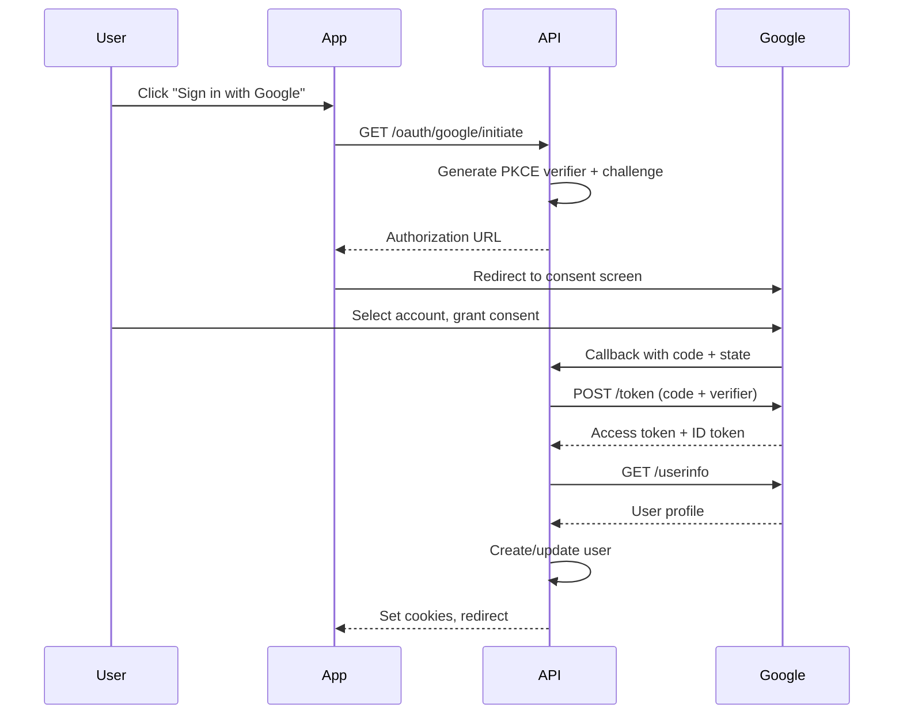

## Overview

<Info>
**Implemented in:** vritti-api-nexus
**Last Updated:** January 2026
**Status:** Production
</Info>

Google OAuth allows users to sign in using their Google account. The implementation uses OAuth 2.0 with PKCE and retrieves user profile information from the Google userinfo endpoint.

## What It Does

- Authenticates users via Google accounts
- Retrieves email, name, and profile picture
- Uses PKCE with S256 challenge method
- Supports both personal and Google Workspace accounts

## Where It's Used

| Location | Purpose |
|----------|---------|
| `vritti-api-nexus/src/modules/cloud-api/auth/oauth/google-oauth.provider.ts` | Google OAuth provider implementation |
| `vritti-auth/src/pages/login/` | "Sign in with Google" button |

## Configuration

### Google Cloud Console Setup

1. Go to [Google Cloud Console](https://console.cloud.google.com/)
2. Create or select a project
3. Navigate to **APIs & Services** > **Credentials**
4. Click **Create Credentials** > **OAuth client ID**
5. Configure the OAuth consent screen:
   - App name: Vritti
   - User support email: your email
   - Authorized domains: vritti.app
6. Create OAuth 2.0 Client ID:
   - Application type: Web application
   - Authorized redirect URIs: Add callback URL

### Authorized Redirect URIs

| Environment | Redirect URI |
|-------------|--------------|
| Local | `http://localhost:3000/cloud-api/auth/oauth/google/callback` |
| Staging | `https://api-staging.vritti.app/cloud-api/auth/oauth/google/callback` |
| Production | `https://api.vritti.app/cloud-api/auth/oauth/google/callback` |

### Environment Variables

```bash
# Google OAuth credentials
GOOGLE_CLIENT_ID=your-client-id.apps.googleusercontent.com
GOOGLE_CLIENT_SECRET=your-client-secret
GOOGLE_CALLBACK_URL=https://api.vritti.app/cloud-api/auth/oauth/google/callback
```

## OAuth Scopes

| Scope | Purpose |
|-------|---------|
| `openid` | OpenID Connect authentication |
| `email` | User's email address |
| `profile` | User's name and profile picture |

## Implementation

### Provider Configuration

```typescript
// google-oauth.provider.ts
@Injectable()
export class GoogleOAuthProvider implements OAuthProvider {
  readonly name = 'google';

  private readonly config = {
    clientId: process.env.GOOGLE_CLIENT_ID,
    clientSecret: process.env.GOOGLE_CLIENT_SECRET,
    callbackUrl: process.env.GOOGLE_CALLBACK_URL,
    scopes: ['openid', 'email', 'profile'],
    authorizationEndpoint: 'https://accounts.google.com/o/oauth2/v2/auth',
    tokenEndpoint: 'https://oauth2.googleapis.com/token',
    userInfoEndpoint: 'https://www.googleapis.com/oauth2/v3/userinfo',
  };
}
```

### Authorization URL

```typescript
getAuthorizationUrl(state: string, codeChallenge: string): string {
  const params = new URLSearchParams({
    client_id: this.config.clientId,
    redirect_uri: this.config.callbackUrl,
    response_type: 'code',
    scope: this.config.scopes.join(' '),
    state,
    code_challenge: codeChallenge,
    code_challenge_method: 'S256',
    access_type: 'offline',  // Get refresh token
    prompt: 'consent',        // Always show consent screen
  });

  return `${this.config.authorizationEndpoint}?${params}`;
}
```

### Token Exchange

```typescript
async exchangeCodeForTokens(code: string, codeVerifier: string): Promise<OAuthTokens> {
  const response = await fetch(this.config.tokenEndpoint, {
    method: 'POST',
    headers: { 'Content-Type': 'application/x-www-form-urlencoded' },
    body: new URLSearchParams({
      client_id: this.config.clientId,
      client_secret: this.config.clientSecret,
      code,
      code_verifier: codeVerifier,
      grant_type: 'authorization_code',
      redirect_uri: this.config.callbackUrl,
    }),
  });

  const data = await response.json();
  return {
    accessToken: data.access_token,
    refreshToken: data.refresh_token,
    expiresIn: data.expires_in,
    idToken: data.id_token,
  };
}
```

### User Profile Retrieval

```typescript
async getUserProfile(accessToken: string): Promise<OAuthUserProfile> {
  const response = await fetch(this.config.userInfoEndpoint, {
    headers: { Authorization: `Bearer ${accessToken}` },
  });

  const data = await response.json();
  return {
    id: data.sub,           // Google user ID
    email: data.email,
    emailVerified: data.email_verified,
    name: data.name,
    givenName: data.given_name,
    familyName: data.family_name,
    picture: data.picture,
  };
}
```

## Authentication Flow



## Response Data

### Token Response

```json
{
  "access_token": "ya29.a0AfB_byC...",
  "expires_in": 3599,
  "refresh_token": "1//0g...",
  "scope": "openid email profile",
  "token_type": "Bearer",
  "id_token": "eyJhbGciOiJSUzI1NiIs..."
}
```

### User Info Response

```json
{
  "sub": "117730574756326251234",
  "name": "John Doe",
  "given_name": "John",
  "family_name": "Doe",
  "picture": "https://lh3.googleusercontent.com/a/...",
  "email": "john.doe@gmail.com",
  "email_verified": true
}
```

## Error Handling

| Error | Cause | Resolution |
|-------|-------|------------|
| `access_denied` | User cancelled consent | Show message, offer retry |
| `invalid_grant` | Code expired or already used | Restart OAuth flow |
| `invalid_client` | Wrong client ID/secret | Check environment variables |
| `redirect_uri_mismatch` | Callback URL not registered | Add URI in Cloud Console |

### Error Response Example

```json
{
  "error": "invalid_grant",
  "error_description": "Code was already redeemed."
}
```

## Security Best Practices

<CardGroup cols={2}>
  <Card title="PKCE Required" icon="shield">
    Always use S256 code challenge method
  </Card>
  <Card title="State Validation" icon="key">
    Verify state parameter on callback
  </Card>
  <Card title="HTTPS Only" icon="lock">
    Never use HTTP callback URLs in production
  </Card>
  <Card title="Scope Minimization" icon="list-check">
    Only request necessary scopes
  </Card>
</CardGroup>

## Testing

### Local Development

1. Create a separate OAuth client for development
2. Add `http://localhost:3000/...` to redirect URIs
3. Use test Google accounts (not production)

### Test Accounts

For testing without real Google accounts:
- Use Google's OAuth Playground for token generation
- Create test users in Google Cloud Console (limited availability)

## Troubleshooting

<Accordion title="Error: redirect_uri_mismatch">
  **Cause:** Callback URL doesn't match registered URIs

  **Solution:**
  - Verify exact URL in Google Cloud Console
  - Check for trailing slashes
  - Ensure protocol matches (http vs https)
</Accordion>

<Accordion title="Error: invalid_client">
  **Cause:** Client credentials are incorrect

  **Solution:**
  - Re-copy client ID and secret from Console
  - Check for extra whitespace in env vars
  - Verify using correct project
</Accordion>

<Accordion title="Consent screen not showing">
  **Cause:** User already granted consent

  **Solution:**
  - Add `prompt=consent` to force consent screen
  - User can revoke at myaccount.google.com/permissions
</Accordion>

<Accordion title="Not getting refresh token">
  **Cause:** Missing parameters or already issued

  **Solution:**
  - Add `access_type=offline` to authorization URL
  - Add `prompt=consent` to force new refresh token
  - Refresh tokens are only issued on first consent
</Accordion>

## Related Documentation

<CardGroup cols={2}>
  <Card title="OAuth Overview" icon="key" href="/features/oauth/overview">
    OAuth architecture and PKCE
  </Card>
  <Card title="Microsoft OAuth" icon="microsoft" href="/features/oauth/microsoft">
    Microsoft/Azure AD setup
  </Card>
  <Card title="Signup & Login" icon="right-to-bracket" href="/features/auth/signup-login">
    Core authentication flows
  </Card>
  <Card title="JWT Sessions" icon="id-card" href="/features/auth/jwt-sessions">
    Session management
  </Card>
</CardGroup>
