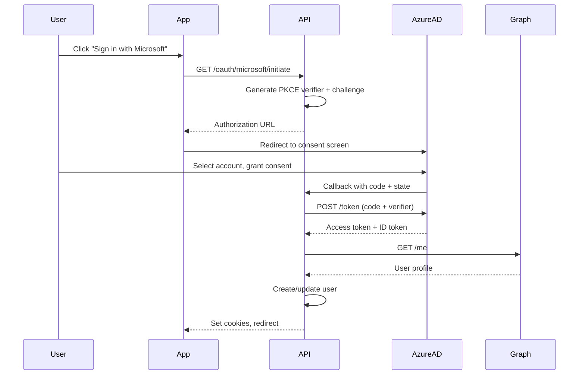

## Overview

<Info>
**Implemented in:** vritti-api-nexus
**Last Updated:** January 2026
**Status:** Production
</Info>

Microsoft OAuth allows users to sign in using their Microsoft account (personal, work, or school). The implementation uses Azure AD OAuth 2.0 with PKCE and retrieves user profile information from Microsoft Graph API.

## What It Does

- Authenticates users via Microsoft accounts
- Supports personal Microsoft accounts and Azure AD accounts
- Retrieves email, name, and profile picture via Microsoft Graph
- Uses PKCE with S256 challenge method
- Compatible with Microsoft 365 and Azure AD tenants

## Where It's Used

| Location | Purpose |
|----------|---------|
| `vritti-api-nexus/src/modules/cloud-api/auth/oauth/microsoft-oauth.provider.ts` | Microsoft OAuth provider implementation |
| `vritti-auth/src/pages/login/` | "Sign in with Microsoft" button |

## Configuration

### Azure Portal Setup

1. Go to [Azure Portal](https://portal.azure.com/)
2. Navigate to **Azure Active Directory** > **App registrations**
3. Click **New registration**
4. Configure the application:
   - Name: Vritti
   - Supported account types: Choose based on your needs
   - Redirect URI: Add callback URL (Web platform)
5. Note the **Application (client) ID**
6. Go to **Certificates & secrets** > **New client secret**
7. Create and save the client secret

### Account Types

| Type | Use Case |
|------|----------|
| Single tenant | Only your organization |
| Multitenant | Any Azure AD organization |
| Personal accounts | Microsoft accounts (outlook.com, hotmail.com) |
| Multitenant + personal | Both work/school and personal accounts |

For Vritti, we use **Multitenant + personal accounts** to support all users.

### Redirect URIs

| Environment | Redirect URI |
|-------------|--------------|
| Local | `http://localhost:3000/cloud-api/auth/oauth/microsoft/callback` |
| Staging | `https://api-staging.vritti.app/cloud-api/auth/oauth/microsoft/callback` |
| Production | `https://api.vritti.app/cloud-api/auth/oauth/microsoft/callback` |

### Environment Variables

```bash
# Microsoft OAuth credentials
MICROSOFT_CLIENT_ID=your-application-client-id
MICROSOFT_CLIENT_SECRET=your-client-secret
MICROSOFT_CALLBACK_URL=https://api.vritti.app/cloud-api/auth/oauth/microsoft/callback
MICROSOFT_TENANT_ID=common  # Use 'common' for multi-tenant
```

## OAuth Scopes

| Scope | Purpose |
|-------|---------|
| `openid` | OpenID Connect authentication |
| `email` | User's email address |
| `profile` | User's name and profile info |
| `User.Read` | Read user profile from Microsoft Graph |

## Implementation

### Provider Configuration

```typescript
// microsoft-oauth.provider.ts
@Injectable()
export class MicrosoftOAuthProvider implements OAuthProvider {
  readonly name = 'microsoft';

  private readonly config = {
    clientId: process.env.MICROSOFT_CLIENT_ID,
    clientSecret: process.env.MICROSOFT_CLIENT_SECRET,
    callbackUrl: process.env.MICROSOFT_CALLBACK_URL,
    tenantId: process.env.MICROSOFT_TENANT_ID || 'common',
    scopes: ['openid', 'email', 'profile', 'User.Read'],
  };

  private get authorizationEndpoint() {
    return `https://login.microsoftonline.com/${this.config.tenantId}/oauth2/v2.0/authorize`;
  }

  private get tokenEndpoint() {
    return `https://login.microsoftonline.com/${this.config.tenantId}/oauth2/v2.0/token`;
  }

  private readonly graphEndpoint = 'https://graph.microsoft.com/v1.0/me';
}
```

### Authorization URL

```typescript
getAuthorizationUrl(state: string, codeChallenge: string): string {
  const params = new URLSearchParams({
    client_id: this.config.clientId,
    redirect_uri: this.config.callbackUrl,
    response_type: 'code',
    scope: this.config.scopes.join(' '),
    state,
    code_challenge: codeChallenge,
    code_challenge_method: 'S256',
    response_mode: 'query',
  });

  return `${this.authorizationEndpoint}?${params}`;
}
```

### Token Exchange

```typescript
async exchangeCodeForTokens(code: string, codeVerifier: string): Promise<OAuthTokens> {
  const response = await fetch(this.tokenEndpoint, {
    method: 'POST',
    headers: { 'Content-Type': 'application/x-www-form-urlencoded' },
    body: new URLSearchParams({
      client_id: this.config.clientId,
      client_secret: this.config.clientSecret,
      code,
      code_verifier: codeVerifier,
      grant_type: 'authorization_code',
      redirect_uri: this.config.callbackUrl,
    }),
  });

  const data = await response.json();
  return {
    accessToken: data.access_token,
    refreshToken: data.refresh_token,
    expiresIn: data.expires_in,
    idToken: data.id_token,
  };
}
```

### User Profile via Microsoft Graph

```typescript
async getUserProfile(accessToken: string): Promise<OAuthUserProfile> {
  const response = await fetch(this.graphEndpoint, {
    headers: { Authorization: `Bearer ${accessToken}` },
  });

  const data = await response.json();
  return {
    id: data.id,                        // Microsoft user ID
    email: data.mail || data.userPrincipalName,
    emailVerified: true,                // Microsoft verifies emails
    name: data.displayName,
    givenName: data.givenName,
    familyName: data.surname,
    picture: null,                      // Requires additional Graph call
  };
}
```

## Authentication Flow



## Response Data

### Token Response

```json
{
  "token_type": "Bearer",
  "scope": "openid profile email User.Read",
  "expires_in": 3600,
  "access_token": "eyJ0eXAiOiJKV1QiLC...",
  "refresh_token": "OAQABAAAAAADCoM...",
  "id_token": "eyJ0eXAiOiJKV1QiLC..."
}
```

### Microsoft Graph User Response

```json
{
  "id": "48d31887-5fad-4d73-a9f5-3c356e68a038",
  "displayName": "John Doe",
  "givenName": "John",
  "surname": "Doe",
  "mail": "john.doe@company.com",
  "userPrincipalName": "john.doe@company.onmicrosoft.com",
  "jobTitle": "Software Engineer",
  "officeLocation": "Building A",
  "preferredLanguage": "en-US"
}
```

## Tenant Configuration

### Common Tenant (Multi-tenant)

```bash
MICROSOFT_TENANT_ID=common
```

Allows any Microsoft account or Azure AD account.

### Organizations Only

```bash
MICROSOFT_TENANT_ID=organizations
```

Allows only Azure AD work/school accounts (no personal accounts).

### Consumers Only

```bash
MICROSOFT_TENANT_ID=consumers
```

Allows only personal Microsoft accounts.

### Specific Tenant

```bash
MICROSOFT_TENANT_ID=your-tenant-id-or-domain
```

Allows only users from a specific Azure AD tenant.

## Error Handling

| Error | Cause | Resolution |
|-------|-------|------------|
| `access_denied` | User cancelled consent | Show message, offer retry |
| `invalid_grant` | Code expired or already used | Restart OAuth flow |
| `invalid_client` | Wrong client ID/secret | Check environment variables |
| `invalid_request` | Missing required parameter | Verify request format |
| `unauthorized_client` | App not authorized for flow | Check Azure app permissions |

### Error Response Example

```json
{
  "error": "invalid_grant",
  "error_description": "AADSTS70000: The provided authorization code or refresh token has expired due to inactivity.",
  "error_codes": [70000],
  "timestamp": "2026-01-27 10:30:00Z",
  "trace_id": "abc123-def456",
  "correlation_id": "xyz789"
}
```

## API Permissions

In Azure Portal, configure the following API permissions:

| Permission | Type | Description |
|------------|------|-------------|
| `openid` | Delegated | Sign users in |
| `email` | Delegated | View users' email address |
| `profile` | Delegated | View users' basic profile |
| `User.Read` | Delegated | Read user profile from Graph |

For the scopes above, admin consent is **not required**.

## Security Best Practices

<CardGroup cols={2}>
  <Card title="PKCE Required" icon="shield">
    Always use S256 code challenge method
  </Card>
  <Card title="State Validation" icon="key">
    Verify state parameter on callback
  </Card>
  <Card title="Client Secret Rotation" icon="rotate">
    Rotate secrets before expiration
  </Card>
  <Card title="Minimal Scopes" icon="list-check">
    Only request necessary permissions
  </Card>
</CardGroup>

## Profile Picture

Microsoft Graph requires a separate call to get the user's profile picture:

```typescript
async getUserPhoto(accessToken: string): Promise<string | null> {
  try {
    const response = await fetch(
      'https://graph.microsoft.com/v1.0/me/photo/$value',
      { headers: { Authorization: `Bearer ${accessToken}` } }
    );

    if (!response.ok) return null;

    const blob = await response.blob();
    return URL.createObjectURL(blob);
  } catch {
    return null;
  }
}
```

## Testing

### Local Development

1. Create a separate app registration for development
2. Add `http://localhost:3000/...` to redirect URIs
3. Use test Microsoft accounts

### Test Accounts

- Create test users in your Azure AD tenant
- Use personal outlook.com accounts for consumer testing

## Troubleshooting

<Accordion title="Error: AADSTS50011 (redirect_uri mismatch)">
  **Cause:** Callback URL doesn't match registered URIs

  **Solution:**
  - Verify exact URL in Azure Portal > App registrations > Redirect URIs
  - Check for trailing slashes
  - Ensure protocol matches (http vs https)
</Accordion>

<Accordion title="Error: AADSTS7000218 (missing client_secret)">
  **Cause:** PKCE not properly configured or secret missing

  **Solution:**
  - Verify client secret is set in environment
  - Check secret hasn't expired in Azure Portal
  - Ensure code_verifier is sent in token request
</Accordion>

<Accordion title="Error: AADSTS65001 (consent not granted)">
  **Cause:** User or admin hasn't consented to permissions

  **Solution:**
  - User must grant consent on first login
  - For admin-consent-required scopes, admin must approve
  - Check Azure Portal for required admin consent
</Accordion>

<Accordion title="No email in user profile">
  **Cause:** User has no email set or using different attribute

  **Solution:**
  - Check both `mail` and `userPrincipalName` fields
  - For personal accounts, email may be in ID token claims
  - Some enterprise accounts hide email addresses
</Accordion>

## Related Documentation

<CardGroup cols={2}>
  <Card title="OAuth Overview" icon="key" href="/features/oauth/overview">
    OAuth architecture and PKCE
  </Card>
  <Card title="Google OAuth" icon="google" href="/features/oauth/google">
    Google OAuth setup
  </Card>
  <Card title="Signup & Login" icon="right-to-bracket" href="/features/auth/signup-login">
    Core authentication flows
  </Card>
  <Card title="JWT Sessions" icon="id-card" href="/features/auth/jwt-sessions">
    Session management
  </Card>
</CardGroup>
