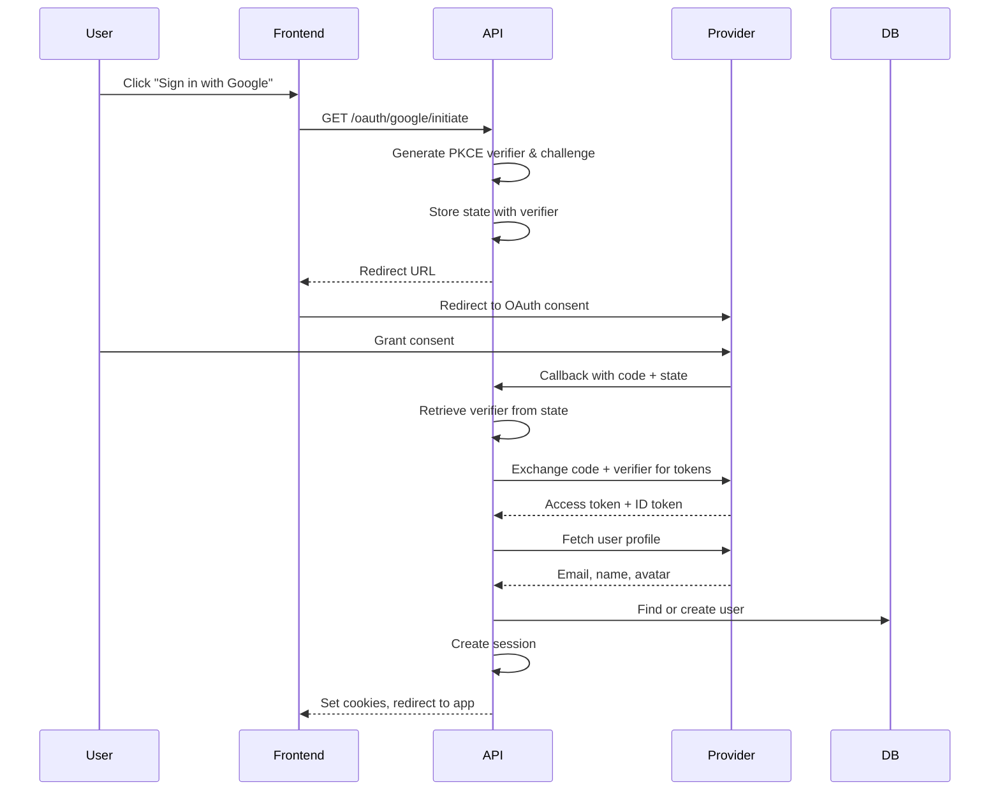
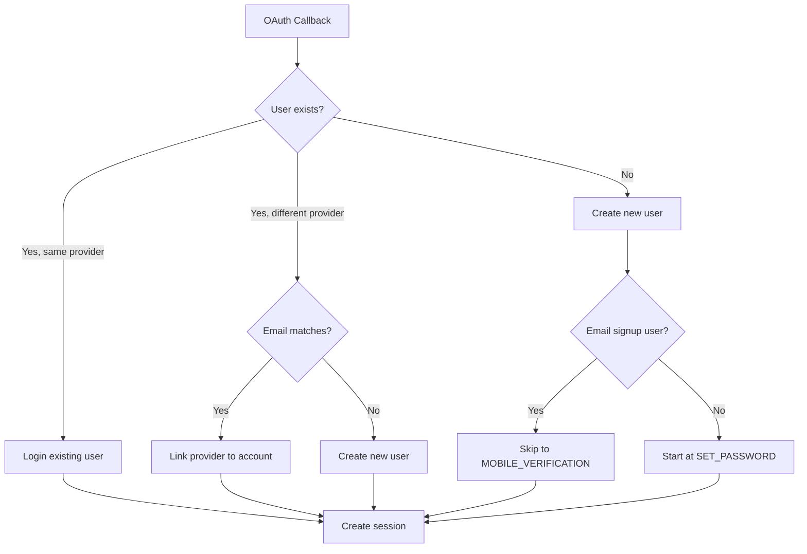

## Overview

<Info>
**Implemented in:** vritti-api-nexus
**Last Updated:** January 2026
**Status:** Production
</Info>

Vritti supports OAuth 2.0 authentication with multiple social providers. The implementation uses PKCE (Proof Key for Code Exchange) for enhanced security, preventing authorization code interception attacks.

## What It Does

- Authenticates users via Google, Microsoft, Apple, Facebook, or Twitter/X
- Uses PKCE with S256 challenge method for security
- Creates new accounts or links to existing accounts
- Handles email collision detection and account linking
- Routes OAuth users through appropriate onboarding steps

## Supported Providers

| Provider | Status | Scopes |
|----------|--------|--------|
| Google | Production | `openid email profile` |
| Microsoft | Production | `openid email profile User.Read` |
| Facebook | Production | `email public_profile` |
| Twitter/X | Production | `tweet.read users.read offline.access` |
| Apple | Production | `name email` |

## Where It's Used

| Location | Purpose |
|----------|---------|
| `vritti-api-nexus/src/modules/cloud-api/auth/oauth/` | Backend OAuth module |
| `vritti-api-nexus/src/modules/cloud-api/auth/oauth/services/oauth.service.ts` | Main OAuth service |
| `vritti-api-nexus/src/modules/cloud-api/auth/oauth/controllers/auth-oauth.controller.ts` | OAuth endpoints |
| `vritti-auth/src/pages/login/` | Login page with OAuth buttons |

## Architecture



## PKCE Implementation

PKCE prevents authorization code interception by requiring a secret verifier that only the original client knows.

### Code Verifier Generation

```typescript
// 32 random bytes, base64url encoded
private generateCodeVerifier(): string {
  return base64url.encode(crypto.randomBytes(32));
}
```

### Code Challenge Generation

```typescript
// SHA-256 hash of verifier, base64url encoded
private generateCodeChallenge(verifier: string): string {
  const hash = crypto
    .createHash('sha256')
    .update(verifier)
    .digest();
  return base64url.encode(hash);
}
```

### Flow

1. **Initiate**: Generate verifier, compute challenge, store verifier with state
2. **Authorize**: Send challenge to provider (not verifier)
3. **Callback**: Retrieve verifier from state, send to token endpoint
4. **Verify**: Provider verifies `SHA256(verifier) === challenge`

## State Management

OAuth state stores temporary data between initiate and callback:

```typescript
interface OAuthState {
  codeVerifier: string;      // PKCE verifier for token exchange
  redirectUrl: string;       // Where to redirect after auth
  linkToUserId?: string;     // If linking OAuth to existing account
}
```

State is stored in Redis with 10-minute TTL:
- **Key**: Random 32-byte state token
- **Value**: Encrypted state object

## API Endpoints

### Initiate OAuth

```http
GET /cloud-api/auth/oauth/:provider/initiate
```

**Path Parameters:**
| Parameter | Description |
|-----------|-------------|
| `provider` | OAuth provider: `google`, `microsoft`, `apple`, `facebook`, `twitter` |

**Query Parameters:**
| Parameter | Required | Description |
|-----------|----------|-------------|
| `redirectUrl` | No | URL to redirect after auth (default: `/`) |

**Response:**
```json
{
  "url": "https://accounts.google.com/o/oauth2/v2/auth?client_id=...&redirect_uri=...&state=...&code_challenge=..."
}
```

### OAuth Callback

```http
GET /cloud-api/auth/oauth/:provider/callback
```

**Query Parameters:**
| Parameter | Description |
|-----------|-------------|
| `code` | Authorization code from provider |
| `state` | State token from initiate |

**Response:** Redirects to `redirectUrl` with session cookies set.

### Link OAuth Provider

```http
POST /cloud-api/auth/oauth/:provider/link
Authorization: Bearer <token>
```

Links an OAuth provider to an existing authenticated account.

## User Creation Flow



### New User from OAuth

When a new user signs up via OAuth:

1. User record created with:
   - `email` from OAuth profile
   - `emailVerified: true` (trusted from provider)
   - `passwordHash: null` (no password yet)
   - `onboardingStep: SET_PASSWORD`

2. OAuth provider linked:
   - Provider type and ID stored
   - Access/refresh tokens encrypted

3. Session created:
   - `ONBOARDING` type session
   - Signup token cookie set

### Existing User Login

When an existing user logs in via OAuth:

1. Provider match found by email or provider ID
2. Full session created (not onboarding)
3. Redirect to dashboard

## Email Collision Handling

When OAuth email matches an existing account:

| Scenario | Behavior |
|----------|----------|
| Same provider already linked | Login to existing account |
| Different provider, same email | Link new provider to account |
| Email exists but no OAuth | Prompt to link or use password |

## Security Considerations

<CardGroup cols={2}>
  <Card title="PKCE" icon="shield">
    S256 challenge method prevents code interception
  </Card>
  <Card title="State Validation" icon="key">
    Random state token prevents CSRF attacks
  </Card>
  <Card title="Token Encryption" icon="lock">
    OAuth tokens encrypted at rest
  </Card>
  <Card title="Short TTL" icon="clock">
    State expires after 10 minutes
  </Card>
</CardGroup>

## Error Handling

| Error | Cause | Resolution |
|-------|-------|------------|
| `INVALID_STATE` | State token expired or invalid | Restart OAuth flow |
| `OAUTH_EMAIL_REQUIRED` | Provider didn't return email | User must grant email permission |
| `PROVIDER_ERROR` | OAuth provider returned error | Check provider error message |
| `ACCOUNT_SUSPENDED` | User account is suspended | Contact support |

## Configuration

### Environment Variables

```bash
# Google OAuth
GOOGLE_CLIENT_ID=your-client-id
GOOGLE_CLIENT_SECRET=your-client-secret
GOOGLE_CALLBACK_URL=https://api.vritti.app/cloud-api/auth/oauth/google/callback

# Microsoft OAuth
MICROSOFT_CLIENT_ID=your-client-id
MICROSOFT_CLIENT_SECRET=your-client-secret
MICROSOFT_CALLBACK_URL=https://api.vritti.app/cloud-api/auth/oauth/microsoft/callback
```

## Related Documentation

<CardGroup cols={3}>
  <Card title="Google OAuth" icon="google" href="/features/oauth/google">
    Google-specific configuration
  </Card>
  <Card title="Microsoft OAuth" icon="microsoft" href="/features/oauth/microsoft">
    Microsoft/Azure AD setup
  </Card>
  <Card title="Facebook OAuth" icon="facebook" href="/features/oauth/facebook">
    Facebook Graph API setup
  </Card>
  <Card title="Twitter/X OAuth" icon="x-twitter" href="/features/oauth/twitter">
    X (Twitter) API v2 setup
  </Card>
  <Card title="Apple OAuth" icon="apple" href="/features/oauth/apple">
    Sign in with Apple setup
  </Card>
  <Card title="Onboarding Flow" icon="list-check" href="/features/onboarding/flow-overview">
    Post-OAuth onboarding steps
  </Card>
</CardGroup>
