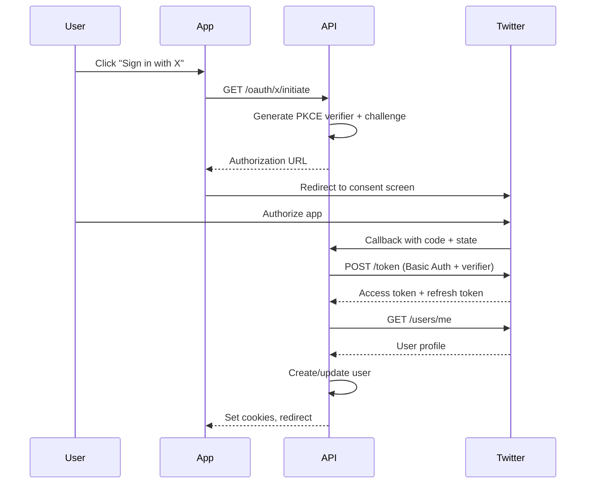

## Overview

<Info>
**Implemented in:** vritti-api-nexus
**Last Updated:** January 2026
**Status:** Production
</Info>

X (Twitter) OAuth allows users to sign in using their X/Twitter account. The implementation uses OAuth 2.0 with PKCE (required by Twitter) and retrieves user profile information from the Twitter API v2.

## What It Does

- Authenticates users via X (Twitter) accounts
- Retrieves username, name, and profile picture via API v2
- Requires PKCE with S256 challenge method
- Uses Basic Auth for token exchange

## Where It's Used

| Location | Purpose |
|----------|---------|
| `vritti-api-nexus/src/modules/cloud-api/auth/oauth/twitter-oauth.provider.ts` | Twitter OAuth provider |
| `vritti-auth/src/pages/login/` | "Sign in with X" button |

## Configuration

### Twitter Developer Portal Setup

1. Go to [Twitter Developer Portal](https://developer.twitter.com/)
2. Create a new project and app
3. Navigate to **User authentication settings**
4. Enable **OAuth 2.0**
5. Set App permissions to **Read**
6. Set Type of App to **Web App**
7. Add callback URL
8. Note the **Client ID** and **Client Secret**

### Callback URLs

| Environment | Callback URL |
|-------------|--------------|
| Local | `http://localhost:3000/cloud-api/auth/oauth/x/callback` |
| Staging | `https://api-staging.vritti.app/cloud-api/auth/oauth/x/callback` |
| Production | `https://api.vritti.app/cloud-api/auth/oauth/x/callback` |

### Environment Variables

```bash
# X (Twitter) OAuth credentials
X_CLIENT_ID=your-client-id
X_CLIENT_SECRET=your-client-secret
X_CALLBACK_URL=https://api.vritti.app/cloud-api/auth/oauth/x/callback
```

## OAuth Scopes

| Scope | Purpose |
|-------|---------|
| `tweet.read` | Read tweets (required for basic access) |
| `users.read` | Read user profile information |
| `offline.access` | Get refresh token for long-lived access |

<Note>
Twitter doesn't provide email by default. The `users.read` scope is required to get username and profile information.
</Note>

## Implementation

### Provider Configuration

```typescript
// twitter-oauth.provider.ts
@Injectable()
export class TwitterOAuthProvider implements IOAuthProvider {
  private readonly AUTHORIZATION_URL = 'https://twitter.com/i/oauth2/authorize';
  private readonly TOKEN_URL = 'https://api.twitter.com/2/oauth2/token';
  private readonly USER_INFO_URL = 'https://api.twitter.com/2/users/me';

  constructor(private readonly configService: ConfigService) {
    this.clientId = this.configService.getOrThrow<string>('X_CLIENT_ID');
    this.clientSecret = this.configService.getOrThrow<string>('X_CLIENT_SECRET');
    this.redirectUri = this.configService.getOrThrow<string>('X_CALLBACK_URL');
  }
}
```

### Authorization URL

```typescript
getAuthorizationUrl(state: string, codeChallenge?: string): string {
  const params = new URLSearchParams({
    client_id: this.clientId,
    redirect_uri: this.redirectUri,
    response_type: 'code',
    scope: 'tweet.read users.read offline.access',
    state,
  });

  // Twitter OAuth 2.0 requires PKCE
  if (codeChallenge) {
    params.append('code_challenge', codeChallenge);
    params.append('code_challenge_method', 'S256');
  }

  return `${this.AUTHORIZATION_URL}?${params.toString()}`;
}
```

### Token Exchange with Basic Auth

```typescript
async exchangeCodeForToken(code: string, codeVerifier?: string): Promise<OAuthTokens> {
  const data = {
    code,
    grant_type: 'authorization_code',
    client_id: this.clientId,
    redirect_uri: this.redirectUri,
    code_verifier: codeVerifier,
  };

  // Twitter uses Basic Auth header for client authentication
  const authHeader = Buffer.from(`${this.clientId}:${this.clientSecret}`).toString('base64');

  const response = await axios.post(this.TOKEN_URL, data, {
    headers: {
      'Content-Type': 'application/x-www-form-urlencoded',
      Authorization: `Basic ${authHeader}`,
    },
  });

  return {
    accessToken: response.data.access_token,
    refreshToken: response.data.refresh_token,
    tokenType: response.data.token_type,
    expiresIn: response.data.expires_in,
  };
}
```

### User Profile via API v2

```typescript
async getUserProfile(accessToken: string): Promise<OAuthUserProfile> {
  const response = await axios.get(this.USER_INFO_URL, {
    headers: {
      Authorization: `Bearer ${accessToken}`,
    },
    params: {
      'user.fields': 'profile_image_url,name,username',
    },
  });

  const data = response.data.data;

  // Twitter doesn't provide email by default
  const email = data.email || `${data.username}@twitter.com`;

  return {
    provider: 'X',
    providerId: data.id,
    email,
    displayName: data.name,
    firstName: data.name?.split(' ')[0],
    lastName: data.name?.split(' ').slice(1).join(' '),
    profilePictureUrl: data.profile_image_url,
  };
}
```

## Authentication Flow



## Response Data

### Token Response

```json
{
  "token_type": "bearer",
  "expires_in": 7200,
  "access_token": "VWdEaHBUQ...",
  "refresh_token": "bWRWYlp...",
  "scope": "tweet.read users.read offline.access"
}
```

### User Profile Response

```json
{
  "data": {
    "id": "12345678901234567890",
    "name": "John Doe",
    "username": "johndoe",
    "profile_image_url": "https://pbs.twimg.com/profile_images/.../normal.jpg"
  }
}
```

## User Fields

| Field | Description |
|-------|-------------|
| `id` | Twitter user ID |
| `name` | Display name |
| `username` | Twitter handle (without @) |
| `profile_image_url` | Profile picture URL |

## PKCE Requirement

<Warning>
Twitter OAuth 2.0 **requires** PKCE. The authorization request will fail without a valid code challenge.
</Warning>

```typescript
// PKCE is mandatory for Twitter
if (!codeChallenge) {
  this.logger.warn('Twitter OAuth 2.0 requires PKCE');
}
```

## Error Handling

| Error | Cause | Resolution |
|-------|-------|------------|
| `invalid_request` | Missing PKCE or parameters | Ensure code_challenge is provided |
| `unauthorized_client` | App not configured correctly | Check OAuth 2.0 settings |
| `access_denied` | User denied authorization | Show retry option |
| `invalid_grant` | Code expired or used | Restart OAuth flow |

### Error Response Example

```json
{
  "error": "invalid_request",
  "error_description": "Value passed for the code_verifier is incorrect."
}
```

## Email Handling

Twitter doesn't provide email addresses through OAuth 2.0 by default. The implementation handles this by:

1. Using the username as a fallback email: `username@twitter.com`
2. Prompting users to add email after registration (optional)

```typescript
// Fallback email for Twitter users
const email = data.email || `${data.username}@twitter.com`;
```

## API Access Levels

| Level | Access |
|-------|--------|
| Essential | Read-only access to public data |
| Elevated | Higher rate limits, additional endpoints |
| Academic | For research purposes |

For basic OAuth login, **Essential** access is sufficient.

## Security Best Practices

<CardGroup cols={2}>
  <Card title="PKCE Required" icon="shield">
    Always use S256 code challenge
  </Card>
  <Card title="Basic Auth" icon="key">
    Use Basic Auth header for token exchange
  </Card>
  <Card title="State Validation" icon="lock">
    Verify state parameter on callback
  </Card>
  <Card title="Refresh Tokens" icon="rotate">
    Use offline.access scope for refresh tokens
  </Card>
</CardGroup>

## Troubleshooting

<Accordion title="Error: PKCE verification failed">
  **Cause:** Code verifier doesn't match code challenge

  **Solution:**
  - Ensure code_verifier is stored correctly with state
  - Verify S256 hash algorithm is used
  - Check base64url encoding is correct
</Accordion>

<Accordion title="Error: Invalid client credentials">
  **Cause:** Wrong Client ID or Secret

  **Solution:**
  - Re-copy credentials from Developer Portal
  - Ensure Basic Auth header is correctly encoded
  - Check environment variables are set
</Accordion>

<Accordion title="Error: Callback URL mismatch">
  **Cause:** Redirect URI not registered

  **Solution:**
  - Add exact URL in Developer Portal
  - Check for http vs https
  - Verify path matches exactly
</Accordion>

<Accordion title="No profile picture returned">
  **Cause:** User has default avatar or missing field

  **Solution:**
  - Ensure `profile_image_url` is in user.fields
  - Handle null/undefined gracefully
  - Use default avatar fallback
</Accordion>

## Related Documentation

<CardGroup cols={2}>
  <Card title="OAuth Overview" icon="key" href="/features/oauth/overview">
    OAuth architecture and PKCE
  </Card>
  <Card title="Google OAuth" icon="google" href="/features/oauth/google">
    Google OAuth setup
  </Card>
  <Card title="Facebook OAuth" icon="facebook" href="/features/oauth/facebook">
    Facebook OAuth setup
  </Card>
  <Card title="Apple OAuth" icon="apple" href="/features/oauth/apple">
    Sign in with Apple setup
  </Card>
</CardGroup>
