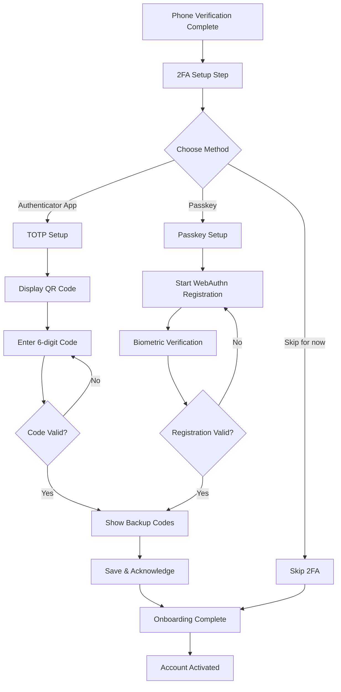

## Overview

<Info>
**Implemented in:** vritti-api-nexus
**Last Updated:** January 2026
**Status:** Production
</Info>

Two-Factor Authentication (2FA) setup is Step 4 of onboarding - the final step before account activation. Users can choose between authenticator apps (TOTP) or passkeys (biometric), or skip 2FA entirely and enable it later.

## What It Does

- Generates TOTP secrets with QR codes for authenticator apps
- Supports passkey registration via WebAuthn (Touch ID, Face ID)
- Generates 10 one-time backup/recovery codes
- Validates setup before storing credentials
- Allows users to skip 2FA and complete onboarding
- Marks onboarding as complete upon 2FA setup or skip

## Where It's Used

| Location | Purpose |
|----------|---------|
| `vritti-api-nexus/src/modules/cloud-api/onboarding/controllers/two-factor.controller.ts` | 2FA setup endpoints |
| `vritti-api-nexus/src/modules/cloud-api/onboarding/services/two-factor-auth.service.ts` | Setup flow logic |
| `vritti-api-nexus/src/modules/cloud-api/onboarding/services/totp.service.ts` | TOTP generation/validation |
| `vritti-api-nexus/src/modules/cloud-api/onboarding/services/webauthn.service.ts` | Passkey registration |
| `vritti-auth/src/pages/onboarding/MFASetupFlowPage.tsx` | Frontend setup flow |
| `vritti-auth/src/components/onboarding/mfa/` | Setup components |

## Setup Flow



## API Endpoints

### TOTP Setup

#### Initiate TOTP Setup

```http
POST /cloud-api/onboarding/2fa/totp/setup
Authorization: Bearer <signup_token>
```

**Response:**
```json
{
  "qrCodeDataUrl": "data:image/png;base64,iVBORw0KGgo...",
  "manualSetupKey": "JBSW Y3DP EHPK 3PXP",
  "issuer": "Vritti",
  "accountName": "user@example.com"
}
```

#### Verify TOTP Setup

```http
POST /cloud-api/onboarding/2fa/totp/verify
Authorization: Bearer <signup_token>
Content-Type: application/json

{
  "token": "123456"
}
```

**Success Response:**
```json
{
  "success": true,
  "message": "Two-factor authentication has been enabled successfully",
  "backupCodes": [
    "ABCD1234",
    "EFGH5678",
    "IJKL9012",
    "MNOP3456",
    "QRST7890",
    "UVWX1234",
    "YZAB5678",
    "CDEF9012",
    "GHIJ3456",
    "KLMN7890"
  ],
  "warning": "Store these backup codes in a safe place. Each code can only be used once."
}
```

### Passkey Setup

#### Initiate Passkey Setup

```http
POST /cloud-api/onboarding/2fa/passkey/setup
Authorization: Bearer <signup_token>
```

**Response:**
```json
{
  "options": {
    "challenge": "base64url-encoded-challenge",
    "rp": {
      "name": "Vritti",
      "id": "vritti.io"
    },
    "user": {
      "id": "base64url-user-id",
      "name": "user@example.com",
      "displayName": "John Doe"
    },
    "pubKeyCredParams": [
      { "alg": -7, "type": "public-key" },
      { "alg": -257, "type": "public-key" }
    ],
    "authenticatorSelection": {
      "authenticatorAttachment": "platform",
      "userVerification": "required",
      "residentKey": "preferred"
    },
    "timeout": 300000
  }
}
```

#### Verify Passkey Setup

```http
POST /cloud-api/onboarding/2fa/passkey/verify
Authorization: Bearer <signup_token>
Content-Type: application/json

{
  "credential": {
    "id": "credential-id",
    "rawId": "base64url-raw-id",
    "type": "public-key",
    "response": {
      "clientDataJSON": "base64url-data",
      "attestationObject": "base64url-attestation"
    }
  }
}
```

### Skip 2FA

```http
POST /cloud-api/onboarding/2fa/skip
Authorization: Bearer <signup_token>
```

**Response:**
```json
{
  "success": true,
  "message": "Two-factor authentication skipped. You can enable it later in settings."
}
```

### Get 2FA Status

```http
GET /cloud-api/onboarding/2fa/status
Authorization: Bearer <signup_token>
```

**Response:**
```json
{
  "isEnabled": false,
  "method": null,
  "backupCodesRemaining": 0,
  "lastUsedAt": null,
  "createdAt": null
}
```

## TOTP Implementation

### Secret Generation

```typescript
// totp.service.ts
@Injectable()
export class TotpService {
  generateTotpSecret(): string {
    return authenticator.generateSecret(20); // 20-byte base32 secret
  }

  generateKeyUri(accountName: string, secret: string): string {
    return authenticator.keyuri(accountName, 'Vritti', secret);
  }

  async generateQrCodeDataUrl(keyUri: string): Promise<string> {
    return await QRCode.toDataURL(keyUri, {
      width: 200,
      margin: 2,
    });
  }

  formatSecretForDisplay(secret: string): string {
    // Format as "XXXX XXXX XXXX XXXX" for manual entry
    return secret.match(/.{1,4}/g)?.join(' ') || secret;
  }
}
```

### Token Verification

```typescript
// totp.service.ts
constructor() {
  authenticator.options = {
    digits: 6,    // 6-digit codes
    step: 30,     // 30-second window
    window: 1,    // Allow ±1 step for clock drift
  };
}

verifyToken(token: string, secret: string): boolean {
  return authenticator.verify({ token, secret });
}
```

### Setup Flow Service

```typescript
// two-factor-auth.service.ts
async initiateTotpSetup(userId: string): Promise<TotpSetupResponseDto> {
  const user = await this.userService.findById(userId);

  // Check for existing 2FA
  const existing = await this.twoFactorAuthRepo.findActiveByUserId(userId);
  if (existing) {
    throw new BadRequestException('2FA is already enabled');
  }

  // Generate secret and QR code
  const secret = this.totpService.generateTotpSecret();
  const keyUri = this.totpService.generateKeyUri(user.email, secret);
  const qrCodeDataUrl = await this.totpService.generateQrCodeDataUrl(keyUri);

  // Store pending setup with 10-minute TTL
  this.pendingSetups.set(userId, {
    secret,
    createdAt: new Date(),
    expiresAt: addMinutes(new Date(), 10),
  });

  return {
    qrCodeDataUrl,
    manualSetupKey: this.totpService.formatSecretForDisplay(secret),
    issuer: 'Vritti',
    accountName: user.email,
  };
}

async verifyTotpSetup(userId: string, token: string): Promise<BackupCodesResponseDto> {
  const pending = this.pendingSetups.get(userId);

  if (!pending) {
    throw new BadRequestException('No pending 2FA setup found');
  }

  if (new Date() > pending.expiresAt) {
    this.pendingSetups.delete(userId);
    throw new BadRequestException('Setup expired. Please start again.');
  }

  // Verify the token
  const isValid = this.totpService.verifyToken(token, pending.secret);
  if (!isValid) {
    throw new BadRequestException('Invalid verification code');
  }

  // Generate and hash backup codes
  const backupCodes = this.totpService.generateBackupCodes();
  const hashedCodes = await this.totpService.hashBackupCodes(backupCodes);

  // Store 2FA configuration
  await this.twoFactorAuthRepo.createTotp(userId, pending.secret, hashedCodes);

  // Clean up and complete onboarding
  this.pendingSetups.delete(userId);
  await this.userService.update(userId, {
    onboardingStep: 'COMPLETE',
    accountStatus: 'ACTIVE',
  });

  return {
    success: true,
    message: 'Two-factor authentication has been enabled successfully',
    backupCodes,
    warning: 'Store these backup codes in a safe place. Each code can only be used once.',
  };
}
```

## Passkey Implementation

### Registration Options

```typescript
// webauthn.service.ts
async generateRegistrationOptions(
  userId: string,
  userEmail: string,
  userName: string,
  existingCredentials: Array<{ id: string; transports?: string[] }> = [],
) {
  return generateRegistrationOptions({
    rpName: this.rpName,
    rpID: this.rpID,
    userID: userId,
    userName: userEmail,
    userDisplayName: userName,
    attestationType: 'none',
    authenticatorSelection: {
      authenticatorAttachment: 'platform',    // Prefer platform (Touch ID, Face ID)
      userVerification: 'required',           // Require biometric/PIN
      residentKey: 'preferred',               // Discoverable credential preferred
    },
    excludeCredentials: existingCredentials.map(cred => ({
      id: this.base64urlToUint8Array(cred.id),
      type: 'public-key',
      transports: cred.transports as AuthenticatorTransportFuture[],
    })),
    supportedAlgorithmIDs: [-7, -257],        // ES256 and RS256
    timeout: 300000,                          // 5-minute timeout
  });
}
```

### Passkey Verification

```typescript
// two-factor-auth.service.ts
async verifyPasskeySetup(
  userId: string,
  credential: RegistrationResponseJSON,
): Promise<BackupCodesResponseDto> {
  const pending = this.pendingPasskeyRegistrations.get(userId);

  if (!pending) {
    throw new BadRequestException('No pending passkey registration');
  }

  if (new Date() > pending.expiresAt) {
    this.pendingPasskeyRegistrations.delete(userId);
    throw new BadRequestException('Registration expired. Please start again.');
  }

  // Verify registration
  const verification = await this.webAuthnService.verifyRegistration(
    credential,
    pending.challenge,
  );

  if (!verification.verified || !verification.registrationInfo) {
    throw new BadRequestException('Passkey verification failed');
  }

  // Generate and hash backup codes
  const backupCodes = this.totpService.generateBackupCodes();
  const hashedCodes = await this.totpService.hashBackupCodes(backupCodes);

  const { credentialID, credentialPublicKey, counter } = verification.registrationInfo;

  // Store passkey credentials
  await this.twoFactorAuthRepo.createPasskey(
    userId,
    this.webAuthnService.uint8ArrayToBase64url(credentialID),
    this.webAuthnService.uint8ArrayToBase64url(credentialPublicKey),
    counter,
    credential.response.transports || [],
    hashedCodes,
  );

  // Clean up and complete onboarding
  this.pendingPasskeyRegistrations.delete(userId);
  await this.userService.update(userId, {
    onboardingStep: 'COMPLETE',
    accountStatus: 'ACTIVE',
  });

  return {
    success: true,
    message: 'Passkey has been registered successfully',
    backupCodes,
    warning: 'Store these backup codes in a safe place.',
  };
}
```

## Backup Codes

### Generation

```typescript
// totp.service.ts
generateBackupCodes(): string[] {
  const codes: string[] = [];
  // Exclude confusing characters: 0, O, 1, I, L
  const chars = 'ABCDEFGHJKMNPQRSTUVWXYZ23456789';

  for (let i = 0; i < 10; i++) {
    let code = '';
    for (let j = 0; j < 8; j++) {
      code += chars[Math.floor(Math.random() * chars.length)];
    }
    codes.push(code);
  }
  return codes;
}
```

### Storage & Verification

```typescript
// totp.service.ts
async hashBackupCodes(codes: string[]): Promise<string[]> {
  return Promise.all(
    codes.map(code => this.encryptionService.hashOtp(code))
  );
}

async verifyBackupCode(
  code: string,
  hashedCodes: string[],
): Promise<{ valid: boolean; remainingHashes: string[] }> {
  for (let i = 0; i < hashedCodes.length; i++) {
    const isMatch = await this.encryptionService.compareOtp(
      code.toUpperCase(),
      hashedCodes[i],
    );
    if (isMatch) {
      // Remove used code
      const remainingHashes = [
        ...hashedCodes.slice(0, i),
        ...hashedCodes.slice(i + 1)
      ];
      return { valid: true, remainingHashes };
    }
  }
  return { valid: false, remainingHashes: hashedCodes };
}
```

## Database Schema

```typescript
// two_factor_auth table
export const twoFactorAuth = cloudSchema.table('two_factor_auth', {
  id: uuid('id').primaryKey().defaultRandom(),
  userId: uuid('user_id').notNull().references(() => users.id),
  method: twoFactorMethodEnum('method').notNull(),  // 'TOTP' | 'PASSKEY'
  isActive: boolean('is_active').notNull().default(true),

  // TOTP fields
  totpSecret: varchar('totp_secret', { length: 255 }),
  totpBackupCodes: text('totp_backup_codes'),  // JSON array of bcrypt hashes

  // Passkey fields
  passkeyCredentialId: varchar('passkey_credential_id', { length: 255 }).unique(),
  passkeyPublicKey: text('passkey_public_key'),
  passkeyCounter: integer('passkey_counter'),
  passkeyTransports: varchar('passkey_transports', { length: 255 }),

  createdAt: timestamp('created_at').notNull().defaultNow(),
  updatedAt: timestamp('updated_at').notNull().defaultNow(),
  lastUsedAt: timestamp('last_used_at'),
});
```

## Frontend Integration

### TOTP Setup Component

```typescript
// vritti-auth - AuthenticatorSetup.tsx
const AuthenticatorSetup = () => {
  const { data: setupData, isLoading } = useTotpSetup();
  const { mutate: verifyTotp, isPending } = useVerifyTotp();
  const [code, setCode] = useState('');

  const handleVerify = () => {
    verifyTotp({ token: code }, {
      onSuccess: (data) => {
        setBackupCodes(data.backupCodes);
        setStep('backup-codes');
      },
    });
  };

  if (isLoading) return <Spinner />;

  return (
    <div>
      <h2>Scan QR Code</h2>
      <p>Use your authenticator app to scan the QR code below</p>

      <div className="w-[200px] h-[200px] bg-white p-4 rounded">
        
      </div>

      <div className="mt-4">
        <p className="text-sm text-gray-500">Or enter this key manually:</p>
        <code className="font-mono">{setupData.manualSetupKey}</code>
      </div>

      <div className="mt-6">
        <label>Enter 6-digit code</label>
        <OTPInput
          length={6}
          value={code}
          onChange={setCode}
          onComplete={handleVerify}
        />
      </div>

      <Button onClick={handleVerify} loading={isPending}>
        Verify
      </Button>
    </div>
  );
};
```

### Backup Codes Display

```typescript
// vritti-auth - BackupCodesDisplay.tsx
const BackupCodesDisplay = ({ codes, onConfirm }) => {
  const [confirmed, setConfirmed] = useState(false);

  const handleCopyAll = () => {
    navigator.clipboard.writeText(codes.join('\n'));
    toast.success('Backup codes copied!');
  };

  const handleDownload = () => {
    const text = `Vritti Backup Codes\n\n${codes.join('\n')}\n\nEach code can only be used once.`;
    const blob = new Blob([text], { type: 'text/plain' });
    const url = URL.createObjectURL(blob);
    const a = document.createElement('a');
    a.href = url;
    a.download = 'vritti-backup-codes.txt';
    a.click();
  };

  return (
    <div>
      <h2>Save Your Backup Codes</h2>

      <Warning>
        Store these codes in a safe place. You'll need them if you lose access
        to your authenticator app. Each code can only be used once.
      </Warning>

      <div className="grid grid-cols-2 gap-2 mt-4">
        {codes.map((code, index) => (
          <div key={index} className="font-mono text-center p-2 bg-gray-100 rounded">
            {code}
          </div>
        ))}
      </div>

      <div className="flex gap-2 mt-4">
        <Button variant="outline" onClick={handleCopyAll}>
          Copy All
        </Button>
        <Button variant="outline" onClick={handleDownload}>
          Download
        </Button>
      </div>

      <Checkbox
        checked={confirmed}
        onCheckedChange={setConfirmed}
        label="I have saved my backup codes"
      />

      <Button onClick={onConfirm} disabled={!confirmed}>
        Continue
      </Button>
    </div>
  );
};
```

### Passkey Setup Component

```typescript
// vritti-auth - PasskeySetup.tsx
const PasskeySetup = () => {
  const { mutate: initiateSetup, isPending: isInitiating } = usePasskeySetup();
  const { mutate: verifySetup, isPending: isVerifying } = useVerifyPasskey();

  const handleSetup = async () => {
    initiateSetup(undefined, {
      onSuccess: async (data) => {
        try {
          // Call WebAuthn API
          const credential = await startRegistration(data.options);

          // Send credential to backend
          verifySetup({ credential }, {
            onSuccess: (result) => {
              setBackupCodes(result.backupCodes);
              setStep('backup-codes');
            },
          });
        } catch (error) {
          if (error.name === 'NotAllowedError') {
            toast.error('Registration was cancelled');
          } else {
            toast.error('Failed to register passkey');
          }
        }
      },
    });
  };

  return (
    <div>
      <h2>Set Up Passkey</h2>
      <p>Use Touch ID, Face ID, or your device's built-in security</p>

      <div className="text-center my-8">
        <FingerprintIcon className="w-16 h-16 mx-auto text-primary" />
      </div>

      <Button onClick={handleSetup} loading={isInitiating || isVerifying}>
        Set Up Passkey
      </Button>
    </div>
  );
};
```

## Skip 2FA Option

Users can skip 2FA setup during onboarding and enable it later:

```typescript
// two-factor-auth.service.ts
async skip2FASetup(userId: string): Promise<void> {
  // Clean up any pending setups
  this.pendingSetups.delete(userId);
  this.pendingPasskeyRegistrations.delete(userId);

  // Complete onboarding without 2FA
  await this.userService.update(userId, {
    onboardingStep: 'COMPLETE',
    accountStatus: 'ACTIVE',
  });

  this.logger.log(`User ${userId} skipped 2FA setup`);
}
```

## Security Features

<CardGroup cols={2}>
  <Card title="Setup Timeout" icon="clock">
    TOTP setup expires in 10 minutes, Passkey in 5 minutes
  </Card>
  <Card title="Code Hashing" icon="lock">
    Backup codes hashed with bcrypt before storage
  </Card>
  <Card title="Clock Drift" icon="rotate">
    TOTP allows ±30 seconds for time differences
  </Card>
  <Card title="One-Time Use" icon="check">
    Backup codes are removed after use
  </Card>
  <Card title="User Verification" icon="fingerprint">
    Passkeys require biometric or PIN confirmation
  </Card>
  <Card title="Counter Checking" icon="shield">
    Passkey counters prevent credential cloning
  </Card>
</CardGroup>

## Configuration

| Setting | TOTP | Passkey |
|---------|------|---------|
| Setup Timeout | 10 minutes | 5 minutes |
| Code Digits | 6 | N/A |
| Time Step | 30 seconds | N/A |
| Clock Drift Window | ±1 step | N/A |
| Backup Codes | 10 codes, 8 chars each | 10 codes, 8 chars each |
| Algorithms | SHA-1 (TOTP standard) | ES256, RS256 |

## Error Handling

| Error | Cause | Resolution |
|-------|-------|------------|
| `No pending 2FA setup found` | Setup expired or not initiated | Start setup again |
| `Setup expired` | Took longer than timeout | Reinitiate setup |
| `Invalid verification code` | Wrong TOTP code | Wait for next code, try again |
| `2FA is already enabled` | User already has 2FA | Skip or disable existing first |
| `Passkey verification failed` | WebAuthn verification error | Try again or use TOTP |

## Troubleshooting

<Accordion title="QR code not scanning">
  **Causes:**
  - Camera focus issues
  - QR code too small

  **Solution:**
  - Use the manual setup key instead
  - In your authenticator app, select "Enter manually"
  - Account name: your email address
  - Key: copy the displayed code (e.g., "JBSW Y3DP EHPK 3PXP")
</Accordion>

<Accordion title="TOTP code always invalid">
  **Causes:**
  - Device time is incorrect
  - Code entered too late

  **Solution:**
  - Enable automatic time sync on your device
  - Wait for the next code and enter it immediately
  - Check for typos when entering
</Accordion>

<Accordion title="Passkey registration fails">
  **Causes:**
  - Browser doesn't support WebAuthn
  - No platform authenticator available
  - User cancelled the prompt

  **Solution:**
  - Ensure using a modern browser (Chrome, Safari, Firefox, Edge)
  - Device must have biometric or PIN capability
  - Try TOTP method as alternative
</Accordion>

<Accordion title="Lost backup codes">
  **Cause:** All backup codes used or lost

  **Solution:**
  - Log in with primary 2FA method
  - Go to Settings > Security
  - Regenerate backup codes (will invalidate old ones)
  - If locked out, contact support for identity verification
</Accordion>

## Related Documentation

<CardGroup cols={2}>
  <Card title="Onboarding Flow" icon="list-check" href="/features/onboarding/flow-overview">
    Complete onboarding process
  </Card>
  <Card title="Phone Verification" icon="phone" href="/features/onboarding/phone-verification">
    Previous step: Phone verification
  </Card>
  <Card title="Multi-Factor Auth" icon="shield" href="/features/mfa">
    MFA verification during login
  </Card>
  <Card title="Passkeys" icon="fingerprint" href="/features/passkeys">
    Passkey authentication details
  </Card>
</CardGroup>
