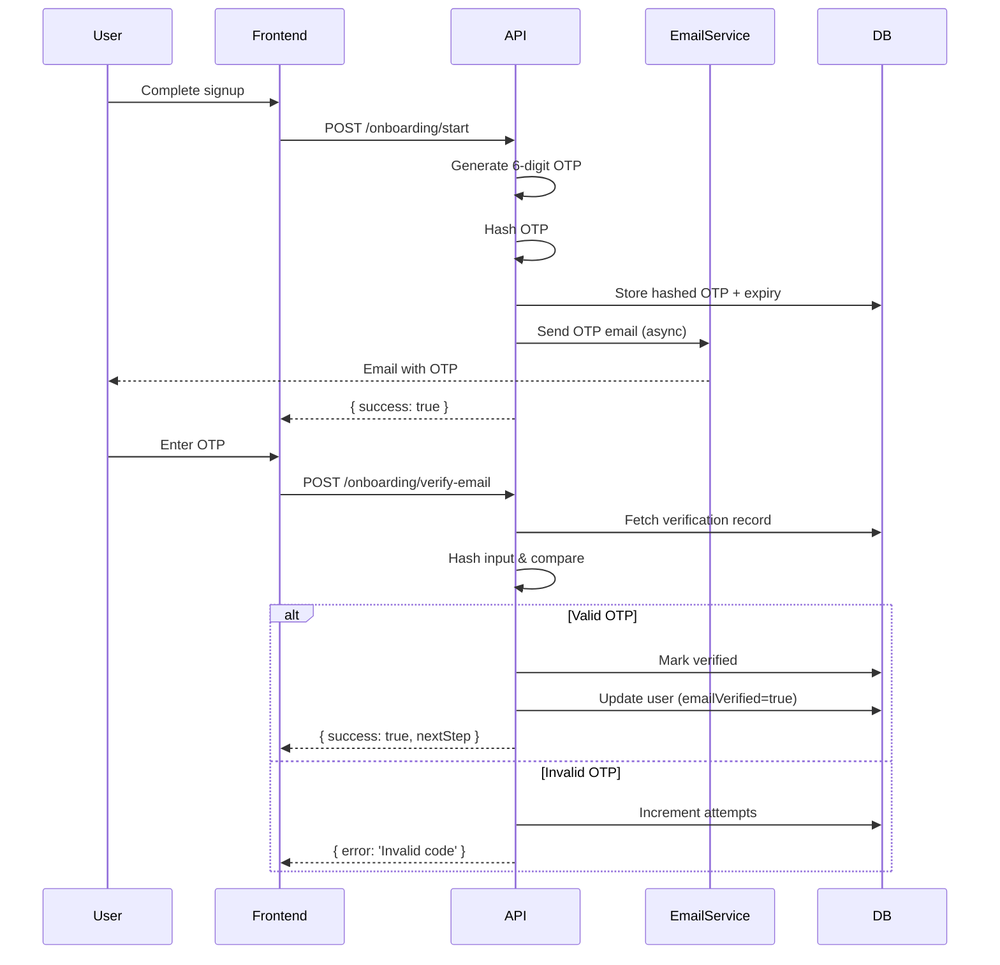

## Overview

<Info>
**Implemented in:** vritti-api-nexus
**Last Updated:** January 2026
**Status:** Production
</Info>

Email verification is the first step of user onboarding. Users receive a 6-digit OTP code via email and must enter it to verify ownership of their email address.

## What It Does

- Sends 6-digit OTP code to user's email address
- Validates OTP with expiry and attempt limits
- Marks email as verified on success
- Advances user to the next onboarding step
- Supports OTP resend with rate limiting

## Where It's Used

| Location | Purpose |
|----------|---------|
| `vritti-api-nexus/src/modules/cloud-api/onboarding/services/email-verification.service.ts` | OTP generation and validation |
| `vritti-api-nexus/src/modules/cloud-api/onboarding/repositories/email-verification.repository.ts` | Verification record storage |
| `vritti-api-nexus/src/modules/cloud-api/onboarding/services/otp.service.ts` | OTP utilities |
| `vritti-auth/src/pages/onboarding/EmailVerificationPage.tsx` | Frontend OTP entry |

## Flow Diagram



## OTP Configuration

| Setting | Value | Description |
|---------|-------|-------------|
| Length | 6 digits | Numeric code (000000-999999) |
| Expiry | 10 minutes | Time before code becomes invalid |
| Max Attempts | 5 | Attempts before lockout |
| Hash Algorithm | bcrypt | OTP stored hashed for security |

## API Endpoints

### Start Onboarding

Triggers the initial OTP email after signup.

```http
POST /cloud-api/onboarding/start
Authorization: Bearer <signup_token>
```

**Response:**
```json
{
  "success": true,
  "message": "Verification email sent"
}
```

### Verify Email

Submit the OTP to verify email ownership.

```http
POST /cloud-api/onboarding/verify-email
Authorization: Bearer <signup_token>
Content-Type: application/json

{
  "otp": "123456"
}
```

**Success Response:**
```json
{
  "success": true,
  "nextStep": "MOBILE_VERIFICATION",
  "user": {
    "id": "usr_abc123",
    "emailVerified": true
  }
}
```

**Error Response:**
```json
{
  "statusCode": 400,
  "message": "Invalid verification code",
  "error": "Bad Request",
  "attemptsRemaining": 3
}
```

### Resend OTP

Request a new OTP code.

```http
POST /cloud-api/onboarding/resend-email-otp
Authorization: Bearer <signup_token>
```

**Response:**
```json
{
  "success": true,
  "message": "New verification code sent"
}
```

## Implementation

### OTP Generation

```typescript
// otp.service.ts
@Injectable()
export class OtpService {
  generateOtp(length: number = 6): string {
    const digits = '0123456789';
    let otp = '';
    for (let i = 0; i < length; i++) {
      otp += digits[crypto.randomInt(0, 10)];
    }
    return otp;
  }

  async hashOtp(otp: string): Promise<string> {
    return this.encryptionService.hashPassword(otp);
  }

  async verifyOtp(otp: string, hash: string): Promise<boolean> {
    return this.encryptionService.comparePassword(otp, hash);
  }
}
```

### Email Verification Service

```typescript
// email-verification.service.ts
@Injectable()
export class EmailVerificationService {
  private readonly OTP_EXPIRY_MINUTES = 10;
  private readonly MAX_ATTEMPTS = 5;

  async sendVerificationOtp(
    userId: string,
    email: string,
    firstName?: string,
  ): Promise<void> {
    // 1. Generate OTP
    const otp = this.otpService.generateOtp(6);
    const hashedOtp = await this.otpService.hashOtp(otp);

    // 2. Calculate expiry
    const expiresAt = addMinutes(new Date(), this.OTP_EXPIRY_MINUTES);

    // 3. Delete any existing verification records
    await this.emailVerificationRepo.deleteByUserId(userId);

    // 4. Create new verification record
    await this.emailVerificationRepo.create({
      userId,
      email,
      otpHash: hashedOtp,
      expiresAt,
      attempts: 0,
    });

    // 5. Send email (fire-and-forget)
    this.emailService.sendVerificationEmail({
      to: email,
      otp,
      firstName,
    }).catch((err) => {
      this.logger.error('Failed to send verification email', err);
    });
  }

  async verifyOtp(userId: string, otp: string): Promise<VerifyResult> {
    // 1. Get latest verification record
    const verification = await this.emailVerificationRepo.findLatestByUserId(userId);

    if (!verification) {
      throw new BadRequestException('No pending verification');
    }

    // 2. Check expiry
    if (new Date() > verification.expiresAt) {
      throw new BadRequestException('Verification code expired');
    }

    // 3. Check attempts
    if (verification.attempts >= this.MAX_ATTEMPTS) {
      throw new BadRequestException('Too many attempts. Please request a new code.');
    }

    // 4. Verify OTP
    const isValid = await this.otpService.verifyOtp(otp, verification.otpHash);

    if (!isValid) {
      // Increment attempts
      await this.emailVerificationRepo.incrementAttempts(verification.id);
      throw new BadRequestException({
        message: 'Invalid verification code',
        attemptsRemaining: this.MAX_ATTEMPTS - verification.attempts - 1,
      });
    }

    // 5. Mark as verified
    await this.emailVerificationRepo.markVerified(verification.id);

    // 6. Update user and advance step
    await this.userService.update(userId, {
      emailVerified: true,
      emailVerifiedAt: new Date(),
    });

    const user = await this.userService.findById(userId);
    const nextStep = user.passwordHash ? 'MOBILE_VERIFICATION' : 'SET_PASSWORD';

    await this.userService.update(userId, { onboardingStep: nextStep });

    return { success: true, nextStep };
  }
}
```

### Database Schema

```typescript
// email verification record
export const emailVerifications = cloudSchema.table('email_verifications', {
  id: uuid('id').primaryKey().defaultRandom(),
  userId: uuid('user_id').notNull().references(() => users.id),
  email: varchar('email', { length: 255 }).notNull(),
  otpHash: varchar('otp_hash', { length: 255 }).notNull(),
  expiresAt: timestamp('expires_at').notNull(),
  attempts: integer('attempts').notNull().default(0),
  verifiedAt: timestamp('verified_at'),
  createdAt: timestamp('created_at').notNull().defaultNow(),
});
```

## Email Template

The verification email uses the Brevo transactional email service:

```typescript
// email.service.ts
async sendVerificationEmail(data: {
  to: string;
  otp: string;
  firstName?: string;
}): Promise<void> {
  await this.brevoService.sendTransactionalEmail({
    templateId: EMAIL_TEMPLATES.VERIFICATION,
    to: [{ email: data.to, name: data.firstName }],
    params: {
      OTP_CODE: data.otp,
      FIRST_NAME: data.firstName || 'there',
      EXPIRY_MINUTES: 10,
    },
  });
}
```

**Email Content:**
- Subject: "Verify your Vritti account"
- Body: "Hi {firstName}, Your verification code is: **{OTP_CODE}**. This code expires in 10 minutes."

## Frontend Integration

### OTP Input Component

```typescript
// vritti-auth - EmailVerificationPage.tsx
const EmailVerificationPage = () => {
  const [otp, setOtp] = useState('');
  const { mutate: verifyEmail, isPending, error } = useVerifyEmail();

  const handleSubmit = () => {
    verifyEmail({ otp }, {
      onSuccess: (data) => {
        navigate(`/onboarding/${data.nextStep.toLowerCase()}`);
      },
    });
  };

  return (
    <div>
      <h1>Check your email</h1>
      <p>We sent a verification code to {user.email}</p>

      <OTPInput
        length={6}
        value={otp}
        onChange={setOtp}
        autoFocus
      />

      {error && <ErrorMessage>{error.message}</ErrorMessage>}

      <Button onClick={handleSubmit} loading={isPending}>
        Verify
      </Button>

      <ResendButton onResend={resendOtp} />
    </div>
  );
};
```

### Auto-Submit on Complete

```typescript
// Auto-submit when 6 digits entered
useEffect(() => {
  if (otp.length === 6) {
    handleSubmit();
  }
}, [otp]);
```

## Security Features

<CardGroup cols={2}>
  <Card title="Hashed Storage" icon="lock">
    OTP stored as bcrypt hash, not plaintext
  </Card>
  <Card title="Expiry Window" icon="clock">
    10-minute validity prevents stale codes
  </Card>
  <Card title="Attempt Limits" icon="ban">
    5 attempts max prevents brute force
  </Card>
  <Card title="Single Use" icon="check">
    OTP invalidated after successful verification
  </Card>
</CardGroup>

## Rate Limiting

OTP resend is rate-limited to prevent abuse:

```typescript
// Resend rate limiting
const RESEND_COOLDOWN_SECONDS = 60;

async resendOtp(userId: string): Promise<void> {
  const lastSent = await this.emailVerificationRepo.getLastSentTime(userId);

  if (lastSent) {
    const elapsed = differenceInSeconds(new Date(), lastSent);
    if (elapsed < RESEND_COOLDOWN_SECONDS) {
      throw new BadRequestException({
        message: 'Please wait before requesting another code',
        retryAfter: RESEND_COOLDOWN_SECONDS - elapsed,
      });
    }
  }

  await this.sendVerificationOtp(userId, user.email, user.firstName);
}
```

## Error Handling

| Error | Cause | Resolution |
|-------|-------|------------|
| `No pending verification` | No OTP record found | Call `/onboarding/start` first |
| `Verification code expired` | OTP older than 10 minutes | Request new code |
| `Too many attempts` | 5+ failed attempts | Request new code |
| `Invalid verification code` | OTP doesn't match | Check for typos, try again |

## Troubleshooting

<Accordion title="OTP email not received">
  **Causes:**
  - Email in spam folder
  - Brevo service issue
  - Invalid email address

  **Solution:**
  - Check spam/junk folder
  - Verify email address is correct
  - Request new code via resend
  - Check Brevo dashboard for delivery status
</Accordion>

<Accordion title="OTP always shows invalid">
  **Causes:**
  - Entering old code after resend
  - Code expired
  - Copy-paste whitespace

  **Solution:**
  - Request fresh code
  - Enter code immediately after receiving
  - Type code manually instead of pasting
</Accordion>

<Accordion title="Locked out after 5 attempts">
  **Cause:** Exceeded maximum attempts

  **Solution:**
  - Click "Resend code" to get new OTP
  - New code resets attempt counter
  - Previous code becomes invalid
</Accordion>

## Related Documentation

<CardGroup cols={2}>
  <Card title="Onboarding Flow" icon="list-check" href="/features/onboarding/flow-overview">
    Complete onboarding process
  </Card>
  <Card title="Password Setup" icon="key" href="/features/onboarding/password-setup">
    Next step for OAuth users
  </Card>
  <Card title="Brevo Email" icon="envelope" href="/features/communication/email-brevo">
    Email service integration
  </Card>
  <Card title="Signup & Login" icon="right-to-bracket" href="/features/auth/signup-login">
    Initial registration flow
  </Card>
</CardGroup>
