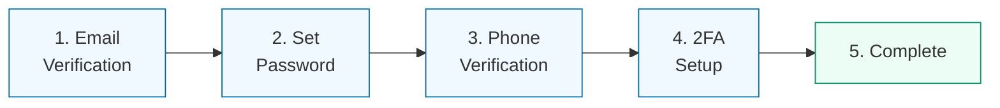
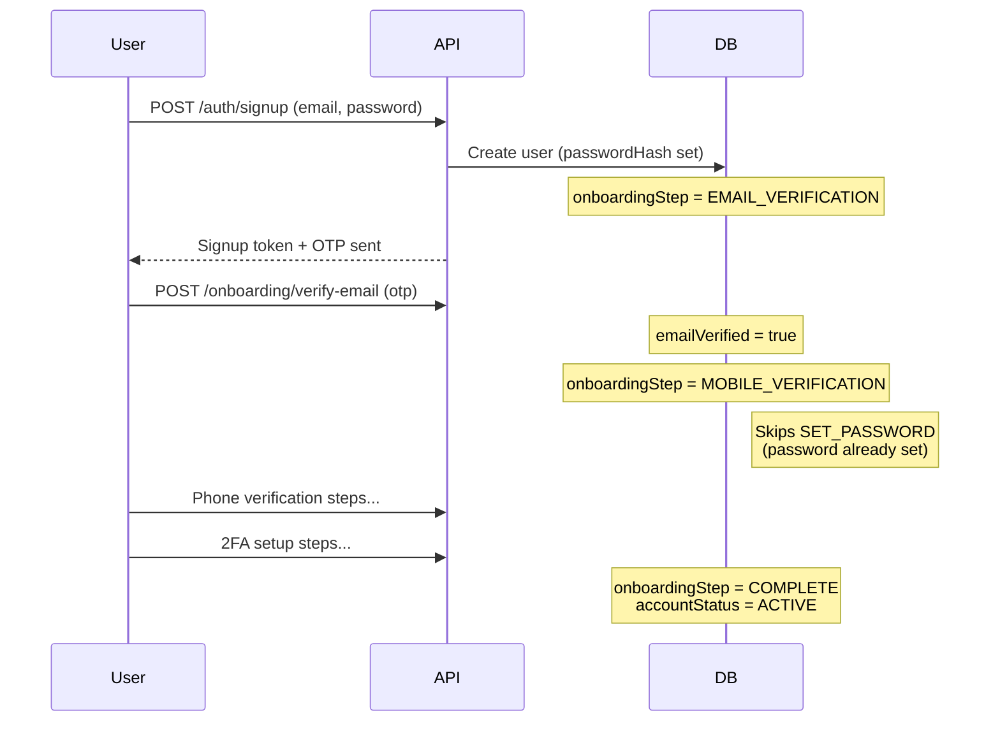
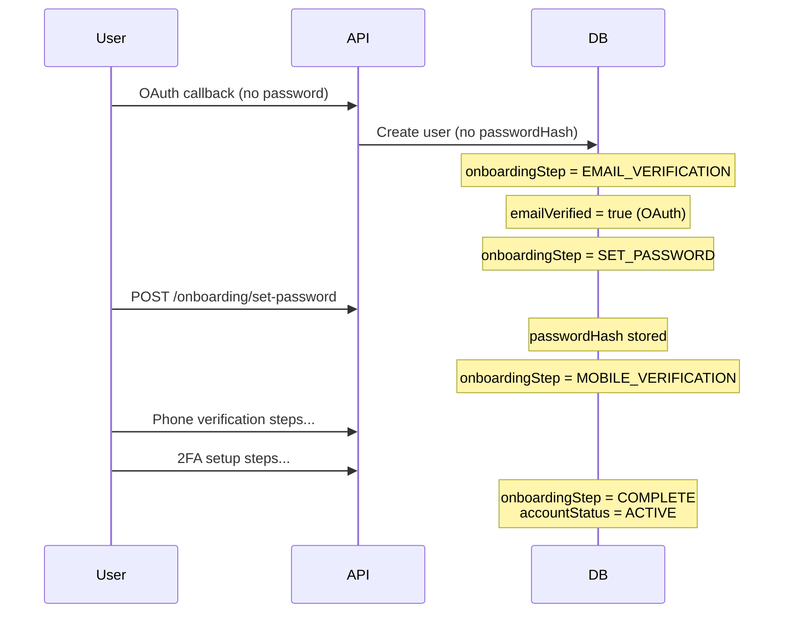

## Overview

<Info>
**Implemented in:** vritti-api-nexus
**Last Updated:** January 2026
**Status:** Production
</Info>

The onboarding flow guides new users through account setup in 5 sequential steps. Users must complete each step before accessing the main application. OAuth users may skip certain steps (like password setup) based on their registration method.

## What It Does

- Guides users through mandatory verification steps
- Tracks progress via `onboardingStep` field on user record
- Supports both email signup and OAuth registration paths
- Validates each step before allowing progression
- Transitions account from `PENDING_VERIFICATION` to `ACTIVE` on completion

## The 5 Onboarding Steps



| Step | Name | Value | Description |
|------|------|-------|-------------|
| 1 | Email Verification | `EMAIL_VERIFICATION` | Verify email address via 6-digit OTP |
| 2 | Set Password | `SET_PASSWORD` | Create password (OAuth users only) |
| 3 | Phone Verification | `MOBILE_VERIFICATION` | Verify phone via QR/SMS |
| 4 | Two-Factor Setup | `TWO_FACTOR_SETUP` | Configure TOTP or Passkey (optional) |
| 5 | Complete | `COMPLETE` | Account activated |

## Where It's Used

| Location | Purpose |
|----------|---------|
| `vritti-api-nexus/src/modules/cloud-api/onboarding/` | Backend onboarding module |
| `vritti-api-nexus/src/db/schema/enums.ts` | Step enum definitions |
| `vritti-api-nexus/src/db/schema/user.ts` | User onboarding fields |
| `vritti-auth/src/pages/onboarding/` | Frontend onboarding pages |

## Flow by Registration Type

### Email Signup Flow



### OAuth Signup Flow



## User State Fields

The user record tracks onboarding progress:

```typescript
// User fields related to onboarding
interface UserOnboardingFields {
  onboardingStep: 'EMAIL_VERIFICATION' | 'SET_PASSWORD' | 'MOBILE_VERIFICATION' | 'TWO_FACTOR_SETUP' | 'COMPLETE';
  accountStatus: 'PENDING_VERIFICATION' | 'ACTIVE' | 'SUSPENDED' | 'DEACTIVATED';
  emailVerified: boolean;
  phoneVerified: boolean;
  emailVerifiedAt: Date | null;
  phoneVerifiedAt: Date | null;
  phone: string | null;        // E.164 format
  phoneCountry: string | null; // Country code
  passwordHash: string | null; // Null for OAuth-only users
}
```

## Step Transitions

### Transition Rules

```typescript
// Step progression logic
const stepTransitions = {
  EMAIL_VERIFICATION: {
    next: (user) => user.passwordHash ? 'MOBILE_VERIFICATION' : 'SET_PASSWORD',
    requires: ['emailVerified'],
  },
  SET_PASSWORD: {
    next: () => 'MOBILE_VERIFICATION',
    requires: ['passwordHash'],
  },
  MOBILE_VERIFICATION: {
    next: () => 'TWO_FACTOR_SETUP',
    requires: ['phoneVerified'],
  },
  TWO_FACTOR_SETUP: {
    next: () => 'COMPLETE',
    requires: [], // 2FA can be skipped
  },
  COMPLETE: {
    next: null,
    requires: [],
  },
};
```

### Implementation

```typescript
// onboarding.service.ts
@Injectable()
export class OnboardingService {
  async advanceToNextStep(userId: string): Promise<void> {
    const user = await this.userService.findById(userId);

    let nextStep: OnboardingStep;

    switch (user.onboardingStep) {
      case 'EMAIL_VERIFICATION':
        // Skip SET_PASSWORD if user already has password (email signup)
        nextStep = user.passwordHash ? 'MOBILE_VERIFICATION' : 'SET_PASSWORD';
        break;
      case 'SET_PASSWORD':
        nextStep = 'MOBILE_VERIFICATION';
        break;
      case 'MOBILE_VERIFICATION':
        nextStep = 'TWO_FACTOR_SETUP';
        break;
      case 'TWO_FACTOR_SETUP':
        nextStep = 'COMPLETE';
        break;
      default:
        return;
    }

    await this.userService.update(userId, {
      onboardingStep: nextStep,
      ...(nextStep === 'COMPLETE' && { accountStatus: 'ACTIVE' }),
    });
  }
}
```

## API Endpoints

### Status Endpoint

```http
GET /cloud-api/onboarding/status
Authorization: Bearer <signup_token>
```

**Response:**
```json
{
  "currentStep": "EMAIL_VERIFICATION",
  "completedSteps": [],
  "user": {
    "id": "usr_abc123",
    "email": "user@example.com",
    "emailVerified": false,
    "phoneVerified": false,
    "accountStatus": "PENDING_VERIFICATION"
  }
}
```

### Step-Specific Endpoints

| Step | Endpoints |
|------|-----------|
| Email Verification | `POST /onboarding/verify-email`, `POST /onboarding/resend-email-otp` |
| Set Password | `POST /onboarding/set-password` |
| Phone Verification | `POST /onboarding/mobile-verification/initiate`, `POST /onboarding/mobile-verification/verify-otp` |
| 2FA Setup | `POST /onboarding/2fa/totp/setup`, `POST /onboarding/2fa/totp/verify`, `POST /onboarding/2fa/skip` |

## Session Handling

Onboarding uses a special `ONBOARDING` session type:

```typescript
// Session configuration
const onboardingSession = {
  type: 'ONBOARDING',
  expiry: '10m',  // Short-lived for security
  permissions: ['onboarding:*'],  // Limited to onboarding endpoints
};
```

The signup token cookie:
- **Name**: `signupToken`
- **Path**: `/cloud-api/onboarding`
- **Expiry**: 10 minutes
- **Flags**: httpOnly, secure, sameSite: 'lax'

## Frontend Navigation

```typescript
// vritti-auth onboarding router
const onboardingRoutes = [
  { path: '/onboarding/verify-email', step: 'EMAIL_VERIFICATION' },
  { path: '/onboarding/set-password', step: 'SET_PASSWORD' },
  { path: '/onboarding/verify-phone', step: 'MOBILE_VERIFICATION' },
  { path: '/onboarding/setup-2fa', step: 'TWO_FACTOR_SETUP' },
];

// Redirect based on current step
function redirectToCurrentStep(user: User) {
  const route = onboardingRoutes.find(r => r.step === user.onboardingStep);
  if (route) navigate(route.path);
  else navigate('/dashboard'); // COMPLETE
}
```

## Error Handling

### Common Errors

| Error | Cause | Resolution |
|-------|-------|------------|
| `INVALID_ONBOARDING_STEP` | User not on expected step | Redirect to correct step |
| `SESSION_EXPIRED` | Signup token expired | Re-authenticate via login |
| `STEP_NOT_COMPLETE` | Missing requirements | Complete current step first |

### Step Validation

```typescript
// Step guard decorator
@Injectable()
export class OnboardingStepGuard implements CanActivate {
  async canActivate(context: ExecutionContext): Promise<boolean> {
    const request = context.switchToHttp().getRequest();
    const requiredStep = this.reflector.get<OnboardingStep>('onboardingStep', context.getHandler());

    const user = request.user;
    if (user.onboardingStep !== requiredStep) {
      throw new BadRequestException({
        code: 'INVALID_ONBOARDING_STEP',
        currentStep: user.onboardingStep,
        requiredStep,
      });
    }

    return true;
  }
}
```

## Security Features

<CardGroup cols={2}>
  <Card title="Session Expiry" icon="clock">
    Onboarding tokens expire in 10 minutes
  </Card>
  <Card title="Step Validation" icon="list-check">
    Users cannot skip steps or go backwards
  </Card>
  <Card title="Rate Limiting" icon="gauge">
    OTP resend limited to prevent abuse
  </Card>
  <Card title="Attempt Limits" icon="ban">
    Max 5 verification attempts per code
  </Card>
</CardGroup>

## Troubleshooting

<Accordion title="User stuck on wrong step">
  **Cause:** Database state mismatch or incomplete step

  **Solution:**
  - Check user's `onboardingStep` in database
  - Verify corresponding flags (`emailVerified`, `phoneVerified`)
  - If flags are true but step is wrong, manually update step
</Accordion>

<Accordion title="Signup token expired during onboarding">
  **Cause:** User took longer than 10 minutes

  **Solution:**
  - User must re-login with email/password
  - System creates new onboarding session
  - Progress is preserved (verified flags remain)
</Accordion>

<Accordion title="OAuth user skipping to wrong step">
  **Cause:** Email auto-verified for OAuth but password check failed

  **Solution:**
  - Ensure `passwordHash` is null for OAuth users
  - Step transition should route to `SET_PASSWORD`
  - Verify transition logic handles OAuth case
</Accordion>

## Related Documentation

<CardGroup cols={2}>
  <Card title="Email Verification" icon="envelope" href="/features/onboarding/email-verification">
    Step 1: OTP email verification
  </Card>
  <Card title="Phone Verification" icon="phone" href="/features/onboarding/phone-verification">
    Step 3: QR/SMS phone verification
  </Card>
  <Card title="2FA Setup" icon="shield" href="/features/onboarding/2fa-setup">
    Step 4: TOTP or Passkey setup
  </Card>
  <Card title="Signup & Login" icon="right-to-bracket" href="/features/auth/signup-login">
    Initial registration flow
  </Card>
</CardGroup>
