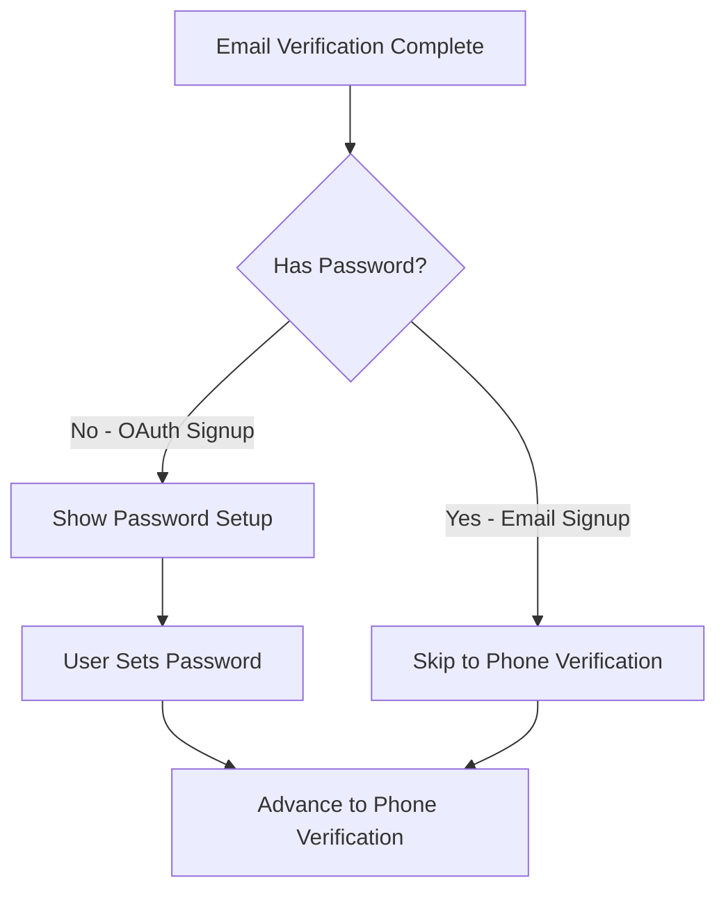
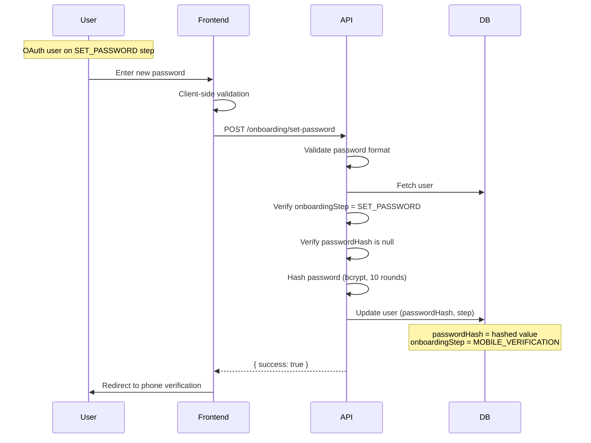

## Overview

<Info>
**Implemented in:** vritti-api-nexus
**Last Updated:** January 2026
**Status:** Production
</Info>

Password setup is Step 2 of onboarding, but only for OAuth users who don't have a password yet. Users who signed up via email already have a password and skip this step. This ensures all accounts have password-based recovery available.

## What It Does

- Allows OAuth users to set a password for their account
- Validates password against security requirements
- Hashes password using bcrypt before storage
- Advances user to the phone verification step
- Provides alternative recovery method for OAuth accounts

## When It's Shown



| Registration Method | Password Setup Step |
|--------------------|--------------------|
| Email Signup | **Skipped** - Password already set during signup |
| Google OAuth | **Required** - No password exists |
| Microsoft OAuth | **Required** - No password exists |
| Other OAuth | **Required** - No password exists |

## Where It's Used

| Location | Purpose |
|----------|---------|
| `vritti-api-nexus/src/modules/cloud-api/onboarding/controllers/onboarding.controller.ts` | Set password endpoint |
| `vritti-api-nexus/src/modules/cloud-api/onboarding/services/onboarding.service.ts` | Password setup logic |
| `vritti-api-nexus/src/modules/cloud-api/onboarding/dto/set-password.dto.ts` | Password validation DTO |
| `vritti-api-nexus/src/services/encryption.service.ts` | Password hashing |
| `vritti-auth/src/pages/onboarding/SetPasswordPage.tsx` | Frontend UI |

## Password Requirements

<CardGroup cols={2}>
  <Card title="Minimum Length" icon="ruler">
    8 characters minimum
  </Card>
  <Card title="Uppercase Letter" icon="font">
    At least one A-Z
  </Card>
  <Card title="Lowercase Letter" icon="text">
    At least one a-z
  </Card>
  <Card title="Number" icon="hashtag">
    At least one 0-9
  </Card>
  <Card title="Special Character" icon="asterisk">
    At least one non-alphanumeric
  </Card>
</CardGroup>

### Validation Regex

```typescript
// set-password.dto.ts
@Matches(/^(?=.*[a-z])(?=.*[A-Z])(?=.*\d)(?=.*[^A-Za-z0-9])/, {
  message: 'Password must contain at least one lowercase letter, uppercase letter, number, and special character',
})
password: string;
```

### Valid Password Examples

| Password | Valid | Reason |
|----------|-------|--------|
| `SecureP@ss123` | ✅ Yes | Meets all requirements |
| `MyP@ssw0rd!` | ✅ Yes | Meets all requirements |
| `password` | ❌ No | Missing uppercase, number, special char |
| `PASSWORD123` | ❌ No | Missing lowercase, special char |
| `Pass123` | ❌ No | Too short, missing special char |

## API Endpoint

### Set Password

```http
POST /cloud-api/onboarding/set-password
Authorization: Bearer <signup_token>
Content-Type: application/json

{
  "password": "SecureP@ss123"
}
```

**Success Response:**
```json
{
  "success": true,
  "message": "Password set successfully"
}
```

**Error Responses:**

```json
// Invalid password format
{
  "statusCode": 400,
  "message": "Password must contain at least one lowercase letter, uppercase letter, number, and special character",
  "error": "Bad Request"
}

// Wrong onboarding step
{
  "statusCode": 400,
  "message": "You cannot set a password at this stage. Please complete the previous onboarding steps first.",
  "error": "Bad Request"
}

// Password already exists
{
  "statusCode": 400,
  "message": "Your account already has a password set. Please use the forgot password feature if you need to change it.",
  "error": "Bad Request"
}
```

## Flow Diagram



## Implementation

### DTO Validation

```typescript
// set-password.dto.ts
import { ApiProperty } from '@nestjs/swagger';
import { IsString, Matches, MinLength } from 'class-validator';

export class SetPasswordDto {
  @ApiProperty({
    description: 'Password with uppercase, lowercase, number, and special character',
    example: 'SecureP@ss123',
    minLength: 8,
  })
  @IsString()
  @MinLength(8, {
    message: 'Password must be at least 8 characters long',
  })
  @Matches(/^(?=.*[a-z])(?=.*[A-Z])(?=.*\d)(?=.*[^A-Za-z0-9])/, {
    message: 'Password must contain at least one lowercase letter, uppercase letter, number, and special character',
  })
  password: string;
}
```

### Controller

```typescript
// onboarding.controller.ts
@Post('set-password')
@Onboarding()
@HttpCode(HttpStatus.OK)
async setPassword(
  @UserId() userId: string,
  @Body() setPasswordDto: SetPasswordDto,
): Promise<{ success: boolean; message: string }> {
  await this.onboardingService.setPassword(userId, setPasswordDto.password);

  return {
    success: true,
    message: 'Password set successfully',
  };
}
```

### Service Logic

```typescript
// onboarding.service.ts
async setPassword(userId: string, password: string): Promise<void> {
  const user = await this.userService.findById(userId);

  if (!user) {
    throw new BadRequestException('User not found');
  }

  // Verify user is on SET_PASSWORD step
  if (user.onboardingStep !== OnboardingStepValues.SET_PASSWORD) {
    throw new BadRequestException(
      'You cannot set a password at this stage. Please complete the previous onboarding steps first.',
    );
  }

  // Verify user doesn't already have a password
  if (user.hasPassword) {
    throw new BadRequestException(
      'Your account already has a password set. Please use the forgot password feature if you need to change it.',
    );
  }

  // Hash password with bcrypt
  const passwordHash = await this.encryptionService.hashPassword(password);

  // Update user and advance to next step
  await this.userService.update(userId, {
    passwordHash,
    onboardingStep: OnboardingStepValues.MOBILE_VERIFICATION,
  });
}
```

### Password Hashing

```typescript
// encryption.service.ts
@Injectable()
export class EncryptionService {
  private readonly saltRounds = 10;

  async hashPassword(password: string): Promise<string> {
    return bcrypt.hash(password, this.saltRounds);
  }

  async comparePassword(password: string, hash: string): Promise<boolean> {
    return bcrypt.compare(password, hash);
  }
}
```

## Database Schema

```typescript
// users table - password field
export const users = cloudSchema.table('users', {
  id: uuid('id').primaryKey().defaultRandom(),
  email: varchar('email', { length: 255 }).notNull().unique(),
  passwordHash: varchar('password_hash', { length: 255 }),  // Null for OAuth-only
  onboardingStep: onboardingStepEnum('onboarding_step').notNull().default('EMAIL_VERIFICATION'),
  // ... other fields
});
```

## Frontend Integration

### Password Input with Strength Indicator

```typescript
// vritti-auth - SetPasswordPage.tsx
const SetPasswordPage = () => {
  const [password, setPassword] = useState('');
  const { mutate: setPasswordMutation, isPending, error } = useSetPassword();

  const passwordStrength = useMemo(() => {
    let strength = 0;
    if (password.length >= 8) strength++;
    if (/[a-z]/.test(password)) strength++;
    if (/[A-Z]/.test(password)) strength++;
    if (/\d/.test(password)) strength++;
    if (/[^A-Za-z0-9]/.test(password)) strength++;
    return strength;
  }, [password]);

  const handleSubmit = () => {
    setPasswordMutation({ password }, {
      onSuccess: () => {
        navigate('/onboarding/verify-phone');
      },
    });
  };

  return (
    <div>
      <h1>Create a password</h1>
      <p>Set a password to secure your account</p>

      <PasswordInput
        value={password}
        onChange={setPassword}
        showStrengthIndicator
        strength={passwordStrength}
      />

      <PasswordRequirements password={password} />

      {error && <ErrorMessage>{error.message}</ErrorMessage>}

      <Button
        onClick={handleSubmit}
        loading={isPending}
        disabled={passwordStrength < 5}
      >
        Continue
      </Button>
    </div>
  );
};
```

### Password Requirements Component

```typescript
// PasswordRequirements.tsx
const requirements = [
  { label: 'At least 8 characters', test: (p: string) => p.length >= 8 },
  { label: 'One lowercase letter', test: (p: string) => /[a-z]/.test(p) },
  { label: 'One uppercase letter', test: (p: string) => /[A-Z]/.test(p) },
  { label: 'One number', test: (p: string) => /\d/.test(p) },
  { label: 'One special character', test: (p: string) => /[^A-Za-z0-9]/.test(p) },
];

const PasswordRequirements = ({ password }: { password: string }) => (
  <ul className="space-y-1">
    {requirements.map((req) => (
      <li key={req.label} className="flex items-center gap-2">
        {req.test(password) ? (
          <CheckIcon className="text-green-500" />
        ) : (
          <XIcon className="text-gray-400" />
        )}
        <span className={req.test(password) ? 'text-green-600' : 'text-gray-500'}>
          {req.label}
        </span>
      </li>
    ))}
  </ul>
);
```

## Security Features

<CardGroup cols={2}>
  <Card title="bcrypt Hashing" icon="lock">
    Passwords hashed with bcrypt (10 salt rounds)
  </Card>
  <Card title="No Plaintext Storage" icon="eye-slash">
    Only hash stored, never plaintext
  </Card>
  <Card title="Step Validation" icon="list-check">
    Can only set password on correct step
  </Card>
  <Card title="One-Time Setup" icon="check">
    Prevents overwriting existing passwords
  </Card>
</CardGroup>

## Why OAuth Users Need Passwords

1. **Account Recovery**: If OAuth provider access is lost, password provides backup login
2. **Consistent Experience**: All users can log in with email/password if preferred
3. **2FA Requirements**: Password + 2FA provides stronger security than OAuth alone
4. **Provider Independence**: Account isn't locked to a single OAuth provider

## Error Handling

| Error | Cause | Resolution |
|-------|-------|------------|
| `Password must be at least 8 characters long` | Password too short | Use longer password |
| `Password must contain...` | Missing required character types | Add missing character type |
| `User not found` | Invalid session | Re-authenticate via OAuth |
| `Cannot set password at this stage` | Wrong onboarding step | Complete email verification first |
| `Account already has a password` | Password already set | Use forgot password if needed |

## Troubleshooting

<Accordion title="Password validation always fails">
  **Causes:**
  - Missing required character type
  - Password too short
  - Special characters not recognized

  **Solution:**
  - Check password has uppercase, lowercase, number, AND special char
  - Ensure at least 8 characters total
  - Try common special characters: `!@#$%^&*()`
</Accordion>

<Accordion title="'Cannot set password at this stage' error">
  **Cause:** User is not on the SET_PASSWORD onboarding step

  **Solution:**
  - Check current onboarding step via `/onboarding/status`
  - Email signup users skip this step (already have password)
  - Complete previous steps if on EMAIL_VERIFICATION
</Accordion>

<Accordion title="Password set but still on same page">
  **Cause:** Frontend not redirecting after success

  **Solution:**
  - Check network response shows `{ success: true }`
  - Verify `onSuccess` callback in mutation
  - Check for navigation errors in console
</Accordion>

## Related Documentation

<CardGroup cols={2}>
  <Card title="Onboarding Flow" icon="list-check" href="/features/onboarding/flow-overview">
    Complete onboarding process
  </Card>
  <Card title="Email Verification" icon="envelope" href="/features/onboarding/email-verification">
    Previous step: Email OTP
  </Card>
  <Card title="Phone Verification" icon="phone" href="/features/onboarding/phone-verification">
    Next step: QR/SMS verification
  </Card>
  <Card title="OAuth Overview" icon="key" href="/features/oauth/overview">
    OAuth registration flow
  </Card>
</CardGroup>
