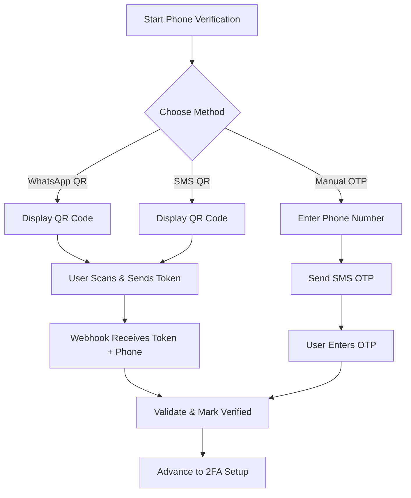
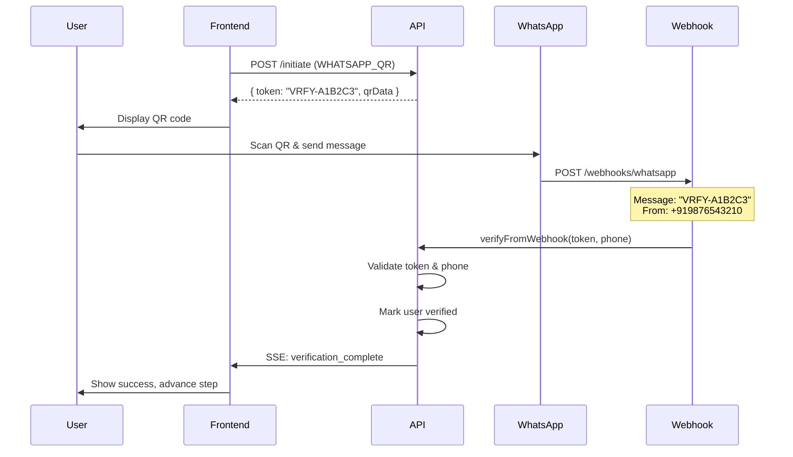

## Overview

<Info>
**Implemented in:** vritti-api-nexus
**Last Updated:** January 2026
**Status:** Production
</Info>

Phone verification is Step 3 of onboarding. It supports three verification methods: WhatsApp QR scan, SMS QR scan, and manual SMS OTP entry. QR-based methods use webhooks to receive the verification token, while manual OTP requires user input.

## What It Does

- Verifies phone number ownership via multiple methods
- Supports WhatsApp and SMS for QR-based verification
- Provides fallback manual OTP entry
- Normalizes phone numbers to E.164 format
- Prevents duplicate phone registration across users
- Uses SSE for real-time status updates

## Verification Methods

| Method | Code | How It Works |
|--------|------|--------------|
| WhatsApp QR | `WHATSAPP_QR` | User scans QR and sends token via WhatsApp |
| SMS QR | `SMS_QR` | User scans QR and sends token via SMS |
| Manual OTP | `MANUAL_OTP` | User receives SMS OTP and enters it manually |



## Where It's Used

| Location | Purpose |
|----------|---------|
| `vritti-api-nexus/src/modules/cloud-api/onboarding/services/mobile-verification.service.ts` | Core verification logic |
| `vritti-api-nexus/src/modules/cloud-api/onboarding/controllers/verification-webhook.controller.ts` | Webhook handlers |
| `vritti-api-nexus/src/modules/cloud-api/onboarding/providers/` | WhatsApp & SMS providers |
| `vritti-auth/src/pages/onboarding/PhoneVerificationPage.tsx` | Frontend UI |

## API Endpoints

### Initiate Verification

```http
POST /cloud-api/onboarding/mobile-verification/initiate
Authorization: Bearer <signup_token>
Content-Type: application/json

{
  "method": "WHATSAPP_QR",
  "phoneNumber": "+919876543210",  // Optional for QR methods
  "countryCode": "IN"              // Optional for QR methods
}
```

**Response (QR Methods):**
```json
{
  "verificationId": "ver_abc123",
  "method": "WHATSAPP_QR",
  "token": "VRFY-A1B2C3",
  "expiresAt": "2026-01-15T10:40:00Z",
  "instructions": {
    "qrData": "whatsapp://send?phone=+1234567890&text=VRFY-A1B2C3",
    "manualSteps": [
      "Scan the QR code with your phone",
      "Send the message that appears",
      "Wait for verification confirmation"
    ]
  }
}
```

**Response (Manual OTP):**
```json
{
  "verificationId": "ver_xyz789",
  "method": "MANUAL_OTP",
  "maskedPhone": "+91 **** **3210",
  "expiresAt": "2026-01-15T10:40:00Z",
  "instructions": {
    "message": "Enter the 6-digit code sent to your phone"
  }
}
```

### Check Verification Status

```http
GET /cloud-api/onboarding/mobile-verification/status
Authorization: Bearer <signup_token>
```

**Response:**
```json
{
  "status": "PENDING",
  "method": "WHATSAPP_QR",
  "token": "VRFY-A1B2C3",
  "expiresAt": "2026-01-15T10:40:00Z",
  "attemptsRemaining": 5
}
```

### Verify OTP (Manual Method)

```http
POST /cloud-api/onboarding/mobile-verification/verify-otp
Authorization: Bearer <signup_token>
Content-Type: application/json

{
  "otp": "123456"
}
```

### Resend Verification

```http
POST /cloud-api/onboarding/mobile-verification/resend
Authorization: Bearer <signup_token>
Content-Type: application/json

{
  "method": "MANUAL_OTP",
  "phoneNumber": "+919876543210",
  "countryCode": "IN"
}
```

## QR-Based Verification Flow

### WhatsApp QR Flow



### Implementation

```typescript
// mobile-verification.service.ts
async initiateVerification(
  userId: string,
  dto: InitiateMobileVerificationDto,
): Promise<MobileVerificationResponse> {
  const { method, phoneNumber, countryCode } = dto;

  // Generate verification token
  const token = this.generateVerificationToken();
  const expiresAt = addMinutes(new Date(), 10);

  // Create verification record
  const verification = await this.mobileVerificationRepo.create({
    userId,
    method,
    token,
    phoneNumber: phoneNumber ? this.normalizePhone(phoneNumber, countryCode) : null,
    countryCode,
    expiresAt,
    status: 'PENDING',
    attempts: 0,
  });

  // For MANUAL_OTP, send SMS immediately
  if (method === 'MANUAL_OTP') {
    if (!phoneNumber) {
      throw new BadRequestException('Phone number required for OTP method');
    }
    await this.smsProvider.sendOtp(phoneNumber, countryCode, token);
  }

  return this.buildResponse(verification, method);
}

async verifyFromWebhook(
  token: string,
  phoneNumber: string,
): Promise<void> {
  // Find pending verification with this token
  const verification = await this.mobileVerificationRepo.findByToken(token);

  if (!verification) {
    throw new BadRequestException('Invalid verification token');
  }

  if (verification.status !== 'PENDING') {
    throw new BadRequestException('Verification already completed');
  }

  if (new Date() > verification.expiresAt) {
    throw new BadRequestException('Verification expired');
  }

  // Normalize and validate phone
  const normalizedPhone = this.normalizePhone(phoneNumber);

  // Check if phone already used by another user
  const existingUser = await this.userService.findByPhone(normalizedPhone);
  if (existingUser && existingUser.id !== verification.userId) {
    throw new BadRequestException('Phone number already registered');
  }

  // Mark verified
  await this.mobileVerificationRepo.update(verification.id, {
    status: 'VERIFIED',
    verifiedAt: new Date(),
    phoneNumber: normalizedPhone,
  });

  // Update user
  await this.userService.markPhoneVerifiedAndAdvanceToMfa(
    verification.userId,
    normalizedPhone,
    verification.countryCode,
  );

  // Notify frontend via SSE
  await this.sseService.sendToUser(verification.userId, {
    event: 'verification_complete',
    data: { step: 'MOBILE_VERIFICATION' },
  });
}
```

## Webhook Handlers

### WhatsApp Webhook

```typescript
// verification-webhook.controller.ts
@Controller('webhooks')
export class VerificationWebhookController {
  @Post('whatsapp')
  @Public()
  async handleWhatsAppWebhook(
    @Body() body: WhatsAppWebhookPayload,
  ): Promise<void> {
    // Extract message and phone from WhatsApp payload
    const { message, from } = this.parseWhatsAppPayload(body);

    // Token format: VRFY-XXXXXX
    if (message.startsWith('VRFY-')) {
      await this.mobileVerificationService.verifyFromWebhook(message, from);
    }
  }

  @Post('sms')
  @Public()
  async handleSmsWebhook(
    @Body() body: TwilioSmsPayload,
  ): Promise<void> {
    const { Body: message, From: from } = body;

    if (message.startsWith('VRFY-')) {
      await this.mobileVerificationService.verifyFromWebhook(message, from);
    }
  }
}
```

## Phone Number Normalization

All phone numbers are stored in E.164 format:

```typescript
// phone-utils.ts
function normalizePhone(phone: string, countryCode?: string): string {
  // Remove all non-digit characters except leading +
  let cleaned = phone.replace(/[^\d+]/g, '');

  // Add country code if not present
  if (!cleaned.startsWith('+')) {
    const dialCode = getDialCodeForCountry(countryCode || 'US');
    cleaned = `+${dialCode}${cleaned}`;
  }

  // Validate E.164 format
  if (!isValidE164(cleaned)) {
    throw new BadRequestException('Invalid phone number format');
  }

  return cleaned;
}

// Examples:
// normalizePhone('9876543210', 'IN') => '+919876543210'
// normalizePhone('+1 (555) 123-4567') => '+15551234567'
```

## Real-Time Updates with SSE

Frontend subscribes to SSE for instant verification updates:

```typescript
// vritti-auth - PhoneVerificationPage.tsx
const PhoneVerificationPage = () => {
  const { data: status } = useVerificationStatus();

  // Subscribe to SSE events
  useSSESubscription('verification_complete', () => {
    // Verification completed via webhook
    navigate('/onboarding/setup-2fa');
  });

  return (
    <div>
      {status?.method === 'WHATSAPP_QR' && (
        <QRCode data={status.instructions.qrData} />
      )}

      <p>Waiting for verification...</p>
      <Spinner />
    </div>
  );
};
```

## Database Schema

```typescript
// mobile verification record
export const mobileVerifications = cloudSchema.table('mobile_verifications', {
  id: uuid('id').primaryKey().defaultRandom(),
  userId: uuid('user_id').notNull().references(() => users.id),
  method: verificationMethodEnum('method').notNull(),
  token: varchar('token', { length: 32 }).notNull(),
  phoneNumber: varchar('phone_number', { length: 20 }),
  countryCode: varchar('country_code', { length: 5 }),
  status: verificationStatusEnum('status').notNull().default('PENDING'),
  attempts: integer('attempts').notNull().default(0),
  expiresAt: timestamp('expires_at').notNull(),
  verifiedAt: timestamp('verified_at'),
  createdAt: timestamp('created_at').notNull().defaultNow(),
});
```

## Configuration

### Environment Variables

```bash
# Twilio SMS
TWILIO_ACCOUNT_SID=your-account-sid
TWILIO_AUTH_TOKEN=your-auth-token
TWILIO_PHONE_NUMBER=+1234567890

# WhatsApp Business API
WHATSAPP_PHONE_NUMBER_ID=your-phone-id
WHATSAPP_ACCESS_TOKEN=your-access-token
WHATSAPP_VERIFY_TOKEN=webhook-verify-token
```

## Security Features

<CardGroup cols={2}>
  <Card title="Token Expiry" icon="clock">
    10-minute verification window
  </Card>
  <Card title="Duplicate Prevention" icon="shield">
    Phone can only be linked to one account
  </Card>
  <Card title="Attempt Limits" icon="ban">
    5 max attempts before lockout
  </Card>
  <Card title="E.164 Validation" icon="check">
    Strict phone number format validation
  </Card>
</CardGroup>

## Error Handling

| Error | Cause | Resolution |
|-------|-------|------------|
| `Invalid verification token` | Token not found or wrong | Ensure correct token sent |
| `Verification expired` | Token older than 10 minutes | Start new verification |
| `Phone number already registered` | Phone linked to another account | Use different phone or contact support |
| `Invalid phone number format` | Phone doesn't match E.164 | Use valid international format |

## Troubleshooting

<Accordion title="QR code not working">
  **Causes:**
  - WhatsApp/SMS app not installed
  - QR code camera issue
  - Token expired

  **Solution:**
  - Ensure messaging app is installed
  - Try manual copy/paste of the message
  - Switch to Manual OTP method
</Accordion>

<Accordion title="Webhook not receiving messages">
  **Causes:**
  - Webhook URL not configured in Twilio/WhatsApp
  - SSL certificate issue
  - Firewall blocking requests

  **Solution:**
  - Verify webhook URL in provider dashboard
  - Check SSL certificate validity
  - Review server firewall rules
  - Check webhook logs in provider dashboard
</Accordion>

<Accordion title="Phone number rejected">
  **Causes:**
  - Invalid phone format
  - Phone already registered
  - Country not supported

  **Solution:**
  - Use full international format (+1234567890)
  - Check if phone is linked to existing account
  - Verify country code is supported
</Accordion>

## Related Documentation

<CardGroup cols={2}>
  <Card title="Onboarding Flow" icon="list-check" href="/features/onboarding/flow-overview">
    Complete onboarding process
  </Card>
  <Card title="2FA Setup" icon="shield" href="/features/onboarding/2fa-setup">
    Next step: Two-factor authentication
  </Card>
  <Card title="Twilio SMS" icon="comment-sms" href="/features/communication/sms-twilio">
    SMS provider integration
  </Card>
  <Card title="WhatsApp" icon="whatsapp" href="/features/communication/whatsapp">
    WhatsApp Business API
  </Card>
</CardGroup>
