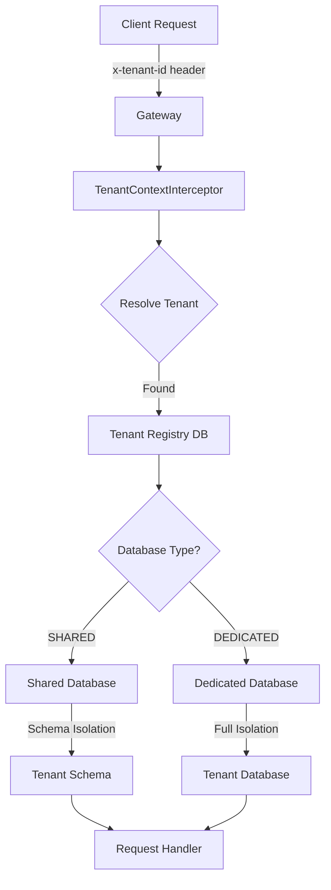

## Overview

<Info>
**Implemented in:** vritti-api-nexus
**Last Updated:** January 2026
**Status:** Production
</Info>

Vritti is a multi-tenant SaaS platform where each organization (tenant) has isolated data and can optionally have a dedicated database. The system supports both shared and dedicated database deployment models, providing flexibility based on customer requirements.

## What It Does

- Provides complete tenant management (CRUD operations)
- Supports two database isolation modes: SHARED and DEDICATED
- Resolves tenant context from request headers
- Manages per-tenant database connections with pooling
- Ensures data isolation between tenants
- Tracks tenant lifecycle (ACTIVE, SUSPENDED, ARCHIVED)

## Where It's Used

| Location | Purpose |
|----------|---------|
| `vritti-api-nexus/src/modules/cloud-api/tenant/` | Tenant module |
| `vritti-api-nexus/src/db/schema/tenant.ts` | Database schema |
| `vritti-api-nexus/src/db/schema/relations.ts` | Table relationships |
| `@vritti/api-sdk` | Tenant context management |

## Architecture



## Key Concepts

### Tenant

A tenant represents an organization or customer using the platform. Each tenant has:

| Property | Description |
|----------|-------------|
| `id` | Unique UUID identifier |
| `subdomain` | Unique identifier for routing (e.g., `acme`) |
| `name` | Organization display name |
| `description` | Optional description |
| `dbType` | Database deployment mode (SHARED/DEDICATED) |
| `status` | Lifecycle status (ACTIVE/SUSPENDED/ARCHIVED) |

### Database Types

<CardGroup cols={2}>
  <Card title="SHARED" icon="database">
    Multiple tenants share one database with schema-level isolation. Cost-effective for smaller tenants.
  </Card>
  <Card title="DEDICATED" icon="server">
    Each tenant gets their own database instance. Full isolation for enterprise customers.
  </Card>
</CardGroup>

### Tenant Status

| Status | Description |
|--------|-------------|
| `ACTIVE` | Tenant is operational and can access the system |
| `SUSPENDED` | Tenant is temporarily disabled (e.g., payment issues) |
| `ARCHIVED` | Tenant is soft-deleted and no longer accessible |

## Data Model

### Tenants Table

```typescript
// db/schema/tenant.ts
export const tenants = cloudSchema.table('tenants', {
  id: uuid('id').primaryKey().defaultRandom(),
  subdomain: varchar('subdomain', { length: 255 }).notNull().unique(),
  name: varchar('name', { length: 255 }).notNull(),
  description: text('description'),
  dbType: tenantDbTypeEnum('db_type').notNull().default('SHARED'),
  status: tenantStatusEnum('status').notNull().default('ACTIVE'),
  createdAt: timestamp('created_at', { withTimezone: true }).notNull().defaultNow(),
  updatedAt: timestamp('updated_at', { withTimezone: true }).notNull().defaultNow(),
});
```

### Database Config Table

For DEDICATED tenants, connection details are stored separately:

```typescript
// db/schema/tenant.ts
export const tenantDatabaseConfigs = cloudSchema.table('tenant_database_configs', {
  id: uuid('id').primaryKey().defaultRandom(),
  tenantId: uuid('tenant_id').references(() => tenants.id, { onDelete: 'cascade' }).unique().notNull(),
  dbHost: varchar('db_host', { length: 255 }).notNull(),
  dbPort: integer('db_port').notNull().default(5432),
  dbUsername: varchar('db_username', { length: 255 }).notNull(),
  dbPassword: varchar('db_password', { length: 255 }).notNull(),
  dbName: varchar('db_name', { length: 255 }).notNull(),
  dbSchema: varchar('db_schema', { length: 255 }),
  dbSslMode: varchar('db_ssl_mode', { length: 50 }).notNull().default('require'),
  connectionPoolSize: integer('connection_pool_size').notNull().default(10),
  createdAt: timestamp('created_at', { withTimezone: true }).notNull().defaultNow(),
  updatedAt: timestamp('updated_at', { withTimezone: true }).notNull().defaultNow(),
});
```

### Relationships

```typescript
// db/schema/relations.ts
export const tenantsRelations = relations(tenants, ({ one }) => ({
  databaseConfig: one(tenantDatabaseConfigs, {
    fields: [tenants.id],
    references: [tenantDatabaseConfigs.tenantId],
  }),
}));

export const tenantDatabaseConfigsRelations = relations(tenantDatabaseConfigs, ({ one }) => ({
  tenant: one(tenants, {
    fields: [tenantDatabaseConfigs.tenantId],
    references: [tenants.id],
  }),
}));
```

## API Endpoints

| Endpoint | Method | Description |
|----------|--------|-------------|
| `/cloud-api/tenants` | POST | Create a new tenant |
| `/cloud-api/tenants` | GET | List all tenants |
| `/cloud-api/tenants/:id` | GET | Get tenant by ID |
| `/cloud-api/tenants/subdomain/:subdomain` | GET | Get tenant by subdomain |
| `/cloud-api/tenants/:id` | PATCH | Update tenant |
| `/cloud-api/tenants/:id` | DELETE | Archive tenant (soft delete) |

### Create Tenant

```http
POST /cloud-api/tenants
Authorization: Bearer <token>
Content-Type: application/json

{
  "subdomain": "acme",
  "name": "Acme Corporation",
  "description": "Enterprise customer",
  "dbType": "DEDICATED",
  "databaseConfig": {
    "dbHost": "acme-db.example.com",
    "dbPort": 5432,
    "dbUsername": "acme_user",
    "dbPassword": "secure_password",
    "dbName": "acme_production",
    "dbSslMode": "require",
    "connectionPoolSize": 20
  }
}
```

**Success Response:**
```json
{
  "id": "550e8400-e29b-41d4-a716-446655440000",
  "subdomain": "acme",
  "name": "Acme Corporation",
  "description": "Enterprise customer",
  "dbType": "DEDICATED",
  "status": "ACTIVE",
  "databaseConfig": {
    "id": "661f9511-f39c-52e5-b827-557766551111",
    "dbHost": "acme-db.example.com",
    "dbPort": 5432,
    "dbName": "acme_production",
    "dbSchema": null,
    "dbSslMode": "require",
    "connectionPoolSize": 20
  },
  "createdAt": "2026-01-27T10:00:00.000Z",
  "updatedAt": "2026-01-27T10:00:00.000Z"
}
```

<Note>
Database credentials (`dbUsername`, `dbPassword`) are never returned in API responses for security.
</Note>

### Get Tenant by Subdomain

```http
GET /cloud-api/tenants/subdomain/acme
Authorization: Bearer <token>
```

Used for tenant discovery during client initialization.

## Module Structure

<Tree>
  <Tree.Folder name="src/modules/cloud-api/tenant" defaultOpen>
    <Tree.File name="tenant.module.ts" />
    <Tree.File name="tenant.controller.ts" />
    <Tree.File name="tenant.service.ts" />
    <Tree.File name="tenant.repository.ts" />
    <Tree.File name="tenant-database-config.service.ts" />
    <Tree.File name="tenant-database-config.repository.ts" />
    <Tree.Folder name="dto" defaultOpen>
      <Tree.File name="create-tenant.dto.ts" />
      <Tree.File name="update-tenant.dto.ts" />
      <Tree.File name="tenant-response.dto.ts" />
      <Tree.File name="create-tenant-database-config.dto.ts" />
      <Tree.File name="update-tenant-database-config.dto.ts" />
      <Tree.File name="tenant-database-config-response.dto.ts" />
    </Tree.Folder>
  </Tree.Folder>
</Tree>

## Configuration

### Environment Variables

```bash
# Primary Database (Tenant Registry)
PRIMARY_DB_HOST=localhost
PRIMARY_DB_PORT=5432
PRIMARY_DB_USERNAME=postgres
PRIMARY_DB_PASSWORD=localdev
PRIMARY_DB_DATABASE=saas_db
PRIMARY_DB_SCHEMA=cloud
PRIMARY_DB_SSL_MODE=disable
```

### Tenant Header Configuration

```typescript
// main.ts
configureApiSdk(app, {
  guard: {
    tenantHeaderName: 'x-tenant-id',  // Header for tenant resolution
  },
});
```

## Security Features

<CardGroup cols={2}>
  <Card title="Credential Protection" icon="lock">
    Database credentials never exposed in API responses
  </Card>
  <Card title="Subdomain Validation" icon="check">
    Strict regex: lowercase, numbers, hyphens only
  </Card>
  <Card title="Unique Constraints" icon="fingerprint">
    Database-level uniqueness for subdomains
  </Card>
  <Card title="Soft Deletes" icon="trash">
    Tenants are archived, not permanently deleted
  </Card>
</CardGroup>

## Validation Rules

### Subdomain

```typescript
// create-tenant.dto.ts
@Matches(/^[a-z0-9-]+$/, {
  message: 'Subdomain can only contain lowercase letters, numbers, and hyphens',
})
@MinLength(2)
@MaxLength(50)
subdomain: string;
```

### Database Config

| Field | Validation |
|-------|------------|
| `dbPort` | 1-65535 |
| `connectionPoolSize` | 1-100 |
| `dbHost` | Valid hostname, IPv4, or localhost |
| `dbSslMode` | `require`, `prefer`, `disable` |

## Error Handling

| Error | Cause | HTTP Status |
|-------|-------|-------------|
| Subdomain already exists | Duplicate subdomain | 409 Conflict |
| Tenant not found | Invalid ID or subdomain | 404 Not Found |
| Invalid subdomain format | Doesn't match regex | 400 Bad Request |
| Invalid database config | Validation failed | 400 Bad Request |

## Current Limitations

<Warning>
**Known TODOs in codebase:**

- Database passwords are stored in plaintext (encryption planned)
- No connection testing during tenant creation
- No automatic schema provisioning for new tenants
</Warning>

## Related Documentation

<CardGroup cols={2}>
  <Card title="Tenant Isolation" icon="shield" href="/features/tenants/tenant-isolation">
    Data isolation strategies
  </Card>
  <Card title="Tenant Resolution" icon="route" href="/features/tenants/tenant-resolution">
    How tenant context is determined
  </Card>
  <Card title="Database Architecture" icon="database" href="/architecture/database/drizzle-orm">
    Drizzle ORM setup
  </Card>
  <Card title="Multi-Tenant Schemas" icon="table" href="/architecture/database/multi-tenant-schemas">
    Per-tenant database design
  </Card>
</CardGroup>
