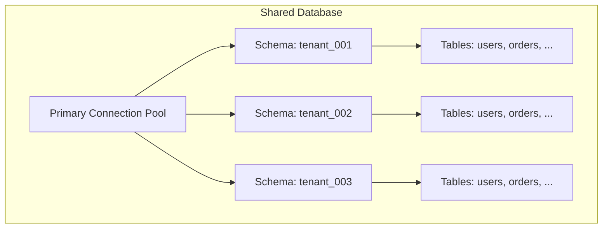
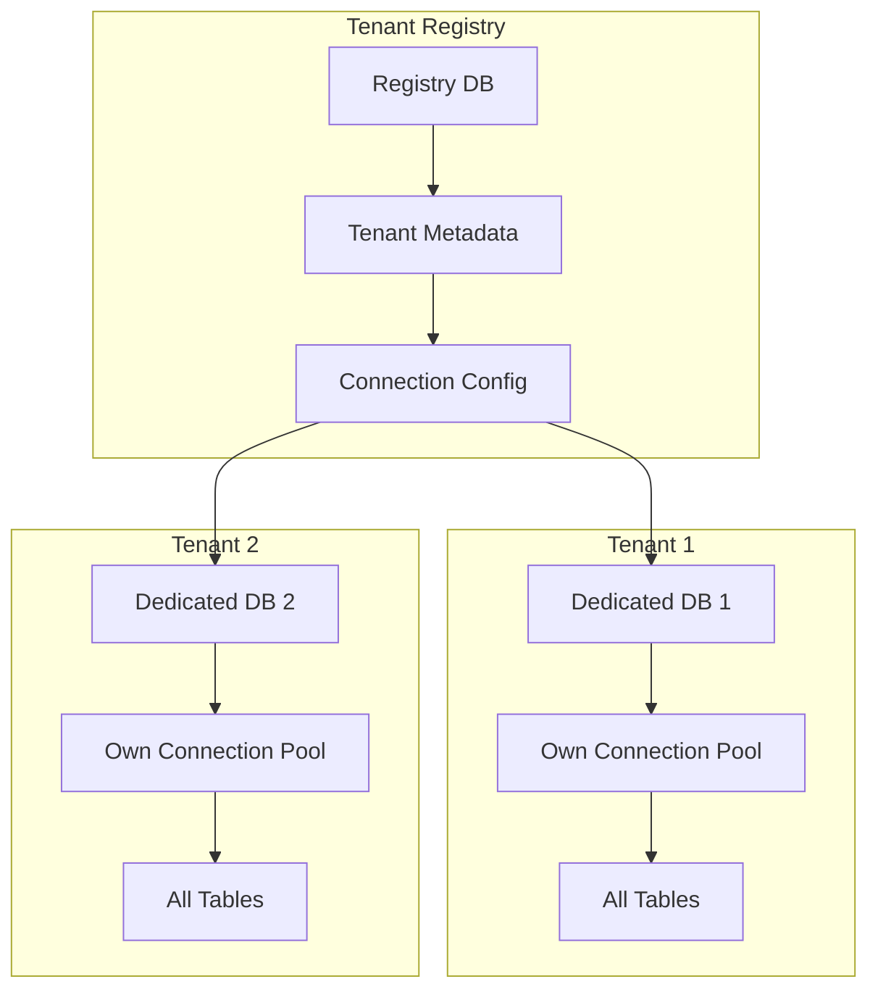
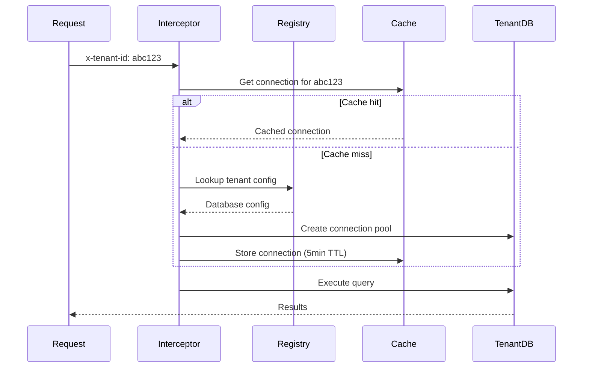

## Overview

<Info>
**Implemented in:** vritti-api-nexus, @vritti/api-sdk
**Last Updated:** January 2026
**Status:** Production
</Info>

Tenant isolation ensures that each organization's data is completely separated from others. Vritti supports two isolation strategies: schema-based isolation for shared databases and database-level isolation for dedicated deployments.

## What It Does

- Prevents data leakage between tenants
- Routes database connections to correct tenant resources
- Manages connection pools per tenant
- Supports both cost-effective and enterprise isolation levels
- Provides automatic tenant context propagation

## Isolation Strategies

### Strategy Comparison

| Aspect | SHARED (Schema) | DEDICATED (Database) |
|--------|-----------------|----------------------|
| **Isolation Level** | Schema-level | Database-level |
| **Cost** | Lower (shared resources) | Higher (dedicated resources) |
| **Performance** | Shared connection pool | Dedicated connection pool |
| **Backup/Restore** | Per-schema operations | Full database operations |
| **Use Case** | SMB customers | Enterprise customers |
| **Compliance** | Standard requirements | Strict data residency |

### Schema-Based Isolation (SHARED)



Multiple tenants share a single PostgreSQL database. Each tenant's data lives in a separate schema:

```sql
-- Schema per tenant
CREATE SCHEMA tenant_001;
CREATE SCHEMA tenant_002;

-- Tables are duplicated per schema
CREATE TABLE tenant_001.users (...);
CREATE TABLE tenant_002.users (...);
```

**Configuration:**
```typescript
// Create SHARED tenant with schema
const tenant = await tenantService.create({
  subdomain: 'acme',
  name: 'Acme Corp',
  dbType: 'SHARED',
  databaseConfig: {
    dbSchema: 'tenant_acme',  // Required for SHARED tenants
  },
});
```

### Database-Level Isolation (DEDICATED)



Each tenant has their own PostgreSQL database with full isolation:

**Configuration:**
```typescript
// Create DEDICATED tenant with full database config
const tenant = await tenantService.create({
  subdomain: 'enterprise',
  name: 'Enterprise Corp',
  dbType: 'DEDICATED',
  databaseConfig: {
    dbHost: 'enterprise-db.rds.amazonaws.com',
    dbPort: 5432,
    dbUsername: 'enterprise_user',
    dbPassword: 'secure_password',
    dbName: 'enterprise_prod',
    dbSslMode: 'require',
    connectionPoolSize: 50,
  },
});
```

## Connection Management

### Primary Database (Tenant Registry)

The primary database stores tenant metadata and is configured via environment variables:

```bash
# .env
PRIMARY_DB_HOST=localhost
PRIMARY_DB_PORT=5432
PRIMARY_DB_USERNAME=postgres
PRIMARY_DB_PASSWORD=localdev
PRIMARY_DB_DATABASE=saas_db
PRIMARY_DB_SCHEMA=cloud
PRIMARY_DB_SSL_MODE=disable
```

### Connection Pooling

| Setting | Value | Purpose |
|---------|-------|---------|
| Pool Size (default) | 10 | Connections per tenant |
| Pool Size (max) | 100 | For high-traffic DEDICATED tenants |
| Cache TTL | 5 minutes | Connection cache lifetime |
| SSL Mode | `require` (default) | Encryption in transit |

### Connection Resolution Flow



## Implementation

### Database Module Configuration

```typescript
// app.module.ts
@Module({
  imports: [
    DatabaseModule.forServer({
      // Enables tenant context interceptor
      // Configures connection pooling
      // Sets up request-scoped database access
    }),
    TenantModule,
    // ... other modules
  ],
})
export class AppModule {}
```

### Tenant Context Interceptor

The interceptor extracts tenant ID from requests and establishes the correct database context:

```typescript
// Automatically registered by DatabaseModule.forServer()
@Injectable()
export class TenantContextInterceptor implements NestInterceptor {
  intercept(context: ExecutionContext, next: CallHandler): Observable<any> {
    const request = context.switchToHttp().getRequest();
    const tenantId = request.headers['x-tenant-id'];

    if (tenantId) {
      // Store in AsyncLocalStorage for request scope
      return this.tenantContext.run(tenantId, () => next.handle());
    }

    return next.handle();
  }
}
```

### Getting Tenant Connection

```typescript
// In a service that needs tenant-specific data
@Injectable()
export class OrderService {
  constructor(
    private readonly tenantDb: TenantDatabaseService,
  ) {}

  async getOrders(tenantId: string) {
    // Get connection for specific tenant
    const db = await this.tenantDb.getConnection(tenantId);

    return db.query.orders.findMany({
      where: eq(orders.tenantId, tenantId),
    });
  }
}
```

## Database Config Service

### Creating Config for DEDICATED Tenant

```typescript
// tenant-database-config.service.ts
async create(tenantId: string, dto: CreateTenantDatabaseConfigDto) {
  // Validate tenant exists
  const tenant = await this.tenantRepository.findById(tenantId);
  if (!tenant) {
    throw new NotFoundException('Tenant not found');
  }

  // Only DEDICATED tenants need full config
  if (tenant.dbType !== 'DEDICATED') {
    throw new BadRequestException('Only DEDICATED tenants can have database configs');
  }

  // TODO: Encrypt dbPassword before storing
  const config = await this.repository.create({
    tenantId,
    ...dto,
  });

  return this.sanitizeResponse(config);
}
```

### Sanitized Response

Credentials are never exposed in API responses:

```typescript
// tenant-database-config-response.dto.ts
export class TenantDatabaseConfigResponseDto {
  id: string;
  dbHost: string;
  dbPort: number;
  dbName: string;
  dbSchema?: string;
  dbSslMode: string;
  connectionPoolSize: number;
  // NOTE: dbUsername and dbPassword are NOT included
  createdAt: Date;
  updatedAt: Date;
}
```

## Schema Isolation Details

### Schema Search Path

For SHARED tenants, the schema search path is set per connection:

```sql
-- Set search path to tenant's schema
SET search_path TO tenant_acme, public;

-- All unqualified queries now use tenant's schema
SELECT * FROM users;  -- Actually: tenant_acme.users
```

### Cross-Schema Access Prevention

```typescript
// Drizzle queries are scoped to tenant schema
const users = await db.query.users.findMany();
// SQL: SELECT * FROM "tenant_acme"."users"

// Cannot access other tenant schemas without explicit qualification
// (which should be blocked at ORM level)
```

## Security Considerations

### Connection Credential Storage

<Warning>
**Current State:** Database passwords are stored in plaintext in `tenant_database_configs` table.

**Planned:** Encrypt passwords using application-level encryption before storage.
</Warning>

### Network Isolation

For DEDICATED tenants, additional network isolation is recommended:

| Layer | Isolation Method |
|-------|------------------|
| VPC | Separate VPCs per tenant (optional) |
| Security Groups | Tenant-specific DB security groups |
| SSL | Required for all connections (`dbSslMode: 'require'`) |
| IAM | Separate database IAM roles per tenant |

### Query Isolation

Drizzle ORM ensures queries are scoped correctly:

```typescript
// Tenant context is always included in queries
const orders = await db.query.orders.findMany({
  where: and(
    eq(orders.tenantId, currentTenantId),  // Always enforced
    eq(orders.status, 'pending'),
  ),
});
```

## Configuration Options

### SSL Modes

| Mode | Description | Use Case |
|------|-------------|----------|
| `require` | Always use SSL (default) | Production |
| `prefer` | Use SSL if available | Development |
| `disable` | No SSL | Local only |

### Connection Pool Sizing

```typescript
// create-tenant-database-config.dto.ts
@Min(1)
@Max(100)
@IsOptional()
connectionPoolSize?: number = 10;
```

**Sizing Guidelines:**

| Tenant Size | Concurrent Users | Recommended Pool |
|-------------|------------------|------------------|
| Small | < 50 | 5-10 |
| Medium | 50-200 | 10-25 |
| Large | 200-1000 | 25-50 |
| Enterprise | 1000+ | 50-100 |

## Troubleshooting

<Accordion title="Connection pool exhausted">
  **Symptoms:**
  - Timeouts on database operations
  - "Too many connections" errors

  **Solution:**
  - Increase `connectionPoolSize` for the tenant
  - Check for connection leaks (unclosed connections)
  - Implement connection timeout settings
  - Consider DEDICATED database for high-traffic tenants
</Accordion>

<Accordion title="Wrong tenant data returned">
  **Symptoms:**
  - Data from other tenants appearing in queries

  **Solution:**
  - Verify `x-tenant-id` header is set correctly
  - Check TenantContextInterceptor is registered
  - Ensure all queries include tenant ID filter
  - Audit custom SQL queries for tenant scope
</Accordion>

<Accordion title="Cannot connect to tenant database">
  **Symptoms:**
  - Connection refused errors
  - Authentication failures

  **Solution:**
  - Verify database credentials in `tenant_database_configs`
  - Check network connectivity to database host
  - Verify SSL mode matches database configuration
  - Check security group/firewall rules
</Accordion>

<Accordion title="Schema not found for SHARED tenant">
  **Symptoms:**
  - "Schema does not exist" errors

  **Solution:**
  - Ensure `dbSchema` was provided during tenant creation
  - Verify schema exists in the shared database
  - Run migrations for the tenant's schema
  - Check search path is set correctly
</Accordion>

## Related Documentation

<CardGroup cols={2}>
  <Card title="Multi-Tenancy Overview" icon="building" href="/features/tenants/overview">
    Tenant architecture basics
  </Card>
  <Card title="Tenant Resolution" icon="route" href="/features/tenants/tenant-resolution">
    How tenant context is determined
  </Card>
  <Card title="Database Architecture" icon="database" href="/architecture/database/drizzle-orm">
    Drizzle ORM configuration
  </Card>
  <Card title="Multi-Tenant Schemas" icon="table" href="/architecture/database/multi-tenant-schemas">
    Schema design patterns
  </Card>
</CardGroup>
