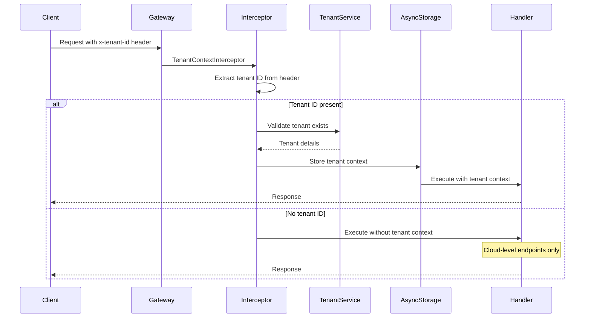

## Overview

<Info>
**Implemented in:** vritti-api-nexus, @vritti/api-sdk
**Last Updated:** January 2026
**Status:** Production
</Info>

Tenant resolution is the process of determining which tenant a request belongs to. Vritti uses a header-based approach where clients include the tenant identifier in each request, and the system validates and establishes the tenant context.

## What It Does

- Extracts tenant identifier from request headers
- Validates tenant exists and is active
- Establishes tenant context for the request lifecycle
- Routes database operations to correct tenant resources
- Provides tenant information to all downstream services

## Resolution Methods

### Primary: Header-Based Resolution

The primary method uses the `x-tenant-id` HTTP header:

```http
GET /cloud-api/orders
Authorization: Bearer <token>
x-tenant-id: 550e8400-e29b-41d4-a716-446655440000
```

**Configuration in main.ts:**
```typescript
// main.ts
configureApiSdk(app, {
  guard: {
    tenantHeaderName: 'x-tenant-id',  // Configurable header name
  },
});
```

### Secondary: Subdomain Lookup

For initial discovery, clients can lookup tenant by subdomain:

```http
GET /cloud-api/tenants/subdomain/acme
Authorization: Bearer <token>
```

**Response:**
```json
{
  "id": "550e8400-e29b-41d4-a716-446655440000",
  "subdomain": "acme",
  "name": "Acme Corporation",
  "status": "ACTIVE"
}
```

The client then uses the returned `id` for subsequent requests.

## Resolution Flow



## Implementation

### Tenant Context Interceptor

Automatically registered by `DatabaseModule.forServer()`:

```typescript
// @vritti/api-sdk (conceptual implementation)
@Injectable()
export class TenantContextInterceptor implements NestInterceptor {
  constructor(
    private readonly tenantHeaderName: string,
    private readonly tenantContext: TenantContext,
  ) {}

  intercept(context: ExecutionContext, next: CallHandler): Observable<any> {
    const request = context.switchToHttp().getRequest();
    const tenantId = request.headers[this.tenantHeaderName];

    if (!tenantId) {
      // Allow request to proceed without tenant context
      // (for cloud-level endpoints like tenant management)
      return next.handle();
    }

    // Validate UUID format
    if (!this.isValidUuid(tenantId)) {
      throw new BadRequestException('Invalid tenant ID format');
    }

    // Store tenant context in AsyncLocalStorage
    return this.tenantContext.run(tenantId, () => next.handle());
  }

  private isValidUuid(value: string): boolean {
    const uuidRegex = /^[0-9a-f]{8}-[0-9a-f]{4}-[0-9a-f]{4}-[0-9a-f]{4}-[0-9a-f]{12}$/i;
    return uuidRegex.test(value);
  }
}
```

### Accessing Tenant Context in Services

```typescript
// In any service within the request scope
@Injectable()
export class OrderService {
  constructor(
    private readonly tenantContext: TenantContext,
  ) {}

  async getOrders() {
    const tenantId = this.tenantContext.getTenantId();

    if (!tenantId) {
      throw new UnauthorizedException('Tenant context required');
    }

    return this.orderRepository.findByTenant(tenantId);
  }
}
```

### Custom Decorator for Tenant ID

```typescript
// @vritti/api-sdk
export const TenantId = createParamDecorator(
  (data: unknown, ctx: ExecutionContext) => {
    const request = ctx.switchToHttp().getRequest();
    return request.headers['x-tenant-id'];
  },
);

// Usage in controller
@Get('orders')
async getOrders(@TenantId() tenantId: string) {
  return this.orderService.getOrders(tenantId);
}
```

## Client Integration

### JavaScript/TypeScript Client

```typescript
// API client configuration
const apiClient = axios.create({
  baseURL: 'https://api.vritti.io',
  headers: {
    'Content-Type': 'application/json',
  },
});

// Set tenant ID after login
function setTenantContext(tenantId: string) {
  apiClient.defaults.headers.common['x-tenant-id'] = tenantId;
}

// Usage
async function initializeApp() {
  // 1. Authenticate user
  const authResponse = await apiClient.post('/auth/login', { ... });
  const token = authResponse.data.accessToken;

  // 2. Set auth header
  apiClient.defaults.headers.common['Authorization'] = `Bearer ${token}`;

  // 3. Get tenant by subdomain (from URL or config)
  const tenantResponse = await apiClient.get('/cloud-api/tenants/subdomain/acme');
  const tenantId = tenantResponse.data.id;

  // 4. Set tenant context for all future requests
  setTenantContext(tenantId);

  // 5. Now all requests include tenant ID
  const orders = await apiClient.get('/orders');  // x-tenant-id included
}
```

### React Application Example

```typescript
// TenantProvider.tsx
const TenantContext = createContext<{
  tenantId: string | null;
  setTenant: (id: string) => void;
}>({ tenantId: null, setTenant: () => {} });

export function TenantProvider({ children }: { children: React.ReactNode }) {
  const [tenantId, setTenantId] = useState<string | null>(null);

  // Configure axios interceptor
  useEffect(() => {
    const interceptor = api.interceptors.request.use((config) => {
      if (tenantId) {
        config.headers['x-tenant-id'] = tenantId;
      }
      return config;
    });

    return () => api.interceptors.request.eject(interceptor);
  }, [tenantId]);

  return (
    <TenantContext.Provider value={{ tenantId, setTenant: setTenantId }}>
      {children}
    </TenantContext.Provider>
  );
}

// Hook for accessing tenant context
export function useTenant() {
  return useContext(TenantContext);
}
```

### Subdomain-Based Discovery

For applications where subdomain indicates tenant:

```typescript
// Get tenant from URL subdomain
function getTenantFromUrl(): string | null {
  const hostname = window.location.hostname;
  // e.g., acme.app.vritti.io
  const subdomain = hostname.split('.')[0];

  if (subdomain === 'app' || subdomain === 'www') {
    return null;  // Main app, no tenant
  }

  return subdomain;
}

// Initialize tenant on app load
async function initializeTenant() {
  const subdomain = getTenantFromUrl();

  if (subdomain) {
    const response = await api.get(`/cloud-api/tenants/subdomain/${subdomain}`);
    return response.data;
  }

  return null;
}
```

## Tenant-Aware vs Cloud-Level Endpoints

### Endpoint Classification

| Endpoint Pattern | Tenant Context | Description |
|------------------|----------------|-------------|
| `/cloud-api/tenants/*` | Not required | Tenant management |
| `/cloud-api/auth/*` | Not required | Authentication |
| `/cloud-api/onboarding/*` | Not required | User onboarding |
| `/api/orders/*` | Required | Tenant business data |
| `/api/users/*` | Required | Tenant user management |

### Requiring Tenant Context

For endpoints that require tenant context:

```typescript
// Custom guard to require tenant
@Injectable()
export class RequireTenantGuard implements CanActivate {
  constructor(private readonly tenantContext: TenantContext) {}

  canActivate(context: ExecutionContext): boolean {
    const tenantId = this.tenantContext.getTenantId();

    if (!tenantId) {
      throw new UnauthorizedException('Tenant context required');
    }

    return true;
  }
}

// Usage on controller or method
@Controller('orders')
@UseGuards(RequireTenantGuard)
export class OrderController {
  // All methods require tenant context
}
```

## Validation

### Tenant Existence Check

```typescript
// Validate tenant exists and is active
async function validateTenant(tenantId: string): Promise<Tenant> {
  const tenant = await tenantRepository.findById(tenantId);

  if (!tenant) {
    throw new NotFoundException('Tenant not found');
  }

  if (tenant.status !== 'ACTIVE') {
    throw new ForbiddenException(`Tenant is ${tenant.status.toLowerCase()}`);
  }

  return tenant;
}
```

### Status-Based Access Control

| Status | Access |
|--------|--------|
| `ACTIVE` | Full access |
| `SUSPENDED` | Read-only (configurable) |
| `ARCHIVED` | No access |

## Error Handling

| Error | HTTP Status | Cause |
|-------|-------------|-------|
| Missing tenant ID | 400 | No `x-tenant-id` header on tenant-required endpoint |
| Invalid tenant ID | 400 | Malformed UUID in header |
| Tenant not found | 404 | Tenant ID doesn't exist |
| Tenant suspended | 403 | Tenant status is SUSPENDED |
| Tenant archived | 403 | Tenant status is ARCHIVED |

### Error Responses

```json
// Missing tenant ID
{
  "statusCode": 400,
  "message": "Tenant context required",
  "error": "Bad Request"
}

// Invalid UUID format
{
  "statusCode": 400,
  "message": "Invalid tenant ID format",
  "error": "Bad Request"
}

// Tenant not found
{
  "statusCode": 404,
  "message": "Tenant not found",
  "error": "Not Found"
}

// Tenant suspended
{
  "statusCode": 403,
  "message": "Tenant is suspended",
  "error": "Forbidden"
}
```

## AsyncLocalStorage Pattern

NestJS uses AsyncLocalStorage to propagate tenant context through async operations:

```typescript
// Context service
@Injectable()
export class TenantContext {
  private readonly storage = new AsyncLocalStorage<string>();

  run<T>(tenantId: string, callback: () => T): T {
    return this.storage.run(tenantId, callback);
  }

  getTenantId(): string | undefined {
    return this.storage.getStore();
  }
}
```

**Benefits:**
- Works with async/await and Promises
- No need to pass tenant ID through every function
- Automatic cleanup after request completes
- Thread-safe (per-request isolation)

## Troubleshooting

<Accordion title="Tenant ID not being extracted">
  **Symptoms:**
  - Tenant context always null
  - Cloud endpoints work, tenant endpoints fail

  **Solution:**
  - Verify header name matches configuration: `x-tenant-id`
  - Check header is being sent by client
  - Ensure `DatabaseModule.forServer()` is imported
  - Verify interceptor is globally registered
</Accordion>

<Accordion title="'Tenant context required' on all endpoints">
  **Symptoms:**
  - Even cloud-level endpoints require tenant

  **Solution:**
  - Check guard configuration
  - Verify endpoint is not decorated with `@RequireTenant()`
  - Review route ordering in controllers
</Accordion>

<Accordion title="Wrong tenant data returned">
  **Symptoms:**
  - Data from other tenants in response

  **Solution:**
  - Log tenant ID at entry and exit points
  - Verify AsyncLocalStorage is working
  - Check for shared state between requests
  - Review any caching mechanisms
</Accordion>

<Accordion title="Tenant context lost in async operations">
  **Symptoms:**
  - Tenant ID available initially, null in callbacks

  **Solution:**
  - Ensure using AsyncLocalStorage pattern
  - Check for manual thread spawning
  - Wrap callbacks in context.run() if needed
  - Avoid setTimeout/setImmediate without context
</Accordion>

## Best Practices

<CardGroup cols={2}>
  <Card title="Always Validate" icon="check">
    Validate tenant exists before processing business logic
  </Card>
  <Card title="Check Status" icon="toggle-on">
    Verify tenant is ACTIVE for write operations
  </Card>
  <Card title="Use Decorators" icon="at">
    Use @TenantId() decorator for clean code
  </Card>
  <Card title="Centralize Logic" icon="bullseye">
    Handle resolution in interceptor, not per-endpoint
  </Card>
</CardGroup>

## Related Documentation

<CardGroup cols={2}>
  <Card title="Multi-Tenancy Overview" icon="building" href="/features/tenants/overview">
    Tenant architecture basics
  </Card>
  <Card title="Tenant Isolation" icon="shield" href="/features/tenants/tenant-isolation">
    Data isolation strategies
  </Card>
  <Card title="Guards & Decorators" icon="shield-check" href="/architecture/backend/guards-decorators">
    NestJS security patterns
  </Card>
  <Card title="Module Structure" icon="folder-tree" href="/architecture/backend/module-structure">
    NestJS module organization
  </Card>
</CardGroup>
