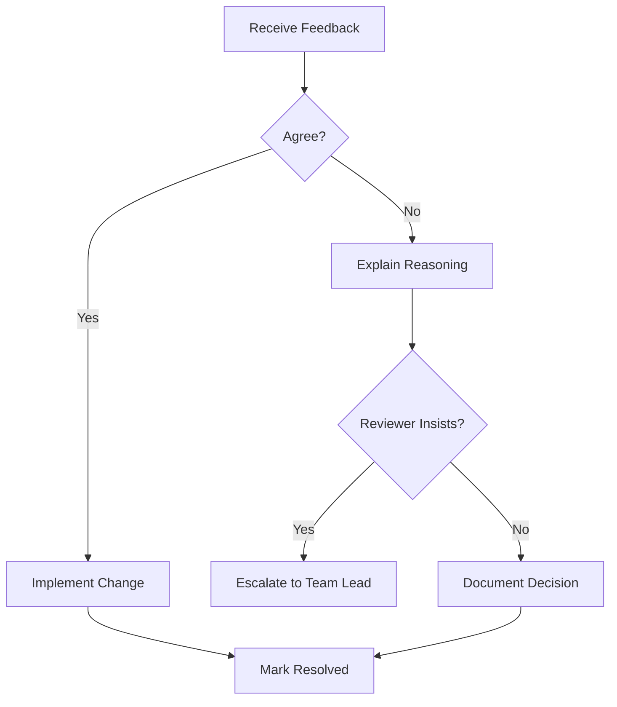
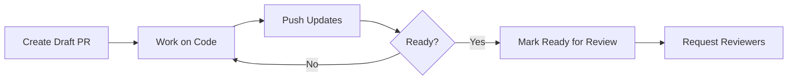

# Pull Request Guidelines

This document outlines the standards and best practices for pull requests (PRs) in our monorepo. Following these guidelines ensures consistent code quality, smooth collaboration, and efficient code reviews across all projects.

## PR Naming Conventions

Use a consistent naming format that clearly communicates the purpose of your changes.

### Format

```
type(scope): brief description
```

### Types

| Type | Description | Example |
|------|-------------|---------|
| `feat` | New feature or functionality | `feat(api): add user authentication endpoint` |
| `fix` | Bug fix | `fix(web): resolve login redirect loop` |
| `docs` | Documentation changes | `docs(readme): update installation instructions` |
| `style` | Code style/formatting (no logic changes) | `style(components): apply Biome formatting` |
| `refactor` | Code refactoring (no feature/fix) | `refactor(api): simplify user service logic` |
| `perf` | Performance improvements | `perf(web): optimize image lazy loading` |
| `test` | Adding or updating tests | `test(api): add unit tests for auth service` |
| `chore` | Build, CI, or tooling changes | `chore(ci): update GitHub Actions workflow` |
| `revert` | Reverting previous changes | `revert: feat(api): add user authentication` |

### Scope

The scope indicates which project or area of the codebase is affected:

- `api` - Backend NestJS application
- `web` - Frontend React application
- `components` - Component library
- `shared` - Shared utilities or types
- `ci` - CI/CD configuration
- `deps` - Dependency updates

<Accordion title="Best Practices for PR Titles">
  - Keep titles under 72 characters
  - Use lowercase for the description
  - Do not end with a period
  - Use imperative mood ("add feature" not "added feature")
  - Be specific but concise
  - Include ticket/issue number if applicable: `feat(api): add user roles [VRITTI-123]`
</Accordion>

## PR Description Template

Every PR should include a well-structured description. Copy and use this template:

````markdown
## Summary

Brief description of what this PR does and why.

## Changes

- List the main changes made
- Be specific about what was added, modified, or removed
- Group related changes together

## Type of Change

- [ ] Bug fix (non-breaking change that fixes an issue)
- [ ] New feature (non-breaking change that adds functionality)
- [ ] Breaking change (fix or feature that would cause existing functionality to change)
- [ ] Documentation update
- [ ] Refactoring (no functional changes)
- [ ] Performance improvement
- [ ] Test updates

## Testing

Describe how you tested your changes:

- [ ] Unit tests pass locally
- [ ] Integration tests pass locally
- [ ] Manual testing performed

### Test Details

Describe the testing performed:
- Steps to reproduce/verify the changes
- Edge cases considered
- Browser/environment tested (for frontend changes)

## Screenshots/Recordings

If applicable, add screenshots or recordings to help explain your changes.

| Before | After |
|--------|-------|
| screenshot | screenshot |

## Related Issues

Closes #issue_number
Related to #issue_number

## Checklist

- [ ] My code follows the project's code style
- [ ] I have run `pnpm lint` and `pnpm format` with no errors
- [ ] I have added tests that prove my fix/feature works
- [ ] I have updated documentation as needed
- [ ] I have checked for potential security issues
- [ ] I have considered backwards compatibility

## Additional Notes

Any additional information that reviewers should know.
````

<Note>
  Teams can customize this template based on their specific needs. Store a copy in `.github/PULL_REQUEST_TEMPLATE.md` to auto-populate PR descriptions.
</Note>

## PR Size Guidelines

Smaller PRs are easier to review, less likely to introduce bugs, and faster to merge.

### Size Categories

| Size | Lines Changed | Review Time | Recommendation |
|------|---------------|-------------|----------------|
| XS | < 50 | 5-10 min | Ideal for fixes and small features |
| S | 50-200 | 15-30 min | Good for most features |
| M | 200-500 | 30-60 min | Consider splitting if possible |
| L | 500-1000 | 1-2 hours | Should be rare, needs justification |
| XL | > 1000 | 2+ hours | Avoid unless absolutely necessary |

### Guidelines for Keeping PRs Small

<AccordionGroup>
  <Accordion title="Split by Feature">
    Break large features into smaller, incremental PRs:
    1. Infrastructure/scaffolding PR
    2. Core logic PR
    3. UI components PR
    4. Integration PR
  </Accordion>

  <Accordion title="Split by Layer">
    Separate backend and frontend changes:
    - API changes in one PR
    - Frontend changes in a follow-up PR
    - This allows parallel reviews
  </Accordion>

  <Accordion title="Exclude Generated Files">
    - Use `.gitattributes` to mark generated files
    - Lock files, build outputs, and generated types inflate PR size
    - Review these separately or exclude from diff counts
  </Accordion>

  <Accordion title="Refactor Separately">
    If your feature requires significant refactoring:
    1. Create a refactoring PR first
    2. Get it merged
    3. Then submit your feature PR
  </Accordion>
</AccordionGroup>

<Warning>
  PRs over 500 lines of changes require justification in the description explaining why the PR cannot be split.
</Warning>

## Code Review Process

### Review Expectations

**For Authors:**
- Self-review your code before requesting reviews
- Respond to all comments, even if just acknowledging
- Keep the PR updated with main branch
- Be receptive to feedback

**For Reviewers:**
- Review within 24 hours (business days)
- Be constructive and specific in feedback
- Approve when confident, request changes when necessary
- Focus on correctness, maintainability, and best practices

### Review Checklist

Reviewers should consider:

<CardGroup cols={2}>
  <Card title="Functionality" icon="check">
    - Does the code do what it claims?
    - Are edge cases handled?
    - Is error handling appropriate?
  </Card>

  <Card title="Code Quality" icon="code">
    - Is the code readable and maintainable?
    - Are naming conventions followed?
    - Is there unnecessary complexity?
  </Card>

  <Card title="Testing" icon="flask">
    - Are there sufficient tests?
    - Do tests cover edge cases?
    - Are tests meaningful (not just for coverage)?
  </Card>

  <Card title="Security" icon="shield">
    - Are there any security vulnerabilities?
    - Is sensitive data handled correctly?
    - Are inputs validated?
  </Card>
</CardGroup>

### Comment Conventions

Use prefixes to indicate the nature of your feedback:

| Prefix | Meaning | Action Required |
|--------|---------|-----------------|
| `blocking:` | Must be addressed before merge | Yes |
| `suggestion:` | Improvement idea, optional | No |
| `question:` | Seeking clarification | Response needed |
| `nit:` | Minor style/preference issue | No |
| `praise:` | Positive feedback | No |

**Example:**
```
blocking: This query is vulnerable to SQL injection. Please use parameterized queries.

suggestion: Consider extracting this logic into a separate function for reusability.

nit: Extra whitespace on line 45.
```

## Reviewer Assignment

### Guidelines

1. **Primary Reviewer**: Assign someone familiar with the affected codebase
2. **Secondary Reviewer**: For larger changes, include a second reviewer
3. **CODEOWNERS**: Respect automatic assignments from CODEOWNERS file

### Reviewer Selection by Project

| Project | Primary Reviewers | Notes |
|---------|-------------------|-------|
| Backend (NestJS) | Backend team leads | Include security review for auth changes |
| Frontend (React) | Frontend team leads | Include UX review for user-facing changes |
| Component Library | Design system team | Ensure design consistency |
| Shared/Cross-project | Tech leads | Coordinate across teams |

<Tip>
  Use GitHub's suggested reviewers feature, which recommends reviewers based on file history and expertise.
</Tip>

## Addressing Review Feedback

### Response Guidelines

1. **Respond to every comment**: Even if just to acknowledge
2. **Resolve conversations**: Mark as resolved only after addressing the feedback
3. **Explain decisions**: If you disagree, explain your reasoning respectfully
4. **Ask for clarification**: If feedback is unclear, ask questions

### Handling Disagreements



<Accordion title="When to Escalate">
  Escalate to a team lead or tech lead when:
  - Reviewers cannot reach agreement after discussion
  - The decision has significant architectural implications
  - The disagreement is blocking other work
  - Multiple PRs are affected by the decision
</Accordion>

## Merge Strategies

Choose the appropriate merge strategy based on the situation:

### Squash and Merge (Default)

**Use for:** Most PRs, especially those with messy commit history

```bash
# Results in a single commit on main
git merge --squash feature-branch
```

**Pros:**
- Clean, linear history
- Single commit per feature
- Easy to revert

**Cons:**
- Loses granular commit history
- May lose co-author information

### Merge Commit

**Use for:** Large features with meaningful commit history

```bash
# Creates a merge commit preserving branch history
git merge --no-ff feature-branch
```

**Pros:**
- Preserves complete history
- Shows branch structure
- Maintains individual commits

**Cons:**
- Can clutter history
- Harder to bisect

### Rebase and Merge

**Use for:** Clean, well-structured commit history you want to preserve

```bash
# Replays commits on top of main
git rebase main feature-branch
```

**Pros:**
- Linear history
- Preserves individual commits
- No merge commits

**Cons:**
- Requires clean commit history
- Can be confusing for beginners

<Tabs>
  <Tab title="Recommendation">
    **Default to Squash and Merge** for most PRs in the Vritti monorepo. This keeps the main branch history clean and makes it easy to understand what each PR introduced.

    Use Merge Commit only for:
    - Release branches
    - Large features with multiple meaningful commits
    - When preserving commit history is important for documentation
  </Tab>
  <Tab title="Configuration">
    Repository settings should be configured to:
    - Enable squash merging (default)
    - Enable merge commits (for exceptions)
    - Disable rebase merging (to maintain consistency)
    - Auto-delete head branches after merge
  </Tab>
</Tabs>

## Draft PRs

Use draft PRs for work-in-progress code that is not ready for review.

### When to Use Drafts

- Early feedback on approach or architecture
- Sharing progress with teammates
- Running CI before code is complete
- Collaborative development

### Draft PR Workflow



### Best Practices

<Steps>
  <Step title="Create Early">
    Open a draft PR as soon as you have initial code to share, even if incomplete.
  </Step>
  <Step title="Update Description">
    Keep the description updated with current status and known issues.
  </Step>
  <Step title="Request Feedback">
    Use comments to ask specific questions about your approach.
  </Step>
  <Step title="Mark Ready">
    Only mark as "Ready for Review" when the PR meets all checklist items.
  </Step>
</Steps>

## Pre-Review Checklist

Before marking your PR as ready for review, ensure all items are complete:

### Required Checks

<Checklist>
  - [ ] Code compiles without errors
  - [ ] All tests pass locally (`pnpm test`)
  - [ ] Linting passes (`pnpm lint`)
  - [ ] Formatting is correct (`pnpm format`)
  - [ ] No merge conflicts with main branch
  - [ ] PR title follows naming conventions
  - [ ] PR description is complete
</Checklist>

### Project-Specific Checks

<Tabs>
  <Tab title="Backend (NestJS)">
    <Checklist>
      - [ ] API documentation updated (if endpoints changed)
      - [ ] Database migrations included (if schema changed)
      - [ ] Environment variables documented (if new ones added)
      - [ ] Jest tests added for new functionality
      - [ ] No sensitive data in logs or responses
    </Checklist>
  </Tab>
  <Tab title="Frontend (React)">
    <Checklist>
      - [ ] Components render correctly across browsers
      - [ ] Accessibility requirements met (ARIA labels, keyboard nav)
      - [ ] No console errors or warnings
      - [ ] Responsive design tested
      - [ ] Loading and error states handled
    </Checklist>
  </Tab>
  <Tab title="Component Library">
    <Checklist>
      - [ ] Storybook stories added/updated
      - [ ] Component API documented with JSDoc
      - [ ] Exports updated in index file
      - [ ] Backward compatibility maintained
      - [ ] Theme tokens used (no hardcoded colors)
    </Checklist>
  </Tab>
</Tabs>

### Running Checks Locally

```bash
# Run all checks before pushing
pnpm lint          # Run Biome linting
pnpm format        # Check formatting
pnpm test          # Run Jest tests
pnpm build         # Verify build succeeds
```

<Tip>
  Set up pre-push hooks to automatically run these checks before pushing. This catches issues early and saves CI time.
</Tip>

## Cross-Project PRs in Monorepo

When changes span multiple projects, follow these additional guidelines:

### Coordination

1. **Identify Dependencies**: Determine the order in which changes must be applied
2. **Communicate**: Notify affected teams before making changes
3. **Coordinate Releases**: Ensure dependent changes are merged together

### PR Structure Options

<AccordionGroup>
  <Accordion title="Option 1: Single PR (Preferred for Small Changes)">
    Include all changes in one PR when:
    - Changes are tightly coupled
    - Less than 500 lines total
    - Same team owns all affected projects

    ```
    feat(api,web): add user profile feature

    - api: Add profile endpoints
    - web: Add profile page component
    - shared: Add profile types
    ```
  </Accordion>

  <Accordion title="Option 2: Stacked PRs (For Larger Changes)">
    Create dependent PRs when:
    - Changes are large and complex
    - Different teams need to review different parts
    - Changes can be merged incrementally

    ```
    PR 1: feat(shared): add profile types
    PR 2: feat(api): add profile endpoints (depends on PR 1)
    PR 3: feat(web): add profile page (depends on PR 2)
    ```
  </Accordion>

  <Accordion title="Option 3: Feature Branch">
    Use a long-lived feature branch when:
    - Feature requires multiple iterations
    - Team needs to collaborate on implementation
    - Changes cannot be safely merged incrementally

    ```
    main
      └── feature/user-profiles
            ├── PR: api changes
            ├── PR: shared types
            └── PR: web components
    ```
  </Accordion>
</AccordionGroup>

### Cross-Project Review Requirements

| Change Type | Required Reviewers |
|-------------|-------------------|
| Shared types/utilities | All affected project leads |
| API contracts | Backend + Frontend leads |
| Component library | Design system + consuming teams |
| CI/CD changes | DevOps + all project leads |

### Breaking Changes

<Warning>
  Breaking changes in shared code require:
  1. Discussion with all affected teams
  2. Migration plan documented in PR
  3. Approval from tech lead
  4. Coordinated deployment
</Warning>

## GitHub Actions Integration

PRs automatically trigger the following CI checks:

```yaml
# Automated checks on PR
- Biome lint and format check
- TypeScript type checking
- Jest unit tests
- Build verification
- Security scanning (Dependabot)
```

### Required Status Checks

PRs cannot be merged until these checks pass:
- `lint` - Biome linting
- `format` - Code formatting
- `test` - Unit tests
- `build` - Build verification
- `typecheck` - TypeScript compilation

### Handling Failed Checks

1. Click on the failed check to see details
2. Fix issues locally
3. Push updated code
4. Wait for checks to re-run

<Accordion title="Common CI Failures and Solutions">
  | Error | Solution |
  |-------|----------|
  | Lint errors | Run `pnpm lint --fix` locally |
  | Format errors | Run `pnpm format --write` locally |
  | Type errors | Check TypeScript errors in your IDE |
  | Test failures | Run `pnpm test` locally to debug |
  | Build failures | Check for missing imports or dependencies |
</Accordion>

## Summary

Following these PR guidelines ensures:

- **Consistency**: All PRs follow the same standards
- **Quality**: Code is thoroughly reviewed before merging
- **Efficiency**: Small, focused PRs are reviewed quickly
- **Collaboration**: Clear communication between authors and reviewers
- **Maintainability**: Clean git history and well-documented changes

<Card title="Quick Reference" icon="bookmark">
  **PR Title**: `type(scope): description`

  **Before Review**:
  1. Self-review your code
  2. Run `pnpm lint && pnpm format && pnpm test`
  3. Update PR description
  4. Assign reviewers

  **Merge Strategy**: Squash and Merge (default)
</Card>
