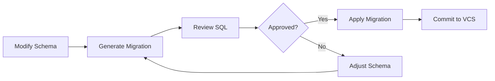
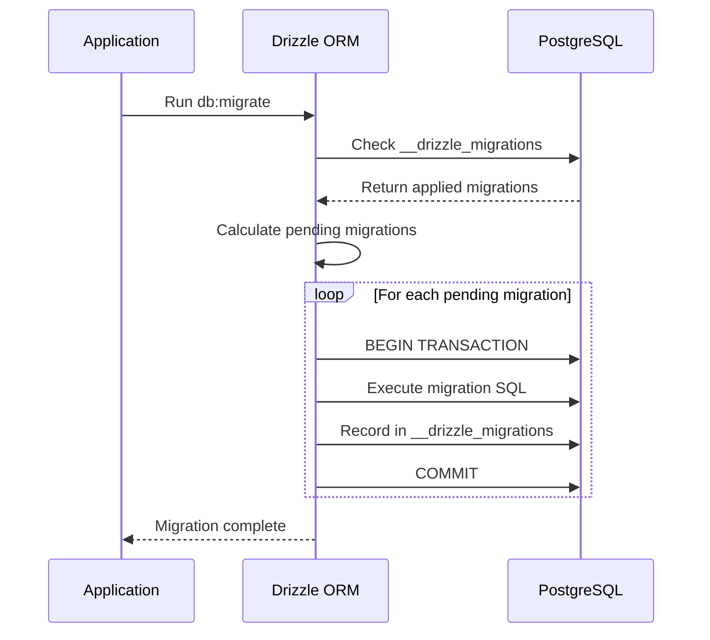

## Overview

Vritti uses **Drizzle ORM** with **PostgreSQL 17** for database management. Drizzle provides a type-safe, SQL-like query builder with automatic migration generation based on schema changes.

<Info>
  Drizzle migrations are **SQL-first** - they generate plain SQL files that can be reviewed, modified, and version-controlled alongside your code.
</Info>

## Migration Workflow



### Available Commands

| Command | Description | Environment |
|---------|-------------|-------------|
| `db:generate` | Generate migrations from schema changes | Development |
| `db:push` | Push schema directly (bypasses migrations) | Development only |
| `db:migrate` | Run pending migrations | All environments |
| `db:studio` | Launch Drizzle Studio UI | Development |
| `db:reset` | Force push schema (destructive) | Development only |
| `db:drop` | Drop entire schema | Development only |

<Warning>
  Never use `db:push`, `db:reset`, or `db:drop` in production environments. These commands bypass migration tracking and can cause data loss.
</Warning>

## Generating Migrations

### Step 1: Modify Your Schema

Update your Drizzle schema files in the `src/db/schema/` directory.

```typescript title="src/db/schema/users.ts"
import { pgTable, uuid, varchar, timestamp, boolean } from 'drizzle-orm/pg-core';

export const users = pgTable('users', {
  id: uuid('id').primaryKey().defaultRandom(),
  email: varchar('email', { length: 255 }).notNull().unique(),
  name: varchar('name', { length: 255 }),
  // New field added
  phoneNumber: varchar('phone_number', { length: 20 }),
  isVerified: boolean('is_verified').default(false),
  createdAt: timestamp('created_at').defaultNow().notNull(),
  updatedAt: timestamp('updated_at').defaultNow().notNull(),
});
```

### Step 2: Generate the Migration

Run the generate command to create a new migration file:

```bash
pnpm db:generate
```

Drizzle will analyze your schema changes and generate a SQL migration file:

```
drizzle/
  migrations/
    0001_initial_schema.sql
    0002_add_phone_number.sql  # New migration
    meta/
      _journal.json
      0001_snapshot.json
      0002_snapshot.json
```

### Step 3: Review the Generated SQL

Always review the generated migration before applying:

```sql title="drizzle/migrations/0002_add_phone_number.sql"
ALTER TABLE "users" ADD COLUMN "phone_number" varchar(20);
```

<Tip>
  Drizzle generates minimal, incremental SQL. Review each migration to ensure it matches your intended changes.
</Tip>

## Reviewing Generated Migrations

### What to Check

<Steps>
  <Step title="Verify Column Types">
    Ensure data types match your requirements (varchar lengths, numeric precision, etc.)
  </Step>
  <Step title="Check Constraints">
    Verify NOT NULL, UNIQUE, and CHECK constraints are correct
  </Step>
  <Step title="Review Indexes">
    Confirm indexes are created for frequently queried columns
  </Step>
  <Step title="Validate Foreign Keys">
    Ensure relationships and cascading rules are properly defined
  </Step>
  <Step title="Assess Data Impact">
    Consider how existing data will be affected by the migration
  </Step>
</Steps>

### Modifying Generated Migrations

You can safely modify generated SQL files before applying them:

```sql title="drizzle/migrations/0002_add_phone_number.sql"
-- Add column with a default for existing rows
ALTER TABLE "users" ADD COLUMN "phone_number" varchar(20);

-- Add an index for phone number lookups
CREATE INDEX "idx_users_phone_number" ON "users" ("phone_number");

-- Backfill existing records if needed
-- UPDATE "users" SET "phone_number" = NULL WHERE "phone_number" IS NULL;
```

<Warning>
  Once a migration has been applied to any environment, do not modify it. Create a new migration instead.
</Warning>

## Applying Migrations

### Development Environment

For local development, you have two options:

<Tabs>
  <Tab title="Using Migrations (Recommended)">
    ```bash
    # Generate migration from schema changes
    pnpm db:generate

    # Apply pending migrations
    pnpm db:migrate
    ```
  </Tab>
  <Tab title="Direct Push (Quick Iteration)">
    ```bash
    # Push schema directly without migrations
    # Use only during rapid prototyping
    pnpm db:push
    ```
  </Tab>
</Tabs>

### Production Environment

Production migrations should always use the migration command:

```bash
# In production deployment pipeline
pnpm db:migrate
```

<Info>
  Drizzle tracks applied migrations in a `drizzle.__drizzle_migrations` table. Only pending migrations are executed.
</Info>

### Migration Execution Process



## Migration Naming Conventions

### File Naming

Drizzle automatically names migrations with a numeric prefix. For clarity, use descriptive names:

```
0001_initial_schema.sql
0002_add_user_phone_number.sql
0003_create_organizations_table.sql
0004_add_user_organization_fk.sql
0005_create_audit_logs.sql
```

### Schema Organization

Organize schema files by domain:

```
src/db/schema/
  index.ts           # Re-exports all schemas
  users.ts           # User-related tables
  organizations.ts   # Organization tables
  subscriptions.ts   # Billing/subscription tables
  audit.ts           # Audit logging tables
```

```typescript title="src/db/schema/index.ts"
export * from './users';
export * from './organizations';
export * from './subscriptions';
export * from './audit';
```

## Handling Schema Conflicts

### Common Conflict Scenarios

<AccordionGroup>
  <Accordion title="Column Already Exists">
    **Cause**: Migration was partially applied or column was added manually.

    **Solution**:
    ```sql
    -- Add IF NOT EXISTS check
    DO $$
    BEGIN
      IF NOT EXISTS (
        SELECT 1 FROM information_schema.columns
        WHERE table_name = 'users' AND column_name = 'phone_number'
      ) THEN
        ALTER TABLE "users" ADD COLUMN "phone_number" varchar(20);
      END IF;
    END $$;
    ```
  </Accordion>

  <Accordion title="Table Already Exists">
    **Cause**: Table was created manually or by a different migration.

    **Solution**:
    ```sql
    CREATE TABLE IF NOT EXISTS "organizations" (
      "id" uuid PRIMARY KEY DEFAULT gen_random_uuid(),
      "name" varchar(255) NOT NULL
    );
    ```
  </Accordion>

  <Accordion title="Foreign Key Constraint Fails">
    **Cause**: Referenced table or column doesn't exist yet.

    **Solution**: Ensure migrations are ordered correctly. Create parent tables before child tables.
  </Accordion>

  <Accordion title="Index Already Exists">
    **Cause**: Index was created manually or in a previous migration.

    **Solution**:
    ```sql
    CREATE INDEX IF NOT EXISTS "idx_users_email" ON "users" ("email");
    ```
  </Accordion>
</AccordionGroup>

### Resolving Migration State Mismatches

If your local database state doesn't match the migration history:

```bash
# Option 1: Reset and replay (development only)
pnpm db:drop
pnpm db:migrate

# Option 2: Mark migrations as applied (careful!)
# Insert record directly into migrations table
INSERT INTO drizzle.__drizzle_migrations (hash, created_at)
VALUES ('migration_hash_here', NOW());
```

## Rollback Strategies

<Warning>
  Drizzle does not generate automatic rollback migrations. You must create rollback scripts manually for critical changes.
</Warning>

### Manual Rollback Scripts

Create a corresponding rollback script for each migration:

```
drizzle/
  migrations/
    0002_add_phone_number.sql
  rollbacks/
    0002_add_phone_number_rollback.sql
```

```sql title="drizzle/rollbacks/0002_add_phone_number_rollback.sql"
-- Rollback migration 0002
ALTER TABLE "users" DROP COLUMN IF EXISTS "phone_number";
```

### Safe Rollback Practices

<Steps>
  <Step title="Backup First">
    Always create a database backup before rolling back:
    ```bash
    pg_dump -Fc $DATABASE_URL > backup_$(date +%Y%m%d_%H%M%S).dump
    ```
  </Step>
  <Step title="Test Rollback">
    Test the rollback script on a staging environment first
  </Step>
  <Step title="Execute Rollback">
    Run the rollback SQL manually or via a script:
    ```bash
    psql $DATABASE_URL -f drizzle/rollbacks/0002_add_phone_number_rollback.sql
    ```
  </Step>
  <Step title="Update Migration State">
    Remove the migration record from the tracking table:
    ```sql
    DELETE FROM drizzle.__drizzle_migrations
    WHERE hash = 'migration_hash_here';
    ```
  </Step>
</Steps>

### Backwards-Compatible Changes

Prefer backwards-compatible migrations when possible:

| Change Type | Backwards Compatible | Strategy |
|------------|---------------------|----------|
| Add nullable column | Yes | Simple ALTER TABLE |
| Add column with default | Yes | ALTER TABLE with DEFAULT |
| Remove column | No | Deploy code first, then migrate |
| Rename column | No | Add new column, migrate data, remove old |
| Change column type | Depends | Use USING clause for safe casts |

## Multi-Tenant Migration Considerations

Vritti uses a multi-tenant architecture with shared database and tenant isolation via foreign keys.

### Tenant-Aware Migrations

When adding tenant-specific tables, always include the tenant reference:

```sql title="Adding a tenant-scoped table"
CREATE TABLE "tenant_settings" (
  "id" uuid PRIMARY KEY DEFAULT gen_random_uuid(),
  "tenant_id" uuid NOT NULL REFERENCES "tenants"("id") ON DELETE CASCADE,
  "key" varchar(255) NOT NULL,
  "value" jsonb,
  "created_at" timestamp DEFAULT NOW() NOT NULL,
  UNIQUE("tenant_id", "key")
);

-- Always add tenant_id index for query performance
CREATE INDEX "idx_tenant_settings_tenant_id" ON "tenant_settings" ("tenant_id");
```

### Row-Level Security (RLS)

For tables requiring RLS, add policies in the migration:

```sql title="Adding RLS to a table"
-- Enable RLS
ALTER TABLE "tenant_settings" ENABLE ROW LEVEL SECURITY;

-- Create policy for tenant isolation
CREATE POLICY "tenant_isolation" ON "tenant_settings"
  USING (tenant_id = current_setting('app.current_tenant_id')::uuid);
```

### Data Migrations Across Tenants

When backfilling data, process tenants in batches:

```sql title="Tenant-aware data migration"
-- Add new required column with temporary default
ALTER TABLE "tenant_settings"
ADD COLUMN "category" varchar(50) DEFAULT 'general';

-- Update existing records per tenant (in batches)
DO $$
DECLARE
  tenant_record RECORD;
BEGIN
  FOR tenant_record IN SELECT id FROM tenants LOOP
    UPDATE tenant_settings
    SET category = 'general'
    WHERE tenant_id = tenant_record.id
    AND category IS NULL;

    -- Commit each tenant batch
    COMMIT;
  END LOOP;
END $$;

-- Remove default after backfill
ALTER TABLE "tenant_settings"
ALTER COLUMN "category" DROP DEFAULT;
```

## CI/CD Integration

### GitHub Actions Workflow

```yaml title=".github/workflows/migrations.yml"
name: Database Migrations

on:
  push:
    branches: [main]
    paths:
      - 'drizzle/migrations/**'

jobs:
  migrate-staging:
    runs-on: ubuntu-latest
    environment: staging
    steps:
      - uses: actions/checkout@v4

      - name: Setup Node.js
        uses: actions/setup-node@v4
        with:
          node-version: '20'

      - name: Install dependencies
        run: pnpm install

      - name: Run migrations
        env:
          DATABASE_URL: ${{ secrets.STAGING_DATABASE_URL }}
        run: pnpm db:migrate

      - name: Verify migration
        env:
          DATABASE_URL: ${{ secrets.STAGING_DATABASE_URL }}
        run: |
          # Run a simple query to verify database connectivity
          pnpm drizzle-kit check

  migrate-production:
    runs-on: ubuntu-latest
    needs: migrate-staging
    environment: production
    steps:
      - uses: actions/checkout@v4

      - name: Setup Node.js
        uses: actions/setup-node@v4
        with:
          node-version: '20'

      - name: Install dependencies
        run: pnpm install

      - name: Create backup
        env:
          DATABASE_URL: ${{ secrets.PRODUCTION_DATABASE_URL }}
        run: |
          pg_dump -Fc $DATABASE_URL > backup.dump
          # Upload to secure storage

      - name: Run migrations
        env:
          DATABASE_URL: ${{ secrets.PRODUCTION_DATABASE_URL }}
        run: pnpm db:migrate
```

### Pre-Deployment Checks

Add migration validation to your CI pipeline:

```yaml title="Migration validation job"
validate-migrations:
  runs-on: ubuntu-latest
  steps:
    - uses: actions/checkout@v4

    - name: Check for pending migrations
      run: |
        # Ensure migrations are generated for any schema changes
        pnpm db:generate

        # Fail if there are uncommitted migration files
        if [[ -n $(git status --porcelain drizzle/migrations/) ]]; then
          echo "Error: Uncommitted migration files detected"
          echo "Run 'pnpm db:generate' and commit the generated migrations"
          exit 1
        fi

    - name: Lint migration SQL
      run: |
        # Check for dangerous operations
        for file in drizzle/migrations/*.sql; do
          if grep -qi "DROP TABLE\|TRUNCATE\|DELETE FROM.*WHERE 1=1" "$file"; then
            echo "Warning: Potentially destructive operation in $file"
          fi
        done
```

### Deployment Order

<Steps>
  <Step title="Run Migrations First">
    Apply database migrations before deploying new application code
  </Step>
  <Step title="Deploy Application">
    Roll out the new application version
  </Step>
  <Step title="Verify Health">
    Run health checks to ensure the application works with the new schema
  </Step>
  <Step title="Cleanup (Optional)">
    Remove deprecated columns/tables in a follow-up migration after confirming stability
  </Step>
</Steps>

## Troubleshooting

### Common Issues

<AccordionGroup>
  <Accordion title="Migration timeout">
    **Symptom**: Migration hangs or times out on large tables.

    **Solution**: For large data migrations, use batched updates:
    ```sql
    -- Process in batches of 10,000
    DO $$
    DECLARE
      batch_size INT := 10000;
      affected INT;
    BEGIN
      LOOP
        UPDATE users
        SET new_column = computed_value
        WHERE new_column IS NULL
        LIMIT batch_size;

        GET DIAGNOSTICS affected = ROW_COUNT;
        EXIT WHEN affected = 0;

        PERFORM pg_sleep(0.1); -- Brief pause between batches
      END LOOP;
    END $$;
    ```
  </Accordion>

  <Accordion title="Lock contention">
    **Symptom**: Migration blocks application queries or vice versa.

    **Solution**: Use `CONCURRENTLY` for index creation:
    ```sql
    CREATE INDEX CONCURRENTLY "idx_users_email" ON "users" ("email");
    ```
  </Accordion>

  <Accordion title="Out of disk space">
    **Symptom**: Migration fails due to disk space during large ALTER operations.

    **Solution**: PostgreSQL creates a new table copy for some ALTER operations. Ensure sufficient disk space (2x table size) or perform changes incrementally.
  </Accordion>
</AccordionGroup>

### Debugging Migrations

```bash
# Check current migration state
psql $DATABASE_URL -c "SELECT * FROM drizzle.__drizzle_migrations ORDER BY created_at;"

# View table structure
psql $DATABASE_URL -c "\d+ users"

# Check for locks
psql $DATABASE_URL -c "SELECT * FROM pg_locks WHERE NOT granted;"
```

## Best Practices Summary

<CardGroup cols={2}>
  <Card title="Always Review" icon="magnifying-glass">
    Review generated SQL before applying migrations
  </Card>
  <Card title="Test First" icon="flask">
    Apply migrations to staging before production
  </Card>
  <Card title="Backup Always" icon="database">
    Create backups before production migrations
  </Card>
  <Card title="Small Changes" icon="layer-group">
    Prefer multiple small migrations over large ones
  </Card>
  <Card title="Backwards Compatible" icon="rotate-left">
    Design migrations to be backwards compatible when possible
  </Card>
  <Card title="Version Control" icon="code-branch">
    Always commit migrations with related code changes
  </Card>
</CardGroup>

## Related Documentation

<CardGroup cols={2}>
  <Card title="Drizzle Schema Guide" icon="table" href="/backend/database/drizzle-schema">
    Learn how to define schemas with Drizzle ORM
  </Card>
  <Card title="Database Backup Procedures" icon="hard-drive" href="/operations/database/backups">
    Database backup and recovery procedures
  </Card>
  <Card title="PostgreSQL Optimization" icon="gauge-high" href="/operations/database/optimization">
    Query optimization and performance tuning
  </Card>
  <Card title="CI/CD Pipeline" icon="arrows-spin" href="/operations/ci-cd">
    Complete CI/CD setup documentation
  </Card>
</CardGroup>
