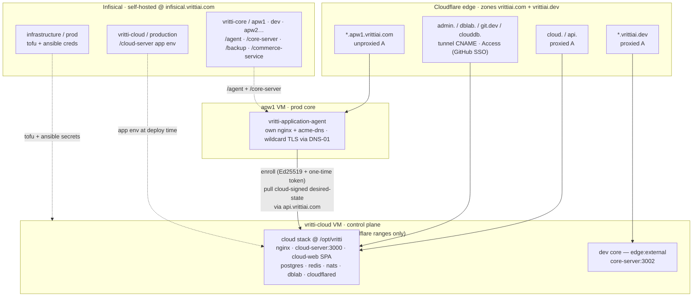

Vritti's infrastructure is small on purpose. One control-plane VM behind Cloudflare, a handful of
direct-served core VMs, two DNS zones, and three Infisical projects. Everything below is provisioned as
code — see the [Repo layout](/overview/repo-layout) for where each piece lives.

## The picture

## The layers

### Cloudflare edge

Two zones front the estate. `vrittiai.com` covers the cloud VM and the prod cores; `vrittiai.dev`
covers the dev core. `cloud.` and `api.` are **proxied A records** — the public only ever sees
Cloudflare IPs, and the origin is hidden. `api.vrittiai.com` is the public machine API the agent enrolls
against (it is **not** Access-gated; agent auth is Ed25519 plus an enroll token). Admin surfaces
(`admin.`, `dblab.`, `git.dev`, `clouddb.`) are proxied CNAMEs to the cloudflared **tunnel**, Access-gated
by GitHub-org SSO, so the VM exposes no inbound admin ports. See [DNS & TLS](/cloud/dns-tls).

### The cloud control-plane VM (`vritti-cloud`)

The control plane runs the cloud compose stack at `/opt/vritti`: nginx, `cloud-server` (the cloud API),
Postgres, Redis, NATS, DbLab, and cloudflared. The cloud-web SPA is a static bundle served by nginx. Its
security group, `vritti-cloud`, allows `:80`/`:443` only from Cloudflare's IPv4 ranges and SSH only from
the admin IP. Details in [Cloud overview](/cloud/overview) and [Security](/cloud/security).

### Core VMs (direct-served)

Core VMs are cattle: each is a reserved public IP plus a VM attached to the **shared `vritti-core`
security group**. `apw1` is a prod core with `edge: managed` — the agent runs its own nginx and bundled
acme-dns and issues a wildcard cert via DNS-01, so its SG is world-open (`:80`/`:443`/`:2222`/`:53`).
The **dev core** is special: it rides the cloud VM with `edge: external`, using the cloud stack's nginx
as its edge. See the [Deployment model](/deployments/model) and [Dev core](/deployments/dev-core).

### DNS zones

- `*.apw1.vrittiai.com` — unproxied A records pointing directly at the apw1 VM.
- `*.vrittiai.dev` — proxied A records pointing at the cloud VM (the dev core). This first-level wildcard
  is covered by free Universal SSL and free proxy; that's why the dev core lives on `vrittiai.dev`
  rather than a second-level `*.dev.vrittiai.com`.

### The agent and signed desired-state

Each core VM runs the `vritti-application-agent` (Go), deployed by Ansible's `agent` role as a container
under systemd. On first run it enrolls with the cloud using its `DEPLOYMENT_ID`, a one-time
`ENROLL_TOKEN`, and its own Ed25519 keypair. Thereafter it pulls a **cloud-signed desired state** from
`https://api.vrittiai.com` and reconciles the core stack. Its secret-store connection arrives inside the
signed desired-state — never through Ansible.

### Three Infisical projects

Everything credential- or per-VM-shaped comes from the self-hosted Infisical at
`https://infisical.vrittiai.com`:

| Project | Env(s) | Holds |
|---|---|---|
| `infrastructure` | `prod` | tofu + ansible creds for the cloud VM |
| `vritti-cloud` | `production` | the `cloud-server` app env (`/cloud-server`), exported at deploy time |
| `vritti-core` | `apw1`, `dev`, future `apw2` | per-core `/agent`, `/core-server`, `/backup`, `/commerce-service` |

See [Infisical overview](/infisical/overview) for the full project × env × folder map.
