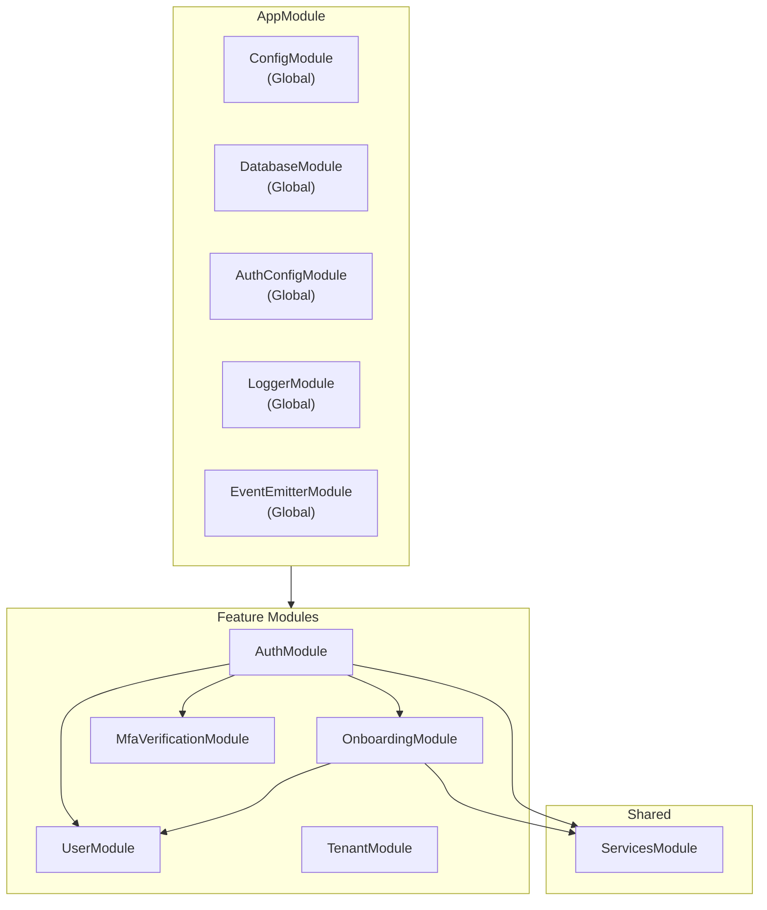
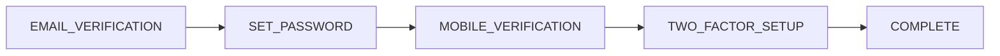

# Module Guide

This guide explains each NestJS module in vritti-api-nexus, their responsibilities, and how they interact.

## Module Architecture



## AppModule (Root)

The root module configures global services and imports all feature modules.

```typescript
// src/app.module.ts
@Module({
  imports: [
    // Global configuration
    ConfigModule.forRoot({ isGlobal: true }),
    EventEmitterModule.forRoot(),
    LoggerModule.forRoot({ preset: 'development' }),

    // Multi-tenant database
    DatabaseModule.forServer({ /* config */ }),

    // Global auth guard
    AuthConfigModule.forRootAsync({ /* config */ }),

    // Route registration with prefix
    RouterModule.register([
      {
        path: 'cloud-api',
        children: [
          { path: 'tenants', module: TenantModule },
          { path: 'users', module: UserModule },
          { path: 'auth', module: AuthModule },
          { path: 'onboarding', module: OnboardingModule },
          { path: 'mfa', module: MfaVerificationModule },
        ],
      },
    ]),
  ],
})
export class AppModule {}
```

## AuthModule

Handles all authentication: JWT, OAuth, Passkeys, and session management.

### Structure

```
src/modules/cloud-api/auth/
├── auth.module.ts
├── auth.controller.ts           # Login, signup, refresh, logout
├── auth.service.ts              # Core auth logic
├── jwt-auth.service.ts          # JWT token operations
├── session.service.ts           # Session management
├── session.repository.ts
├── oauth/
│   ├── oauth.controller.ts      # OAuth initiate, callback
│   ├── oauth.service.ts         # OAuth provider logic
│   ├── oauth-state.service.ts   # CSRF state management
│   ├── oauth-provider.repository.ts
│   ├── oauth-state.repository.ts
│   └── providers/               # Google, Microsoft, etc.
├── passkey/
│   ├── passkey-auth.controller.ts
│   └── passkey-auth.service.ts
├── mfa-verification/            # MFA sub-module
│   ├── mfa-verification.module.ts
│   └── mfa-verification.controller.ts
└── dto/
    ├── login.dto.ts
    ├── signup.dto.ts
    └── refresh-token.dto.ts
```

### Key Components

| Component | Purpose |
|-----------|---------|
| `AuthController` | Login, signup, refresh token, logout endpoints |
| `AuthService` | Credential validation, user lookup, session creation |
| `JwtAuthService` | JWT token generation and validation |
| `SessionService` | Session CRUD, token rotation |
| `OAuthService` | OAuth flow coordination |
| `PasskeyAuthService` | WebAuthn registration and verification |

### Endpoints

| Method | Path | Description |
|--------|------|-------------|
| POST | `/auth/signup` | Register new user |
| POST | `/auth/login` | Authenticate with email/password |
| POST | `/auth/refresh` | Refresh access token |
| POST | `/auth/logout` | Invalidate session |
| GET | `/auth/me` | Get current user |
| GET | `/auth/oauth/:provider/initiate` | Start OAuth flow |
| GET | `/auth/oauth/:provider/callback` | OAuth callback |
| POST | `/auth/passkey/register/start` | Start passkey registration |
| POST | `/auth/passkey/register/verify` | Complete passkey registration |
| POST | `/auth/passkey/login/start` | Start passkey login |
| POST | `/auth/passkey/login/verify` | Complete passkey login |

### Module Definition

```typescript
@Module({
  imports: [
    JwtModule.registerAsync({ /* config */ }),
    forwardRef(() => UserModule),
    forwardRef(() => OnboardingModule),
    MfaVerificationModule,
  ],
  controllers: [
    AuthController,
    AuthOAuthController,
    PasskeyAuthController,
  ],
  providers: [
    AuthService,
    JwtAuthService,
    SessionService,
    SessionRepository,
    OAuthService,
    OAuthStateService,
    OAuthProviderRepository,
    OAuthStateRepository,
    PasskeyAuthService,
    // OAuth providers
    GoogleOAuthProvider,
    MicrosoftOAuthProvider,
  ],
  exports: [AuthService, JwtAuthService, SessionService],
})
export class AuthModule {}
```

## OnboardingModule

Manages the multi-step user onboarding flow with verification.

### Structure

```
src/modules/cloud-api/onboarding/
├── onboarding.module.ts
├── onboarding.controller.ts     # Onboarding flow endpoints
├── onboarding.service.ts        # Step coordination
├── verification/
│   ├── email-verification.service.ts
│   ├── email-verification.repository.ts
│   ├── mobile-verification.service.ts
│   ├── mobile-verification.repository.ts
│   └── otp.service.ts           # OTP generation/validation
├── two-factor/
│   ├── two-factor.controller.ts # 2FA setup endpoints
│   ├── two-factor-auth.service.ts
│   ├── two-factor-auth.repository.ts
│   ├── totp.service.ts          # TOTP (authenticator apps)
│   └── webauthn.service.ts      # Passkey setup
├── sse/
│   ├── verification-sse.controller.ts
│   └── sse-connection.service.ts
├── webhooks/
│   └── verification-webhook.controller.ts
└── dto/
```

### Onboarding Flow



### Key Components

| Component | Purpose |
|-----------|---------|
| `OnboardingService` | Coordinates step transitions |
| `EmailVerificationService` | Email OTP send/verify |
| `MobileVerificationService` | SMS/WhatsApp verification |
| `OtpService` | OTP generation and hashing |
| `TotpService` | TOTP secret and verification |
| `WebAuthnService` | Passkey registration during 2FA setup |
| `SseConnectionService` | Real-time verification updates |

### Endpoints

| Method | Path | Description |
|--------|------|-------------|
| GET | `/onboarding/status` | Current onboarding step |
| POST | `/onboarding/verify-email/send` | Send email OTP |
| POST | `/onboarding/verify-email/verify` | Verify email OTP |
| POST | `/onboarding/set-password` | Set user password |
| POST | `/onboarding/mobile/initiate` | Start mobile verification |
| POST | `/onboarding/mobile/verify` | Verify mobile OTP |
| GET | `/onboarding/2fa/methods` | Available 2FA methods |
| POST | `/onboarding/2fa/totp/setup` | Generate TOTP secret |
| POST | `/onboarding/2fa/totp/verify` | Verify TOTP setup |
| POST | `/onboarding/2fa/passkey/register` | Register passkey |
| GET | `/onboarding/sse/verification` | SSE connection |

### SSE Real-Time Updates

```typescript
// Client subscribes to verification events
const eventSource = new EventSource('/cloud-api/onboarding/sse/verification');

eventSource.onmessage = (event) => {
  const data = JSON.parse(event.data);
  if (data.type === 'MOBILE_VERIFIED') {
    // Proceed to next step
  }
};
```

## UserModule

Manages user accounts and profiles.

### Structure

```
src/modules/cloud-api/user/
├── user.module.ts
├── user.controller.ts
├── user.service.ts
├── user.repository.ts
└── dto/
    ├── create-user.dto.ts
    └── update-user.dto.ts
```

### Key Components

| Component | Purpose |
|-----------|---------|
| `UserService` | User CRUD operations |
| `UserRepository` | Database queries |

### Endpoints

| Method | Path | Description |
|--------|------|-------------|
| GET | `/users` | List users (admin) |
| GET | `/users/:id` | Get user by ID |
| PATCH | `/users/:id` | Update user |

### User Entity

```typescript
// Key fields in users table
interface User {
  id: string;
  email: string;
  passwordHash?: string;
  accountStatus: 'PENDING_VERIFICATION' | 'ACTIVE' | 'INACTIVE';
  onboardingStep: OnboardingStep;
  emailVerified: boolean;
  phoneVerified: boolean;
  phone?: string;
  locale: string;
  timezone: string;
}
```

## TenantModule

Multi-tenant management for the SaaS platform.

### Structure

```
src/modules/cloud-api/tenant/
├── tenant.module.ts
├── tenant.controller.ts
├── tenant.service.ts
├── tenant.repository.ts
├── tenant-database-config.service.ts
├── tenant-database-config.repository.ts
└── dto/
```

### Key Components

| Component | Purpose |
|-----------|---------|
| `TenantService` | Tenant CRUD, status management |
| `TenantDatabaseConfigService` | Database connection config |

### Endpoints

| Method | Path | Description |
|--------|------|-------------|
| POST | `/tenants` | Create tenant |
| GET | `/tenants` | List tenants |
| GET | `/tenants/:id` | Get tenant |
| PATCH | `/tenants/:id` | Update tenant |
| DELETE | `/tenants/:id` | Archive tenant |

### Tenant Models

```typescript
// Tenant types
type DatabaseType = 'SHARED' | 'DEDICATED';
type TenantStatus = 'ACTIVE' | 'SUSPENDED' | 'ARCHIVED';

interface Tenant {
  id: string;
  subdomain: string;  // e.g., "acme"
  name: string;
  dbType: DatabaseType;
  status: TenantStatus;
}

interface TenantDatabaseConfig {
  tenantId: string;
  dbHost: string;
  dbPort: number;
  dbUsername: string;
  dbPassword: string;  // Encrypted
  dbName: string;
  dbSchema: string;
  connectionPoolSize: number;
}
```

## MfaVerificationModule

Handles MFA verification during login (separate from 2FA setup).

### Structure

```
src/modules/cloud-api/auth/mfa-verification/
├── mfa-verification.module.ts
├── mfa-verification.controller.ts
└── dto/
```

### Endpoints

| Method | Path | Description |
|--------|------|-------------|
| POST | `/mfa/totp/verify` | Verify TOTP during login |
| POST | `/mfa/passkey/verify` | Verify passkey during login |
| POST | `/mfa/backup-code/verify` | Verify backup code |

## ServicesModule

Shared services for communication and encryption.

### Structure

```
src/services/
├── services.module.ts
├── email.service.ts        # Brevo integration
├── sms.service.ts          # SMS delivery
├── whatsapp.service.ts     # WhatsApp Cloud API
└── encryption.service.ts   # Data encryption
```

### Email Service

```typescript
@Injectable()
export class EmailService {
  async sendVerificationEmail(email: string, otp: string): Promise<void>;
  async sendWelcomeEmail(email: string, name: string): Promise<void>;
  async sendPasswordResetEmail(email: string, token: string): Promise<void>;
}
```

### WhatsApp Service

```typescript
@Injectable()
export class WhatsAppService {
  async sendVerificationMessage(phone: string, otp: string): Promise<void>;
  async generateQrCode(phone: string, verificationId: string): Promise<string>;
  async verifyWebhookSignature(payload: string, signature: string): boolean;
}
```

## Module Communication

### Dependency Injection

```typescript
// AuthService injects UserService
@Injectable()
export class AuthService {
  constructor(
    private readonly userService: UserService,
    private readonly sessionService: SessionService,
    private readonly jwtService: JwtAuthService,
  ) {}
}
```

### Event-Based Communication

```typescript
// Emit event
this.eventEmitter.emit('user.verified', { userId, type: 'email' });

// Listen for event
@OnEvent('user.verified')
handleUserVerified(payload: { userId: string; type: string }) {
  // Update SSE clients
  this.sseConnectionService.broadcast(payload.userId, {
    type: 'VERIFICATION_COMPLETE',
    method: payload.type,
  });
}
```

### Forward References

Used for circular dependencies:

```typescript
@Module({
  imports: [
    forwardRef(() => UserModule),  // Circular dependency
    forwardRef(() => OnboardingModule),
  ],
})
export class AuthModule {}
```

## Best Practices

<CardGroup cols={2}>
  <Card title="Single Responsibility" icon="bullseye">
    Each module handles one domain. Auth doesn't manage users directly.
  </Card>
  <Card title="Explicit Exports" icon="share">
    Only export what other modules need. Keep internals private.
  </Card>
  <Card title="Repository Pattern" icon="database">
    All database access goes through repositories, never directly in services.
  </Card>
  <Card title="DTO Validation" icon="check">
    Validate all input at controller level using class-validator.
  </Card>
</CardGroup>

## Next Steps

<CardGroup cols={2}>
  <Card title="Service Patterns" icon="layer-group" href="/projects/api-nexus/services">
    Learn service layer patterns
  </Card>
  <Card title="Testing Guide" icon="flask" href="/projects/api-nexus/testing">
    Test your modules
  </Card>
</CardGroup>
