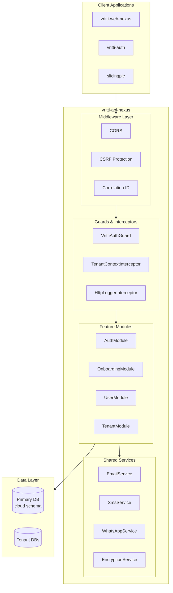

# API Nexus

**vritti-api-nexus** is the main backend API gateway for the Vritti SaaS platform. Built with NestJS 11 and Fastify 5, it provides a secure, scalable, multi-tenant API for all frontend applications.

## Technology Stack

| Technology | Version | Purpose |
|------------|---------|---------|
| NestJS | 11.0.1 | Application framework |
| Fastify | 5.6.2 | HTTP server (faster than Express) |
| Drizzle ORM | 0.43.1 | Type-safe PostgreSQL ORM |
| TypeScript | 5.7 | Language |
| SWC | Latest | Fast TypeScript compilation |
| Biome | 2.2.3 | Linting and formatting |
| Jest | 30.x | Testing framework |

## Architecture Overview



## Project Structure

```
vritti-api-nexus/
├── src/
│   ├── config/                 # Environment validation, JWT config
│   ├── db/
│   │   ├── schema/             # Drizzle ORM table definitions
│   │   └── migrations/         # Database migrations
│   ├── modules/
│   │   └── cloud-api/          # All API modules
│   │       ├── auth/           # Authentication (JWT, OAuth, Passkey)
│   │       ├── onboarding/     # Verification flows
│   │       ├── tenant/         # Multi-tenant management
│   │       └── user/           # User management
│   ├── services/               # Shared services (email, SMS, etc.)
│   ├── app.module.ts           # Root module
│   └── main.ts                 # Bootstrap
├── test/                       # Test configuration
├── certs/                      # SSL certificates
├── drizzle.config.ts           # ORM configuration
└── openapi.json                # Generated API spec
```

## Feature Modules

<CardGroup cols={2}>
  <Card title="AuthModule" icon="key">
    JWT authentication, OAuth (Google, Microsoft), Passkey/WebAuthn, session management
  </Card>
  <Card title="OnboardingModule" icon="user-plus">
    Email verification, mobile verification (SMS/WhatsApp), 2FA setup, SSE real-time updates
  </Card>
  <Card title="TenantModule" icon="building">
    Tenant registry, database configuration, multi-tenancy management
  </Card>
  <Card title="UserModule" icon="user">
    User CRUD operations, profile management
  </Card>
</CardGroup>

## Key Features

### Multi-Tenancy

Supports two database models:

<Tabs>
  <Tab title="Shared Database">
    Multiple tenants share a PostgreSQL instance with schema-level isolation. Cost-effective for smaller tenants.
  </Tab>
  <Tab title="Dedicated Database">
    Each tenant has a separate PostgreSQL database. Full isolation for enterprise customers.
  </Tab>
</Tabs>

### Authentication

- **JWT Tokens**: Short-lived access tokens (15 min) + long-lived refresh tokens (30 days)
- **Token Binding**: Access tokens contain refresh token hash for additional security
- **OAuth**: Google, Microsoft, Apple, Facebook, Twitter
- **Passkeys**: WebAuthn support with credential storage

### Real-Time Updates

Server-Sent Events (SSE) for real-time verification status updates during onboarding.

### Logging

- **Winston Logger**: Structured JSON logging in production
- **PII Masking**: Automatic masking of emails, phone numbers
- **Correlation IDs**: Request tracking across services
- **File Rotation**: Daily log rotation with configurable retention

## API Routes

All endpoints are prefixed with `/cloud-api`:

| Prefix | Module | Description |
|--------|--------|-------------|
| `/cloud-api/auth` | AuthModule | Login, signup, refresh, logout |
| `/cloud-api/auth/oauth` | AuthModule | OAuth initiate, callback, link |
| `/cloud-api/auth/passkey` | AuthModule | Passkey registration and login |
| `/cloud-api/onboarding` | OnboardingModule | Verification flows, 2FA setup |
| `/cloud-api/tenants` | TenantModule | Tenant CRUD |
| `/cloud-api/users` | UserModule | User management |
| `/csrf-token` | CsrfController | CSRF token endpoint |

## Dependencies

### Internal Packages

| Package | Purpose |
|---------|---------|
| `@vritti/api-sdk` | Auth guards, database module, decorators, logging |

### Key External Dependencies

| Package | Purpose |
|---------|---------|
| `@fastify/cookie` | Cookie handling |
| `@fastify/csrf-protection` | CSRF protection |
| `@simplewebauthn/server` | WebAuthn/Passkey support |
| `@getbrevo/brevo` | Email service |
| `drizzle-orm` | Database ORM |
| `drizzle-kit` | Migration tooling |
| `argon2` | Password hashing |

## Next Steps

<CardGroup cols={2}>
  <Card title="Setup Guide" icon="gear" href="/projects/api-nexus/setup">
    Local development setup
  </Card>
  <Card title="Module Guide" icon="cubes" href="/projects/api-nexus/module-guide">
    Deep dive into each module
  </Card>
</CardGroup>
