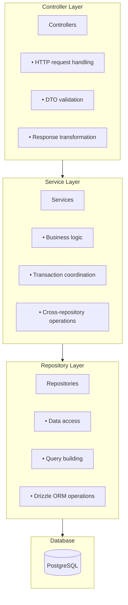

# Service Patterns

This guide covers the service layer architecture, patterns, and best practices used in vritti-api-nexus.

## Layered Architecture



## Service Structure

### Standard Service Pattern

```typescript
// user.service.ts
import { Injectable } from '@nestjs/common';
import { UserRepository } from './user.repository';
import { CreateUserDto, UpdateUserDto } from './dto';

@Injectable()
export class UserService {
  constructor(private readonly userRepository: UserRepository) {}

  async findById(id: string) {
    const user = await this.userRepository.findById(id);
    if (!user) {
      throw new NotFoundException(`User ${id} not found`);
    }
    return user;
  }

  async findByEmail(email: string) {
    return this.userRepository.findByEmail(email);
  }

  async create(dto: CreateUserDto) {
    // Check for existing user
    const existing = await this.userRepository.findByEmail(dto.email);
    if (existing) {
      throw new ConflictException('Email already registered');
    }

    // Business logic
    const user = await this.userRepository.create({
      ...dto,
      accountStatus: 'PENDING_VERIFICATION',
      onboardingStep: 'EMAIL_VERIFICATION',
    });

    return user;
  }

  async update(id: string, dto: UpdateUserDto) {
    await this.findById(id); // Throws if not found
    return this.userRepository.update(id, dto);
  }
}
```

### Service with Multiple Dependencies

```typescript
// auth.service.ts
@Injectable()
export class AuthService {
  constructor(
    private readonly userService: UserService,
    private readonly sessionService: SessionService,
    private readonly jwtService: JwtAuthService,
    private readonly configService: ConfigService,
  ) {}

  async login(dto: LoginDto) {
    // 1. Find user
    const user = await this.userService.findByEmail(dto.email);
    if (!user) {
      throw new UnauthorizedException('Invalid credentials');
    }

    // 2. Verify password
    const isValid = await this.verifyPassword(dto.password, user.passwordHash);
    if (!isValid) {
      throw new UnauthorizedException('Invalid credentials');
    }

    // 3. Check MFA requirement
    if (user.mfaEnabled) {
      return { requiresMfa: true, userId: user.id };
    }

    // 4. Create session and tokens
    const session = await this.sessionService.create(user.id, 'CLOUD');
    const tokens = await this.jwtService.generateTokens(user, session);

    return { user, tokens };
  }
}
```

## Repository Pattern

### Base Repository

```typescript
// base.repository.ts
export abstract class BaseRepository<T> {
  constructor(
    protected readonly db: PrimaryDatabaseService,
    protected readonly table: PgTableWithColumns<T>,
  ) {}

  async findById(id: string): Promise<T | null> {
    const [result] = await this.db.select()
      .from(this.table)
      .where(eq(this.table.id, id))
      .limit(1);
    return result ?? null;
  }

  async create(data: Partial<T>): Promise<T> {
    const [result] = await this.db.insert(this.table)
      .values(data)
      .returning();
    return result;
  }

  async update(id: string, data: Partial<T>): Promise<T> {
    const [result] = await this.db.update(this.table)
      .set({ ...data, updatedAt: new Date() })
      .where(eq(this.table.id, id))
      .returning();
    return result;
  }

  async delete(id: string): Promise<void> {
    await this.db.delete(this.table)
      .where(eq(this.table.id, id));
  }
}
```

### Domain Repository

```typescript
// user.repository.ts
@Injectable()
export class UserRepository extends BaseRepository<typeof users> {
  constructor(db: PrimaryDatabaseService) {
    super(db, users);
  }

  // Custom queries
  async findByEmail(email: string) {
    const [user] = await this.db.select()
      .from(users)
      .where(eq(users.email, email.toLowerCase()))
      .limit(1);
    return user ?? null;
  }

  async findActiveUsers(limit = 100, offset = 0) {
    return this.db.select()
      .from(users)
      .where(eq(users.accountStatus, 'ACTIVE'))
      .limit(limit)
      .offset(offset);
  }

  async updateOnboardingStep(userId: string, step: OnboardingStep) {
    return this.update(userId, { onboardingStep: step });
  }
}
```

## Shared Services

### EmailService

Integration with Brevo for transactional emails.

```typescript
// services/email.service.ts
@Injectable()
export class EmailService {
  private readonly client: TransactionalEmailsApi;

  constructor(private readonly configService: ConfigService) {
    const apiKey = this.configService.get('BREVO_API_KEY');
    this.client = new TransactionalEmailsApi();
    this.client.setApiKey(TransactionalEmailsApiApiKeys.apiKey, apiKey);
  }

  async sendVerificationEmail(email: string, otp: string) {
    await this.client.sendTransacEmail({
      sender: {
        email: this.configService.get('SENDER_EMAIL'),
        name: this.configService.get('SENDER_NAME'),
      },
      to: [{ email }],
      subject: 'Verify your email',
      htmlContent: `Your verification code is: <strong>${otp}</strong>`,
    });
  }

  async sendWelcomeEmail(email: string, name: string) {
    await this.client.sendTransacEmail({
      sender: { /* ... */ },
      to: [{ email }],
      templateId: 1, // Brevo template ID
      params: { name },
    });
  }
}
```

### WhatsAppService

Integration with WhatsApp Cloud API.

```typescript
// services/whatsapp.service.ts
@Injectable()
export class WhatsAppService {
  private readonly baseUrl = 'https://graph.facebook.com/v18.0';

  constructor(private readonly configService: ConfigService) {}

  async sendVerificationMessage(phone: string, otp: string) {
    const phoneNumberId = this.configService.get('WHATSAPP_PHONE_NUMBER_ID');
    const accessToken = this.configService.get('WHATSAPP_ACCESS_TOKEN');

    await axios.post(
      `${this.baseUrl}/${phoneNumberId}/messages`,
      {
        messaging_product: 'whatsapp',
        to: phone,
        type: 'template',
        template: {
          name: 'verification_code',
          language: { code: 'en' },
          components: [
            {
              type: 'body',
              parameters: [{ type: 'text', text: otp }],
            },
          ],
        },
      },
      {
        headers: { Authorization: `Bearer ${accessToken}` },
      },
    );
  }

  verifyWebhookSignature(payload: string, signature: string): boolean {
    const appSecret = this.configService.get('WHATSAPP_APP_SECRET');
    const expectedSignature = crypto
      .createHmac('sha256', appSecret)
      .update(payload)
      .digest('hex');
    return `sha256=${expectedSignature}` === signature;
  }
}
```

### EncryptionService

For encrypting sensitive data like database credentials.

```typescript
// services/encryption.service.ts
@Injectable()
export class EncryptionService {
  private readonly algorithm = 'aes-256-gcm';
  private readonly key: Buffer;

  constructor(configService: ConfigService) {
    this.key = Buffer.from(configService.get('ENCRYPTION_KEY'), 'hex');
  }

  encrypt(plaintext: string): string {
    const iv = crypto.randomBytes(16);
    const cipher = crypto.createCipheriv(this.algorithm, this.key, iv);

    let encrypted = cipher.update(plaintext, 'utf8', 'hex');
    encrypted += cipher.final('hex');

    const authTag = cipher.getAuthTag().toString('hex');

    return `${iv.toString('hex')}:${authTag}:${encrypted}`;
  }

  decrypt(ciphertext: string): string {
    const [ivHex, authTagHex, encrypted] = ciphertext.split(':');

    const iv = Buffer.from(ivHex, 'hex');
    const authTag = Buffer.from(authTagHex, 'hex');

    const decipher = crypto.createDecipheriv(this.algorithm, this.key, iv);
    decipher.setAuthTag(authTag);

    let decrypted = decipher.update(encrypted, 'hex', 'utf8');
    decrypted += decipher.final('utf8');

    return decrypted;
  }
}
```

## Error Handling

### Custom Exceptions

```typescript
// Common NestJS exceptions
throw new BadRequestException('Invalid input');
throw new UnauthorizedException('Invalid credentials');
throw new ForbiddenException('Access denied');
throw new NotFoundException('Resource not found');
throw new ConflictException('Resource already exists');

// Custom domain exceptions
export class OtpExpiredException extends BadRequestException {
  constructor() {
    super('OTP has expired. Please request a new one.');
  }
}

export class MaxAttemptsExceededException extends BadRequestException {
  constructor() {
    super('Maximum verification attempts exceeded.');
  }
}
```

### Error Response Format

All errors follow RFC 7807 Problem Details:

```json
{
  "type": "https://vrittiai.com/errors/validation",
  "title": "Validation Error",
  "status": 400,
  "detail": "Email is required",
  "instance": "/cloud-api/auth/signup",
  "timestamp": "2024-01-15T10:30:00Z",
  "correlationId": "abc123"
}
```

## Event-Driven Communication

### Emitting Events

```typescript
// onboarding.service.ts
@Injectable()
export class OnboardingService {
  constructor(private readonly eventEmitter: EventEmitter2) {}

  async verifyEmail(userId: string, otp: string) {
    // ... verification logic

    // Emit event for listeners
    this.eventEmitter.emit('verification.completed', {
      userId,
      type: 'email',
      timestamp: new Date(),
    });
  }
}
```

### Listening for Events

```typescript
// verification-event.listener.ts
@Injectable()
export class VerificationEventListener {
  constructor(private readonly sseService: SseConnectionService) {}

  @OnEvent('verification.completed')
  handleVerificationCompleted(payload: VerificationEvent) {
    // Broadcast to SSE clients
    this.sseService.broadcast(payload.userId, {
      type: 'VERIFICATION_COMPLETE',
      method: payload.type,
    });
  }
}
```

## Transaction Management

### Using Drizzle Transactions

```typescript
// tenant.service.ts
async createTenantWithDatabase(dto: CreateTenantDto) {
  return this.db.transaction(async (tx) => {
    // Create tenant
    const [tenant] = await tx.insert(tenants)
      .values({ subdomain: dto.subdomain, name: dto.name })
      .returning();

    // Create database config
    await tx.insert(tenantDatabaseConfigs)
      .values({
        tenantId: tenant.id,
        dbHost: dto.dbHost,
        dbPort: dto.dbPort,
        // ... other fields
      });

    return tenant;
  });
}
```

## Best Practices

<CardGroup cols={2}>
  <Card title="Single Responsibility" icon="bullseye">
    Each service handles one domain. `AuthService` handles auth, not user creation.
  </Card>
  <Card title="Dependency Injection" icon="syringe">
    Always inject dependencies via constructor. Never instantiate directly.
  </Card>
  <Card title="Repository Abstraction" icon="database">
    Services never access the database directly. Always go through repositories.
  </Card>
  <Card title="Explicit Errors" icon="exclamation-triangle">
    Throw specific exceptions. `NotFoundException` not generic `Error`.
  </Card>
</CardGroup>

### Anti-Patterns to Avoid

<Warning>
  **Don't do this:**

  ```typescript
  // ❌ Accessing DB directly in service
  async findUser(id: string) {
    return this.db.select().from(users).where(eq(users.id, id));
  }

  // ❌ Catching all errors silently
  try {
    await this.userService.create(dto);
  } catch (e) {
    // Swallowed error
  }

  // ❌ Business logic in controller
  @Post()
  async create(@Body() dto: CreateDto) {
    if (dto.email.includes('test')) {
      throw new BadRequestException('Test emails not allowed');
    }
    return this.service.create(dto);
  }
  ```
</Warning>

## Next Steps

<CardGroup cols={2}>
  <Card title="Testing Guide" icon="flask" href="/projects/api-nexus/testing">
    Write tests for your services
  </Card>
  <Card title="Guards & Decorators" icon="shield" href="/architecture/backend/guards-decorators">
    Learn about authentication guards
  </Card>
</CardGroup>
