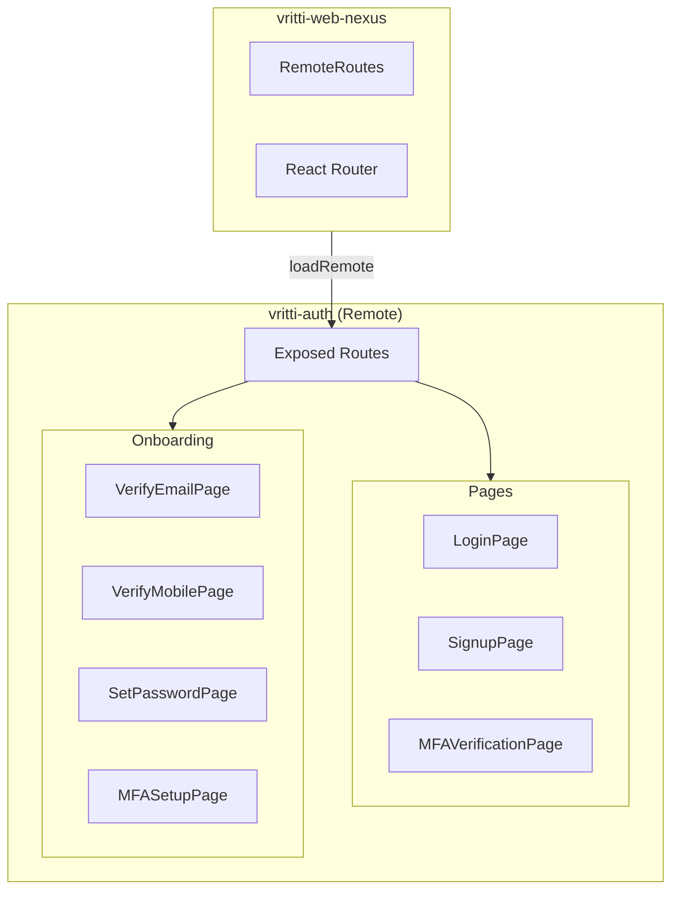
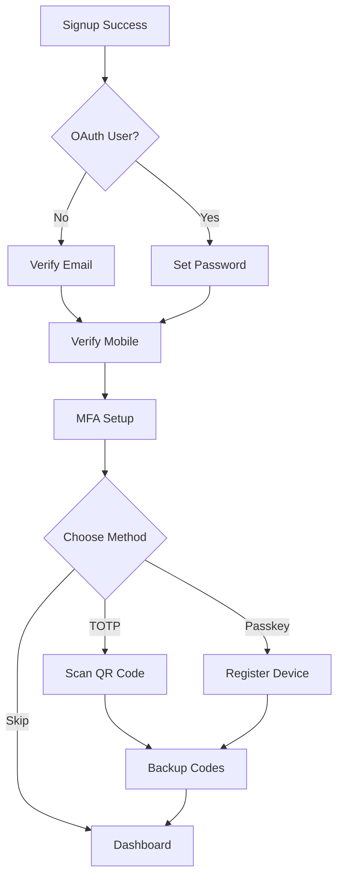

## Overview

<Info>
**Project:** vritti-auth
**Type:** Remote Application (Module Federation)
**Port:** 3001
**Host:** local.vrittiai.com
</Info>

vritti-auth is a micro-frontend that handles all authentication and onboarding flows. It exposes its routes via Module Federation to be consumed by the host application (vritti-web-nexus).

## What It Does

- Provides login and signup pages with form validation
- Supports OAuth social login (Google, Microsoft, Facebook, Twitter, Apple)
- Handles multi-factor authentication (TOTP, SMS, Passkey)
- Manages complete onboarding flow (email, phone, password, 2FA setup)
- Exposes routes for host application integration

## Tech Stack

| Technology | Version | Purpose |
|------------|---------|---------|
| React | 19.2.3 | UI framework |
| Rsbuild | 1.7.2 | Build tool with Module Federation |
| React Router | 7.12.0 | Routing |
| TanStack Query | 5.90.19 | Server state management |
| react-hook-form | 7.71.1 | Form management |
| Zod | 4.3.5 | Schema validation |
| @vritti/quantum-ui | 0.2.7 | Design system |
| @simplewebauthn/browser | 13.2.2 | WebAuthn/Passkey support |

## Architecture



## Project Structure

```
vritti-auth/
├── src/
│   ├── components/
│   │   ├── auth/                    # Auth UI components
│   │   │   ├── SocialAuthButtons.tsx
│   │   │   ├── AuthDivider.tsx
│   │   │   └── mfa-verification/
│   │   ├── icons/                   # Social provider icons
│   │   ├── layouts/
│   │   │   └── AuthLayout.tsx
│   │   └── onboarding/
│   │       ├── OnboardingRouter.tsx
│   │       └── mfa/
│   ├── context/
│   │   └── OnboardingProvider.tsx   # Onboarding state
│   ├── hooks/                       # API hooks
│   │   ├── useLogin.ts
│   │   ├── useSignup.ts
│   │   ├── usePasskey.ts
│   │   └── ...
│   ├── pages/
│   │   ├── auth/                    # Auth pages
│   │   └── onboarding/              # Onboarding pages
│   ├── services/
│   │   ├── auth.service.ts
│   │   └── onboarding.service.ts
│   ├── schemas/
│   │   └── auth.ts                  # Zod schemas
│   └── routes.tsx                   # Exposed routes
├── rsbuild.config.ts
└── package.json
```

## Module Federation

### Exposed Module

vritti-auth exposes its routes for the host:

```typescript
// rsbuild.config.ts
pluginModuleFederation({
  name: 'vritti_auth',
  exposes: {
    './routes': './src/routes.tsx',
  },
  shared: {
    react: { singleton: true, eager: true },
    'react-dom': { singleton: true, eager: true },
    'react-router-dom': { singleton: true, eager: true },
    '@vritti/quantum-ui': { singleton: true, eager: true },
    axios: { singleton: true, eager: true },
    '@tanstack/react-query': { singleton: true, eager: true },
  },
})
```

### Route Export

```typescript
// src/routes.tsx
export const authRoutes: RouteObject[] = [
  {
    path: '/',
    element: <AuthLayout />,
    children: [
      { index: true, element: <Navigate to="/login" replace /> },
      { path: 'login', element: <LoginPage /> },
      { path: 'signup', element: <SignupPage /> },
      { path: 'signup-success', element: <SignupSuccessPage /> },
      { path: 'forgot-password', element: <ForgotPasswordPage /> },
      { path: 'mfa-verify', element: <MFAVerificationPage /> },
      {
        path: 'onboarding',
        element: <OnboardingProvider><Outlet /></OnboardingProvider>,
        children: [
          { index: true, element: <OnboardingRouter /> },
        ],
      },
    ],
  },
];
```

## Authentication Features

### Login

- Email and password authentication
- Social login buttons (5 providers)
- MFA verification redirect when required
- Remember device option

### Signup

- Full name, email, password registration
- Password strength indicator
- Real-time password match validation
- Terms and privacy acceptance
- Social signup support

### MFA Verification

Three verification methods:

| Method | Description |
|--------|-------------|
| TOTP | 6-digit code from authenticator app |
| SMS | 6-digit code sent to phone |
| Passkey | WebAuthn biometric/hardware key |

## Onboarding Flow



### Onboarding Steps

| Step | Page | Purpose |
|------|------|---------|
| EMAIL_VERIFICATION | VerifyEmailPage | OTP verification |
| SET_PASSWORD | SetPasswordPage | For OAuth users |
| PHONE_VERIFICATION | VerifyMobilePage | WhatsApp/SMS/OTP |
| MFA_SETUP | MFASetupPage | 2FA configuration |
| COMPLETED | - | Redirect to dashboard |

## State Management

### OnboardingContext

```typescript
interface OnboardingContextType {
  currentStep: OnboardingStep;
  email: string;
  phone?: string;
  isLoading: boolean;
  refetch: () => void;
}
```

The provider fetches status from `/cloud-api/onboarding/status` to determine the current step, preventing URL manipulation.

### API Hooks

| Hook | Purpose |
|------|---------|
| `useLogin` | Login mutation |
| `useSignup` | Signup mutation |
| `useVerifyEmail` | Email OTP verification |
| `useSetPassword` | Password setup |
| `useMobileVerificationSSE` | Real-time mobile verification |
| `usePasskey` | WebAuthn registration/verification |
| `use2FA` | TOTP setup and verification |

## Security Features

<CardGroup cols={2}>
  <Card title="WebAuthn" icon="fingerprint">
    Passkey support for passwordless auth
  </Card>
  <Card title="TOTP" icon="clock">
    Time-based one-time passwords
  </Card>
  <Card title="SSE Verification" icon="bolt">
    Real-time mobile verification status
  </Card>
  <Card title="Backup Codes" icon="key">
    Account recovery options
  </Card>
</CardGroup>

## Development

### Start Development Server

```bash
pnpm dev      # http://local.vrittiai.com:3001
pnpm dev:ssl  # https://local.vrittiai.com:3001
```

### Build

```bash
pnpm build  # Generates mf-manifest.json
```

## Related Documentation

<CardGroup cols={2}>
  <Card title="Setup Guide" icon="wrench" href="/projects/auth/setup">
    Local development setup
  </Card>
  <Card title="Pages & Flows" icon="sitemap" href="/projects/auth/pages-flows">
    Detailed page documentation
  </Card>
  <Card title="OAuth" icon="key" href="/features/oauth/overview">
    OAuth integration
  </Card>
  <Card title="Onboarding" icon="list-check" href="/features/onboarding/flow-overview">
    Onboarding flow details
  </Card>
</CardGroup>
