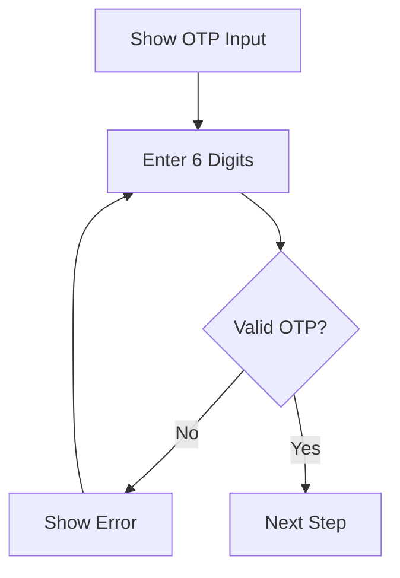
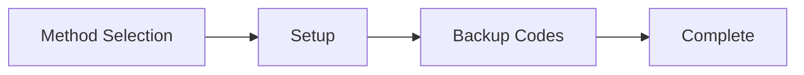

## Overview

vritti-auth contains two main page groups:

1. **Auth Pages** - Login, signup, and MFA verification
2. **Onboarding Pages** - Step-by-step user setup

## Auth Pages

### Login Page

**Route:** `/login`

**Features:**
- Email and password form with validation
- "Forgot password" link
- Social auth buttons (Google, Microsoft, Facebook, Twitter, Apple)
- MFA redirect when required
- Session persistence option

**Form Schema:**

```typescript
const loginSchema = z.object({
  email: z.string().email('Invalid email address'),
  password: z.string().min(1, 'Password is required'),
});
```

**Flow:**

```mermaid
flowchart TD
    A[Enter Credentials] --> B{Valid?}
    B -->|No| C[Show Errors]
    C --> A
    B -->|Yes| D[Submit to API]
    D --> E{MFA Required?}
    E -->|Yes| F[/mfa-verify]
    E -->|No| G{Onboarding Complete?}
    G -->|Yes| H[Dashboard]
    G -->|No| I[/onboarding]
```

**Component Highlights:**

```typescript
// LoginPage.tsx
function LoginPage() {
  const { mutate: login, isPending } = useLogin();
  const form = useForm<LoginInput>({
    resolver: zodResolver(loginSchema),
  });

  const onSubmit = (data: LoginInput) => {
    login(data, {
      onSuccess: (response) => {
        if (response.requiresMfa) {
          navigate('/mfa-verify');
        } else if (response.onboardingStep) {
          navigate('/onboarding');
        } else {
          navigate('/dashboard');
        }
      },
    });
  };
}
```

---

### Signup Page

**Route:** `/signup`

**Features:**
- Full name, email, password registration
- Password strength indicator with requirements
- Real-time password match validation
- Terms of service and privacy policy acceptance
- Social signup buttons
- Smart redirect to login if email exists

**Form Schema:**

```typescript
const signupSchema = z.object({
  firstName: z.string().min(1, 'First name is required'),
  lastName: z.string().min(1, 'Last name is required'),
  email: z.string().email('Invalid email address'),
  password: z
    .string()
    .min(8, 'At least 8 characters')
    .regex(/[A-Z]/, 'One uppercase letter')
    .regex(/[a-z]/, 'One lowercase letter')
    .regex(/[0-9]/, 'One number'),
  confirmPassword: z.string(),
}).refine((data) => data.password === data.confirmPassword, {
  message: 'Passwords do not match',
  path: ['confirmPassword'],
});
```

**Password Requirements:**

| Requirement | Validation |
|-------------|------------|
| Minimum length | 8 characters |
| Uppercase | At least 1 letter |
| Lowercase | At least 1 letter |
| Number | At least 1 digit |

---

### Signup Success Page

**Route:** `/signup-success`

**Features:**
- Success message with email display
- Next steps based on signup method
- "Start Onboarding" button
- Calls `startOnboarding()` API before proceeding

---

### MFA Verification Page

**Route:** `/mfa-verify`

**Purpose:** Verify user identity after login when MFA is enabled.

**Supported Methods:**

<Tabs>
  <Tab title="TOTP">
    - 6-digit code from authenticator app
    - Auto-submit on 6 digits
    - Clear error on input

    ```typescript
    <TOTPVerification
      onSubmit={(code) => verifyTotp(code)}
      isLoading={isPending}
      error={error}
    />
    ```
  </Tab>
  <Tab title="SMS">
    - 6-digit code sent to phone
    - Masked phone number display
    - Resend code option with cooldown

    ```typescript
    <SMSVerification
      maskedPhone="*******890"
      onSubmit={(code) => verifySms(code)}
      onResend={resendSmsCode}
    />
    ```
  </Tab>
  <Tab title="Passkey">
    - WebAuthn biometric/hardware key
    - One-click authentication
    - Browser native UI

    ```typescript
    <PasskeyVerification
      onVerify={async () => {
        const challenge = await getPasskeyChallenge();
        const credential = await startAuthentication(challenge);
        await verifyPasskey(credential);
      }}
    />
    ```
  </Tab>
</Tabs>

**Method Switching:**

```typescript
<MethodSwitcher
  availableMethods={['totp', 'sms', 'passkey']}
  currentMethod={method}
  onSwitch={setMethod}
/>
```

---

### Forgot Password Page

**Route:** `/forgot-password`

**Flow:**
1. Enter email address
2. Receive OTP via email
3. Enter OTP code
4. Set new password

---

## Onboarding Pages

All onboarding pages are wrapped with `OnboardingProvider` which:
- Fetches current step from API
- Prevents URL manipulation
- Provides step context to children

### Verify Email Page

**Route:** `/onboarding/verify-email`

**Purpose:** Verify email address after signup.

**Features:**
- 6-digit OTP input
- Auto-submit on 6 digits
- Resend OTP button (60s cooldown)
- Change email option

**Flow:**



---

### Set Password Page

**Route:** `/onboarding/set-password`

**Purpose:** Set password for OAuth signup users.

<Note>
This page only appears for users who signed up via OAuth and need to set a password for their account.
</Note>

**Features:**
- Password with strength indicator
- Confirm password with match indicator
- Real-time requirement validation

---

### Verify Mobile Page

**Route:** `/onboarding/verify-mobile`

**Purpose:** Verify phone number for SMS notifications and 2FA.

**Three Verification Methods:**

<Tabs>
  <Tab title="WhatsApp QR">
    **Recommended method**
    - Scan QR code with WhatsApp
    - Automatic verification via webhook
    - Real-time status via SSE

    ```typescript
    <QRCodeDisplay
      value={verificationUrl}
      method="whatsapp"
    />
    <SSEStatusListener
      onVerified={() => navigate('/onboarding/mfa-setup')}
    />
    ```
  </Tab>
  <Tab title="SMS QR">
    - Scan QR code to send SMS
    - Opens native SMS app
    - Backend receives verification

    ```typescript
    <QRCodeDisplay
      value={smsUrl}
      method="sms"
    />
    ```
  </Tab>
  <Tab title="Manual OTP">
    - Enter phone number
    - Receive OTP via SMS
    - Enter 6-digit code

    ```typescript
    <PhoneInput
      value={phone}
      onChange={setPhone}
      country={country}
    />
    <Button onClick={sendOtp}>Send Code</Button>
    <OTPInput onComplete={verifyOtp} />
    ```
  </Tab>
</Tabs>

**SSE Real-time Updates:**

```typescript
// useMobileVerificationSSE.ts
function useMobileVerificationSSE() {
  useEffect(() => {
    const eventSource = new EventSource('/api/verification/status');

    eventSource.onmessage = (event) => {
      const data = JSON.parse(event.data);
      if (data.verified) {
        onVerified();
      }
    };

    return () => eventSource.close();
  }, []);
}
```

---

### MFA Setup Page

**Route:** `/onboarding/mfa-setup`

**Purpose:** Configure two-factor authentication.

**Four-Step Flow:**



**Step 1: Method Selection**

| Method | Description |
|--------|-------------|
| Authenticator | Google Authenticator, Authy, etc. |
| Passkey | Biometric or hardware key |
| Skip | Configure later in settings |

**Step 2: Setup**

<Tabs>
  <Tab title="TOTP Setup">
    - Display QR code for scanning
    - Show manual setup key
    - Enter 6-digit verification code

    ```typescript
    <QRCodeSVG
      value={`otpauth://totp/Vritti:${email}?secret=${secret}&issuer=Vritti`}
      size={200}
    />
    <Typography>Manual key: {secret}</Typography>
    <OTPInput onComplete={verifyTotp} />
    ```
  </Tab>
  <Tab title="Passkey Setup">
    - Initiate WebAuthn registration
    - Browser prompts for biometric
    - Register credential with backend

    ```typescript
    const handleSetup = async () => {
      const options = await getRegistrationOptions();
      const credential = await startRegistration(options);
      await verifyRegistration(credential);
    };
    ```
  </Tab>
</Tabs>

**Step 3: Backup Codes**

```typescript
<BackupCodesDisplay
  codes={backupCodes}
  onDownload={downloadCodes}
  onContinue={completeSetup}
/>
```

<Warning>
Users must save backup codes securely. These are the only way to recover access if they lose their authenticator.
</Warning>

**Step 4: Complete**

- Success message
- Auto-redirect to dashboard after 3 seconds

---

### OAuth Success Page

**Route:** `/onboarding/oauth-success`

**Purpose:** Handle OAuth callback success.

**Actions:**
1. Extract token from URL parameters
2. Set authentication token
3. Fetch onboarding status
4. Redirect to appropriate step

---

### OAuth Error Page

**Route:** `/onboarding/oauth-error`

**Purpose:** Handle OAuth callback errors.

**Features:**
- Display error message
- Retry button
- Alternative login options

---

## Onboarding Router

The `OnboardingRouter` component renders the appropriate page based on current step:

```typescript
function OnboardingRouter() {
  const { currentStep, isLoading } = useOnboarding();

  if (isLoading) return <LoadingSpinner />;

  switch (currentStep) {
    case 'EMAIL_VERIFICATION':
      return <VerifyEmailPage />;
    case 'SET_PASSWORD':
      return <SetPasswordPage />;
    case 'PHONE_VERIFICATION':
      return <VerifyMobileFlowPage />;
    case 'MFA_SETUP':
      return <MFASetupFlowPage />;
    case 'COMPLETED':
      return <Navigate to="/dashboard" replace />;
    default:
      return <Navigate to="/login" replace />;
  }
}
```

## Component Library

### Auth Components

| Component | Purpose |
|-----------|---------|
| `SocialAuthButtons` | OAuth provider buttons |
| `AuthDivider` | "or continue with" divider |
| `PasswordStrength` | Password requirement indicator |
| `OTPInput` | 6-digit code input |

### MFA Components

| Component | Purpose |
|-----------|---------|
| `MethodSwitcher` | Switch between MFA methods |
| `TOTPVerification` | Authenticator code input |
| `SMSVerification` | SMS code input |
| `PasskeyVerification` | WebAuthn trigger |

### Onboarding Components

| Component | Purpose |
|-----------|---------|
| `MultiStepProgressIndicator` | Step progress bar |
| `OnboardingRouter` | Step-based routing |
| `AuthenticatorSetup` | TOTP QR code setup |
| `PasskeySetup` | WebAuthn registration |
| `BackupCodesDisplay` | Recovery codes |
| `MFAMethodSelection` | Method picker |

## Related Documentation

<CardGroup cols={2}>
  <Card title="Auth Overview" icon="user-lock" href="/projects/auth/overview">
    Project overview
  </Card>
  <Card title="OAuth" icon="key" href="/features/oauth/overview">
    OAuth providers
  </Card>
  <Card title="Onboarding Flow" icon="list-check" href="/features/onboarding/flow-overview">
    Onboarding architecture
  </Card>
  <Card title="MFA" icon="shield" href="/features/mfa">
    MFA implementation
  </Card>
</CardGroup>
